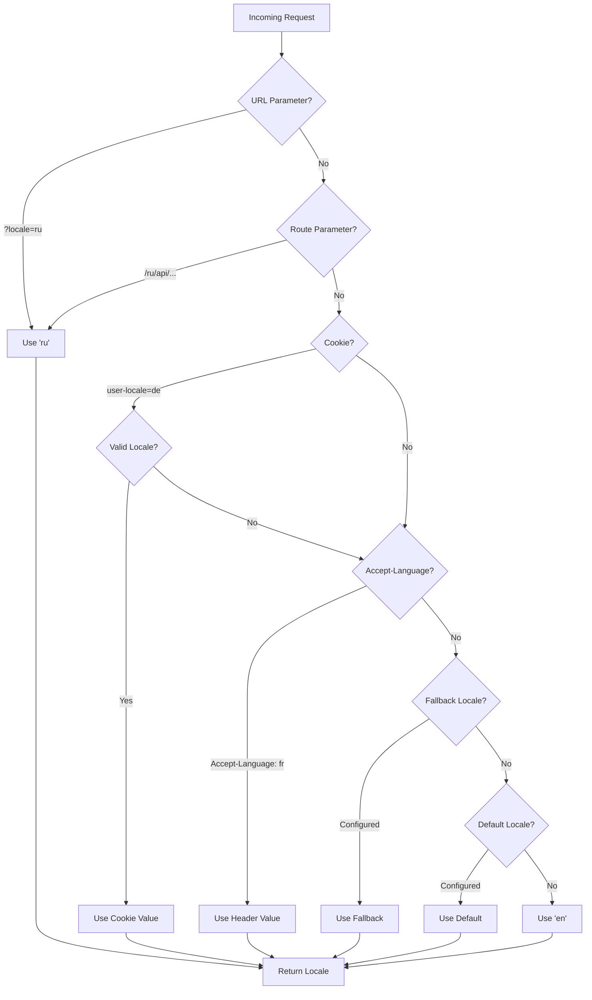

# 🌍 Traducciones e información de idioma en el servidor en Nuxt I18n Micro

## 📖 Descripción general

Nuxt I18n Micro admite traducciones e información de idioma en el servidor, permitiéndote traducir contenido y acceder a los detalles del idioma en el servidor. Esto es particularmente útil para APIs o aplicaciones renderizadas en el servidor donde se necesita localización antes de llegar al cliente.

Las traducciones usan mensajes de idioma definidos en la configuración de Nuxt I18n y se resuelven dinámicamente según el idioma detectado.

Por defecto (`translationPayloads.mode: 'premerged'`), los archivos raíz se cocinan en cada payload de página en tiempo de compilación como `\{page\}/\{locale\}/data.json`. El servidor carga los mismos archivos preconstruidos que el cliente obtiene bajo `/\{apiBaseUrl\}/...`, así que todas las claves (tanto compartidas como específicas de página) están disponibles en los handlers del servidor.

Con `translationPayloads.mode: 'source'`, los archivos fuente compactos se fusionan en runtime cuando se llama a `loadTranslationsFromServer()` (o la ruta `/_locales`). En **Edge** mediante `serverAssets` de Nitro, en **Node** desde la copia pública opcional. Consulta la [Guía de rendimiento — Salida de payload serverless](/guides/performance#serverless-payload-output) y [Arquitectura de caché y almacenamiento](/api/cache) para más detalles.

Para una lista consolidada de APIs de runtime y servidor, consulta la [Referencia de la API](/api/overview).

## 🛠️ Configurar el middleware del servidor

Para habilitar las traducciones e información de idioma en el servidor, usa las funciones middleware proporcionadas:

- `useTranslationServerMiddleware` — para traducir contenido.
- `useLocaleServerMiddleware` — para acceder a la información de idioma.

Ambas funciones middleware están automáticamente disponibles en todas las rutas del servidor.

La lógica de detección de idioma se comparte entre ambas funciones middleware mediante la función de utilidad `detectCurrentLocale` para asegurar consistencia en el módulo.

## ✨ Usar traducciones en handlers del servidor

Puedes traducir contenido sin problemas en cualquier `eventHandler` usando el middleware de traducción.

### Ejemplo: uso básico de traducción

```typescript
import { defineEventHandler } from 'h3'

export default defineEventHandler(async (event) => {
  const t = await useTranslationServerMiddleware(event)
  return {
    message: t('greeting'), // Returns the translated value for the key "greeting"
  }
})
```

En este ejemplo:

- El idioma del usuario se detecta automáticamente desde parámetros de consulta, cookies o encabezados.
- La función `t` obtiene la traducción apropiada para el idioma detectado.

## 🌍 Usar información de idioma en handlers del servidor

### Uso básico de información de idioma

```typescript
import { defineEventHandler } from 'h3'

export default defineEventHandler((event) => {
  const localeInfo = useLocaleServerMiddleware(event)

  return {
    success: true,
    data: localeInfo,
    timestamp: new Date().toISOString(),
  }
})
```

### Proporcionar parámetros de idioma personalizados

```typescript
import { defineEventHandler } from 'h3'

export default defineEventHandler((event) => {
  // Force specific locale with custom default
  const localeInfo = useLocaleServerMiddleware(event, 'en', 'ru')

  return {
    success: true,
    data: localeInfo,
    timestamp: new Date().toISOString(),
  }
})
```

### Estructura de la respuesta

El middleware de idioma devuelve un objeto `LocaleInfo` con las siguientes propiedades:

```typescript
interface LocaleInfo {
  current: string // Current detected locale code
  default: string // Default locale code
  fallback: string // Fallback locale code
  available: string[] // Array of all available locale codes
  locale: Locale | null // Full locale configuration object
  isDefault: boolean // Whether current locale is the default
  isFallback: boolean // Whether current locale is the fallback
}
```

### Ejemplo de respuesta

```json
{
  "success": true,
  "data": {
    "current": "ru",
    "default": "en",
    "fallback": "en",
    "available": ["en", "ru", "de"],
    "locale": {
      "code": "ru",
      "iso": "ru-RU",
      "dir": "ltr",
      "displayName": "Русский"
    },
    "isDefault": false,
    "isFallback": false
  },
  "timestamp": "2024-01-15T10:30:00.000Z"
}
```

## 🌐 Proporcionar un idioma personalizado

Si necesitas especificar un idioma manualmente (por ejemplo, para pruebas o ciertas solicitudes), puedes pasarlo al middleware de traducción:

### Ejemplo: idioma personalizado

```typescript
import { defineEventHandler } from 'h3'

function detectLocale(event): string | null {
  const urlSearchParams = new URLSearchParams(event.node.req.url?.split('?')[1])
  const localeFromQuery = urlSearchParams.get('locale')
  if (localeFromQuery) return localeFromQuery

  return 'en'
}

export default defineEventHandler(async (event) => {
  const t = await useTranslationServerMiddleware(event, 'en', detectLocale(event)) // Force French local, en - default locale
  return {
    message: t('welcome'), // Returns the French translation for "welcome"
  }
})
```

## 📋 Lógica de detección de idioma

Ambas funciones middleware determinan automáticamente el idioma del usuario usando el siguiente orden de prioridad:



1. **Parámetros de URL**: `?locale=ru`
2. **Parámetros de ruta**: `/ru/api/endpoint`
3. **Cookies**: cookie `user-locale`
4. **Encabezados HTTP**: encabezado `Accept-Language`
5. **Idioma de fallback**: según lo configurado en las opciones del módulo
6. **Idioma por defecto**: según lo configurado en las opciones del módulo
7. **Fallback codificado**: `'en'`

> **Nota**: La lógica de detección de idioma se comparte entre `useLocaleServerMiddleware` y `useTranslationServerMiddleware` para asegurar consistencia en el módulo.

## 📋 Ejemplos de uso avanzado

### Respuesta condicional según el idioma

```typescript
import { defineEventHandler } from 'h3'

export default defineEventHandler((event) => {
  const { current, isDefault, locale } = useLocaleServerMiddleware(event)

  // Return different content based on locale
  if (current === 'ru') {
    return {
      message: 'Привет, мир!',
      locale: current,
      isDefault,
    }
  }

  if (current === 'de') {
    return {
      message: 'Hallo, Welt!',
      locale: current,
      isDefault,
    }
  }

  // Default English response
  return {
    message: 'Hello, World!',
    locale: current,
    isDefault,
  }
})
```

### Detección de idioma personalizada

```typescript
import { defineEventHandler } from 'h3'

export default defineEventHandler((event) => {
  // Force German locale with English as fallback
  const { current, isDefault, locale } = useLocaleServerMiddleware(event, 'en', 'de')

  return {
    message: 'Hallo, Welt!',
    locale: current,
    isDefault: false, // Will be false since we forced German
  }
})
```

### API sensible al idioma con validación

```typescript
import { defineEventHandler, createError } from 'h3'

export default defineEventHandler((event) => {
  const { current, available, locale } = useLocaleServerMiddleware(event)

  // Validate if the detected locale is supported
  if (!available.includes(current)) {
    throw createError({
      statusCode: 400,
      statusMessage: `Unsupported locale: ${current}. Available locales: ${available.join(', ')}`,
    })
  }

  // Return locale-specific configuration
  return {
    locale: current,
    direction: locale?.dir || 'ltr',
    displayName: locale?.displayName || current,
    availableLocales: available,
  }
})
```

### Integración con middleware de traducción

Puedes combinar información de idioma con el middleware de traducción para una internacionalización completa:

```typescript
import { defineEventHandler } from 'h3'

export default defineEventHandler(async (event) => {
  const localeInfo = useLocaleServerMiddleware(event)
  const t = await useTranslationServerMiddleware(event)

  return {
    locale: localeInfo.current,
    message: t('welcome_message'),
    availableLocales: localeInfo.available,
    isDefault: localeInfo.isDefault,
  }
})
```

## 📝 Buenas prácticas

1. **Valida siempre los idiomas**: comprueba si el idioma detectado está en tu lista de idiomas disponibles.
2. **Usa lógica de fallback**: proporciona valores por defecto razonables cuando falla la detección de idioma.
3. **Cachea información de idioma**: para aplicaciones críticas en rendimiento, considera cachear los resultados de detección de idioma.
4. **Maneja casos límite**: contempla idiomas no admitidos y proporciona respuestas de error apropiadas.
5. **Combina con traducciones**: usa la información de idioma junto al middleware de traducción para soporte i18n completo.

## 🚀 Consideraciones de rendimiento

- Ambas funciones middleware son ligeras y están diseñadas para una ejecución rápida.
- La detección de idioma usa cadenas de fallback eficientes.
- No se realizan llamadas a APIs externas durante la detección de idioma.
- Los resultados se calculan de forma síncrona para un rendimiento óptimo.
