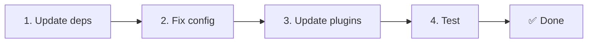

# 📦 Actualización de v2.x a v3.x

<Tip>
Consulta [Migración desde nuxt-i18n](/migration/from-nuxtjs-i18n): esa guía cubre el paso desde el ecosistema vue-i18n, no desde nuxt-i18n-micro v2.
</Tip>

v3.0.0 introduce cambios arquitectónicos fundamentales: paquetes de estrategia, un nuevo sistema de caché, gestión centralizada de locales mediante `useI18nLocale()` y una tubería de redirecciones rediseñada. Esta sección cubre todos los cambios incompatibles y cómo actualizar tu código.

## Pasos de migración



## Resumen de cambios incompatibles

- **Estado de locale**: `useState` / `useCookie` manualmente → composable `useI18nLocale()`.
- **Acceso a la configuración**: `useRuntimeConfig().public.i18nConfig` → `getI18nConfig()` desde `#build/i18n.strategy.mjs`.
- **Componente de redirección**: opción `fallbackRedirectComponentPath` → plugin de redirección de servidor + middleware de ruta del cliente (automático).
- **`includeDefaultLocaleRoute`**: admitido (obsoleto) → eliminado, usa la opción `strategy`.
- **`experimental.hmr`**: bajo `experimental` → opción a nivel raíz.
- **`previousPageFallback`**: eliminado por completo (la estrategia de fusión acumulativa lo gestiona automáticamente).
- **Caché**: `useStorage('cache')` → singleton `TranslationStorage` (`Symbol.for` en `globalThis`).
- **Transferencia SSR**: runtime config → payload de Nuxt (v3 usaba `useState`; los chunks ahora viven en `payload.data`; consulta [Rendimiento](/guides/performance#server-side-payload-transfer)).
- **Clases de estrategia**: internas → paquetes separados (`@i18n-micro/route-strategy`, `@i18n-micro/path-strategy`).

## Eliminado: `fallbackRedirectComponentPath`

La opción `fallbackRedirectComponentPath` y el componente de reserva `locale-redirect.vue` se han eliminado. La lógica de redirección ahora la gestionan:

1. **Middleware de servidor** (`i18n.global.ts`): establece `event.context.i18n.locale`.
2. **Plugin de redirección de servidor** (`06.redirect.ts`, solo servidor): redirecciones 302 antes del renderizado.
3. **Middleware de ruta del cliente** (`i18n-redirect.global.ts`): redirecciones SPA tras la hidratación.

```diff
 i18n: {
   strategy: 'prefix_except_default',
-  fallbackRedirectComponentPath: '~/components/MyRedirect.vue',
 }
```

Si tenías lógica de redirección personalizada en el componente de reserva, impleméntala en un plugin de servidor en su lugar:

```ts
// plugins/i18n-loader.server.ts
export default defineNuxtPlugin({
  name: 'i18n-custom-redirect',
  enforce: 'pre',
  order: -10,
  setup() {
    const { setLocale } = useI18nLocale()
    // Your custom detection logic
    setLocale(detectedLocale)
  },
})
```

## Eliminado: `includeDefaultLocaleRoute`

Usa la opción `strategy` en su lugar:

- `includeDefaultLocaleRoute: true` → `strategy: 'prefix'`.
- `includeDefaultLocaleRoute: false` → `strategy: 'prefix_except_default'` (predeterminado).

```diff
 i18n: {
-  includeDefaultLocaleRoute: true,
+  strategy: 'prefix',
 }
```

## Acceso a la configuración: `getI18nConfig()` reemplaza a `useRuntimeConfig`

```diff
- const config = useRuntimeConfig()
- const cookieName = config.public.i18nConfig?.localeCookie || 'user-locale'
+ import { getI18nConfig } from '#build/i18n.strategy.mjs'
+ const { localeCookie: configCookie } = getI18nConfig()
+ const cookieName = configCookie ?? 'user-locale'
```

## Gestión de locales: `useI18nLocale()` reemplaza al state manual

En v2, es posible que usaras `useState('i18n-locale')` o `useCookie('user-locale')` directamente. En v3, usa el composable centralizado `useI18nLocale()`:

```diff
- const locale = useState('i18n-locale')
- const cookie = useCookie('user-locale')
- locale.value = 'fr'
- cookie.value = 'fr'
+ const { setLocale } = useI18nLocale()
+ setLocale('fr') // Updates both state and cookie atomically
```

Consulta [Detección de idioma personalizada](/guides/custom-language-detection) para ejemplos detallados.

## Opciones experimentales movidas / eliminadas

`hmr` se ha movido de `experimental` al nivel raíz. `previousPageFallback` se ha eliminado por completo: el módulo ahora utiliza una estrategia de fusión profunda acumulativa (profundidad de 2 niveles) que preserva automáticamente las traducciones de la página anterior durante las animaciones de transición, incluso cuando las páginas comparten claves anidadas superpuestas. Tras completarse la animación de transición, el hook `page:transition:finish` limpia las claves de la página anterior de memoria.

```diff
 i18n: {
-  experimental: {
-    hmr: true,
-    previousPageFallback: true
-  }
+  hmr: true,
+  // previousPageFallback removed — handled automatically
 }
```

## Arquitectura de redirecciones (v3)

Las redirecciones ahora las gestionan automáticamente dos componentes:

1. **Lado del servidor** (`06.redirect.ts`, solo servidor): se ejecuta durante SSR, emite redirecciones 302 antes de cualquier renderizado de página; sin «flash de error».
2. **Lado del cliente** (`i18n-redirect.global.ts`): middleware global de rutas en navegación SPA; preserva la cadena de consulta y el hash.

Prioridad de locale para redirecciones:

1. `useState('i18n-locale')`: establecido mediante `useI18nLocale().setLocale()`.
2. Cookie: si `localeCookie` está configurado.
3. Cabecera `Accept-Language`: si `autoDetectLanguage: true`.
4. `defaultLocale`: reserva.

No se requieren cambios de código para configuraciones estándar.

<Warning>
Para las estrategias `prefix` y `prefix_except_default` con `redirects: true`, establece `localeCookie: 'user-locale'` para habilitar la persistencia del locale entre recargas de página. Sin ello, las redirecciones solo utilizan `Accept-Language` o `defaultLocale`.
</Warning>

## TypeScript: tipos internos del módulo (opcional)

Si encuentras errores de tipo relacionados con imports internos como `#i18n-internal/plural`, `#i18n-internal/strategy` o `#i18n-internal/config`, añade la sección `imports` al `package.json` de tu proyecto:

```json
{
  "imports": {
    "#i18n-internal/plural": "nuxt-i18n-micro/internals",
    "#i18n-internal/strategy": "nuxt-i18n-micro/internals",
    "#i18n-internal/config": "nuxt-i18n-micro/internals"
  }
}
```

<Tip>

</Tip>
