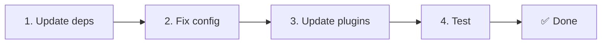

# 📦 Actualizar de v2.x a v3.x

<Tip>
Consulta [Migración desde nuxt-i18n](/migration/from-nuxtjs-i18n). Esa guía cubre la migración desde el ecosistema vue-i18n, no desde nuxt-i18n-micro v2.
</Tip>

v3.0.0 introduce cambios arquitectónicos fundamentales: paquetes de estrategia, un nuevo sistema de caché, gestión centralizada de idioma vía `useI18nLocale()` y un pipeline de redirección rediseñado. Esta sección cubre todos los cambios incompatibles y cómo actualizar tu código.

## Pasos de migración



## Resumen de cambios incompatibles

- **Estado de idioma**: `useState` / `useCookie` manual → composable `useI18nLocale()`
- **Acceso a configuración**: `useRuntimeConfig().public.i18nConfig` → `getI18nConfig()` desde `#build/i18n.strategy.mjs`
- **Componente de redirección**: opción `fallbackRedirectComponentPath` → Plugin de redirección del servidor + middleware de ruta del cliente (automático)
- **`includeDefaultLocaleRoute`**: admitido (obsoleto) → Eliminado, usa la opción `strategy`
- **`experimental.hmr`**: Bajo `experimental` → Opción a nivel raíz
- **`previousPageFallback`**: Eliminado por completo (la estrategia de fusión acumulativa lo maneja automáticamente)
- **Caché**: `useStorage('cache')` → singleton `TranslationStorage` (`Symbol.for` en `globalThis`)
- **Transferencia SSR**: Runtime config → Nuxt payload (v3 usaba `useState`; los chunks ahora viven en `payload.data`, consulta [Rendimiento](/guides/performance#server-side-payload-transfer))
- **Clases de estrategia**: Internas → Paquetes separados (`@i18n-micro/route-strategy`, `@i18n-micro/path-strategy`)

## Eliminado: `fallbackRedirectComponentPath`

Se han eliminado la opción `fallbackRedirectComponentPath` y el componente fallback `locale-redirect.vue`. La lógica de redirección ahora la manejan:

1. **Middleware del servidor** (`i18n.global.ts`): establece `event.context.i18n.locale`.
2. **Plugin de redirección del servidor** (`06.redirect.ts`, solo servidor): redirecciones 302 antes del render.
3. **Middleware de ruta del cliente** (`i18n-redirect.global.ts`): redirecciones SPA tras la hidratación.

```diff
 i18n: {
   strategy: 'prefix_except_default',
-  fallbackRedirectComponentPath: '~/components/MyRedirect.vue',
 }
```

Si tenías lógica de redirección personalizada en el componente fallback, impleméntala en un plugin del servidor en su lugar:

```ts
// plugins/i18n-loader.server.ts
export default defineNuxtPlugin({
  name: 'i18n-custom-redirect',
  enforce: 'pre',
  order: -10,
  setup() {
    const { setLocale } = useI18nLocale()
    // Your custom detection logic
    setLocale(detectedLocale)
  },
})
```

## Eliminado: `includeDefaultLocaleRoute`

Usa la opción `strategy` en su lugar:

- `includeDefaultLocaleRoute: true` → `strategy: 'prefix'`
- `includeDefaultLocaleRoute: false` → `strategy: 'prefix_except_default'` (el por defecto)

```diff
 i18n: {
-  includeDefaultLocaleRoute: true,
+  strategy: 'prefix',
 }
```

## Acceso a configuración: `getI18nConfig()` reemplaza a `useRuntimeConfig`

```diff
- const config = useRuntimeConfig()
- const cookieName = config.public.i18nConfig?.localeCookie || 'user-locale'
+ import { getI18nConfig } from '#build/i18n.strategy.mjs'
+ const { localeCookie: configCookie } = getI18nConfig()
+ const cookieName = configCookie ?? 'user-locale'
```

## Gestión de idioma: `useI18nLocale()` reemplaza el estado manual

En v2, es posible que usaras `useState('i18n-locale')` o `useCookie('user-locale')` directamente. En v3, usa el composable centralizado `useI18nLocale()`:

```diff
- const locale = useState('i18n-locale')
- const cookie = useCookie('user-locale')
- locale.value = 'fr'
- cookie.value = 'fr'
+ const { setLocale } = useI18nLocale()
+ setLocale('fr') // Updates both state and cookie atomically
```

Consulta [Detección de idioma personalizada](/guides/custom-language-detection) para ejemplos detallados.

## Opciones experimentales movidas / eliminadas

`hmr` se ha movido de `experimental` al nivel raíz. `previousPageFallback` se ha eliminado por completo. El módulo ahora usa una estrategia de fusión profunda acumulativa (2 niveles) que preserva automáticamente las traducciones de la página anterior durante las animaciones de transición, incluso cuando las páginas comparten claves anidadas solapadas. Después de que la animación de transición se completa, el hook `page:transition:finish` limpia las claves de la página antigua de la memoria.

```diff
 i18n: {
-  experimental: {
-    hmr: true,
-    previousPageFallback: true
-  }
+  hmr: true,
+  // previousPageFallback removed — handled automatically
 }
```

## Arquitectura de redirección (v3)

Las redirecciones ahora las manejan automáticamente dos componentes:

1. **Lado servidor** (`06.redirect.ts`, solo servidor): se ejecuta durante SSR, emite redirecciones 302 antes de cualquier renderizado de página. Sin "flash de error".
2. **Lado cliente** (`i18n-redirect.global.ts`): middleware global de ruta en navegación SPA; preserva el query string y el hash.

Prioridad de idioma para redirecciones:

1. `useState('i18n-locale')`: establecido vía `useI18nLocale().setLocale()`.
2. Cookie: si `localeCookie` está configurada.
3. Encabezado `Accept-Language`: si `autoDetectLanguage: true`.
4. `defaultLocale`: fallback.

No se requieren cambios de código para configuraciones estándar.

<Warning>
Para las estrategias `prefix` y `prefix_except_default` con `redirects: true`, establece `localeCookie: 'user-locale'` para habilitar la persistencia del idioma entre recargas de página. Sin él, las redirecciones solo usan `Accept-Language` o `defaultLocale`.
</Warning>

## TypeScript: tipos internos del módulo (opcional)

Si encuentras errores de tipos relacionados con imports internos como `#i18n-internal/plural`, `#i18n-internal/strategy` o `#i18n-internal/config`, añade la sección `imports` al `package.json` de tu proyecto:

```json
{
  "imports": {
    "#i18n-internal/plural": "nuxt-i18n-micro/internals",
    "#i18n-internal/strategy": "nuxt-i18n-micro/internals",
    "#i18n-internal/config": "nuxt-i18n-micro/internals"
  }
}
```
