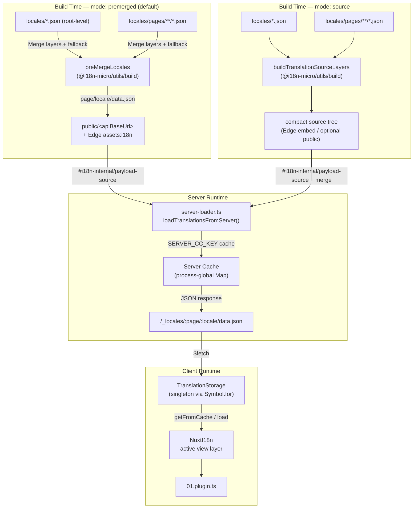

# 🗄️ Käännösvälimuistin ja tallennuksen arkkitehtuuri

## 📖 Yleiskatsaus

Nuxt I18n Micro v3 käyttää käännöksissä monikerroksista välimuistiarkkitehtuuria. Hyötykuorman lataus riippuu asetuksesta `translationPayloads.mode`:

- **`premerged`** (oletus) — juuri-, sivu-, fallback- ja layer-tiedostot yhdistetään käännösvaiheessa paketilla `@i18n-micro/utils/build` tiedostoon `\{page\}/\{locale\}/data.json`.
- **`source`** — kompaktit lähdetiedostot säilytetään ajonaikaista yhdistämistä varten paketeilla `@i18n-micro/utils/source-loader` ja `@i18n-micro/utils/merge-source` (Edge upottaa ne Nitron `serverAssets`-hakemistoon. Node lukee ne hakemistosta `public/`, kun ne on kopioitu sinne).

Tämä sivu kuvaa, miten sisäänrakennettu välimuisti toimii ja miten sitä voi laajentaa mukautettuihin käyttötapauksiin (hallintatyökalut, ulkoiset API:t, välimuistin mitätöinti).

## 📊 Arkkitehtuurin yleiskatsaus

### Tiedon kulku



## 🧱 Keskeiset komponentit

### 1. `TranslationStorage` (asiakas + palvelin)

**Tiedosto**: `src/runtime/utils/storage.ts`

Singleton-luokka, joka tarjoaa yhtenäisen käännöstallennuksen sekä asiakkaalle että palvelimelle. Käyttää `Symbol.for('__NUXT_I18N_STORAGE_CACHE__')`-tunnistetta `globalThis`-objektissa varmistamaan, että vain yksi instanssi on olemassa, vaikka useita bundleja olisi ladattu.

**Keskeiset metodit:**

| Metodi                              | Kuvaus                                                                 |
| ----------------------------------- | ---------------------------------------------------------------------- |
| `getFromCache(locale, routeName?)`  | Synkroninen tarkistus: palauttaa välimuistiin tallennetun datan tai `null` |
| `load(locale, routeName?, options)` | Asynkroninen lataus välimuistilla: tarkistaa ensin välimuistin ja hakee sitten `$fetch`-funktiolla |
| `clear()`                           | Tyhjentää koko välimuistin                                             |

**Välimuistin avaimen muoto**: `\{locale\}:\{routeName\}` (esim. `en:index`, `fr:about`)

```typescript
import { translationStorage } from '../utils/storage'

// Synchronous cache check
const cached = translationStorage.getFromCache('en', 'index')

// Async load (with automatic caching)
const result = await translationStorage.load('en', 'index', {
  apiBaseUrl: '_locales',
  baseURL: '/',
  dateBuild: '2024-01-01',
})
// result.data — merged translations
// result.cacheKey — cache key used
```

### ⚙️ Deterministinen välimuistin ohitus (`i18n.dateBuild`)

Oletuksena moduuli luo arvon `dateBuild` käännösvaiheessa funktiolla `Date.now()`. Se upotetaan luotuun tiedostoon `#build/i18n.strategy.mjs` ja käytetään kyselyparametrina (`?v=...`) käännösten hakuvälimuistin mitätöintiin uudelleenkäännösten jälkeen.

Jos tarvitset toistettavia käännöksiä (esimerkiksi parantaaksesi chunkkien välimuistiosuvuutta rullaavissa käyttöönotoissa), aseta pysyvä arvo tiedostoon `nuxt.config`:

```ts
export default defineNuxtConfig({
  i18n: {
    // Any stable string/number (git SHA, CI build number, release tag, etc.)
    dateBuild: process.env.GIT_SHA ?? 'local-dev',
  },
})
```

### 2. `loadTranslationsFromServer()` (vain palvelin)

**Tiedosto**: `src/runtime/server/utils/server-loader.ts`

Lataa käännökset annetulle kielelle/sivulle ja välimuistittaa yhdistetyn tuloksen prosessin laajuiseen `CacheControl`-mappiin, jonka avaimena on `@i18n-micro/hmr/cache-keys` (`SERVER_CC_KEY`).

Toiminta: SSR lataa lähteestä `#i18n-internal/payload-source` — **Node** käyttää funktiota `readFile` hakemistosta `public/<apiBaseUrl>` (`\{page\}/\{locale\}/data.json` esikootussa tilassa), **Edge** käyttää `assets:i18n`-hakemistoa. `premerged` lukee yhden tiedoston. `source` yhdistää juuri-/sivu-/fallback-tiedostot paketilla `@i18n-micro/utils/source-loader`.

```typescript
import { loadTranslationsFromServer } from '../server/utils/server-loader'

// Returns { data: Translations, json: string }
const { data, json } = await loadTranslationsFromServer('en', 'index')
```

### 3. Asiakaspuolen lataus (ei HTML-upotusta)

Sanakirjoja **ei** kirjoiteta `nuxtApp.payload`-objektiin. Palvelin pitää ne muistissa SSR-renderöintiä varten. Asiakaspuolen liitännäinen `await`aa funktiota `switchContext`, joka lataa polun `/\{apiBaseUrl\}/:page/:locale/data.json` (sama oletuskäytös kuin `@nuxtjs/i18n`-moduulilla asetuksella `experimental.preload: false`).

`NuxtI18n` pitää aktiivista näkymäkerroksen sanakirjaa, jota käyttävät `$t()` ja `$has()`. `NuxtTranslationLoader` vaihtaa kieli-/reittikontekstin ja yhdistää palat kyseiseen kerrokseen.

### 4. Palvelimen API-reitti

**Reitti**: `/_locales/\{page\}/\{locale\}/data.json`

**Tiedosto**: `src/runtime/server/routes/i18n.ts`

Tämä Nitro-reitti tarjoaa yhdistetyt käännökset aktiivisessa hyötykuormatilassa. Se kutsuu funktiota `loadTranslationsFromServer()` ja palauttaa tuloksen JSON-muodossa.

Tuotannossa se asettaa myös:

```http
Cache-Control: public, max-age={httpCacheDuration}, immutable
```

Oletusarvo `httpCacheDuration` on `31536000` (1 vuosi). Tämä on turvallista, koska asiakkaat pyytävät hyötykuormia välimuistin ohittavalla parametrilla `?v=\{dateBuild\}`. Aseta `httpCacheDuration: 0`, jos haluat jättää otsikon pois. Otsikkoa ei käytetä kehityksessä.

## 📥 Laajennus: mukautettu käännösten lataus

### Lue välimuistista (palvelinreitti)

```ts
// server/api/i18n/load-cache.[post].ts
import { defineEventHandler, readBody } from 'h3'
import { loadTranslationsFromServer } from '#imports'

export default defineEventHandler(async (event) => {
  const { page, locale } = await readBody<{ page: string; locale: string }>(event)
  const { data } = await loadTranslationsFromServer(locale, page)
  return { locale, page, data }
})
```

### Päivitä käännökset (tiedosto + mitätöi välimuisti)

```ts
// server/api/i18n/update.[post].ts
import { defineEventHandler, readBody, createError } from 'h3'
import { join } from 'node:path'
import { readFile, writeFile } from 'node:fs/promises'
import { deepMergeTranslations } from '@i18n-micro/utils/deep-merge'

export default defineEventHandler(async (event) => {
  const { path, updates } = await readBody<{ path: string; updates: Record<string, unknown> }>(event)

  if (!path || !updates) {
    throw createError({ statusCode: 400, statusMessage: 'Missing path or updates' })
  }

  const fullPath = join('locales', path)
  let existing: Record<string, unknown> = {}

  try {
    const content = await readFile(fullPath, 'utf-8')
    existing = JSON.parse(content) as Record<string, unknown>
  } catch {
    // File does not exist — create new
  }

  const merged = deepMergeTranslations(existing, updates)
  await writeFile(fullPath, JSON.stringify(merged, null, 2), 'utf-8')

  return { success: true, path, updated: merged }
})
```


## 🧹 Välimuistin tyhjennys

### Ohjelmallinen välimuistin tyhjennys (asiakas)

Käytä sisäänrakennettua metodia `$clearCache`:

```vue
<script setup>
const { $clearCache } = useNuxtApp()

// Clears both TranslationStorage and plugin-level cache
$clearCache()
</script>
```

### Palvelinvälimuistin käytös

Palvelinpuolen välimuisti (`loadTranslationsFromServer`) on prosessin laajuinen ja säilyy, kunnes:

- Palvelinprosessi käynnistetään uudelleen
- Uusi käyttöönotto havaitaan (eri `dateBuild`-arvo)

Serverless-ympäristöissä jokaisella kylmällä käynnistyksellä on tuore välimuisti.

## ⚙️ Serverless-konfiguraatio

Serverless-ympäristöissä (Cloudflare Workers, AWS Lambda) sisäänrakennettu välimuisti käyttää muistinsisäisiä `Map`-objekteja. Käännösvälimuisti itsessään ei vaadi ulkoisen tallennuksen määrittelyä.

Nitron tallennus lähdekäännöstiedostoille voi kuitenkin vaatia konfiguraatiota:

```ts
export default defineNuxtConfig({
  nitro: {
    storage: {
      // Only needed if default file-system storage is unavailable
      'assets:server': {
        driver: 'cloudflare-kv-binding',
        binding: 'MY_KV_NAMESPACE',
      },
    },
  },
})
```

## 💡 Keskeiset erot v2-versioon nähden

| Osa-alue         | v2                            | v3                                                                       |
| ---------------- | ----------------------------- | ------------------------------------------------------------------------ |
| Asiakasvälimuisti | `useStorage('cache')`         | `TranslationStorage`-singleton (`Symbol.for` `globalThis`-objektissa)   |
| SSR-siirto       | Runtime-konfiguraatio         | Täydet palat kohteessa `payload.data` (v3.0 käytti `useState`)          |
| Palvelinvälimuisti | Nitron välimuistitallennus  | Prosessin laajuinen `Map` `Symbol.for`-avaimella                        |
| Yhdistämislogiikka | Asiakaspuolella             | Käännösvaiheessa (`premerged`) tai ajonaikaisesti (`source`) paketilla `@i18n-micro/utils/*` |
| Välimuistin avainmuoto | `i18n:merged:\{page\}:\{locale\}` | `\{locale\}:\{routeName\}`                                                   |

## 📚 Aiheeseen liittyvää

- [Suorituskykyopas](/guides/performance) — miten välimuistitus vaikuttaa suorituskykyyn
- [Palvelinpuolen käännökset](/guides/server-side-translations) — käännösten käyttö palvelinreiteillä
- [Firebase-käyttöönotto](/guides/firebase) — käyttöönottokohtaiset välimuistihuomiot
