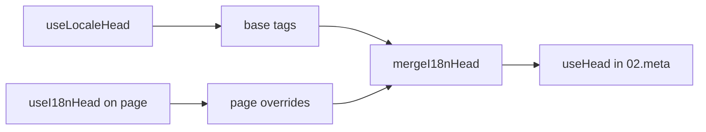

# `useI18nHead`-koostaja

`useI18nHead` antaa sinun mukauttaa i18n SEO -tageja **sivukohtaisesti** ilman mukautettua meta-liitännäistä. Kun `meta: true`, moduuli yhdistää syötteesi koostajan [`useLocaleHead`](/api/composables/use-locale-head) tulosteen päälle.

Tyypillisiä tapauksia:

- **CMS/blogiartikkelit** — vain osa kielistä on käännetty. Vaihtoehtoiset URL-osoitteet eroavat kielten välillä (eri slugit tai polut).
- **Dynaaminen kanoninen** — kanonisen URL:n on täsmättävä API:n artikkelin URL:iin, ei `$switchLocalePath`-arvoon.
- **Ylimääräinen Open Graph** — `og:title`, `og:description`, `og:image` automaattisesti luotujen `og:locale`- ja `og:url`-tagien rinnalla.
- **Osittainen hallinta** — säilytä moduulin luoma kanoninen ja `og:url`, mutta korvaa vain `hreflang` ja `og:locale:alternate`.

---

## Allekirjoitus

{/* generated:symbol:useI18nHead — do not edit; run `pnpm run docs:generate` */}

```ts
useI18nHead(input?: MaybeRefOrGetter<I18nHeadInput | null>): { pageHead: any; resetPageHead: () => void }
```

Rekisteröi sivutason ohitukset i18n SEO -head-tageille.
Ne yhdistetään koostajan `useLocaleHead` tulosteen päälle `02.meta`-liitännäisen toimesta.

| Parametri | Tyyppi | Kuvaus |
| --- | --- | --- |
| `input` *(valinnainen)* | `MaybeRefOrGetter<I18nHeadInput \| null>` |  |

{/* /generated:symbol:useI18nHead */}

## Miten se asettuu putkeen



Kutsut `useI18nHead`-koostajaa sivukomponentissa. `02.meta`-liitännäinen soveltaa ohitukset jokaisen `updateMeta()`-kutsun jälkeen (reitin vaihto, `$setI18nRouteParams`, `page:finish` asiakkaalla).

---

## Esimerkki 1 — Artikkeli, jonka käännökset ovat vain osalla kielistä

Yleinen kaava: API palauttaa, mitä kieliä on olemassa, sekä niiden absoluuttiset tai suhteelliset URL-osoitteet.

```ts
interface Article {
  title: string
  slug: string
  /** Locale code → page URL (absolute or site-relative) */
  locales: Record<string, string>
}
```

```vue
<script setup lang="ts">
const route = useRoute()
const { data: article } = await useFetch<Article>(`/api/articles/${route.params.slug}`)

const localeCodes = computed(() => Object.keys(article.value?.locales ?? {}))

useI18nHead(() => {
  if (!article.value) return null

  return {
    meta: [
      { property: 'og:title', content: article.value.title },
      { property: 'og:type', content: 'article' },
    ],
    replace: {
      hreflang: localeCodes.value.map((locale) => ({
        rel: 'alternate',
        hreflang: locale,
        href: article.value!.locales[locale]!,
      })),
      ogAlternates: localeCodes.value,
    },
  }
})
</script>
```

`ogAlternates` ottaa **kielikoodit** `i18n.locales`-konfiguraatiostasi. `og:locale:alternate`-arvot ratkaistaan `locale.og`- tai `iso`-arvon kautta (Open Graphin `en_US`-muoto).

---

## Esimerkki 2 — Artikkeli kielikohtaisilla slugeilla (`$defineI18nRoute` + `$setI18nRouteParams`)

Kun URL:t rakennetaan lokalisoiduista reittimalleista ja dynaamisista parametreista:

```vue
<script setup lang="ts">
const { $defineI18nRoute, $setI18nRouteParams } = useNuxtApp()
const route = useRoute()

const { data: article } = await useFetch(`/api/articles/${route.params.slug}`)

$defineI18nRoute({
  localeRoutes: {
    en: '/blog/[slug]',
    de: '/de/blog/[slug]',
    fr: '/fr/blog/[slug]',
  },
})

if (article.value) {
  $setI18nRouteParams({
    en: { slug: article.value.slugEn },
    de: { slug: article.value.slugDe },
    fr: { slug: article.value.slugFr },
  })

  const availableLocales = article.value.availableLocales as string[]

  useI18nHead({
    meta: [{ property: 'og:title', content: article.value.title }],
    replace: {
      hreflang: availableLocales.map((locale) => ({
        rel: 'alternate',
        hreflang: locale,
        href: article.value!.urls[locale],
      })),
      ogAlternates: availableLocales,
    },
  })
}
</script>
```

Moduulin luomat vaihtoehdot listaisivat **kaikki** määritetyt kielet. `replace.hreflang` rajaa tagit vain kieliin, joilla käännös todella on.

---

## Esimerkki 3 — Mukautettu `x-default` oletuskielen artikkelin URL:lle

Oletuksena `x-default` osoittaa oletuskielen URL:iin `$switchLocalePath`-funktion mukaan. Ohjaa se artikkeleiden osalta oletuskäännöksen URL:iin:

```vue
<script setup lang="ts">
const { $defaultLocale } = useNuxtApp()
const article = await loadArticle()

const defaultLocale = $defaultLocale() ?? 'en'
const defaultHref = article.locales[defaultLocale]

useI18nHead({
  replace: {
    hreflang: Object.entries(article.locales).map(([locale, href]) => ({
      rel: 'alternate',
      hreflang: locale,
      href,
    })),
    xDefault: defaultHref ? { rel: 'alternate', hreflang: 'x-default', href: defaultHref } : false,
    ogAlternates: Object.keys(article.locales),
  },
})
</script>
```

---

## Esimerkki 4 — Korvaa kanoninen ja `og:url` API-datasta

Kun kanonisen on täsmättävä CMS:n antamaan URL:iin (moniverkkotunnus, mukautettu polku tai valmiiksi rakennettu absoluuttinen URL):

```vue
<script setup lang="ts">
const article = await loadArticle()
const canonical = article.canonicalUrl // e.g. https://www.example.com/en/blog/my-post

useI18nHead({
  replace: {
    canonical,
    ogUrl: canonical,
    hreflang: buildAlternateLinks(article),
    ogAlternates: Object.keys(article.locales),
  },
  meta: [
    { property: 'og:title', content: article.title },
    { name: 'description', content: article.excerpt },
  ],
})
</script>
```

---

## Esimerkki 5 — Säilytä automaattinen kanoninen / `og:url`, korvaa vain vaihtoehtoiset linkit

Jos `$switchLocalePath` + `$setI18nRouteParams` tuottavat jo oikean kanonisen ja `og:url`-arvon, korvaa vain löydettävyystagit:

```vue
<script setup lang="ts">
const article = await loadArticle()

useI18nHead({
  replace: {
    hreflang: buildAlternateLinks(article),
    ogAlternates: Object.keys(article.locales),
  },
})
</script>
```

---

## Esimerkki 6 — Täysi head sisältösivulle (meta + linkit)

Kaava muistuttaa "sivun metan" ja "vaihtoehtoisten linkkien" jakamista erillisiin apureihin. Nyt ne yhdistetään yhteen kutsuun:

```vue
<script setup lang="ts">
const article = await loadArticle()
const alternates = Object.entries(article.locales).map(([locale, href]) => ({
  rel: 'alternate' as const,
  hreflang: locale,
  href: normalizeSeoUrl(href), // strip ?query and #hash if needed
}))

useI18nHead({
  meta: [
    { property: 'og:title', content: article.title },
    { property: 'og:description', content: article.description },
    { property: 'og:image', content: article.imageUrl },
    { name: 'twitter:card', content: 'summary_large_image' },
    { name: 'twitter:title', content: article.title },
  ],
  replace: {
    canonical: article.canonicalUrl,
    ogUrl: article.canonicalUrl,
    hreflang: alternates,
    ogAlternates: Object.keys(article.locales),
  },
})
</script>
```

```ts
/** Remove query and hash — useful when CMS URLs must be clean for SEO */
function normalizeSeoUrl(href: string): string {
  try {
    const url = new URL(href, 'https://placeholder.local')
    url.search = ''
    url.hash = ''
    return href.startsWith('http') ? url.href : `${url.pathname}`
  } catch {
    return href.split(/[?#]/)[0] ?? href
  }
}
```

---

## Esimerkki 7 — Kaksi sisältötyyppiä, sama kaava (uutiset vs oppaat)

Sama API-muoto, eri reittinimet. Uudelleenkäytä pientä apuria:

```ts
// composables/useArticleHead.ts
import type { I18nHeadInput } from '@i18n-micro/types'

interface LocalizedContent {
  title: string
  locales: Record<string, string>
  canonicalUrl?: string
}

export function buildArticleHead(content: LocalizedContent): I18nHeadInput {
  const localeCodes = Object.keys(content.locales)
  const canonical = content.canonicalUrl ?? content.locales.en

  return {
    meta: [{ property: 'og:title', content: content.title }],
    replace: {
      canonical,
      ogUrl: canonical,
      hreflang: localeCodes.map((locale) => ({
        rel: 'alternate',
        hreflang: locale,
        href: content.locales[locale]!,
      })),
      ogAlternates: localeCodes,
    },
  }
}
```

```vue
<!-- pages/blog/[slug].vue -->
<script setup lang="ts">
const article = await loadArticle()
useI18nHead(buildArticleHead(article))
</script>
```

```vue
<!-- pages/guides/[slug].vue -->
<script setup lang="ts">
const guide = await loadGuide()
useI18nHead(buildArticleHead(guide))
</script>
```

---

## Esimerkki 8 — Ota sisäänrakennetut vaihtoehdot pois käytöstä, tarjoa oma lista

Vastaa moduulin hreflang-generaattorin sammuttamista ja mukautetun listan välittämistä (ei päällekkäisiä vaihtoehtoisia listoja):

```vue
<script setup lang="ts">
const article = await loadArticle()

useI18nHead({
  disable: ['hreflang', 'x-default', 'og-alternates'],
  link: Object.entries(article.locales).map(([locale, href]) => ({
    rel: 'alternate',
    hreflang: locale,
    href,
  })),
  replace: {
    ogAlternates: Object.keys(article.locales),
  },
})
</script>
```

Tai suosi `replace.hreflang`-avainta ilman `disable`-listaa. Se korvaa kaikki `rel="alternate"`-linkit yhdellä askeleella.

---

## Esimerkki 9 — Aloitussivu: vain lisä-OG, säilytä kaikki i18n-tagit

```vue
<script setup lang="ts">
const { t } = useI18n()

useI18nHead({
  meta: [
    { property: 'og:title', content: t('landing.ogTitle') },
    { property: 'og:description', content: t('landing.ogDescription') },
  ],
})
</script>
```

---

## Esimerkki 10 — Tuotesivu: poista hreflang käytöstä yhden kielen kokeilua varten

```vue
<script setup lang="ts">
useI18nHead({
  disable: ['hreflang', 'x-default'],
  // canonical, og:locale, og:url still generated
})
</script>
```

---

## Esimerkki 11 — Reaktiiviset päivitykset asiakaspuolen haun jälkeen

```vue
<script setup lang="ts">
const article = ref<Article | null>(null)

onMounted(async () => {
  article.value = await $fetch('/api/articles/latest')
})

useI18nHead(() => {
  if (!article.value) return null
  return {
    meta: [{ property: 'og:title', content: article.value.title }],
    replace: {
      hreflang: Object.entries(article.value.locales).map(([locale, href]) => ({
        rel: 'alternate',
        hreflang: locale,
        href,
      })),
    },
  }
})
</script>
```

Head päivittyy tapahtumassa `page:finish` ja kun `pageHead`-tila muuttuu.

---

## Esimerkki 12 — HTTPS-alkuperä käänteispalvelimen takana

Jos aiemmin ratkaisit "julkisen alkuperän" koostajan kanonisia/vaihtoehtoisia absoluuttisia URL-osoitteita varten, käytä sen sijaan moduulin konfiguraatiota:

```ts
// nuxt.config.ts
export default defineNuxtConfig({
  i18n: {
    meta: true,
    // undefined = origin from current request (multi-domain friendly)
    metaBaseUrl: undefined,
    metaTrustForwardedHost: true,
    metaTrustForwardedProto: true,
  },
})
```

Välitä sitten **polut tai täydet URL-osoitteet** avaimissa `replace.hreflang`/`replace.canonical`. Moduuli käyttää funktiota `useRequestURL` sekä otsikoita `X-Forwarded-Host`/`X-Forwarded-Proto` SSR:ssä.

---

## API-viite

### `meta`

Ylimääräisiä `<meta>`-tageja. Karsitaan päällekkäisyydet avaimen `id`, `property` tai `name` perusteella.

### `link`

Ylimääräisiä `<link>`-tageja. Karsitaan päällekkäisyydet avaimen `id` tai `rel` + `hreflang` perusteella.

### `htmlAttrs`

Yhdistetään `<html>`-attribuutteihin koostajan `useLocaleHead` tuottamana (`lang`, `dir`).

### `replace`

| Avain          | Tyyppi                    | Vaikutus                                       |
| -------------- | ------------------------- | ---------------------------------------------- |
| `canonical`    | `string \| false`         | Korvaa tai poista kanoninen linkki             |
| `hreflang`     | `I18nHeadLink[] \| false` | Korvaa tai poista kaikki `rel="alternate"`-linkit |
| `xDefault`     | `I18nHeadLink \| false`   | Korvaa tai poista `hreflang="x-default"`       |
| `ogLocale`     | `string \| false`         | Korvaa tai poista `og:locale`                  |
| `ogUrl`        | `string \| false`         | Korvaa tai poista `og:url`                     |
| `ogAlternates` | `string[] \| false`       | Rakenna uudelleen `og:locale:alternate` kielikoodeille |

### `disable`

| Arvo            | Poistaa                                    |
| --------------- | ------------------------------------------ |
| `hreflang`      | Kielten vaihtoehtoiset linkit (ei `x-default`) |
| `x-default`     | `hreflang="x-default"`-linkin              |
| `canonical`     | Kanonisen linkin                           |
| `og`            | `og:locale`- ja `og:url`-tagit             |
| `og-alternates` | `og:locale:alternate`-tagit                |
| `html`          | `lang`/`dir` `<html>`-elementistä          |

---

## `useLocaleHead` vs `useI18nHead`

| Koostaja        | Laajuus              | Milloin käyttää                            |
| --------------- | -------------------- | ------------------------------------------ |
| `useLocaleHead` | Globaali / manuaalinen head | `meta: false`, täysin mukautettu `useHead`-asennus |
| `useI18nHead`   | Sivukohtaiset ohitukset | `meta: true`, mukauta tiettyjä sivuja      |

Kun `meta: true`, **et** tarvitse `useLocaleHead`-koostajaa sivuilla, jotka käyttävät vain koostajaa `useI18nHead`.

---

## Siirtymä mukautetusta i18n head -liitännäisestä

Monet projektit ylläpitävät mukautettua liitännäistä, joka:

- yhdistää sivukohtaiset vaihtoehtoiset linkit jaetusta tilasta;
- suodattaa päällekkäiset alueelliset `hreflang`-merkinnät;
- normalisoi `og:locale`-arvot;
- riisuu kyselymerkkijonot SEO-URL-osoitteista.

Voit korvata tämän `useI18nHead`-koostajalla jokaisella sisältösivulla ja moduulin oletuksilla.

| Aiempi lähestymistapa                                 | `useI18nHead`-koostajalla                            |
| ----------------------------------------------------- | ---------------------------------------------------- |
| Jaettu tila + "mitkä kielet tälle artikkelille"       | `replace: \{ ogAlternates: localeCodes \}`             |
| Erillinen apuri, joka rakentaa `rel="alternate"`-linkit | `replace: \{ hreflang: links \}`                       |
| Mukautettu liitännäinen, joka yhdistää sivutilan headiin | Sisäänrakennettu yhdistäminen `02.meta`-liitännäisessä |
| Mukautettu "julkinen alkuperä" absoluuttisille URL-osoitteille | `metaBaseUrl` + välitetyt otsikot (katso esimerkki 12) |
| Lyhyt `og:locale` (`en` `en_US`:n sijaan)             | Aseta `locale.og` tai käytä `iso` → `en_US` (OG-protokolla) |

**`hreflang` `iso`-arvosta:** jokainen kieli lähettää yhden vaihtoehdon, jossa `hreflang = iso || code`. Reitityksen `code`-arvoa ei koskaan käytetä, kun `iso` on asetettu (välttää virheelliset tagit, kuten `hreflang="mx"`). Ota käyttöön pelkän kielen varakoodit (`es-ES` → myös `es`) asetuksella `hreflangBaseLanguage: true`. Ne johdetaan `iso`-arvosta, ei `code`-arvosta. Täysin mukautettuja listoja varten käytä `replace.hreflang`-avainta.

**JSON-LD:** `useI18nHead` ei luo strukturoitua dataa. Pidä `useHead(\{ script: [...] \})` tai omistautunut JSON-LD-apuri sen rinnalla.

---

## Katso myös

- [SEO-opas](/guides/seo) — automaattinen metan luonti ja sivutason ohitukset
- [`useLocaleHead`](/api/composables/use-locale-head) — matalan tason head-API
