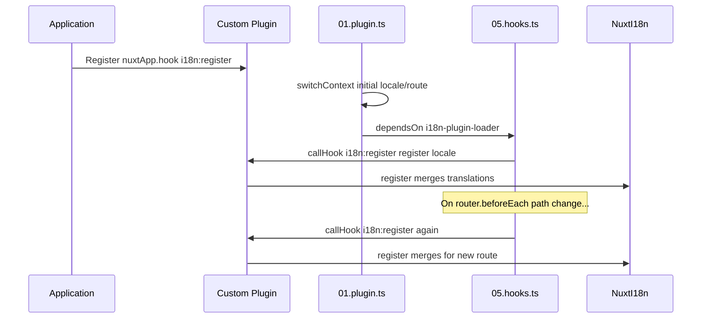

# 📢 Tapahtumat

## 🔄 `i18n:register`

`Nuxt I18n Micro`n `i18n:register`-tapahtuma mahdollistaa käännösten dynaamisen lisäämisen sovelluksesi i18n-kontekstiin. Se tekee kansainvälistämisprosessista saumattoman ja joustavan. Tapahtuman avulla voit integroida uusia käännöksiä tarpeen mukaan ja parantaa sovelluksesi lokalisointikykyä.

### 📝 Tapahtuman tiedot

- **Tarkoitus**:
  - Mahdollistaa lisäkäännösten dynaamisen sisällyttämisen olemassa olevaan sarjaan tietylle kielelle.

- **Hyötykuorma**:
  - **`register`**:
    - Tapahtuman tarjoama funktio, joka ottaa kaksi argumenttia:
      - **`translations`** (`Translations`):
        - Objekti, joka sisältää avain-arvo-pareina käännökset `Translations`-rajapinnan mukaisesti järjestettynä.
      - **`locale`** (`string`, valinnainen):
        - Kielikoodi (esim. `'en'`, `'ru'`), jolle käännökset rekisteröidään. Oletuksena tapahtuman tarjoama kielikoodi, jos ei erikseen määritelty.

- **Käytös**:
  - Kun tapahtuma laukaistaan, funktio `register` yhdistää uudet käännökset nykyiseen kontekstiin määritetylle kielelle ja päivittää saatavilla olevat käännökset koko sovelluksessa.

### ⏱️ Milloin se laukeaa

Moduulin hooks-liitännäinen (`05.hooks.ts`, `dependsOn: ['i18n-plugin-loader']`) kutsuu funktiota `nuxtApp.callHook('i18n:register', …)`:

1. **Kerran käynnistyksessä** — sen jälkeen kun pää-i18n-liitännäinen (`01.plugin.ts`) on ladannut käännökset alkuperäiselle reitille.
2. **Navigoinnin yhteydessä** — funktiossa `router.beforeEach`, kun polku muuttuu, tai jokaisen navigoinnin yhteydessä, kun `strategy: 'no_prefix'`.

Rekisteröi kuuntelijasi tavallisessa Nuxt-liitännäisessä funktiolla `nuxtApp.hook('i18n:register', …)`. Hooks-liitännäinen ajetaan lataajan valmistumisen jälkeen, joten callbackisi kutsutaan, kun käännöksiä on laajennettava.

Aseta `hooks: false` tiedostossa `nuxt.config`, jos haluat poistaa automaattiset `i18n:register`-kutsut käytöstä (katso [Konfiguraatio — `hooks`](/guides/configuration#hooks)).

### 💡 Käyttöesimerkki

Seuraava esimerkki näyttää, miten `i18n:register`-tapahtumaa käytetään käännösten dynaamiseen lisäämiseen:

```typescript
nuxt.hook('i18n:register', async (register: (translations: unknown, locale?: string) => void, locale: string) => {
  register(
    {
      greeting: 'Hello',
      farewell: 'Goodbye',
    },
    locale,
  )
})
```

### 🛠️ Selitys



- **Tapahtuman laukaisu**:
  - Hooks-liitännäinen (`05.hooks.ts`) laukaisee `i18n:register`-tapahtuman lataajan valmistumisen jälkeen ja olennaisten navigointien yhteydessä.

- **Käännösten lisääminen**:
  - Esimerkki rekisteröi englanninkieliset käännökset avaimille `"greeting"` ja `"farewell"`.
  - Funktio `register` yhdistää nämä käännökset annetun kielen olemassa olevaan sarjaan.

### 🔗 Tärkeimmät edut

- **Dynaamiset päivitykset**:
  - Voit päivittää tai lisätä käännöksiä helposti ilman koko sovelluksen uudelleenkäyttöönottoa.

- **Lokalisoinnin joustavuus**:
  - Tukee reaaliaikaisia lokalisointimuutoksia käyttäjän tai sovelluksen tarpeiden mukaan.

Käyttämällä tapahtumaa `i18n:register` voit varmistaa, että sovelluksesi lokalisointistrategia pysyy joustavana ja mukautuvana. Tämä parantaa käyttäjäkokemusta.

---

## 🛠️ Käännösten muokkaaminen liitännäisillä

Nuxt-sovelluksesi käännösten muokkaamiseen dynaamisesti liitännäisten käyttö on suositeltavaa. Liitännäiset tarjoavat rakenteellisen tavan käsitellä lokalisointipäivityksiä, erityisesti moduulien tai ulkoisten käännöstiedostojen kanssa.

### **Liitännäisen rekisteröinti**

Jos käytät moduulia, rekisteröi liitännäinen paikkaan, jossa käännösmuutokset tapahtuvat, lisäämällä se moduulisi konfiguraatioon:

```javascript
addPlugin({
  src: resolve('./plugins/extend_locales'),
})
```

Tämä rekisteröi liitännäisen, joka sijaitsee polussa `./plugins/extend_locales` ja käsittelee käännösten dynaamista lataamista ja rekisteröintiä.

### **Liitännäisen toteutus**

Voit hallita kielimuutoksia liitännäisessä. Tässä on esimerkki toteutuksesta Nuxt-liitännäisessä:

```typescript
import { defineNuxtPlugin } from '#app'

export default defineNuxtPlugin(async (nuxtApp) => {
  // Function to load translations from JSON files and register them
  const loadTranslations = async (lang: string) => {
    try {
      const translations = await import(`../locales/${lang}.json`)
      return translations.default
    } catch (error) {
      console.error(`Error loading translations for language: ${lang}`, error)
      return null
    }
  }

  // Hook into the 'i18n:register' event to dynamically add translations
  // eslint-disable-next-line @typescript-eslint/ban-ts-comment
  // @ts-expect-error
  nuxtApp.hook('i18n:register', async (register: (translations: unknown, locale?: string) => void, locale: string) => {
    const translations = await loadTranslations(locale)
    if (translations) {
      register(translations, locale)
    }
  })
})
```

### 📝 Yksityiskohtainen selitys

1. **Käännösten lataus**:

- Funktio `loadTranslations` tuo käännöstiedostot dynaamisesti kielen perusteella. Tiedostojen odotetaan olevan hakemistossa `locales` ja nimetty kielikoodien mukaan (esim. `en.json`, `de.json`).
- Onnistuneen latauksen jälkeen käännökset palautetaan. Muussa tapauksessa virhe kirjataan lokiin.

2. **Käännösten rekisteröinti**:

- Liitännäinen liittyy `i18n:register`-tapahtumaan funktiolla `nuxtApp.hook`.
- Kun tapahtuma laukeaa, funktiota `register` kutsutaan ladatuilla käännöksillä ja vastaavalla kielellä.
- Tämä yhdistää uudet käännökset i18n-kontekstiin määritetylle kielelle ja päivittää saatavilla olevat käännökset koko sovelluksessa.

### 🔗 Liitännäisten käytön edut käännösten muokkauksessa

- **Vastuunjaon selkeys**:
  - Kapseloi lokalisointilogiikka erilleen pääsovelluskoodista. Hallinta ja ylläpito helpottuvat.

- **Dynaaminen ja skaalautuva**:
  - Dynaamisesti ladattavien ja rekisteröitävien käännösten avulla voit päivittää sisältöä ilman koko sovelluksen uudelleenkäyttöönottoa. Tämä on erityisen hyödyllistä sovelluksille, joissa on usein päivittyvää tai monikielistä sisältöä.

- **Parannettu lokalisoinnin joustavuus**:
  - Liitännäiset mahdollistavat käännösten muokkaamisen tai laajentamisen tarpeen mukaan. Tämä tarjoaa mukautuvamman ja responsiivisemman lokalisointistrategian, joka vastaa käyttäjän mieltymyksiä tai liiketoiminnan vaatimuksia.

Tätä lähestymistapaa soveltamalla voit tehokkaasti laajentaa ja muokata sovelluksesi lokalisointia liitännäisten avulla rakenteellisella ja ylläpidettävällä tavalla. Näin kansainvälistäminen pysyy mukautuvana muuttuviin tarpeisiin ja parantaa käyttäjäkokemusta.
