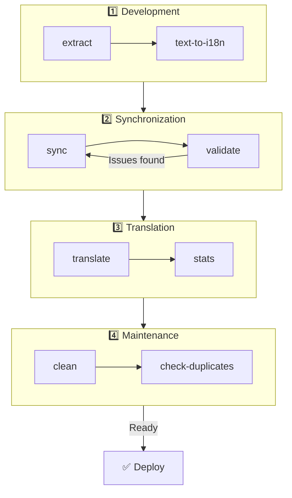

# 🌐 nuxt-i18n-micro-cli -opas

## 📖 Johdanto

`nuxt-i18n-micro-cli` on komentorivityökalu, joka on suunniteltu virtaviivaistamaan paikallistamis- ja kansainvälistämisprosessia Nuxt.js-projekteissa, jotka käyttävät `nuxt-i18n-micro`-moduulia (Nuxt I18n Micro). Se tarjoaa apuvälineitä käännösavainten poimimiseen koodikannastasi, käännöstiedostojen hallintaan, käännösten synkronointiin kielten välillä ja käännösprosessin automatisointiin ulkoisten käännöspalveluiden avulla.

Tämä opas ohjaa sinut asennukseen, konfigurointiin ja työkalun `nuxt-i18n-micro-cli` käyttöön projektisi käännösten tehokkaassa hallinnassa. Paketti [npmjs.com](https://www.npmjs.com/package/nuxt-i18n-micro-cli).

## 🔧 Asennus ja käyttöönotto

### 📦 nuxt-i18n-micro-cli:n asentaminen

Asenna globaalisti tai kehitysriippuvuutena Nuxt-projektiisi (suositellaan CI:tä varten):

```bash
# global
npm install -g nuxt-i18n-micro-cli

# or per project
pnpm add -D nuxt-i18n-micro-cli
pnpm exec i18n-micro text-to-i18n --dryRun
```

Käytä **`nuxt-i18n-micro-cli` ≥ 2.1.1** -versiota, jos projektisi käyttää Nuxt 4:n `app/`-hakemistoa (`app/pages`, `app/components`, …). Vanhemmat CLI-versiot skannasivat vain `pages/`-hakemiston projektin juuresta.

### 🛠 Alustus projektissasi

Kun olet asentanut, voit ajaa `i18n-micro`-komentoja Nuxt.js-projektisi hakemistossa.

Varmista, että projektisi on määritetty käyttämään `nuxt-i18n-micro`-moduulia ja että siinä on tarvittava konfiguraatio tiedostossa `nuxt.config.ts` (tai `nuxt.config.js`).

### 📄 Yleiset argumentit

- `--cwd`: Määritä nykyinen työhakemisto (oletus `.`).
- `--logLevel`: Aseta lokitaso (`silent`, `info`, `verbose`).
- `--translationDir`: Hakemisto, joka sisältää JSON-käännöstiedostot (oletus: `locales`).

## 📊 CLI-työnkulun yleiskatsaus



### Työnkulun vaiheet

| Vaihe           | Komennot                    | Tarkoitus                          |
| --------------- | --------------------------- | ---------------------------------- |
| **Kehitys**     | `extract`, `text-to-i18n`   | Etsi ja poimi käännösavaimet       |
| **Synk.**       | `sync`, `validate`          | Varmista, että kaikilla kielillä on samat avaimet |
| **Käännös**     | `translate`, `stats`        | Käännä puuttuvat avaimet automaattisesti |
| **Ylläpito**    | `clean`, `check-duplicates` | Pidä käännökset siisteinä          |

## 📋 Komennot

### 🔄 `text-to-i18n`-komento

CLI-paketti: [`nuxt-i18n-micro-cli`](https://www.npmjs.com/package/nuxt-i18n-micro-cli)

**Kuvaus**: Skannaa Vue-/TS-/JS-tiedostot etsien kovakoodattuja käyttäjänäkyviä merkkijonoja, korvaa ne muodossa `$t('...')` ja yhdistää uudet avaimet JSON-käännöstiedostoosi. Aja **Nuxt-projektin juuresta** (jossa `nuxt.config` sijaitsee).

**Käyttö**:

```bash
i18n-micro text-to-i18n [options]
```

**Vaihtoehdot**:

| Vaihtoehto              | Oletus            | Kuvaus                                                              |
| ----------------------- | ----------------- | ------------------------------------------------------------------- |
| `--translationFile`     | `locales/en.json` | JSON-tiedosto uusille avaimille (suhteessa projektin juureen).      |
| `--path`                | —                 | Käsittele vain yksi tiedosto tai hakemisto (esim. `app/pages/about.vue`). |
| `--context`             | —                 | Avaimen prefiksi (esim. `auth` → `auth.*`).                         |
| `--dryRun`              | `false`           | Esikatsele kirjoittamatta tiedostoja.                               |
| `--verbose`             | `false`           | Lisälokitus.                                                        |
| `--interactive`         | `false`           | Vahvista tai muokkaa jokainen avain ennen soveltamista.             |
| `--extractOnlyDirs`     | `plugins`         | Hakemistot, joista avaimet poimitaan mutta lähdetiedostoja **ei** kirjoiteta uudelleen. |
| `--extractOnlyPatterns` | —                 | Glob-tyyliset vain-poimintamallit (esim. `**/*.plugin.ts`).         |

**Esimerkki**:

```bash
i18n-micro text-to-i18n --translationFile locales/en.json --context auth --dryRun
```

#### Mitkä kansiot skannataan?

<Info>
CLI-versiosta **v2.1.1** alkaen `text-to-i18n` skannaa sekä klassiset juurikansiot että `app/*`-vastineet. Aja komento **projektin juuresta** — älä `cd app`.
</Info>

Kerää `*.vue`-, `*.js`- ja `*.ts`-tiedostoja hakemistoista:

| Nuxt 3 (projektin juuri) | Nuxt 4 (`app/`-hakemisto) |
| ------------------------ | ------------------------- |
| `pages/`                 | `app/pages/`              |
| `components/`            | `app/components/`         |
| `plugins/`               | `app/plugins/`            |
| `layouts/`               | `app/layouts/`            |

Muut kansiot (`server/`, `composables/`, `middleware/`, …) ohitetaan, ellet käytä `--path`-vaihtoehtoa. Nuxt 4:n osalta aja projektin juuresta (`cd app` ei ole tarpeen). Sovita `i18n.translationDir` `--translationFile`-arvoon, jos se ei ole `locales/`.

```bash
i18n-micro text-to-i18n --path app/pages
```

#### Miten se toimii

1. Kerää tiedostot yllä olevista hakemistoista (tai `--path`-arvosta).
2. Korvaa literaalit / templaattitekstit muodossa `$t('generated.key')` (`plugins/` on oletuksena vain-poiminta).
3. Yhdistä uudet avaimet arvoon `--translationFile` poistamatta olemassa olevia merkintöjä.

**Esimerkkimuunnokset**:

Ennen:

```vue
<template>
  <div>
    <h1>Welcome to our site</h1>
    <p>Please sign in to continue</p>
  </div>
</template>
```

Jälkeen:

```vue
<template>
  <div>
    <h1>{{ $t('pages.home.welcome_to_our_site') }}</h1>
    <p>{{ $t('pages.home.please_sign_in') }}</p>
  </div>
</template>
```

**Parhaat käytännöt**: aja ensin dry-run; commitoi ennen täysajoa; sovita `--translationFile` `i18n.translationDir`-arvoon `nuxt.config`-tiedostossa; pidä `--extractOnlyDirs plugins` bootstrap-koodia varten.

**Rajoitukset**: erillinen npm-paketti (ei ole niputettu moduulin kanssa); ei lue `nuxt.config`-tiedostoa automaattisesti; tulostaa `$t(...)`-muodossa; monimutkaiset dynaamiset merkkijonot saattavat vaatia `extract` / `search`-komentojen käyttöä.

### 📊 `stats`-komento

**Kuvaus**: `stats`-komentoa käytetään näyttämään käännöstilastot jokaiselle kielelle Nuxt.js-projektissasi. Se auttaa sinua ymmärtämään käännöstesi edistymistä näyttämällä, kuinka monta avainta on käännetty verrattuna saatavilla olevien avainten kokonaismäärään.

**Käyttö**:

```bash
i18n-micro stats [options]
```

**Vaihtoehdot**:

- `--full`: Näytä vain yhdistettyjen käännösten tilastot (oletus: `false`).

**Esimerkki**:

```bash
i18n-micro stats --full
```

### 🌍 `translate`-komento

**Kuvaus**: `translate`-komento kääntää puuttuvat avaimet automaattisesti käyttäen ulkoisia käännöspalveluita. Tämä komento yksinkertaistaa käännösprosessia hyödyntämällä palveluiden kuten Google Translate, DeepL ja muiden API:ita täyttääkseen puuttuvat käännökset.

**Käyttö**:

```bash
i18n-micro translate [options]
```

**Vaihtoehdot**:

- `--service`: Käytettävä käännöspalvelu (esim. `google`, `deepl`, `yandex`). Jos ei ole määritetty, komento pyytää sinua valitsemaan.
- `--token`: API-avain valitulle käännöspalvelulle. Jos ei ole annettu, sinua pyydetään syöttämään se.
- `--options`: Lisävaihtoehdot käännöspalvelulle, annettuina avain:arvo-pareina pilkuilla eroteltuina (esim. `model:gpt-3.5-turbo,max_tokens:1000`).
- `--replace`: Käännä kaikki avaimet, korvaten olemassa olevat käännökset (oletus: `false`).

**Esimerkki**:

```bash
i18n-micro translate --service deepl --token YOUR_DEEPL_API_KEY
```

#### 🌐 Tuetut käännöspalvelut

`translate`-komento tukee useita käännöspalveluita. Joitakin tuettuja palveluita ovat:

- **Google Translate** (`google`)
- **DeepL** (`deepl`)
- **Yandex Translate** (`yandex`)
- **OpenAI** (`openai`)
- **Azure Translator** (`azure`)
- **IBM Watson** (`ibm`)
- **Baidu Translate** (`baidu`)
- **LibreTranslate** (`libretranslate`)
- **MyMemory** (`mymemory`)
- **Lingva Translate** (`lingvatranslate`)
- **Papago** (`papago`)
- **Tencent Translate** (`tencent`)
- **Systran Translate** (`systran`)
- **Yandex Cloud Translate** (`yandexcloud`)
- **ModernMT** (`modernmt`)
- **Lilt** (`lilt`)
- **Unbabel** (`unbabel`)
- **Reverso Translate** (`reverso`)

#### ⚙️ Palvelun konfigurointi

Jotkut palvelut vaativat tiettyjä konfiguraatioita tai API-avaimia. Kun käytät `translate`-komentoa, voit määrittää palvelun ja antaa tarvittavan `--token`-arvon (API-avaimen) sekä lisää `--options`-vaihtoehtoja tarvittaessa.

Esimerkiksi:

```bash
i18n-micro translate --service openai --token YOUR_OPENAI_API_KEY --options openaiModel:gpt-3.5-turbo,max_tokens:1000
```

### 🛠️ `extract`-komento

**Kuvaus**: Poimii käännösavaimet koodikannastasi ja järjestää ne laajuuden mukaan.

**Käyttö**:

```bash
i18n-micro extract [options]
```

**Vaihtoehdot**:

- `--prod, -p`: Suorita tuotantotilassa.

**Esimerkki**:

```bash
i18n-micro extract
```

### 🔄 `sync`-komento

**Kuvaus**: Synkronoi käännöstiedostot kielten välillä varmistaen, että kaikilla kielillä on samat avaimet.

**Käyttö**:

```bash
i18n-micro sync [options]
```

**Esimerkki**:

```bash
i18n-micro sync
```

### ✅ `validate`-komento

**Kuvaus**: Validoi käännöstiedostot puuttuvien tai ylimääräisten avainten varalta verrattuna viitekieleen.

**Käyttö**:

```bash
i18n-micro validate [options]
```

**Esimerkki**:

```bash
i18n-micro validate
```

### 🧹 `clean`-komento

**Kuvaus**: Poistaa käyttämättömät käännösavaimet käännöstiedostoista.

**Käyttö**:

```bash
i18n-micro clean [options]
```

**Esimerkki**:

```bash
i18n-micro clean
```

### 📤 `import`-komento

**Kuvaus**: Muuntaa PO-tiedostot takaisin JSON-muotoon ja tallentaa ne käännöshakemistoon.

**Käyttö**:

```bash
i18n-micro import [options]
```

**Vaihtoehdot**:

- `--potsDir`: Hakemisto, joka sisältää PO-tiedostot (oletus: `pots`).

**Esimerkki**:

```bash
i18n-micro import --potsDir pots
```

### 📥 `export`-komento

**Kuvaus**: Vie käännökset PO-tiedostoihin ulkoista käännösten hallintaa varten.

**Käyttö**:

```bash
i18n-micro export [options]
```

**Vaihtoehdot**:

- `--potsDir`: Hakemisto, johon PO-tiedostot tallennetaan (oletus: `pots`).

**Esimerkki**:

```bash
i18n-micro export --potsDir pots
```

### 🗂️ `export-csv`-komento

**Kuvaus**: `export-csv`-komento vie käännösavaimet ja -arvot JSON-tiedostoista, mukaan lukien niiden tiedostopolut, CSV-muotoon. Tämä komento on hyödyllinen tiimeille, jotka työskentelevät mieluummin käännösdatan kanssa taulukkolaskentaohjelmissa.

**Käyttö**:

```bash
i18n-micro export-csv [options]
```

**Vaihtoehdot**:

- `--csvDir`: Hakemisto, johon viedyt CSV-tiedostot tallennetaan.
- `--delimiter`: Määritä erotin CSV-tiedostolle (oletus: `,`).

**Esimerkki**:

```bash
i18n-micro export-csv --csvDir csv_files
```

### 📑 `import-csv`-komento

**Kuvaus**: `import-csv`-komento tuo käännösdataa CSV-tiedostoista, päivittäen vastaavat JSON-tiedostot. Tämä on hyödyllistä käännösten massapäivitysten soveltamiseen taulukoista.

**Käyttö**:

```bash
i18n-micro import-csv [options]
```

**Vaihtoehdot**:

- `--csvDir`: Hakemisto, joka sisältää tuotavat CSV-tiedostot.
- `--delimiter`: Määritä CSV-tiedostossa käytettävä erotin (oletus: `,`).

**Esimerkki**:

```bash
i18n-micro import-csv --csvDir csv_files
```

### 🧾 `diff`-komento

**Kuvaus**: Vertailee käännöstiedostoja oletuskielen ja muiden kielten välillä samassa hakemistossa (mukaan lukien alihakemistot). Komento tunnistaa puuttuvat avaimet ja niiden arvot oletuskielessä muihin kieliin verrattuna, mikä helpottaa käännösten edistymisen tai epäjohdonmukaisuuksien seurantaa.

**Käyttö**:

```bash
i18n-micro diff [options]
```

**Esimerkki**:

```bash
i18n-micro diff
```

### 🔍 `check-duplicates`-komento

**Kuvaus**: `check-duplicates`-komento tarkistaa käännösarvojen päällekkäisyydet jokaisessa kielessä kaikissa käännöstiedostoissa, mukaan lukien sekä juuritason että sivukohtaiset käännökset. Se varmistaa, että eri avaimet saman kielen sisällä eivät jaa identtisiä käännösarvoja, mikä auttaa säilyttämään selkeyden ja johdonmukaisuuden käännöksissäsi.

**Käyttö**:

```bash
i18n-micro check-duplicates [options]
```

**Esimerkki**:

```bash
i18n-micro check-duplicates
```

**Miten se toimii**:

- Komento tarkistaa sekä juuritason että sivukohtaiset käännöstiedostot jokaiselle kielelle.
- Jos käännösarvo esiintyy useissa paikoissa (joko juuritason käännöksissä tai eri sivujen välillä), se raportoi päällekkäiset arvot yhdessä tiedoston ja avaimen kanssa, joissa ne löytyvät.
- Jos päällekkäisyyksiä ei löydy, komento vahvistaa, että kieli on vapaa päällekkäisistä käännösarvoista.

Tämä komento auttaa varmistamaan, että käännösavaimet säilyttävät uniikit arvot, estäen tahattoman toiston saman kielen sisällä.

### 🔄 `replace-values`-komento

**Kuvaus**: `replace-values`-komento mahdollistaa käännösarvojen massakorvausten suorittamisen kaikkien kielten välillä. Se tukee sekä yksinkertaisia tekstikorvauksia että edistyneempiä korvauksia käyttäen säännöllisiä lausekkeita (regex). Voit myös käyttää sieppausryhmiä regex-malleissa ja viitata niihin korvausmerkkijonossa, mikä tekee siitä ihanteellisen monimutkaisempiin korvausskenaarioihin.

**Käyttö**:

```bash
i18n-micro replace-values [options]
```

**Vaihtoehdot**:

- `--search`: Teksti tai regex-malli, jota etsitään käännöksistä. Tämä on pakollinen vaihtoehto.
- `--replace`: Korvausteksti löydetyille käännöksille. Tämä on pakollinen vaihtoehto.
- `--useRegex`: Ota käyttöön haku säännöllisen lausekkeen mallilla (oletus: `false`).

**Esimerkki 1**: Yksinkertainen korvaus

Korvaa merkkijono "Hello" arvolla "Hi" kaikissa kielissä:

```bash
i18n-micro replace-values --search "Hello" --replace "Hi"
```

**Esimerkki 2**: Regex-korvaus

Ota regex-haku käyttöön ja korvaa mikä tahansa "Hello"-alkuinen merkkijono, jota seuraa numeroita (esim. "Hello123"), arvolla "Hi" kaikissa kielissä:

```bash
i18n-micro replace-values --search "Hello\\d+" --replace "Hi" --useRegex
```

**Esimerkki 3**: Regex-sieppausryhmien käyttö

Käytä sieppausryhmiä sijoittaaksesi dynaamisesti osan vastanneesta merkkijonosta korvauksen sisään. Korvaa esimerkiksi "Hello [name]" arvolla "Hi [name]" säilyttäen nimen ennallaan:

```bash
i18n-micro replace-values --search "Hello (\\w+)" --replace "Hi $1" --useRegex
```

Tässä tapauksessa `$1` viittaa ensimmäiseen sieppausryhmään, joka vastaa `[name]`-osaa "Hello"-sanan jälkeen. Korvaus säilyttää nimen alkuperäisestä merkkijonosta.

**Miten se toimii**:

- Komento skannaa kaikki käännöstiedostot (sekä globaalit että sivukohtaiset).
- Kun osuma löytyy hakumerkkijonon tai regex-mallin perusteella, se korvaa osumatekstin annetulla korvauksella.
- Kun käytetään regexiä, sieppausryhmiä voidaan käyttää korvausmerkkijonossa viittaamalla niihin `$1`-, `$2`-arvoilla jne.
- Kaikki muutokset lokitetaan, näyttäen tiedostopolun, käännösavaimen ja käännösarvon ennen/jälkeen -tilan.

**Lokitus**:
Jokaiselle korvaukselle komento lokittaa yksityiskohdat, mukaan lukien:

- Kieli ja tiedostopolku
- Muokattava käännösavain
- Vanha arvo ja uusi arvo korvauksen jälkeen
- Jos käytetään regexiä sieppausryhmien kanssa, lokit näyttävät ryhmäosumat ja miten ne korvattiin.

Tämän avulla voit seurata tarkasti, missä ja mitä muutoksia tehtiin korvausoperaation aikana, tarjoten selkeän muutoshistorian käännöstiedostoissasi.

## 🛠 Esimerkkejä

- **Käännösten poiminta**:

  ```bash
  i18n-micro extract
  ```

- **Puuttuvien avainten kääntäminen Google Translatella**:

  ```bash
  i18n-micro translate --service google --token YOUR_GOOGLE_API_KEY
  ```

- **Kaikkien avainten kääntäminen ja olemassa olevien käännösten korvaaminen**:

  ```bash
  i18n-micro translate --service deepl --token YOUR_DEEPL_API_KEY --replace
  ```

- **Käännöstiedostojen validointi**:

  ```bash
  i18n-micro validate
  ```

- **Käyttämättömien käännösavainten siivous**:

  ```bash
  i18n-micro clean
  ```

- **Käännöstiedostojen synkronointi**:

  ```bash
  i18n-micro sync
  ```

## ⚙️ Konfigurointiopas

`nuxt-i18n-micro-cli` luottaa Nuxt.js-i18n-konfiguraatioosi tiedostossa `nuxt.config.ts` (tai `nuxt.config.js`). Varmista, että sinulla on `nuxt-i18n-micro`-moduuli asennettuna ja konfiguroituna.

### 🔑 nuxt.config.js-esimerkki

```ts
export default defineNuxtConfig({
  modules: ['nuxt-i18n-micro'],
  i18n: {
    locales: [
      { code: 'en', iso: 'en-US' },
      { code: 'fr', iso: 'fr-FR' },
    ],
    defaultLocale: 'en',
    fallbackLocale: 'en',
    translationDir: 'locales', // or 'app/locales' for Nuxt 4 colocation
  },
})
```

Varmista, että `translationDir`-arvo vastaa hakemistoa, jota `nuxt-i18n-micro-cli` käyttää (oletus on `locales`).

## 📝 Parhaat käytännöt

### 🔑 Yhdenmukainen avainten nimeäminen

Varmista, että käännösavaimet ovat yhdenmukaisia ja kuvaavia sekaannusten ja päällekkäisyyksien välttämiseksi.

### 🧹 Säännöllinen ylläpito

Käytä `clean`-komentoa säännöllisesti käyttämättömien käännösavainten poistamiseksi ja pidä käännöstiedostosi siisteinä.

### 🛠 Automatisoi käännöstyönkulku

Integroi `nuxt-i18n-micro-cli`-komennot kehitystyönkulkuusi tai CI/CD-putkellesi automatisoidaksesi käännösten poiminnan, kääntämisen, validoinnin ja synkronoinnin.

### 🛡️ Suojaa API-avaimet

Kun käytät käännöspalveluita, jotka vaativat API-avaimia, varmista että avaimesi pidetään turvassa eikä niitä laiteta versionhallintaan. Harkitse ympäristömuuttujien tai turvallisten avainhallintaratkaisujen käyttöä.

## 📞 Tuki ja osallistumiset

Jos kohtaat ongelmia tai sinulla on parannusehdotuksia, voit vapaasti osallistua projektiin tai avata issue-tiketin projektin repositoriossa.

---

Tätä opasta seuraamalla pystyt hallitsemaan Nuxt.js-projektisi käännöksiä tehokkaasti käyttämällä `nuxt-i18n-micro-cli`-työkalua, virtaviivaistamalla kansainvälistämispyrkimyksiäsi ja varmistamalla sujuvan kokemuksen käyttäjille eri kielillä.
