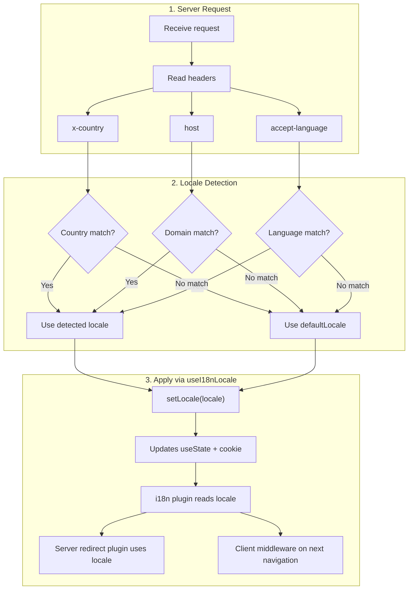

# 🔧 Mukautettu kielen tunnistus Nuxt I18n Microssa

## 📖 Yleiskatsaus

Nuxt I18n Micro v3 tarjoaa keskitetyn koostetoiminnon — `useI18nLocale()` — kaikkeen kielenhallintaan. Tämä korvaa v2:n manuaaliset `useState`/`useCookie`-mallit. Käyttämällä `useI18nLocale().setLocale()`-metodia palvelinpluginissa voit toteuttaa minkä tahansa mukautetun tunnistuslogiikan säilyttäen samalla täyden yhteensopivuuden moduulin uudelleenohjaus- ja evästejärjestelmien kanssa.

## 🏗️ Arkkitehtuuri

```mermaid
flowchart TB
    subgraph Plugins["Plugin Execution Order"]
        A["Your plugin<br/>order: -10"] -->|setLocale()| B["01.plugin.ts<br/>order: -5"]
        B --> C["06.redirect.ts server<br/>order: 10"]
    end

    subgraph Client["Client SPA Navigation"]
        D["i18n-redirect.global.ts<br/>route middleware"]
    end

    subgraph State["Locale State"]
        E["useState('i18n-locale')"]
        F["localeCookie"]
    end

    A -->|"setLocale() updates both"| E
    A -->|"setLocale() updates both"| F
    B -->|reads| E
    C -->|reads| E
    C -->|reads| F
    D -->|reads target route +| E
```

**Ydinperiaate**: Kutsu metodia `useI18nLocale().setLocale()` palvelinpluginissa arvolla `order: -10`. Tämä päivittää sekä `useState('i18n-locale')`-arvon että kieli-evästeen atomisesti, jolloin i18n-plugin (`order: -5`) ja palvelimen redirect-plugin (`order: 10`) näkevät oikean kielen ensimmäisellä SSR-pyynnöllä. Asiakaspuolen automaattiset uudelleenohjaukset suoritetaan globaalissa reittimiddlewaressa myöhempien navigointien yhteydessä.

## 🛠️ Sisäänrakennetun automaattisen tunnistuksen poistaminen käytöstä

Jos haluat täyden hallinnan kielen tunnistuksesta, poista sisäänrakennettu mekanismi käytöstä:

```ts
export default defineNuxtConfig({
  i18n: {
    autoDetectLanguage: false,
  },
})
```

## ✨ Esimerkki: Palvelinpuolen tunnistus `useI18nLocale`-metodilla

Tämä on **suositeltu lähestymistapa** kaikille strategioille.

### Vaihe 1: Määritä `nuxt.config.ts`

```ts
export default defineNuxtConfig({
  modules: ['nuxt-i18n-micro'],
  i18n: {
    strategy: 'no_prefix', // Works with ANY strategy
    defaultLocale: 'en',
    localeCookie: 'user-locale',
    autoDetectLanguage: false,
    locales: [
      { code: 'en', iso: 'en-US' },
      { code: 'de', iso: 'de-DE' },
      { code: 'ja', iso: 'ja-JP' },
    ],
  },
})
```

### Vaihe 2: Luo `plugins/i18n-loader.server.ts`

```ts
import { defineNuxtPlugin, useRequestHeaders } from '#imports'

export default defineNuxtPlugin({
  name: 'i18n-custom-loader',
  enforce: 'pre',
  order: -10, // Execute BEFORE the i18n plugin (which has order -5)

  setup() {
    const { setLocale } = useI18nLocale()
    const headers = useRequestHeaders(['host', 'x-country', 'accept-language'])
    let detectedLocale = 'en'

    // --- YOUR DETECTION LOGIC ---

    // Example 1: By domain
    const host = headers['host']
    if (host?.includes('example.de')) {
      detectedLocale = 'de'
    }
    // Example 2: By custom header
    else if (headers['x-country'] === 'JP') {
      detectedLocale = 'ja'
    }
    // Example 3: By Accept-Language header
    else if (headers['accept-language']?.includes('de')) {
      detectedLocale = 'de'
    }

    // --- APPLY THE LOCALE ---
    setLocale(detectedLocale)
  },
})
```

### Miten se toimii



1. **Plugin suoritetaan ensin** (`order: -10`) — tunnistaa kielen otsakkeista, domainista tai muista lähteistä
2. **`setLocale()` päivittää molemmat** `useState('i18n-locale')`-arvon ja evästeen — takaa välittömän näkyvyyden kaikille myöhemmille plugineille
3. **i18n-plugin** (`order: -5`) lukee kielen ja lataa oikeat käännökset
4. **Palvelimen redirect-plugin** (`order: 10`) käyttää kieltä uudelleenohjauspäätöksiin SSR:ssä
5. **Asiakkaan reittimiddleware** (`i18n-redirect`) soveltaa uudelleenohjauksia SPA-navigoinnissa, kun URL:n kieli ei vastaa mieltymystä

## 🌐 Strategiakohtainen käyttäytyminen

`useI18nLocale().setLocale()` toimii **kaikilla strategioilla**. Uudelleenohjauskäyttäytyminen riippuu strategiasta:

<Tip>
| Strategia | `setLocale('de')`-vaikutus |
|----------|---------------------------|
| `no_prefix` | Renderöi saksaksi, ei URL-muutosta |
| `prefix` | 302 → `/de/` (palvelinpuolen uudelleenohjaus) |
| `prefix_except_default` | 302 → `/de/` jos `de` ≠ oletus; ei uudelleenohjausta jos `de` = oletus |
| `prefix_and_default` | Ei uudelleenohjausta (sekä `/` että `/de/` valideja) |
</Tip>

**Tärkeitä huomioita:**

- Evästepohjainen kielen tunnistus on oletuksena pois käytöstä (`localeCookie: null`)
- Aseta `localeCookie: 'user-locale'` ottaaksesi evästeen säilyvyyden käyttöön
- Jos eväste-/tilaarvo ei ole `locales`-listalla, palautetaan `defaultLocale`

## 🏢 Edistynyt: Domain-pohjainen tunnistus

Monidomain-asetuksissa, joissa jokainen domain tarjoilee eri kieltä:

```ts
import { defineNuxtPlugin, useRequestHeaders } from '#imports'

export default defineNuxtPlugin({
  name: 'i18n-domain-loader',
  enforce: 'pre',
  order: -10,

  setup() {
    const { setLocale } = useI18nLocale()
    const headers = useRequestHeaders(['host'])
    const host = headers['host'] || ''

    let detectedLocale = 'en'

    if (host.endsWith('.de') || host.includes('german.')) {
      detectedLocale = 'de'
    } else if (host.endsWith('.fr') || host.includes('french.')) {
      detectedLocale = 'fr'
    } else if (host.endsWith('.jp') || host.includes('japanese.')) {
      detectedLocale = 'ja'
    }

    setLocale(detectedLocale)
  },
})
```

## 🔄 Edistynyt: Käyttäjän mieltymysten kunnioittaminen

Jos käyttäjät voivat vaihtaa kielen manuaalisesti, kunnioita heidän valintaansa automaattisen tunnistuksen sijaan:

```ts
import { defineNuxtPlugin, useRequestHeaders } from '#imports'

export default defineNuxtPlugin({
  name: 'i18n-smart-loader',
  enforce: 'pre',
  order: -10,

  setup() {
    const { getLocale, setLocale } = useI18nLocale()

    // If user already has a preference (from cookie), respect it
    if (getLocale()) {
      return
    }

    // Otherwise, detect locale from headers
    const headers = useRequestHeaders(['accept-language'])
    let detectedLocale = 'en'

    const acceptLanguage = headers['accept-language'] || ''
    if (acceptLanguage.includes('de')) {
      detectedLocale = 'de'
    } else if (acceptLanguage.includes('ja')) {
      detectedLocale = 'ja'
    }

    setLocale(detectedLocale)
  },
})
```

## ⚙️ Vain palvelinpuolen tai vain asiakaspuolen pluginit

Käytä [Nuxtin tiedostonimikäytäntöjä](https://nuxt.com/docs/getting-started/directory-structure#plugins) hallitaksesi missä pluginisi ajetaan:

- **Vain palvelin**: `i18n-loader.server.ts` — ajetaan vain SSR:n aikana (suositeltu otsakepohjaiseen tunnistukseen)
- **Vain asiakas**: `i18n-loader.client.ts` — ajetaan vain selaimessa (`localStorage`- tai DOM-pohjaiseen tunnistukseen)

<Tip>

</Tip>

## ✅ Yhteenveto

| Ominaisuus                             | Kuvaus                                                            |
| -------------------------------------- | ----------------------------------------------------------------- |
| `useI18nLocale().setLocale()`          | Päivittää `useState` + evästeen atomisesti; toimii kaikilla strategioilla |
| `useI18nLocale().getLocale()`          | Palauttaa nykyisen kielen tilasta tai evästeestä                 |
| `useI18nLocale().getPreferredLocale()` | Palauttaa suosikkikielen (validoitu `locales`-listaa vasten)     |
| Plugin `order: -10`                    | Varmistaa, että pluginisi ajetaan ennen i18n:n alustusta         |
| `enforce: 'pre'`                       | Ajetaan "pre"-plugin-ryhmässä                                     |

**ÄLÄ:**

- Käytä `useCookie('user-locale')`-metodia suoraan — `useI18nLocale()` hallinnoi evästeitä sisäisesti
- Käytä `useState('i18n-locale')`-metodia suoraan — käytä sen sijaan `useI18nLocale().setLocale()`
- Aseta `order` >= -5 — pluginisi täytyy ajaa ennen i18n-pluginia
