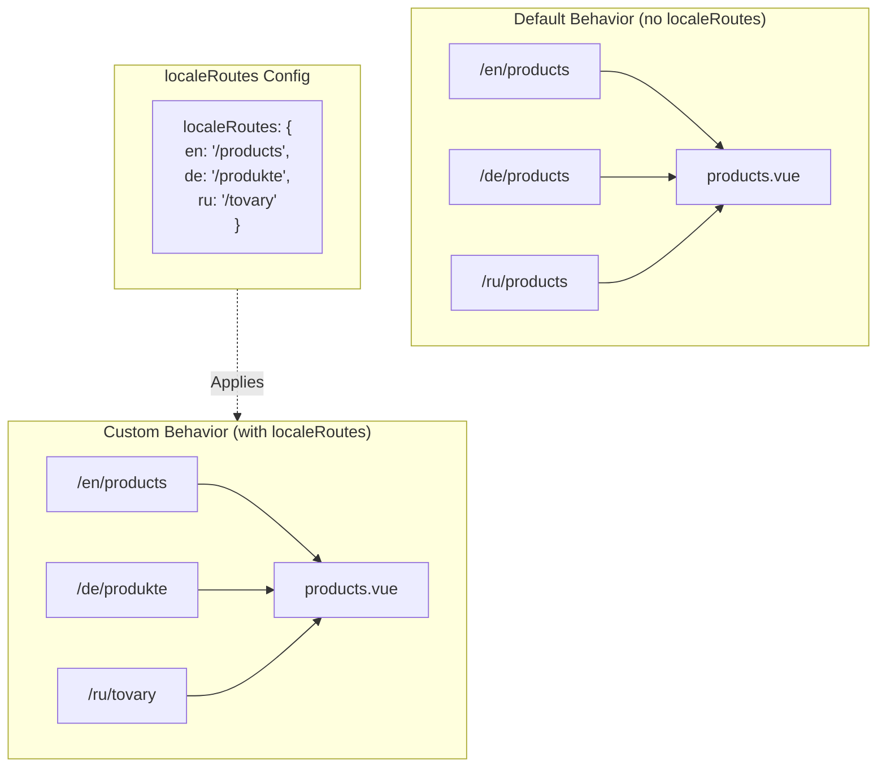

# 🔗 Mukautetut paikallistetut reitit `localeRoutes`-asetuksella moduulissa `Nuxt I18n Micro`

## 📖 Johdanto `localeRoutes`-asetukseen

`localeRoutes`-ominaisuus moduulissa `Nuxt I18n Micro` mahdollistaa mukautettujen reittien määrittämisen tiettyjä kieliä varten, tarjoten joustavuutta ja hallintaa sovelluksesi reititysrakenteeseen. Tämä ominaisuus on erityisen hyödyllinen, kun tietyt kielet vaativat erilaisia URL-rakenteita, räätälöityjä polkuja tai niiden on noudatettava tiettyjä alueellisia tai kielellisiä käytäntöjä.

## 🚀 `localeRoutes`-asetuksen ensisijainen käyttötapaus

`localeRoutes`-asetuksen ensisijainen käyttötapaus on tarjota erillisiä reittejä eri kielille, mikä parantaa käyttökokemusta varmistamalla, että URL-osoitteet ovat intuitiivisia ja kohdeyleisölle relevantteja. Sinulla voi esimerkiksi olla eri polut sivun englannin- ja venäjänkielisille versioille, joissa venäjän kieli noudattaa paikallista URL-muotoa.

### 📄 Esimerkki: `localeRoutes`-asetuksen määrittäminen metodissa `$defineI18nRoute`

Tässä esimerkki siitä, miten voit määrittää mukautettuja reittejä tiettyjä kieliä varten käyttämällä `localeRoutes`-asetusta `$defineI18nRoute`-funktiossa:

```typescript
import { useNuxtApp } from '#imports'

const { $defineI18nRoute } = useNuxtApp()

$defineI18nRoute({
  localeRoutes: {
    ru: '/localesubpage', // Custom route path for the Russian locale
    de: '/lokaleseite', // Custom route path for the German locale
  },
})
```

> [!IMPORTANT]
> `$defineI18nRoute` ei ole globaali funktio. `script setup`-lohkossa hae se ensin metodilla `useNuxtApp()`, ja kutsu sitä sitten.

### 🔄 Miten `localeRoutes` toimii



- **Oletuskäyttäytyminen**: Ilman `localeRoutes`-asetusta kaikki kielet käyttävät ensisijaisen polun määrittämää yhteistä reittirakennetta.
- **Mukautettu käyttäytyminen**: `localeRoutes`-asetuksen kanssa tietyillä kielillä voi olla omat reittinsä, jotka ohittavat oletuspolun konfiguraatiossa määritetyillä kielikohtaisilla reiteillä.

## 🌱 `localeRoutes`-käyttötapaukset

### 📄 Esimerkki: `localeRoutes`-asetuksen käyttö sivulla

Tässä yksinkertainen Vue-komponentti, joka näyttää `$defineI18nRoute`-metodin käytön yhdessä `localeRoutes`-asetuksen kanssa:

```vue
<template>
  <div>
    <!-- Display greeting message based on the current locale -->
    <p>{{ $t('greeting') }}</p>

    <!-- Navigation links -->
    <div>
      <NuxtLink :to="$localeRoute({ name: 'index' })"> Go to Index </NuxtLink>
      |
      <NuxtLink :to="$localeRoute({ name: 'about' })"> Go to About Page </NuxtLink>
    </div>
  </div>
</template>

<script setup>
import { useNuxtApp } from '#imports'

const { $getLocale, $switchLocale, $getLocales, $localeRoute, $t, $defineI18nRoute } = useNuxtApp()

// Define translations and custom routes for specific locales
$defineI18nRoute({
  localeRoutes: {
    ru: '/localesubpage', // Custom route path for Russian locale
  },
})
</script>
```

### 🛠️ `localeRoutes`-asetuksen käyttö eri konteksteissa

- **Aloitussivut**: Käytä mukautettuja reittejä aloitussivujen URL-osoitteiden paikallistamiseen varmistaaksesi, että ne noudattavat markkinointikampanjoita.
- **Dokumentaatiosivustot**: Tarjoa erilliset reitit jokaiselle kielelle vastaamaan paremmin paikallistetun sisällön rakennetta.
- **Verkkokauppasivustot**: Räätälöi tuotteen tai kategorian URL-osoitteet kielittäin parantaaksesi SEO:ta ja käyttökokemusta.

## Navigointi `localeRoutes`-asetuksen kanssa

Koska paikallistetut reitit eivät suoraan vastaa tiedostonimiä sivujen hakemistossa, sinun täytyy viitata navigointiin objektin eikä nimen mukaan.

```vue
<template>
  /**
   * Exemple page: /pages/about-us.vue
   * EN /about-us
   * ES /sobre-nosotros
   * FR /a-propos
   */

  // Using NuxtLink
  <NuxtLink :to="$localeRoute({ name: 'about-us' })">
    Go to About Page
  </NuxtLink>

  // Using I18nLink
  <I18nLink :to="{ name: 'about-us' }">
    Go to About Page
  </NuxtLink>

  // The string literal navigation wouldn't work for any locale but english
  <I18nLink to="/about-us">
    Go to About Page
  </NuxtLink>
</template>
```

### Sisäkkäisten sivujen nimeäminen

Oletusarvoisesti sivusi nimetään niiden tiedoston ja polun nimen perusteella. Näin se toimii:

- Tiedostoon `/pages/about-us.vue` pääsee käsiksi kutsulla `$localeRoute(\{ name: 'about-us' \})`
- Tiedostoon `/pages/about-us/physical-stores.vue` pääsee käsiksi kutsulla `$localeRoute(\{ name: 'about-us-physical-stores' \})`

Ohittaaksesi tämän käyttäytymisen, nimeä sivu eksplisiittisesti metodilla `definePageMeta`.

```vue
// /pages/about-us/physical-stores.vue
<script setup>
definePageMeta({
  name: 'our-stores'
})
```

Tähän sivuun voidaan nyt viitata joko `$localeRoute`-metodilla tai `I18nLink`-komponentilla sen nimellä `:to='\{ name: "our-stores" \}'`.

## 🎯 Dynaamiset reitit slugeilla ja `$setI18nRouteParams`-metodilla

Kun työskentelet dynaamisten reittien kanssa, jotka sisältävät slugeja tai parametreja, voit käyttää `localeRoutes`-asetusta dynaamisten segmenttien kanssa sekä `$setI18nRouteParams`-metodia tarjotaksesi kielikohtaisia slugeja jokaiselle kielelle.

### Dynaamiset reittiparametrit `localeRoutes`-asetuksessa

Voit määrittää dynaamisia reittejä käyttämällä Nuxtin reittiparametrisyntaksia (`[...slug]` catch-all-reiteille, `[param]` yksittäisille parametreille tai `:param()` nimetyille parametreille):

```vue
<script setup lang="ts">
import { useNuxtApp, useRoute, useFetch, createError } from '#imports'

const { $defineI18nRoute, $setI18nRouteParams } = useNuxtApp()

// Define custom routes with dynamic segments
$defineI18nRoute({
  localeRoutes: {
    en: '/our-products/[...slug]',
    es: '/nuestros-productos/[...slug]',
  },
})
</script>
```

### Kielikohtaisten reittiparametrien asettaminen

Funktio `$setI18nRouteParams` mahdollistaa erilaisten parametriarvojen (kuten slugien) asettamisen jokaiselle kielelle. Tämä on erityisen hyödyllistä, kun sisällölläsi on kielikohtaisia URL-osoitteita.

**Tärkeää**: `$setI18nRouteParams` tulee kutsua sen jälkeen, kun on haettu data, joka sisältää kielikohtaisia slugeja, tyypillisesti metodin `useFetch` tai `useAsyncData` sisällä.

```vue
<script setup lang="ts">
import { useNuxtApp, useRoute, useFetch, createError } from '#imports'

interface Product {
  title: string
  price: string
  urlEn: string // English slug
  urlEs: string // Spanish slug
}

const { $defineI18nRoute, $setI18nRouteParams } = useNuxtApp()

const route = useRoute()
const slug = Array.isArray(route.params.slug) ? route.params.slug[0] : route.params.slug

// Fetch product data that includes locale-specific slugs
const { data: product, error } = await useFetch<Product>(`/api/product/${slug}`)
if (error.value)
  throw createError({
    statusCode: error.value?.statusCode,
    statusMessage: error.value?.statusMessage,
    fatal: true,
  })

// Define custom routes with dynamic segments
$defineI18nRoute({
  localeRoutes: {
    en: '/our-products/[...slug]',
    es: '/nuestros-productos/[...slug]',
  },
})

// Set different slugs for different locales
if (product.value) {
  $setI18nRouteParams({
    en: { slug: product.value.urlEn },
    es: { slug: product.value.urlEs },
  })
}
</script>
```

### Täydellinen esimerkki: Tuotesivut kielikohtaisilla slugeilla

Tässä täydellinen esimerkki, joka näyttää `localeRoutes`- ja `$setI18nRouteParams`-asetusten käytön yhdessä tuotteen yksityiskohtasivulla:

```vue
<template>
  <div v-if="product">
    <h1>{{ product.title }}</h1>
    <p>{{ $t('price') }}: {{ product.price }}</p>
    <div class="locale-switcher">
      <a :href="$switchLocalePath('en')">English</a>
      <a :href="$switchLocalePath('es')">Español</a>
    </div>
  </div>
</template>

<script setup lang="ts">
import { useNuxtApp, useRoute, useFetch, createError } from '#imports'

interface Product {
  title: string
  price: string
  urlEn: string
  urlEs: string
}

const { $t, $defineI18nRoute, $setI18nRouteParams, $switchLocalePath } = useNuxtApp()

// Set page name for easier navigation
definePageMeta({ name: 'product-slug' })

const route = useRoute()
const slug = Array.isArray(route.params.slug) ? route.params.slug[0] : route.params.slug

// Fetch product data
const { data: product, error } = await useFetch<Product>(`/api/product/${slug}`)
if (error.value)
  throw createError({
    statusCode: error.value?.statusCode,
    statusMessage: error.value?.statusMessage,
    fatal: true,
  })

// Define locale-specific routes with dynamic segments
$defineI18nRoute({
  localeRoutes: {
    en: '/our-products/[...slug]',
    es: '/nuestros-productos/[...slug]',
  },
})

// Set locale-specific slugs so $switchLocalePath works correctly
if (product.value) {
  $setI18nRouteParams({
    en: { slug: product.value.urlEn },
    es: { slug: product.value.urlEs },
  })
}
</script>
```

### Esimerkki: Tuotelistaussivu

Kun linkität dynaamisiin reitteihin listasivulta, käytä reitin nimeä parametrien kanssa:

```vue
<template>
  <div>
    <h1>{{ $t('title') }}</h1>
    <ul>
      <li v-for="product in products?.[$getLocale()] || []" :key="product.id">
        <I18nLink :to="{ name: 'product-slug', params: { slug: product.url } }"> {{ product.title }} – {{ product.price }} </I18nLink>
      </li>
    </ul>
  </div>
</template>

<script setup lang="ts">
import { useNuxtApp, useFetch, createError } from '#imports'

interface Product {
  id: string
  title: string
  price: string
  url: string
}

type ProductsByLocale = Record<string, Product[]>

const { $t, $defineI18nRoute, $getLocale } = useNuxtApp()

const { data: products, error } = await useFetch<ProductsByLocale>('/api/product')
if (error.value)
  throw createError({
    statusCode: error.value?.statusCode,
    statusMessage: error.value?.statusMessage,
    fatal: true,
  })

$defineI18nRoute({
  locales: {
    en: {
      title: 'Our Product Range',
      description: 'Discover our collection of high-quality products.',
    },
    es: {
      title: 'Nuestra Gama de Productos',
      description: 'Descubra nuestra colección de productos de alta calidad.',
    },
  },
  localeRoutes: {
    en: '/our-products',
    es: '/nuestros-productos',
  },
})
</script>
```

### Miten se toimii

1. **Reitin määrittely**: `localeRoutes` määrittää kielikohtaisen peruspolun rakenteen, mukaan lukien dynaamiset segmentit kuten `[...slug]` tai `[id]`.

2. **Parametrien asetus**: `$setI18nRouteParams` asettaa parametrien todelliset arvot kullekin kielelle. Kun käyttäjä vaihtaa kieltä metodilla `$switchLocalePath`, moduuli käyttää näitä parametreja rakentaakseen oikean URL-osoitteen.

3. **Parametrien muoto**: Parametriobjektin tulee vastata rakennetta:

   ```typescript
   {
     [localeCode]: {
       [paramName]: paramValue
     }
   }
   ```

4. **Navigointi**: Käytä `I18nLink`-komponenttia tai `$localeRoute`-metodia reitin nimen ja parametrien kanssa siirtyäksesi dynaamisten reittien paikallistettujen versioiden välillä.

### Tärkeitä huomioita

- **Ajoitus**: `$setI18nRouteParams` tulee kutsua sen jälkeen, kun on haettu data, joka sisältää kielikohtaisia slugeja, tyypillisesti metodin `useFetch` tai `useAsyncData` sisällä.

- **Parametrien nimet**: Parametrien nimien metodissa `$setI18nRouteParams` täytyy vastata reittiparametrien nimiä (esim. `slug` parametrille `[...slug]` tai `id` parametrille `[id]`).

- **Reittien nimet**: Kun käytät `definePageMeta(\{ name: 'route-name' \})`-määrittelyä, käytä tätä nimeä, kun linkität reittiin `I18nLink`-komponentilla tai `$localeRoute`-metodilla.

- **Catch-all-reitit**: Catch-all-reiteille (`[...slug]`) slug-parametrin tulee olla taulukko tai merkkijono, joka muunnetaan taulukoksi.

## 🧩 Ohjelmalliset reitit (`pages:extend`) — #244

`pages:extend`-hookissa luoduilla reiteillä ei ole paikkaa `defineI18nRoute()`-kutsulle, ja useat reitit jakavat usein yhden wrapper-SFC:n. Tiedostoavaimeen perustuva skannaus tiivistää ne sitten yhdeksi merkinnäksi.

**Älä** laita paikallistettuja polkuja arvoon `route.meta` (ne toimitettaisiin asiakkaan reittitaulukossa). Pidä yksi rekisteri ja projisoi se kahdesti:

1. arvoon `pages:extend` (luo Nuxt-reitit)
2. arvoon `i18n.globalLocaleRoutes`, jossa avaimena on reitin **nimi** (ei tiedostopolku)

Käytä `splitLocaleRoutes`-funktiota paketista `@i18n-micro/utils/split-locale-routes`:

```typescript
import { splitLocaleRoutes } from '@i18n-micro/utils/split-locale-routes'

const dynamic = splitLocaleRoutes([
  {
    name: 'products_tag',
    path: '/products/:tag',
    file: '~/pages/_dynamic.vue',
    paths: { fr: '/produits/:tag', de: '/produkte/:tag' },
  },
  {
    name: 'products_category',
    path: '/products/category/:category',
    file: '~/pages/_dynamic.vue',
    paths: { fr: '/produits/categorie/:category' },
  },
  // Disable localization for a programmatic route:
  // { name: 'internal', path: '/internal', file: '~/pages/_dynamic.vue', paths: false },
])

export default defineNuxtConfig({
  hooks: {
    'pages:extend'(pages) {
      pages.push(...dynamic.pages)
    },
  },
  i18n: {
    globalLocaleRoutes: dynamic.globalLocaleRoutes,
  },
})
```

Molemmat puolikkaat pysyvät synkronoituina; jaetut wrapperit eivät enää ylikirjoita toisiaan. `globalLocaleRoutes` yksin ei riitä — se vain mukauttaa reittien polkuja, jotka ovat jo olemassa Nuxtin sivutaulukossa.

## 📝 Parhaat käytännöt `localeRoutes`-asetuksen käyttöön

- **🚀 Käytä relevantteihin kieliin**: Käytä `localeRoutes`-asetusta ensisijaisesti siellä, missä URL-rakenne vaikuttaa merkittävästi käyttökokemukseen tai SEO:hon. Vältä ylikäyttöä pieniin eroihin.
- **🔧 Säilytä johdonmukaisuus**: Pidä johdonmukainen reitityskuvio kielten välillä, ellei ole vahvaa syytä poiketa. Tämä lähestymistapa auttaa säilyttämään selkeyden ja vähentää monimutkaisuutta.
- **📚 Dokumentoi mukautetut reitit**: Dokumentoi selkeästi kaikki `localeRoutes`-asetuksella määrittämäsi mukautetut reitit, erityisesti modulaarisissa sovelluksissa, jotta tiimin jäsenet ymmärtävät reitityslogiikan.
