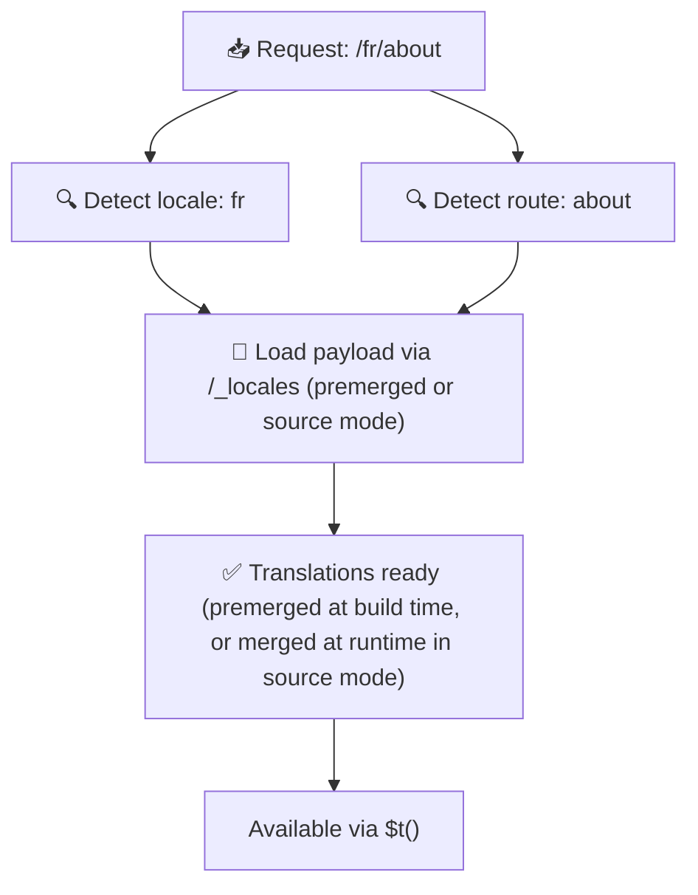

# 📂 Kansiorakenneopas

## 📖 Johdanto

Käännöstiedostojen tehokas järjestäminen on olennaista skaalautuvan ja tehokkaan kansainvälistysjärjestelmän (i18n) ylläpitämiseksi. `Nuxt I18n Micro` yksinkertaistaa tätä prosessia tarjoamalla selkeän lähestymistavan juuritason ja sivukohtaisten käännösten hallintaan. Tämä opas käy läpi suositellun kansiorakenteen ja selittää, kuinka `Nuxt I18n Micro` käsittelee näitä käännöksiä.

## 🗂️ Suositeltu kansiorakenne

`Nuxt I18n Micro` järjestää käännökset juuritason tiedostoihin ja sivukohtaisiin tiedostoihin `pages`-hakemiston sisällä. Asetuksella `translationPayloads.mode: 'premerged'` (oletus) juuritason käännökset yhdistetään automaattisesti jokaiseen sivutiedostoon käännösaikana, joten jokaisella sivulla on täydellinen käännösten joukko ilman ajonaikaista yhdistämisen lisäkuormaa.

Asetuksella `mode: 'source'` lähdetiedostot pysyvät erillisinä Nitro-resursseissa ja ne yhdistetään ajonaikaisesti `/_locales`-reitin kautta. Katso [Serverless-payloadin tuotos](/guides/performance#serverless-payload-output).

### 🔧 Perusrakenne

Tässä on peruskansiorakenne, jota kannattaa noudattaa:

```text
locales/
├── pages/
│   ├── index/
│   │   ├── en.json
│   │   ├── fr.json
│   │   └── ar.json
│   ├── about/
│   │   ├── en.json
│   │   ├── fr.json
│   │   └── ar.json
├── en.json
├── fr.json
└── ar.json

```

### 📄 Rakenteen selitys

#### 1. 🌍 Juuritason käännöstiedostot

- **Polku:** `/locales/\{locale\}.json` (esim. `/locales/en.json`)
- **Tarkoitus:** Nämä tiedostot sisältävät käännökset, jotka jaetaan koko sovelluksen kesken (navigointivalikot, ylätunnisteet, alatunnisteet jne.). Asetuksella `mode: 'premerged'` (oletus) ne yhdistetään automaattisesti jokaiseen sivukohtaiseen tiedostoon käännösaikana, joten palvelin palauttaa yhden esikäännetyn tiedoston sivua kohti.

  **Esimerkkisisältö (`/locales/en.json`):**

  ```json
  {
    "menu": {
      "home": "Home",
      "about": "About Us",
      "contact": "Contact"
    },
    "footer": {
      "copyright": "© 2024 Your Company"
    }
  }
  ```

#### 2. 📄 Sivukohtaiset käännöstiedostot

- **Polku:** `/locales/pages/\{routeName\}/\{locale\}.json` (esim. `/locales/pages/index/en.json`)
- **Tarkoitus:** Nämä tiedostot sisältävät yksittäisiin sivuihin kuuluvia käännöksiä. Asetuksella `mode: 'premerged'` (oletus) juuritason käännökset yhdistetään mukaan perustaksi käännösaikana, joten jokainen sivutiedosto muuttuu itsenäiseksi.

  **Esimerkkisisältö (`/locales/pages/index/en.json`):**

  ```json
  {
    "title": "Welcome to Our Website",
    "description": "We offer a wide range of products and services to meet your needs."
  }
  ```

  **Esimerkkisisältö (`/locales/pages/about/en.json`):**

  ```json
  {
    "title": "About Us",
    "description": "Learn more about our mission, vision, and values."
  }
  ```

### 📂 Dynaamisten reittien ja sisäkkäisten polkujen käsittely

`Nuxt I18n Micro` muuntaa automaattisesti dynaamiset segmentit ja sisäkkäiset polut reiteissä litteäksi kansiorakenteeksi tietyn uudelleennimeämiskäytännön avulla. Tämä varmistaa, että kaikki käännökset tallennetaan johdonmukaisella ja helposti saavutettavalla tavalla.

#### Dynaamisten reittien käännöskansiorakenne

Käsiteltäessä dynaamisia reittejä, kuten `/products/[id]`, moduuli muuntaa dynaamisen segmentin `[id]` staattiseen muotoon tiedostorakenteessa.

**Esimerkki dynaamisten reittien kansiorakenteesta:**

Reitille, kuten `/products/[id]`, käännöstiedostot tallennetaan kansioon nimeltä `products-id`:

```text
locales/pages/
├── products-id/
│   ├── en.json
│   ├── fr.json
│   └── ar.json

```

**Esimerkki sisäkkäisten dynaamisten reittien kansiorakenteesta:**

Sisäkkäiselle reitille, kuten `/products/key/[id]`, käännöstiedostot tallennetaan kansioon nimeltä `products-key-id`:

```text
locales/pages/
├── products-key-id/
│   ├── en.json
│   ├── fr.json
│   └── ar.json

```

**Esimerkki monitasoisten sisäkkäisten reittien kansiorakenteesta:**

Monimutkaisemmalle sisäkkäiselle reitille, kuten `/products/category/[id]/details`, käännöstiedostot tallennetaan kansioon nimeltä `products-category-id-details`:

```text
locales/pages/
├── products-category-id-details/
│   ├── en.json
│   ├── fr.json
│   └── ar.json

```

### 🛠 Hakemistorakenteen mukauttaminen

Jos haluat säilyttää käännökset eri hakemistossa, `Nuxt I18n Micro` mahdollistaa käännöstiedostojen tallennushakemiston mukauttamisen. Voit määrittää tämän `nuxt.config.ts`-tiedostossasi.

**Esimerkki: Käännöshakemiston mukauttaminen**

```typescript
export default defineNuxtConfig({
  i18n: {
    translationDir: 'i18n', // Custom directory path
  },
})
```

Tämä ohjeistaa `Nuxt I18n Micron` etsimään käännöstiedostoja `/i18n`-hakemistosta oletusarvoisen `/locales`-hakemiston sijaan.

## ⚙️ Miten käännöksiä ladataan

### 🌍 Dynaamiset kielireitit

`Nuxt I18n Micro` käyttää dynaamisia kielireittejä käännösten tehokkaaseen lataamiseen. Kun käyttäjä vierailee sivulla, moduuli määrittää sopivan kielen ja lataa vastaavat käännöstiedostot nykyisen reitin ja kielen perusteella.



Esimerkiksi:

- Osoitteessa `/en/index` vieraileminen lataa käännökset tiedostosta `/locales/pages/index/en.json`.
- Osoitteessa `/fr/about` vieraileminen lataa käännökset tiedostosta `/locales/pages/about/fr.json`.

Tämä menetelmä varmistaa, että vain tarvittavat käännökset ladataan, mikä optimoi sekä palvelinkuorman että asiakaspuolen suorituskyvyn.

### 💾 Välimuistitus ja esirenderöinti

Suorituskyvyn edelleen parantamiseksi `Nuxt I18n Micro` tukee käännöstiedostojen välimuistitusta ja esirenderöintiä:

- **Välimuistitus**: Kun käännöstiedosto on ladattu, se välimuistitetaan myöhempiä pyyntöjä varten, mikä vähentää tarvetta hakea samaa dataa toistuvasti.
- **Esirenderöinti**: Buildin aikana voit esirenderöidä käännöstiedostot kaikille määritetyille kielille ja reiteille, jolloin ne voidaan tarjoilla suoraan palvelimelta ilman ajonaikaisia viiveitä.

## 📝 Parhaat käytännöt

### 📂 Käytä sivukohtaisia tiedostoja järkevästi

Hyödynnä sivukohtaisia tiedostoja pitääksesi käännökset järjestyksessä. Tämä pitää kunkin sivun käännökset kevyinä ja nopeasti ladattavina, mikä on erityisen tärkeää monimutkaista tai suurta sisältöä sisältäville sivuille.

### 🔑 Pidä käännösavaimet yhdenmukaisina

Käytä yhdenmukaisia nimeämiskäytäntöjä käännösavaimillesi tiedostojen välillä. Tämä auttaa säilyttämään selkeyden ja estää ongelmat käännösten hallinnassa, erityisesti sovelluksen kasvaessa.

### 🗂️ Järjestä käännökset asiayhteyden mukaan

Ryhmittele toisiinsa liittyvät käännökset yhteen tiedostoissasi. Ryhmittele esimerkiksi kaikki painikkeiden tekstit avaimen `buttons` alle ja kaikki lomakkeisiin liittyvät tekstit avaimen `forms` alle. Tämä parantaa luettavuutta ja tekee käännösten hallinnasta helpompaa eri kielten välillä.

### ⚠️ Sisäkkäisyyden syvyysraja (2 tasoa suositellaan)

Asiakaspuolen navigoinnin aikana `Nuxt I18n Micro` käyttää optimoitua 2-tasoista syvää yhdistämistä yhdistääkseen lähtevän ja tulevan sivun käännökset. Tämä varmistaa, että päällekkäiset sisäkkäiset avaimet (esim. molemmilla sivuilla on avaimet kohdassa `common.*`) säilyvät siirtymäanimaatioiden aikana.

**Tämä toimii oikein tavanomaisella `Section → Key → Value` -rakenteella (2 tasoa):**

```json
// Page A translations
{ "common": { "fromA": "Text A" } }

// Page B translations
{ "common": { "fromB": "Text B" } }

// During transition, both are available:
// { "common": { "fromA": "Text A", "fromB": "Text B" } }
```

**Jos kuitenkin käytät 3+ sisäkkäisyyden tasoa, syvemmät avaimet voivat ylikirjoittua siirtymien aikana:**

```json
// Page A translations
{ "auth": { "form": { "login": "Login" } } }

// Page B translations
{ "auth": { "form": { "register": "Register" } } }

// During transition: "login" key is lost
// { "auth": { "form": { "register": "Register" } } }
```

<Tip>

</Tip>

### 🧹 Siivoa käyttämättömät käännökset säännöllisesti

Ajan myötä sovelluksesi saattaa kertyä käyttämättömiä käännösavaimia, erityisesti jos ominaisuuksia poistetaan tai rakennetta muutetaan. Käy säännöllisesti läpi ja siivoa käännöstiedostosi pitääksesi ne kevyinä ja ylläpidettävinä.
