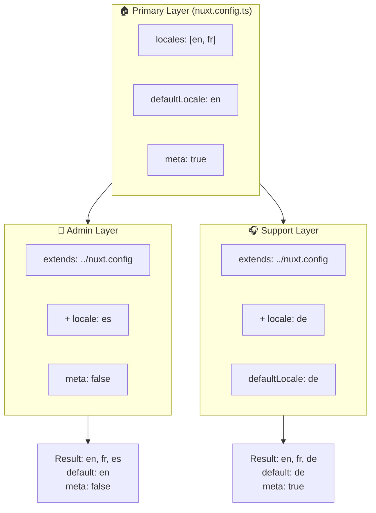

# 🗂️ Kerrokset moduulissa `Nuxt I18n Micro`

## 📖 Kerrosten esittely

Kerrokset moduulissa `Nuxt I18n Micro` mahdollistavat paikallistamisasetusten joustavan hallinnan ja mukauttamisen sovelluksesi eri osissa. Määrittelemällä eri kerroksia voit säätää konfiguraatiota erilaisia konteksteja varten, kuten ohittaa asetuksia tiettyjä sivustosi osia varten tai luoda uudelleenkäytettäviä peruskonfiguraatioita, joita muut sovelluksesi osat voivat laajentaa.

### Kerrosten periytymisen kulku



## 🛠️ Ensisijainen konfiguraatiokerros

**Ensisijainen konfiguraatiokerros** on paikka, jossa määrität koko sovelluksesi oletusarvoiset paikallistamisasetukset. Tämä kerros on olennainen, sillä se määrittää globaalin konfiguraation, mukaan lukien tuetut kielet, oletuskielen ja muut kriittiset i18n-asetukset.

### 📄 Esimerkki: Ensisijaisen konfiguraatiokerroksen määrittäminen

Tässä esimerkki, miten ensisijainen konfiguraatiokerros voidaan määrittää `nuxt.config.ts`-tiedostossa:

```typescript
export default defineNuxtConfig({
  i18n: {
    locales: [
      { code: 'en', iso: 'en-EN', dir: 'ltr' },
      { code: 'fr', iso: 'fr-FR', dir: 'ltr' },
      { code: 'ar', iso: 'ar-SA', dir: 'rtl' },
    ],
    defaultLocale: 'en', // The default locale for the entire app
    translationDir: 'locales', // Directory where translations are stored
    meta: true, // Automatically generate SEO-related meta tags like `alternate`
    autoDetectLanguage: true, // Automatically detect and use the user's preferred language
  },
})
```

## 🌱 Lapsikerrokset

Lapsikerroksia käytetään ensisijaisen konfiguraation laajentamiseen tai ohittamiseen sovelluksesi tiettyjä osia varten. Voit esimerkiksi haluta lisätä ylimääräisiä kieliä tai muuttaa oletuskieltä tiettyä sivustosi osaa varten. Lapsikerrokset ovat erityisen hyödyllisiä modulaarisissa sovelluksissa, joissa sovelluksen eri osilla voi olla erilaisia paikallistamisvaatimuksia.

### 📄 Esimerkki: Ensisijaisen kerroksen laajentaminen lapsikerroksessa

Oletetaan, että sivustollasi on osio, jonka on tuettava ylimääräisiä kieliä, tai haluat poistaa tietyn kielen käytöstä tietyssä kontekstissa. Näin voit tehdä sen laajentamalla ensisijaista konfiguraatiokerrosta:

```typescript
// basic/nuxt.config.ts (Primary Layer)
export default defineNuxtConfig({
  i18n: {
    locales: [
      { code: 'en', iso: 'en-EN', dir: 'ltr' },
      { code: 'fr', iso: 'fr-FR', dir: 'ltr' },
    ],
    defaultLocale: 'en',
    meta: true,
    translationDir: 'locales',
  },
})
```

```typescript
// extended/nuxt.config.ts (Child Layer)
export default defineNuxtConfig({
  extends: '../basic', // Inherit the base configuration from the 'basic' layer
  i18n: {
    locales: [
      { code: 'en', iso: 'en-EN', dir: 'ltr' }, // Inherited from the base layer
      { code: 'fr', iso: 'fr-FR', dir: 'ltr' }, // Inherited from the base layer
      { code: 'de', iso: 'de-DE', dir: 'ltr' }, // Added in the child layer
    ],
    defaultLocale: 'fr', // Override the default locale to French for this section
    autoDetectLanguage: false, // Disable automatic language detection in this section
  },
})
```

### 🌐 Kerrosten käyttö modulaarisessa sovelluksessa

Suuremmassa modulaarisessa Nuxt-sovelluksessa sinulla voi olla useita osioita, joista jokainen vaatii omat i18n-asetuksensa. Hyödyntämällä kerroksia voit ylläpitää siistin ja skaalautuvan konfiguraatiorakenteen.

### 📄 Esimerkki: Kerroksellinen konfiguraatio modulaarisessa sovelluksessa

Kuvittele, että sinulla on verkkokauppasivusto, jossa on erillisiä osioita, kuten päääverkkosivusto, hallintapaneeli ja asiakastukiportaali. Jokainen osio saattaa tarvita erilaisen joukon kieliä tai muita i18n-asetuksia.

#### **Ensisijainen kerros (globaali konfiguraatio):**

```typescript
// nuxt.config.ts
export default defineNuxtConfig({
  i18n: {
    locales: [
      { code: 'en', iso: 'en-EN', dir: 'ltr' },
      { code: 'fr', iso: 'fr-FR', dir: 'ltr' },
    ],
    defaultLocale: 'en',
    meta: true,
    translationDir: 'locales',
    autoDetectLanguage: true,
  },
})
```

#### **Lapsikerros hallintapaneelille:**

```typescript
// admin/nuxt.config.ts
export default defineNuxtConfig({
  extends: '../nuxt.config', // Inherit the global settings
  i18n: {
    locales: [
      { code: 'en', iso: 'en-EN', dir: 'ltr' }, // Inherited
      { code: 'fr', iso: 'fr-FR', dir: 'ltr' }, // Inherited
      { code: 'es', iso: 'es-ES', dir: 'ltr' }, // Specific to the admin panel
    ],
    defaultLocale: 'en',
    meta: false, // Disable automatic meta generation in the admin panel
  },
})
```

#### **Lapsikerros asiakastukiportaalille:**

```typescript
// support/nuxt.config.ts
export default defineNuxtConfig({
  extends: '../nuxt.config', // Inherit the global settings
  i18n: {
    locales: [
      { code: 'en', iso: 'en-EN', dir: 'ltr' }, // Inherited
      { code: 'fr', iso: 'fr-FR', dir: 'ltr' }, // Inherited
      { code: 'de', iso: 'de-DE', dir: 'ltr' }, // Specific to the support portal
    ],
    defaultLocale: 'de', // Default to German in the support portal
    autoDetectLanguage: false, // Disable automatic language detection
  },
})
```

Tässä modulaarisessa esimerkissä:

- Jokaisella osiolla (admin, support) on omat i18n-asetuksensa, mutta ne kaikki perivät peruskonfiguraation.
- Hallintapaneeli lisää espanjan (`es`) kieleksi ja poistaa metatagien automaattisen generoinnin käytöstä.
- Tukiportaali lisää saksan (`de`) kieleksi ja käyttää saksaa oletuksena käyttöliittymässä.

## 📝 Parhaat käytännöt kerrosten käyttöön

- **🔧 Pidä ensisijainen kerros yksinkertaisena:** Ensisijaisen kerroksen tulee sisältää yleisimmin käytetyt asetukset, jotka pätevät globaalisti koko sovelluksellesi. Pidä se suoraviivaisena varmistaaksesi yhdenmukaisuuden.
- **⚙️ Käytä lapsikerroksia tiettyihin mukautuksiin:** Ohita tai laajenna asetuksia lapsikerroksissa vain tarpeen vaatiessa. Tämä lähestymistapa välttää turhaa monimutkaisuutta konfiguraatiossasi.
- **📚 Dokumentoi kerroksesi:** Dokumentoi selkeästi kunkin kerroksen tarkoitus ja erityispiirteet projektissasi. Tämä auttaa säilyttämään selkeyden ja tekee muille (tai tulevalle sinulle) helpommaksi ymmärtää konfiguraatio.
