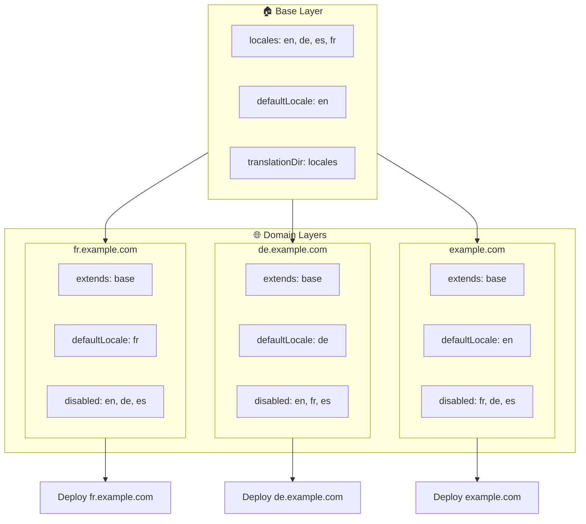

# 🌍 Moniverkkotunnuskielten asennus paketilla `Nuxt I18n Micro` tasoja käyttäen

## 📝 Johdanto

Käyttämällä tasoja (layers) paketissa `Nuxt I18n Micro` voit luoda joustavan ja ylläpidettävän moniverkkotunnuslokalisointiasennuksen. Tämä lähestymistapa yksinkertaistaa verkkotunnusten hallintaa poistamalla monimutkaisten toiminnallisuuksien tarpeen. Se mahdollistaa myös tehokkaan kuormituksen jakamisen ja pienentää projektin monimutkaisuutta. Ajamalla erillisiä projekteja eri kielille sovelluksesi voi skaalautua ja mukautua helposti muuttuviin kielivaatimuksiin useilla verkkotunnuksilla. Tämä tarjoaa vankan ja skaalautuvan ratkaisun globaaleille sovelluksille.

## 🎯 Tavoite

Luoda asennus, jossa eri verkkotunnukset tarjoavat tiettyjä kieliä mukauttamalla konfiguraatioita lapsitasoissa. Tämä menetelmä hyödyntää Nuxtin tasotusjärjestelmää. Voit ylläpitää perusmääritystä samalla, kun laajennat tai muokkaat sitä kullekin verkkotunnukselle.

### Moniverkkotunnusarkkitehtuuri



## 🛠 Vaiheet moniverkkotunnuskielten toteuttamiseen

### 1. **Luo perustaso**

Aloita luomalla perusmäärityksen taso, joka sisältää kaikki sovelluksesi yleiset kieliasetukset. Tämä konfiguraatio toimii perustana muille verkkotunnuskohtaisille konfiguraatioille.

#### **Perustason konfiguraatio**

Luo perusmääritystiedosto `base/nuxt.config.ts`:

```typescript
// base/nuxt.config.ts

export default defineNuxtConfig({
  i18n: {
    locales: [
      { code: 'en', iso: 'en-US', dir: 'ltr' },
      { code: 'de', iso: 'de-DE', dir: 'ltr' },
      { code: 'es', iso: 'es-ES', dir: 'ltr' },
    ],
    defaultLocale: 'en',
    translationDir: 'locales',
    meta: true,
    autoDetectLanguage: true,
  },
})
```

### 2. **Luo verkkotunnuskohtaiset lapsitasot**

Luo jokaiselle verkkotunnukselle lapsitaso, joka muokkaa perusmääritystä vastaamaan kyseisen verkkotunnuksen erityisvaatimuksia. Voit poistaa käytöstä kielet, joita ei tarvita tietylle verkkotunnukselle.

#### **Esimerkki: konfiguraatio ranskalaiselle verkkotunnukselle**

Luo lapsitason konfiguraatio ranskalaiselle verkkotunnukselle tiedostoon `fr/nuxt.config.ts`:

```typescript
// fr/nuxt.config.ts

export default defineNuxtConfig({
  extends: '../base', // Inherit from the base configuration

  i18n: {
    locales: [
      { code: 'en', iso: 'en-US', dir: 'ltr', disabled: true }, // Disable English
      { code: 'fr', iso: 'fr-FR', dir: 'ltr' }, // Add and enable the French locale
      { code: 'de', iso: 'de-DE', dir: 'ltr', disabled: true }, // Disable German
      { code: 'es', iso: 'es-ES', dir: 'ltr', disabled: true }, // Disable Spanish
    ],
    defaultLocale: 'fr', // Set French as the default locale
    autoDetectLanguage: false, // Disable automatic language detection
  },
})
```

#### **Esimerkki: konfiguraatio saksalaiselle verkkotunnukselle**

Luo vastaavasti lapsitason konfiguraatio saksalaiselle verkkotunnukselle tiedostoon `de/nuxt.config.ts`:

```typescript
// de/nuxt.config.ts

export default defineNuxtConfig({
  extends: '../base', // Inherit from the base configuration

  i18n: {
    locales: [
      { code: 'en', iso: 'en-US', dir: 'ltr', disabled: true }, // Disable English
      { code: 'fr', iso: 'fr-FR', dir: 'ltr', disabled: true }, // Disable French
      { code: 'de', iso: 'de-DE', dir: 'ltr' }, // Use the German locale
      { code: 'es', iso: 'es-ES', dir: 'ltr', disabled: true }, // Disable Spanish
    ],
    defaultLocale: 'de', // Set German as the default locale
    autoDetectLanguage: false, // Disable automatic language detection
  },
})
```

### 3. **Julkaise sovellus kullekin verkkotunnukselle**

Julkaise sovellus asianmukaisella konfiguraatiolla kullekin verkkotunnukselle. Esimerkiksi:

- Julkaise `fr`-tason konfiguraatio osoitteeseen `fr.example.com`.
- Julkaise `de`-tason konfiguraatio osoitteeseen `de.example.com`.

### 4. **Aseta useita projekteja eri kielille**

Jokaiselle kielelle ja verkkotunnukselle sinun on ajettava erillinen sovelluksen instanssi. Näin varmistat, että kukin verkkotunnus tarjoaa oikean kielikonfiguraation. Tämä optimoi kuormituksen jakautumisen ja yksinkertaistaa projektin rakennetta. Kullekin kielelle räätälöityjen useiden projektien ajaminen mahdollistaa selkeän erottelun konfiguraatioiden välillä ja vähentää kokonaisasennuksen monimutkaisuutta.

### 5. **Määritä reititys verkkotunnuksen mukaan**

Varmista, että reitityksesi on määritetty ohjaamaan käyttäjät oikeaan projektiin sen verkkotunnuksen perusteella, jota he käyttävät. Näin kukin verkkotunnus tarjoaa asianmukaisen kielen, parantaen käyttäjäkokemusta ja säilyttäen johdonmukaisuuden eri alueilla.

### 6. **Julkaise ja varmista**

Kun olet määrittänyt tasot ja julkaissut ne omille verkkotunnuksilleen, varmista, että kukin verkkotunnus tarjoaa oikean kielen. Testaa sovellus perusteellisesti vahvistaaksesi, että oikea kieli ladataan verkkotunnuksesta riippuen.

## 📝 Parhaat käytännöt

- **Pidä perusmääritys geneerisenä**: perusmäärityksen tulisi kattaa kaikkiin verkkotunnuksiin sovellettavat yleiset asetukset.
- **Eristä verkkotunnuskohtainen logiikka**: pidä verkkotunnuskohtaiset konfiguraatiot omissa tasoissaan säilyttääksesi selkeyden ja huolenaiheiden erottelun.

## 🎉 Yhteenveto

Käyttämällä tasoja paketissa `Nuxt I18n Micro` voit luoda joustavan ja ylläpidettävän moniverkkotunnuslokalisointiasennuksen. Tämä lähestymistapa poistaa monimutkaisten verkkotunnushallintatoimintojen tarpeen ja mahdollistaa tehokkaan kuormituksen jakamisen ja projektin monimutkaisuuden pienentämisen. Erillisten projektien ajaminen eri kielille varmistaa, että sovelluksesi voi skaalautua helposti ja mukautua eri verkkotunnusten kielivaatimuksiin. Tämä tarjoaa vankan ja skaalautuvan ratkaisun globaaleille sovelluksille.
