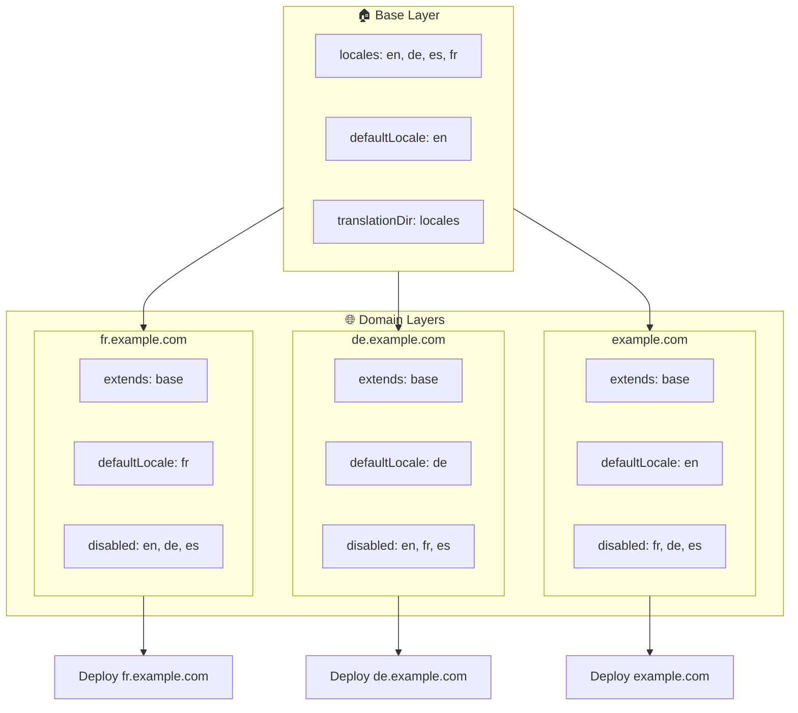

# 🌍 Monidomain-kielten määrittäminen `Nuxt I18n Microlla` kerroksilla

## 📝 Johdanto

Hyödyntämällä kerroksia moduulissa `Nuxt I18n Micro` voit luoda joustavan ja ylläpidettävän monidomain-paikallistamisasetuksen. Tämä lähestymistapa yksinkertaistaa domainien hallintaa poistamalla monimutkaisten toiminnallisuuksien tarpeen, mutta mahdollistaa myös tehokkaan kuorman jakamisen ja projektin monimutkaisuuden vähentämisen. Ajamalla erilliset projektit eri kielille sovelluksesi voi helposti skaalautua ja mukautua vaihteleviin kielivaatimuksiin useiden domainien välillä, tarjoten vahvan ja skaalautuvan ratkaisun globaaleille sovelluksille.

## 🎯 Tavoite

Luoda asetus, jossa eri domainit tarjoilevat tiettyjä kieliä mukauttamalla asetuksia lapsikerroksissa. Tämä menetelmä hyödyntää Nuxtin kerrostusjärjestelmää, mikä mahdollistaa peruskonfiguraation ylläpidon samalla kun sitä laajennetaan tai muokataan jokaista domainia varten.

### Monidomain-arkkitehtuuri



## 🛠 Vaiheet monidomain-kielten toteuttamiseen

### 1. **Luo peruskerros**

Aloita luomalla peruskonfiguraatiokerros, joka sisältää kaikki sovelluksesi yhteiset kieliasetukset. Tämä konfiguraatio toimii perustana muille domain-kohtaisille konfiguraatioille.

#### **Peruskerroksen konfiguraatio**

Luo peruskonfiguraatiotiedosto `base/nuxt.config.ts`:

```typescript
// base/nuxt.config.ts

export default defineNuxtConfig({
  i18n: {
    locales: [
      { code: 'en', iso: 'en-US', dir: 'ltr' },
      { code: 'de', iso: 'de-DE', dir: 'ltr' },
      { code: 'es', iso: 'es-ES', dir: 'ltr' },
    ],
    defaultLocale: 'en',
    translationDir: 'locales',
    meta: true,
    autoDetectLanguage: true,
  },
})
```

### 2. **Luo domain-kohtaiset lapsikerrokset**

Luo jokaiselle domainille lapsikerros, joka muokkaa peruskonfiguraatiota vastaamaan kyseisen domainin erityisvaatimuksia. Voit poistaa käytöstä kielet, joita ei tarvita tiettyyn domainiin.

#### **Esimerkki: Ranskan domainin konfiguraatio**

Luo lapsikerroksen konfiguraatio ranskalaiselle domainille tiedostoon `fr/nuxt.config.ts`:

```typescript
// fr/nuxt.config.ts

export default defineNuxtConfig({
  extends: '../base', // Inherit from the base configuration

  i18n: {
    locales: [
      { code: 'en', iso: 'en-US', dir: 'ltr', disabled: true }, // Disable English
      { code: 'fr', iso: 'fr-FR', dir: 'ltr' }, // Add and enable the French locale
      { code: 'de', iso: 'de-DE', dir: 'ltr', disabled: true }, // Disable German
      { code: 'es', iso: 'es-ES', dir: 'ltr', disabled: true }, // Disable Spanish
    ],
    defaultLocale: 'fr', // Set French as the default locale
    autoDetectLanguage: false, // Disable automatic language detection
  },
})
```

#### **Esimerkki: Saksan domainin konfiguraatio**

Vastaavasti luo lapsikerroksen konfiguraatio saksalaiselle domainille tiedostoon `de/nuxt.config.ts`:

```typescript
// de/nuxt.config.ts

export default defineNuxtConfig({
  extends: '../base', // Inherit from the base configuration

  i18n: {
    locales: [
      { code: 'en', iso: 'en-US', dir: 'ltr', disabled: true }, // Disable English
      { code: 'fr', iso: 'fr-FR', dir: 'ltr', disabled: true }, // Disable French
      { code: 'de', iso: 'de-DE', dir: 'ltr' }, // Use the German locale
      { code: 'es', iso: 'es-ES', dir: 'ltr', disabled: true }, // Disable Spanish
    ],
    defaultLocale: 'de', // Set German as the default locale
    autoDetectLanguage: false, // Disable automatic language detection
  },
})
```

### 3. **Ota sovellus käyttöön jokaiselle domainille**

Ota sovellus käyttöön asianmukaisella konfiguraatiolla jokaiselle domainille. Esimerkiksi:

- Ota `fr`-kerroksen konfiguraatio käyttöön osoitteessa `fr.example.com`.
- Ota `de`-kerroksen konfiguraatio käyttöön osoitteessa `de.example.com`.

### 4. **Määritä useita projekteja eri kielille**

Jokaista kieltä ja domainia varten sinun tulee ajaa erillinen sovellusinstanssi. Tämä varmistaa, että jokainen domain tarjoilee oikean kielikonfiguraation, optimoi kuormanjaon ja yksinkertaistaa projektin rakennetta. Ajamalla useita kielille räätälöityjä projekteja voit säilyttää selkeän erottelun konfiguraatioiden välillä ja vähentää kokonaisrakenteen monimutkaisuutta.

### 5. **Määritä reititys domainin mukaan**

Varmista, että reitityksesi on määritetty ohjaamaan käyttäjät oikeaan projektiin sen domainin perusteella, jota he käyttävät. Tämä varmistaa, että jokainen domain tarjoilee sopivan kielen, parantaen käyttökokemusta ja säilyttäen yhdenmukaisuuden eri alueiden välillä.

### 6. **Ota käyttöön ja varmista**

Kun olet määrittänyt kerrokset ja ottanut ne käyttöön vastaaville domaineille, varmista että jokainen domain tarjoilee oikean kielen. Testaa sovellus perusteellisesti varmistaaksesi, että oikea kieli latautuu domainista riippuen.

## 📝 Parhaat käytännöt

- **Pidä peruskonfiguraatio yleisenä**: Peruskonfiguraation tulisi kattaa kaikkiin domaineihin soveltuvat yleiset asetukset.
- **Eristä domain-kohtainen logiikka**: Pidä domain-kohtaiset konfiguraatiot omissa kerroksissaan säilyttääksesi selkeyden ja huolenaiheiden erottelun.

## 🎉 Yhteenveto

Hyödyntämällä kerroksia moduulissa `Nuxt I18n Micro` voit luoda joustavan ja ylläpidettävän monidomain-paikallistamisasetuksen. Tämä lähestymistapa poistaa monimutkaisten domainhallintatoimintojen tarpeen ja mahdollistaa myös kuorman tehokkaan jakamisen sekä projektin monimutkaisuuden vähentämisen. Erillisten projektien ajaminen eri kielille varmistaa, että sovelluksesi voi skaalautua helposti ja mukautua erilaisiin kielivaatimuksiin eri domaineissa, tarjoten vahvan ja skaalautuvan ratkaisun globaaleille sovelluksille.
