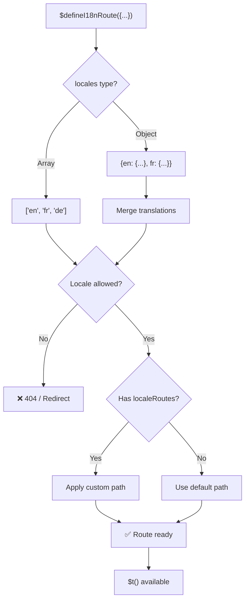
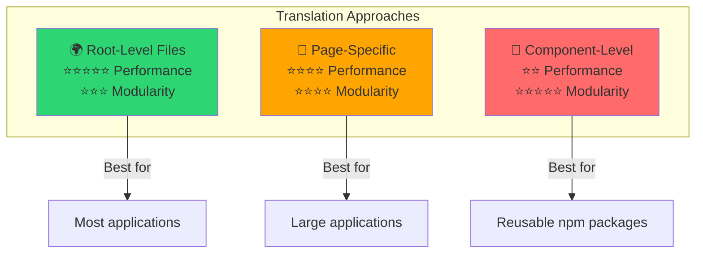

# 📖 Komponenttikohtaiset käännökset

Opi määrittämään käännökset suoraan Vue-komponenteissa käyttäen `$defineI18nRoute`-metodia modulaariseen ja ylläpidettävään paikallistamiseen.

## 📖 Yleiskatsaus

Komponenttikohtaiset käännökset moduulissa `Nuxt I18n Micro` mahdollistavat käännösten määrittämisen suoraan tiettyihin komponentteihin tai sivuihin käyttämällä `$defineI18nRoute`-funktiota. Tämä lähestymistapa on ihanteellinen yksittäisille komponenteille uniikin paikallistetun sisällön hallintaan, tarjoten modulaarisemman ja ylläpidettävämmän tavan käsitellä käännöksiä.

## 🚀 Pika-aloitus

### Peruskäyttö

```vue
<template>
  <div>
    <h1>{{ $t('greeting') }}</h1>
    <p>{{ $t('farewell') }}</p>
  </div>
</template>

<script setup lang="ts">
import { useNuxtApp } from '#imports'

const { $defineI18nRoute, $t } = useNuxtApp()

$defineI18nRoute({
  locales: {
    en: { greeting: 'Hello', farewell: 'Goodbye' },
    fr: { greeting: 'Bonjour', farewell: 'Au revoir' },
    de: { greeting: 'Hallo', farewell: 'Auf Wiedersehen' },
  },
})
</script>
```

### Pakollinen asennus (`script setup`)

`$defineI18nRoute` on Nuxt-app-injektio, ei globaali makro.  
Hae se aina metodilla `useNuxtApp()` ennen kutsumista.

```ts
import { useNuxtApp } from '#imports'

const { $defineI18nRoute } = useNuxtApp()
```

## 🏗️ Käännösaikainen reittimeta

Käännösaikana Vite-unplugin skannaa sivujen `.vue`-tiedostot etsien `defineI18nRoute(...)` / `$defineI18nRoute(...)` -kutsuja ja poimii kielirajoitukset, `localeRoutes`-asetuksen ja `disableMeta`-asetuksen reittimetadataksi, jota `@i18n-micro/route-strategy` käyttää.

- **Käännös**: unplugin (`src/unplugin-define-i18n-route.ts`) suoritetaan Viten transform-vaiheen aikana ja kirjoittaa `i18n-route-meta.json`-tiedoston Nuxt-buildkansioon
- **Ajonaikainen**: define-plugin (`03.define.ts`) tarjoaa edelleen `$defineI18nRoute`-metodin `script setup`-lohkossa dev-tilaa ja inline-konfiguraatiota varten

Kutsu tavallisesti `$defineI18nRoute`-metodia vain sivuilla — moduuli käsittelee käännösaikaisen poiminnan automaattisesti.

## 🔧 `$defineI18nRoute`-funktio

`$defineI18nRoute`-funktio määrittää reitin käyttäytymisen nykyisen kielen perusteella, tarjoten monipuolisen ratkaisun seuraaviin:

- Hallitse pääsyä tiettyihin reitteihin käytettävissä olevien kielten perusteella
- Tarjoa käännöksiä tietyille kielille
- Aseta mukautettuja reittejä eri kielille
- Hallitse metatagien generointia

### Miten se toimii



### Metodin allekirjoitus

```typescript
const { $defineI18nRoute } = useNuxtApp();
$defineI18nRoute(routeDefinition: DefineI18nRouteConfig);
```

### Parametrit

| Parametri      | Tyyppi                                     | Kuvaus                              |
| -------------- | ------------------------------------------ | ----------------------------------- |
| `locales`      | `string[] \| Record<string, Translations>` | Reitille käytettävissä olevat kielet |
| `localeRoutes` | `Record<string, string>`                   | Mukautetut reitit tietyille kielille |
| `disableMeta`  | `boolean \| string[]`                      | Hallitse i18n-metatagien generointia |

### Yksityiskohtaiset parametrikuvaukset

#### `locales`

Määrittää, mitkä kielet ovat käytettävissä reitille:

<CodeGroup>
```typescript Array Format
$defineI18nRoute({
  locales: ['en', 'fr', 'de'], // Simple array of locale codes
})
```

```typescript Object Format
$defineI18nRoute({
  locales: {
    en: { greeting: 'Hello', farewell: 'Goodbye' },
    fr: { greeting: 'Bonjour', farewell: 'Au revoir' },
    de: { greeting: 'Hallo', farewell: 'Auf Wiedersehen' },
    ru: {}, // Russian locale allowed but no translations provided
  },
})
```
</CodeGroup>

#### `localeRoutes`

Sallii mukautetut reitit tietyille kielille:

```typescript
$defineI18nRoute({
  localeRoutes: {
    en: '/welcome',
    fr: '/bienvenue',
    de: '/willkommen',
    ru: '/privet', // Custom route path for Russian locale
  },
})
```

#### `disableMeta`

Hallitsee i18n-metatagien generointia:

<CodeGroup>
```typescript Disable All Meta
$defineI18nRoute({
  locales: ['en', 'fr', 'de'],
  disableMeta: true, // Disables all i18n meta tags
})
```

```typescript Disable Specific Locales
$defineI18nRoute({
  locales: ['en', 'fr', 'de'],
  disableMeta: ['en', 'fr'], // Only English and French won't have meta tags
})
```
</CodeGroup>

## 💡 Käyttötapaukset

### 1. Pääsyn hallinta kielten perusteella

Määritä, mitkä kielet ovat sallittuja tietyille reiteille:

```typescript
$defineI18nRoute({
  locales: ['en', 'fr', 'de'], // Only these locales are allowed for this route
})
```

### 2. Komponenttikohtaisten käännösten tarjoaminen

Käytä `locales`-objektia tarjotaksesi kohdennettuja käännöksiä jokaiselle reitille:

```typescript
$defineI18nRoute({
  locales: {
    en: {
      greeting: 'Hello',
      farewell: 'Goodbye',
      description: 'Welcome to our application',
    },
    fr: {
      greeting: 'Bonjour',
      farewell: 'Au revoir',
      description: 'Bienvenue dans notre application',
    },
    de: {
      greeting: 'Hallo',
      farewell: 'Auf Wiedersehen',
      description: 'Willkommen in unserer Anwendung',
    },
  },
})
```

### 3. Mukautettu reititys kielille

Määritä mukautetut polut tietyille kielille:

```typescript
$defineI18nRoute({
  locales: ['en', 'fr', 'de'],
  localeRoutes: {
    en: '/welcome',
    fr: '/bienvenue',
    de: '/willkommen',
  },
})
```

### 4. Metatagien poistaminen käytöstä

Hallitse SEO-metatagien generointia tietyille reiteille tai kielille:

```typescript
// Disable meta tags for all locales
$defineI18nRoute({
  locales: ['en', 'fr', 'de'],
  disableMeta: true,
})

// Disable meta tags only for specific locales
$defineI18nRoute({
  locales: ['en', 'fr', 'de'],
  disableMeta: ['en', 'fr'],
})
```

## ✅ Tuetut konfiguraatiomuodot

`$defineI18nRoute`-jäsentäjä tukee useita JavaScript-konfiguraatioita:

### Staattiset konfiguraatiot

<CodeGroup>
```typescript Static Arrays
$defineI18nRoute({
  locales: ['en', 'de', 'fr'],
})
```

```typescript Static Objects
$defineI18nRoute({
  locales: {
    en: { greeting: 'Hello' },
    de: { greeting: 'Hallo' },
  },
  localeRoutes: {
    en: '/welcome',
    de: '/willkommen',
  },
})
```
</CodeGroup>

### Dynaamiset konfiguraatiot

<CodeGroup>
```typescript Variables and Functions
const locales = ['en', 'de', 'fr']
const routes = { en: '/welcome', de: '/willkommen' }

$defineI18nRoute({
  locales: locales,
  localeRoutes: routes,
})
```

```typescript Template Literals
const prefix = 'api'

$defineI18nRoute({
  locales: [`${prefix}-en`, `${prefix}-de`],
  localeRoutes: {
    [`${prefix}-en`]: `/api/welcome`,
    [`${prefix}-de`]: `/api/willkommen`,
  },
})
```
</CodeGroup>

### Edistyneet konfiguraatiot

<CodeGroup>
```typescript Spread Operator
const baseLocales = ['en', 'de']
const additionalLocales = ['fr', 'es']

$defineI18nRoute({
  locales: [...baseLocales, ...additionalLocales],
})
```

```typescript Array of Objects
$defineI18nRoute({
  locales: [
    { code: 'en', name: 'English' },
    { code: 'de', name: 'German' },
  ],
})
```
</CodeGroup>

### Ehdollinen logiikka

```typescript
$defineI18nRoute({
  locales: process.env.NODE_ENV === 'production' ? ['en', 'de'] : ['en', 'de', 'fr', 'es'],
})
```

### Monimutkaiset sisäkkäiset objektit

```typescript
$defineI18nRoute({
  locales: {
    'en-us': {
      region: 'US',
      currency: 'USD',
      format: {
        date: 'MM/DD/YYYY',
        time: '12h',
      },
    },
    'de-de': {
      region: 'DE',
      currency: 'EUR',
      format: {
        date: 'DD.MM.YYYY',
        time: '24h',
      },
    },
  },
})
```

### Kommentit ja muotoilu

```typescript
$defineI18nRoute({
  // Supported locales for this component
  locales: [
    'en', // English
    'de', // German
    'fr', // French
  ],
  // Custom routes for each locale
  localeRoutes: {
    en: '/welcome',
    de: '/willkommen',
    fr: '/bienvenue',
  },
})
```

## ❌ Ei tuettu

Jäsentäjällä on rajoituksia, eikä se pysty käsittelemään:

- **Ulkoiset tuonnit** (`import`-lauseet)
- **Async/await-funktiot**
- **Luokan metodit**
- **Monimutkaista ohjausvirtaa** (silmukat, try-catch, switch)
- **Nuolifunktiot** konfiguraatiossa
- **Generaattorifunktiot**

## 📝 Täydellinen esimerkki

Tässä on kattava esimerkki, joka näyttää kaikki ominaisuudet:

```vue
<template>
  <div class="welcome-page">
    <header>
      <h1>{{ $t('title') }}</h1>
      <p>{{ $t('subtitle') }}</p>
    </header>

    <main>
      <section>
        <h2>{{ $t('features.title') }}</h2>
        <ul>
          <li v-for="feature in $t('features.list')" :key="feature">
            {{ feature }}
          </li>
        </ul>
      </section>

      <section>
        <h2>{{ $t('contact.title') }}</h2>
        <p>{{ $t('contact.description') }}</p>
        <a :href="$t('contact.email')">{{ $t('contact.email') }}</a>
      </section>
    </main>

    <footer>
      <p>{{ $t('footer.copyright') }}</p>
    </footer>
  </div>
</template>

<script setup lang="ts">
import { useNuxtApp } from '#imports'

const { $defineI18nRoute, $t } = useNuxtApp()

// Define comprehensive i18n route configuration
$defineI18nRoute({
  locales: {
    en: {
      title: 'Welcome to Our Platform',
      subtitle: 'The best solution for your needs',
      features: {
        title: 'Key Features',
        list: ['High Performance', 'Easy to Use', 'Scalable Architecture'],
      },
      contact: {
        title: 'Get in Touch',
        description: "We'd love to hear from you",
        email: 'mailto:contact@example.com',
      },
      footer: {
        copyright: '© 2024 Example Company. All rights reserved.',
      },
    },
    fr: {
      title: 'Bienvenue sur Notre Plateforme',
      subtitle: 'La meilleure solution pour vos besoins',
      features: {
        title: 'Fonctionnalités Clés',
        list: ['Haute Performance', 'Facile à Utiliser', 'Architecture Évolutive'],
      },
      contact: {
        title: 'Contactez-Nous',
        description: 'Nous aimerions avoir de vos nouvelles',
        email: 'mailto:contact@example.com',
      },
      footer: {
        copyright: '© 2024 Example Company. Tous droits réservés.',
      },
    },
    de: {
      title: 'Willkommen auf Unserer Plattform',
      subtitle: 'Die beste Lösung für Ihre Bedürfnisse',
      features: {
        title: 'Hauptfunktionen',
        list: ['Hohe Leistung', 'Einfach zu Verwenden', 'Skalierbare Architektur'],
      },
      contact: {
        title: 'Kontaktieren Sie Uns',
        description: 'Wir würden gerne von Ihnen hören',
        email: 'mailto:contact@example.com',
      },
      footer: {
        copyright: '© 2024 Example Company. Alle Rechte vorbehalten.',
      },
    },
  },
  localeRoutes: {
    en: '/welcome',
    fr: '/bienvenue',
    de: '/willkommen',
  },
  disableMeta: false, // Enable SEO meta tags
})
</script>

<style scoped>
.welcome-page {
  max-width: 800px;
  margin: 0 auto;
  padding: 2rem;
}

header {
  text-align: center;
  margin-bottom: 3rem;
}

section {
  margin-bottom: 2rem;
}

footer {
  text-align: center;
  margin-top: 3rem;
  padding-top: 2rem;
  border-top: 1px solid #eee;
}
</style>
```

## ⚡ Suorituskykyhuomiot

Käännösten upottaminen Single File Componentteihin (SFC) voi vaikuttaa suorituskykyyn:

### Mahdolliset ongelmat

- **Kasvanut tiedostokoko**: Kaikki kielet ovat SFC:ssä, toisin kuin erilliset käännöstiedostot, jotka mahdollistavat kielikohtaisen latauksen
- **Hitaampi renderöinti**: Tiedostossa olevat käännökset käsitellään ajonaikaisesti
- **Muistin käyttö**: Kaikki käännökset ladataan riippumatta nykyisestä kielestä

### Parhaat käytännöt

- **Käytä sivukohtaisia käännöksiä** optimaalisen suorituskyvyn saavuttamiseksi
- **Varaa komponenttitason käännökset** erityistapauksiin, kuten:
  - Uudelleenkäytettävät komponentit, jotka julkaistaan npm:ssä
  - Käännökset, jotka eivät sovellu juuritason tiedostoihin
  - Komponentit, joiden on oltava itsenäisiä

### Suorituskyky vs. modulaarisuus

Tasapainota projektisi tarpeet valitessasi lähestymistapaa:



| Lähestymistapa           | Suorituskyky | Modulaarisuus | Käyttötapaus              |
| ------------------------ | ------------ | ------------- | ------------------------- |
| **Juuritason tiedostot** | ⭐⭐⭐⭐⭐   | ⭐⭐⭐        | Useimmat sovellukset      |
| **Sivukohtaiset**        | ⭐⭐⭐⭐     | ⭐⭐⭐⭐      | Suuret sovellukset        |
| **Komponenttitaso**      | ⭐⭐         | ⭐⭐⭐⭐⭐    | Uudelleenkäytettävät komponentit |

## 🎯 Parhaat käytännöt

### 1. Pidä käännökset lähellä komponentteja

Määritä käännökset suoraan olennaisen komponentin sisällä pitääksesi paikallistetun sisällön järjestäytyneenä ja ylläpidettävänä.

### 2. Käytä kieliobjekteja joustavuuden vuoksi

Hyödynnä objektimuotoa `locales`-ominaisuudelle, kun tarvitaan tiettyjä käännöksiä tai kieliin perustuvaa pääsynhallintaa.

### 3. Dokumentoi mukautetut reitit

Dokumentoi selkeästi eri kielille asetetut mukautetut reitit selkeyden säilyttämiseksi ja kehityksen ja ylläpidon yksinkertaistamiseksi.

### 4. Ota huomioon suorituskykyvaikutus

Arvioi, ovatko komponenttitason käännökset tarpeellisia käyttötapauksellesi ottaen huomioon suorituskykyvaikutukset.

### 5. Käytä TypeScriptiä

Hyödynnä TypeScriptiä paremman tyyppiturvallisuuden ja IntelliSense-tuen saamiseksi:

```typescript
interface ComponentTranslations {
  title: string
  subtitle: string
  features: {
    title: string
    list: string[]
  }
}

$defineI18nRoute({
  locales: {
    en: {
      title: 'Welcome',
      subtitle: 'Subtitle',
      features: {
        title: 'Features',
        list: ['Feature 1', 'Feature 2'],
      },
    } as ComponentTranslations,
  },
})
```

## 📚 Aiheeseen liittyviä aiheita

- **[Aloittaminen](/quickstart)** - Perusasennus ja konfiguraatio
- **[API-viite](/api/methods)** - Täydellinen metodien dokumentaatio
- **[Esimerkit](/examples)** - Todelliset käyttöesimerkit

## Yhteenveto

Komponenttikohtaisten käännösten ominaisuus, jota `$defineI18nRoute`-funktio ohjaa, tarjoaa tehokkaan ja joustavan tavan hallita paikallistamista Nuxt-sovelluksessasi. Sallimalla paikallistetun sisällön ja reitityksen määrittämisen komponenttitasolla se auttaa luomaan erittäin räätälöidyn ja käyttäjäystävällisen kokemuksen, joka on sovitettu yleisösi kieli- ja alueellisiin mieltymyksiin.

Valitse projektisi tarpeisiin parhaiten sopiva lähestymistapa ottaen huomioon sekä suorituskykyvaatimukset että ylläpidettävyyshuolet.
