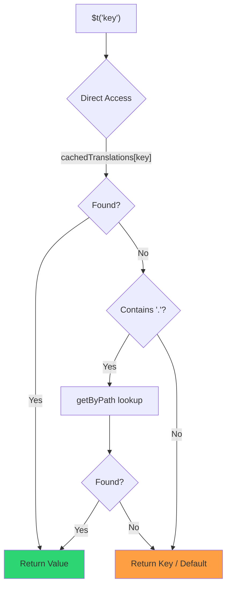

# 🚀 Suorituskykyopas

## 📖 Johdanto

`Nuxt I18n Micro` on suunniteltu suorituskykyä silmällä pitäen ja tarjoaa merkittävän parannuksen perinteisiin kansainvälistysmoduuleihin, kuten `nuxt-i18n`, verrattuna. Tämä opas tarjoaa syvällisen katsauksen `Nuxt I18n Micron` suorituskykyhyötyihin ja siihen, miten se vertautuu muihin ratkaisuihin.

## 🤔 Miksi keskittyä suorituskykyyn?

Suurissa projekteissa ja runsaan liikenteen ympäristöissä suorituskyvyn pullonkaulat voivat johtaa hitaisiin käännösaikoihin, kasvavaan muistin käyttöön ja huonoihin palvelinvastausaikoihin. Nämä ongelmat korostuvat monimutkaisissa i18n-asetuksissa, joissa on suuria käännöstiedostoja. `Nuxt I18n Micro` rakennettiin vastaamaan näihin haasteisiin optimoimalla nopeutta, muistitehokkuutta ja minimaalista vaikutusta sovelluksen bundle-kokoon.

## 📊 Suorituskyvyn vertailu

Suoritimme joukon testejä samoilla fikstuureilla komennolla `pnpm test:performance` (`pnpm -C scripts cli performance`) versiota **`@nuxtjs/i18n@10.6.0`** vasten. Täydellinen metodologia ja kaaviot: [Suorituskykytestien tulokset](/guides/performance-results).

Oletus-CLI-profiili: **4 kieltä** × **2 sivua** (`index`, `page`) × ~10k etusivun leaf-avainta. Kasvata `--locales` / `--keys` -arvoja raskaampaa regressiotutka-kuormaa varten. Raportti jakaa **koodin**, **käännökset** (mukaan lukien `@nuxtjs/i18n`:n `chunks/raw/*`) ja **kokonaiskäyttöönotettavan** tuotoksen.

```bash
pnpm test:performance
pnpm -C scripts cli performance --only micro --skip-stress
pnpm -C scripts cli performance --locales 12 --keys 100000 --runs 3
```

### ⏱️ Käännösaika ja resurssien kulutus

<Accordion title="**@nuxtjs/i18n v10.6**">
- **Koodibundle**: 2,16 MB
- **Käännökset**: 7,21 MB (viestichunkit + kielipayloadit)
- **Kokonaiskäyttöönotettava**: 9,37 MB
- **Maks. muistin käyttö**: 1 821 MB
- **Kulunut aika**: 8,34 s (3:n keskiarvo)
</Accordion>

<Tip>
- **Koodibundle**: 1,74 MB — **~19 % pienempi koodi kuin `@nuxtjs/i18n` v10.6**
- **Käännökset**: 6,8 MB (laiskasti ladattu JSON)
- **Kokonaiskäyttöönotettava**: 8,54 MB
- **Maks. muistin käyttö**: 1 065 MB — **~41 % vähemmän muistia kuin `@nuxtjs/i18n` v10.6**
- **Kulunut aika**: 5,34 s — **~36 % nopeampi kuin `@nuxtjs/i18n` v10.6** (≈ plain-nuxt-perustaso)
</Tip>

> Vanhemmat dokumentit, jotka näyttivät `@nuxtjs/i18n` "code ≈ 15 MB / translations 0 B", laskivat `chunks/raw`-viestitiedostot sovelluksen koodiksi. Nykyinen luokittelija erottaa ne; ero **koodissa** on pienempi, ja micro on silti edellä käännösajassa, huippu-RSS:ssä ja kuormitustesteissä.

Katso [täydellinen vertailuraportti](/guides/performance-results) kaavioita, Autocannon-tuloksia ja fikstuurien tietoja varten.

### 🌐 Palvelimen suorituskyky kuormituksen alla

Artillery (6s@6 + 60s@60) ja Autocannon (10c / 10s), 3 peräkkäisen ajon keskiarvo fikstuuria kohti.

<Accordion title="**@nuxtjs/i18n v10.6**">
- **Pyynnöt sekunnissa (Artillery)**: 143 [#/sek]
- **Keskimääräinen vastausaika**: 956 ms
- **Autocannon RPS / keskim. viive**: 72 / 139 ms
</Accordion>

<Tip>
- **Pyynnöt sekunnissa (Artillery)**: 275 [#/sek] — **~93 % enemmän kuin `@nuxtjs/i18n` v10.6**
- **Keskimääräinen vastausaika**: 483 ms — **~49 % nopeampi kuin `@nuxtjs/i18n` v10.6**
- **Autocannon RPS / keskim. viive**: 162 / 62 ms
</Tip>

### 📈 Visuaalinen vertailu

<Note>
Interaktiivinen kaavio jätetty pois Mintlify-dokumentaatiosta. Katso tämän sivun vertailutaulukot tai [VitePress-dokumentaatio](https://s00d.github.io/nuxt-i18n-micro/guide/performance-results) kaaviota varten: `chart`.
</Note>

<Note>
Interaktiivinen kaavio jätetty pois Mintlify-dokumentaatiosta. Katso tämän sivun vertailutaulukot tai [VitePress-dokumentaatio](https://s00d.github.io/nuxt-i18n-micro/guide/performance-results) kaaviota varten: `chart`.
</Note>

| Metriikka       | @nuxtjs/i18n v10.6 | i18n-micro | Parannus           |
| --------------- | ------------------ | ---------- | ------------------ |
| Käännösaika     | 8,34 s             | 5,34 s     | **~36 % nopeampi** |
| Muisti (build)  | 1 821 MB           | 1 065 MB   | **~41 % vähemmän** |
| Koodibundle     | 2,16 MB            | 1,74 MB    | **~19 % pienempi** |
| Vastausaika     | 956 ms             | 483 ms     | **~49 % nopeampi** |
| RPS (Artillery) | 143                | 275        | **~93 % enemmän**  |

### 🔍 Tulosten tulkinta

Nykyistä `@nuxtjs/i18n` **v10.6** -versiota vastaan (oletus-CLI-profiili, 3:n keskiarvo):

- 🗜️ **Pienempi koodigraafi**: ~1,74 MB vs. ~2,16 MB, kun viestichunkkeja ei väärin luokitella "koodiksi".
- 🧠 **Alhaisempi build-RSS**: ~1,1 GB huippu vs. ~1,8 GB.
- 🕒 **Nopeammat buildit**: ~5,3 s vs. ~8,3 s (micro yltää plain-Nuxt-perustason tasolle tällä profiililla).
- ⚡ **Paljon parempi kuormituksen alla**: ~275 vs. ~143 Artillery RPS, ~162 vs. ~72 Autocannon RPS, alhaisempi keskimääräinen viive.

Absoluuttiset luvut eroavat vanhemmista julkaistuista taulukoista (pienemmät sanakirjat, vanhempi Nuxt ja epäreilu "0 B translations" -jako moduulille `@nuxtjs/i18n`). Suuntaus on sama: micro pysyy edellä build-kustannuksissa ja pyyntöjen läpimenossa.

## ⚙️ Keskeiset optimoinnit

### 🛠️ Minimalistinen suunnittelu

`Nuxt I18n Micro` on rakennettu minimalistisen arkkitehtuurin ympärille pienellä ytimellä ja omistetuilla strategiapaketeilla. Tämä vähentää yleiskustannuksia ja yksinkertaistaa sisäistä logiikkaa, mikä johtaa parempaan suorituskykyyn.

### 🚦 Tehokas reititys

V3:ssa reittigenerointi ja ajonaikainen polkulogiikka on jaettu omiin paketteihin optimaalista tree-shakingia varten:

- **`@i18n-micro/route-strategy`** — Käännösaikainen reittigenerointi: laajentaa Nuxt-sivut paikallistetuilla reiteillä. Vain valittu strategia (`no_prefix`, `prefix`, `prefix_except_default`, `prefix_and_default`) sisällytetään.
- **`@i18n-micro/path-strategy`** — Ajonaikainen polkujen resolvointi, uudelleenohjaukset ja linkkien luonti. Käyttää puhtaita funktioita ja esilaskettuja kontekstilippuja minimoidakseen allokoinnit kuumilla poluilla. Alipolku-viennit (`/prefix`, `/no-prefix` jne.) varmistavat, että vain valittu toteutus bundlataan.

Tämä lähestymistapa pitää reitityskonfiguraation kevyenä ja varmistaa nopean reitin resolvoinnin kielten määrästä riippumatta.

### 📂 Virtaviivaistettu käännösten lataus

Moduuli tukee vain JSON-tiedostoja käännöksissä, ja globaalit ja sivukohtaiset tiedostot erotetaan selkeästi. Tämä varmistaa, että vain tarvittava käännösdata ladataan kulloinkin, mikä parantaa suorituskykyä entisestään.

### 🔒 GlobalThis-singleton-välimuisti

Alkaen versiosta v3.0.0 moduuli käyttää `globalThis`-singleton-mallia yhdessä `Symbol.for`-metodin kanssa taatakseen yhden välimuisti-instanssin koko Node.js-prosessissa. Tämä estää:

- Välimuistin päällekkäisyyden, kun sama moduuli bundlataan useita kertoja
- Pyyntökohtaisen objektien uudelleenluonnin, joka aiheuttaa GC-painetta
- Muistivuodot orpoutuneista välimuisti-instansseista

```mermaid
flowchart LR
    subgraph Process["Node.js Process"]
        G["globalThis[Symbol.for('CACHE')]"]

        subgraph R1["SSR Request 1"]
            P1[Plugin Instance] --> G
        end

        subgraph R2["SSR Request 2"]
            P2[Plugin Instance] --> G
        end

        subgraph R3["SSR Request 3"]
            P3[Plugin Instance] --> G
        end
    end

    G --> Cache["Single Map Instance"]
    Cache --> D1["en:index → translations"]
    Cache --> D2["en:about → translations"
```

```typescript
// Internal implementation pattern
const CACHE_KEY = Symbol.for('__NUXT_I18N_STORAGE_CACHE__')
if (!globalThis[CACHE_KEY]) {
  globalThis[CACHE_KEY] = new Map()
}
```

### ⚡ Optimoitu käännösfunktio (tFast)

Funktio `$t()` käyttää suoraa hakustrategiaa, joka on optimoitu nopeutta varten:

1. **Esilaskettu konteksti**: Kieli ja reitin nimi lasketaan kerran navigoinnin aikana, ei jokaisessa `$t()`-kutsussa
2. **Yksilähteinen haku**: Kaikki käännökset (juuri + sivukohtainen + fallback) yhdistetään käännösaikana yhdeksi tiedostoksi sivua kohti — ei tarvita kerroksittaista hakua
3. **Kumulatiivinen syvä yhdistäminen navigoinnissa**: Kun navigoidaan saman kielen sisällä, uuden sivun käännökset syvästi yhdistetään (2 tason syvyydellä) aktiiviseen sanakirjaan, jolloin edellisen sivun avaimet pysyvät näkyvillä siirtymäanimaatioiden aikana — myös silloin kun sivuilla on päällekkäisiä sisäkkäisiä prefiksejä (esim. molemmilla sivuilla on avaimia kohdassa `common.*`)
4. **Roskienkeräys `page:transition:finish` -tapahtuman kautta**: Kun siirtymäanimaatio on kokonaan valmis, yhdistetty sanakirja korvataan uuden sivun puhtailla käännöksillä, mikä vapauttaa muistia vanhojen sivujen avaimilta
5. **Suora ominaisuuspääsy**: Käyttää `obj[key]`-syntaksia Map-hakujen sijaan kuumilla poluilla



```typescript
// Simplified lookup logic — single active dictionary
let val = cachedTranslations[key]
if (val === undefined && key.includes('.')) {
  val = getByPath(cachedTranslations, key)
}
```

### 💉 Palvelinpuolen lataus (ei HTML-upotusta)

SSR:n aikana ladatut käännökset pysyvät **palvelimen muistissa** `$t`-metodia varten renderöinnin aikana. Niitä **ei** kopioida `nuxtApp.payload`-arvoon / HTML-dokumenttiin (sama idea kuin moduulissa `@nuxtjs/i18n` asetuksella `experimental.preload: false`).

Asiakkaalla `01.plugin.ts` odottaa `switchContext`-kutsua, joka lataa polun `/\{apiBaseUrl\}/:page/:locale/data.json` ennen kuin sovellus jatkaa — yksi pyyntö, ei 8 MB inline-blobia.

`NuxtI18n` säilyttää edelleen aktiivisen yhdistetyn sanakirjan (`cachedTranslations`) metodeille `$t()` / `$has()`. Samankieliset navigoinnit syvästi yhdistävät sivuchunkit, kunnes `page:transition:finish` siivoaa vanhentuneet avaimet.

#### Missä ollaan nyt

Alla olevat luvut luetaan budjettitiedostosta, jota `pnpm run budget:payload` mittaa ja valvoo.

{/* generated:payload-budget — do not edit; run `pnpm run docs:generate` */}

Mitattu `playgroundissa` reiteille `/`, `/de`:

| Mittaus | Koko |
| --- | --- |
| Käännöslähteet levyllä | 15,2 MB |
| Tarjoillaan erillisinä payload-tiedostoina | 76,3 MB |
| Suurin inline `__NUXT_DATA__` | 6,9 MB |
| Asiakkaan resurssit | 449,5 KB |

Playgroundissa on tarkoituksellisesti ylimitoitettu sanakirja, joten nämä eivät ole lukuja, joita voi odottaa todelliselta
sovellukselta — ne ovat kiinteä piste, jota vasten mitata. Budjetti epäonnistuu, kun ne kasvavat odottamatta,
ja näin huomataan tahaton muutos siihen, mitä payload kuljettaa.

{/* /generated:payload-budget */}

### 💾 Välimuistitus ja esirenderöinti

Käännökset kulkevat useiden välimuistien läpi, ja sen tietäminen, mikä niistä vastasi pyyntöön, on
ero viiden minuutin ja viiden tunnin virheenetsintäistunnon välillä. Niitä on neljä, siinä
järjestyksessä kuin pyyntö kohtaa ne:

| Kerros | Missä | Elinaika | Tyhjennetään |
| --- | --- | --- | --- |
| Selain / CDN | `Cache-Control` polulle `/\{apiBaseUrl\}/**` | `httpCacheDuration`, `immutable` | uusi `?v=` — eli käyttöönotto, joka muutti käännöksiä |
| Nitro-reittivälimuisti | `routeRules['/\{apiBaseUrl\}/**'].cache` | 60 s, stale-while-revalidate | palvelimen uudelleenkäynnistys |
| Palvelinlataaja | in-process `CacheControl`, avain `locale:routeName` | prosessin elinikä tai `cacheTtl` | palvelimen uudelleenkäynnistys, HMR devissä |
| Asiakasvarasto | `translationStorage` + aktiivinen chunki objektissa `NuxtI18n` | sivun elinikä | uudelleenlataus |

Kaksi sääntöä pitää ne kohtuullisina keskenään:

- **Nitro-reittivälimuisti on olemassa vain, kun `?v=` on olemassa.** Cache-busterin kanssa jokainen URL on
  yksilöllinen sisällölleen, joten sen välimuistitus palvelinpuolella on vapaa vanhentuneisuudesta. Aseta
  `dateBuild: 0` ja kyseinen kerros on kytketty pois päältä, koska URL on silloin vakaa ja
  vastaus sanoo `must-revalidate` — palvelinpuolen välimuisti vastaisi vanhentuneesta merkinnästä
  jopa minuutin ajan ja kaataisi sen hiljaisesti.
- **`immutable` vaatii myös `?v=`-arvon.** Ilman busteria otsake on
  `public, max-age=0, must-revalidate`, sanoipa `httpCacheDuration` mitä tahansa: pitkä
  `max-age` URL:ssä, joka ei koskaan muutu, kiinnittää ensimmäisen vastauksen, jonka selain koskaan näki.

<Warning>
Asetuksella `translationPayloads.publicAssets` (oletus esiyhdistetyssä tilassa) payloadit kopioidaan hakemistoon
`public/<apiBaseUrl>/\{page\}/\{locale\}/data.json`. Alusta, joka tarjoilee kyseistä hakemistoa itse
(Cloudflare Pages, Firebase Hosting, `npx serve`), soveltaa omia otsakkeitaan — Nitron
`routeRules`-otsake tavoittaa vain palvelimen läpi kulkevat vastaukset. Aseta välimuistikäytäntö
näille staattisille tiedostoille alustan omassa konfiguraatiossa.
</Warning>

🏁 **Esirenderöinti**: esiyhdistetyssä tilassa `publicAssets` kirjoittaa jo asiakkaan URL-puun hakemistoon
`public/`. Ota `prerenderRoutes` käyttöön vain, jos tarvitset Nitroa materialisoimaan käsittelijäreitit, kun
kyseinen kopio on poistettu käytöstä.

### 🗜️ Pakatut julkiset payloadit

Kun `nitro.compressPublicAssets` on käytössä, julkiseen hakemistoon kopioidut käännöspayloadit
saavat myös `.gz`- ja `.br`-sisarukset:

```ts
export default defineNuxtConfig({
  nitro: { compressPublicAssets: true },
})
```

Nitro pakkaa julkiset resurssit ennen hookia, joka kopioi payloadit, joten ilman tätä ne olisivat
staattisen buildin ainoa pakkaamaton osa. Moduuli ei kytke pakkausta itse päälle —
se soveltaa vain valitsemaasi asetusta. Koodauskohtainen valinta (`\{ gzip: true, brotli: false \}`)
kunnioitetaan.

Playgroundin index-payload: 6 651 984 B raakana, 1 012 831 B gzip, 821 617 B brotli.

### ☁️ Serverless-payloadin tuotos

**Nodessa** SSR lukee käännös-JSON:t hakemistosta `public/<apiBaseUrl>` (`readFile`, ei Nitro `serverAssets` / Rollup `raw:`). **Edgessä** Nitro `serverAssets` upottaa saman puun (suosi asetusta `mode: 'source'` suurille luetteloille).

```typescript
export default defineNuxtConfig({
  i18n: {
    translationPayloads: {
      serverAssets: true, // default — Node → public copy; Edge → serverAssets embed
      publicAssets: true, // default in premerged mode
    },
  },
})
```

Käytä `translationPayloads.mode: 'source'` -asetusta tiiviisiin Edge-upotuksiin (ja valinnaisiin tiiviisiin julkisiin kopioihin):

```typescript
export default defineNuxtConfig({
  i18n: {
    translationPayloads: {
      mode: 'source',
    },
  },
})
```

`mode: 'source'` pitää layer-yhdistetyt lähdetiedostot tiiviinä ja yhdistää juuren/sivun/fallbackin ajonaikaisesti sisäänrakennetun `/_locales`-reitin (tai Edge `assets:i18n`) kautta. Oletuksena se poistaa käytöstä julkiset resurssikopiot ja esirenderöidyt payload-reitit.

<Warning>
`prerenderRoutes` on oletuksena `false`. Asetuksella `mode: 'source'` myös `publicAssets` on oletuksena `false`. Puhdas staattinen isännöinti ilman Nitro/edge-ajoympäristöä ei siksi voi ladata käännöksiä asiakkaalla, ellet ota yhtä näistä tuotoksista käyttöön, pidä `serverHandler`-käsittelijää saatavilla ajonaikaisesti tai isännöi payloadeja ulkoisesti.

Oletusarvo esiyhdistetty + `publicAssets` sijoittaa jo polun `/\{apiBaseUrl\}/\{page\}/\{locale\}/data.json` hakemistoon `public/`, joten staattiset isännät voivat tarjoilla asiakkaan fetch-pyynnöt ilman Nitroa.
</Warning>

<Warning>
Asetusten `apiBaseServerHost` tai `apiBaseClientHost` asettaminen siirtää payloadien tarjoilun tuohon alkuperään, mikä tuo mukanaan omat vaatimuksensa — katso [Konfiguraatio → Ulkoiset CDN-isännät](/guides/configuration#external-cdn-hosts).
</Warning>

Tai poista käytöstä yksittäiset HTTP-/julkiset tuotokset ja isännöi payloadeja ulkoisesti:

```typescript
export default defineNuxtConfig({
  i18n: {
    apiBaseClientHost: 'https://cdn.example.com',
    apiBaseServerHost: 'https://cdn.example.com',
    translationPayloads: {
      serverHandler: false,
      publicAssets: false,
      prerenderRoutes: false,
    },
  },
})
```

Pidä `serverHandler` käytössä, kun luotat sisäänrakennettuun paikalliseen `/\{apiBaseUrl\}/:page/:locale/data.json` -reittiin. Poista se käytöstä, kun payloadit isännöidään ulkoisesti ja `apiBaseServerHost` osoittaa tuohon ulkoiseen alkuperään. Ota `prerenderRoutes` käyttöön vain, kun tarvitset Nitroa materialisoimaan staattiset payload-reitit eikä `publicAssets` ole jo kirjoittanut niitä.

Buildin aikana moduuli varoittaa, kun generoitu payload-tuotos ylittää arvon `translationPayloads.warnFileCount` (oletus 500) tai `translationPayloads.warnSizeBytes` (oletus 10 MB). Se varoittaa myös, kun kaikki paikalliset tuotokset on poistettu käytöstä ilman ulkoisia payload-isäntiä.

## 📝 Vinkkejä suorituskyvyn maksimointiin

Tässä muutama vinkki, joilla saat parhaan suorituskyvyn irti moduulista `Nuxt I18n Micro`:

- 📉 **Rajoita kielidataa**: Sisällytä projektiisi vain tarvitsemasi kielet pitääksesi bundle-koon pienenä.
- 🗂️ **Käytä sivukohtaisia käännöksiä**: Järjestä käännöstiedostosi sivukohtaisesti välttääksesi turhan datan lataamisen.
- 💾 **Ota välimuistitus käyttöön**: Hyödynnä välimuistiominaisuuksia palvelinkuorman vähentämiseen ja vastausaikojen parantamiseen.
- 🏁 **Hyödynnä esirenderöintiä**: Esirenderöi käännöksesi nopeuttaaksesi sivujen latauksia ja vähentääksesi ajonaikaista lisäkuormaa.

Katso yksityiskohtaisia suorituskykytestien tuloksia kohdasta [Suorituskykytestien tulokset](/guides/performance-results).
