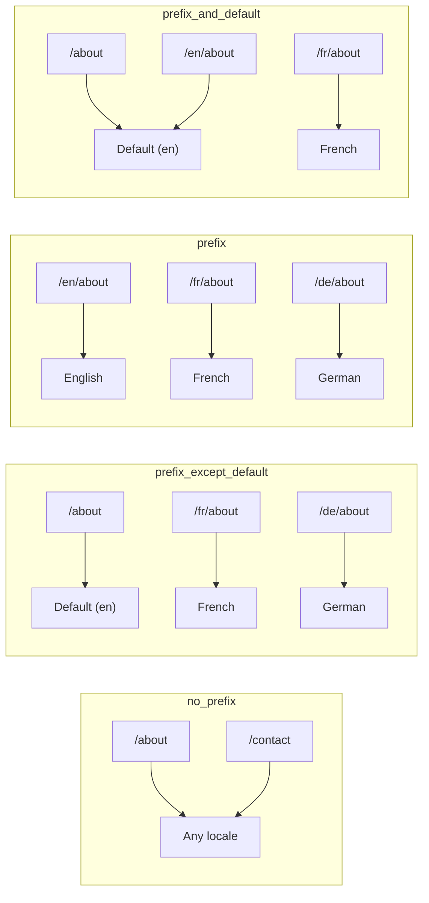
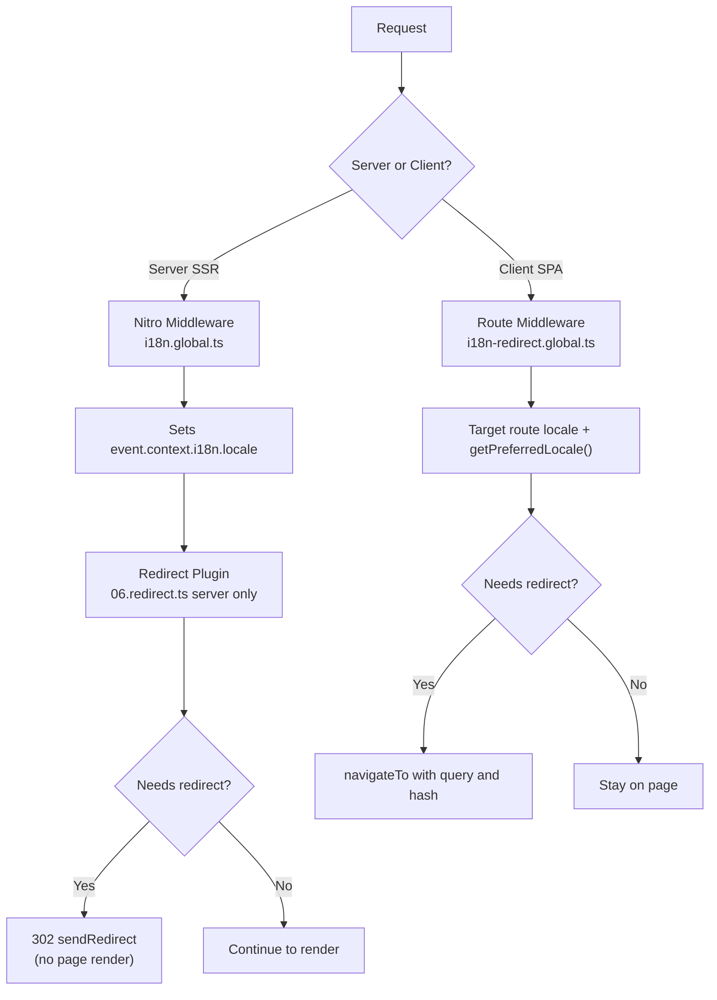

# 🗂️ Reititysstrategiat Nuxt I18n Microssa

## 📖 Yleiskatsaus

Nuxt I18n Micro ohjaa kieliprefiksien näkymistä URL-osoitteissa `strategy`-asetuksen avulla. Konepellin alla kaksi pakettia toteuttaa tämän:

- **`@i18n-micro/route-strategy`** — käännösaikainen reittigenerointi (laajentaa Nuxt-sivuja paikallistetuilla reiteillä)
- **`@i18n-micro/path-strategy`** — ajonaikainen polkujen resolvointi, uudelleenohjaukset, SEO-attribuutit ja linkkien luonti

Nuxt-moduuli valitsee oikean strategialuokan käännösaikana ja aliasoi sen kautta `#i18n-strategy`, joten vain valittu toteutus bundlataan.

## 🚦 Saatavilla olevat strategiat

{/* generated:option:strategy — do not edit; run `pnpm run docs:generate` */}

**Tyyppi** `Strategies` · **Oletus** `'prefix_except_default'`

URL-reititysstrategia kieliprefikseille.

- `'no_prefix'` — ei kieltä URL:ssa; kieli tallennetaan evästeeseen.
- `'prefix_except_default'` — prefiksi kaikille kielille paitsi oletuskielelle.
- `'prefix'` — aina prefiksi, mukaan lukien oletuskieli.
- `'prefix_and_default'` — kuten `prefix`, mutta oletuskielelle pääsee myös ilman prefiksiä.

{/* /generated:option:strategy */}

### Strategiavertailu



### 🛑 `no_prefix`

URL-osoitteissa ei ole kielisegmenttiä. Kieli määritetään evästeistä, `useI18nLocale()`-tilasta tai selaimen tunnistuksesta.

- **Reitit**: `/about`, `/contact` — sama URL-malli kaikille kielille (ei prefiksiä `/en/`, `/fr/`)
- **Kielen säilyvyys**: Asetuksen `localeCookie` kautta (asetetaan automaattisesti arvoon `'user-locale'`, jos ei ole määritetty)
- **Mukautetut polut**: Tuettu [`globalLocaleRoutes`](/guides/configuration#globallocaleroutes)- ja [`defineI18nRoute`](/guides/custom-locale-routes)-asetusten kautta — paikallistetut slugit generoidaan lisäämättä kieliprefiksiä URL-osoitteisiin (esim. `/about` vs `/ueber-uns`). Sisäkkäiset reitit, aliakset ja kielikohtaiset rajoitukset ovat yksinkertaisempia kuin strategiassa `prefix_except_default`.

<Tip>
Strategian `no_prefix` käytön yhteydessä `localeCookie` asetetaan automaattisesti arvoon `'user-locale'`, jos sitä ei ole määritetty. Tämä on välttämätöntä, koska URL ei sisällä kielitietoa.
</Tip>

```typescript
i18n: {
  strategy: 'no_prefix'
  // localeCookie is automatically set to 'user-locale'
}
```

### 🚧 `prefix_except_default`

Kaikilla reiteillä on kieliprefiksi **paitsi** oletuskielellä.

- **Oletuskieli**: `/about`, `/contact`
- **Muut kielet**: `/fr/about`, `/de/contact`
- **Oletuskieli prefiksillä palauttaa 404:n**: `/en/about` → 404 (kun `en` on oletuskieli)

```typescript
i18n: {
  strategy: 'prefix_except_default' // This is the default
}
```

### 🌍 `prefix`

Jokaisella reitillä on kieliprefiksi, mukaan lukien oletuskieli.

- **Kaikki kielet**: `/en/about`, `/fr/about`, `/de/about`
- **Juuri `/`**: Uudelleenohjaus polkuun `/\{locale\}/` käyttäjän mieltymyksen mukaan

```typescript
i18n: {
  strategy: 'prefix'
}
```

### 🔄 `prefix_and_default`

Oletuskieli on saatavilla sekä prefiksillä että ilman. Muilla kuin oletuskielillä on aina prefiksi.

- **Oletuskieli**: sekä `/about` että `/en/about` ovat valideja
- **Muut kielet**: `/fr/about`, `/de/about`
- **Ei uudelleenohjausta juuresta `/`**: Sekä `/` että `/en/` tarjoilevat oletuskieltä

```typescript
i18n: {
  strategy: 'prefix_and_default'
}
```

## 🔀 Uudelleenohjausarkkitehtuuri (v3)

V3:ssa uudelleenohjauslogiikka on jaettu kahteen kerrokseen optimaalisen suorituskyvyn saavuttamiseksi:

### Miten se toimii



### Palvelinpuoli (ei välähdystä)

1. **Nitro-middleware** (`i18n.global.ts`) ajetaan ensin — tunnistaa kielen URL:sta, evästeestä tai `Accept-Language`-otsakkeesta ja asettaa `event.context.i18n.locale`
2. **Redirect-plugin** (`06.redirect.ts`, vain palvelin) tarkistaa metodilla `i18nStrategy.getClientRedirect()`, tarvitseeko nykyinen polku uudelleenohjausta, ja lähettää 302:n **ennen** kuin sivun renderöinti tapahtuu
3. Tämä estää "virheenvälähdyksen", jossa käyttäjät näkevät hetkellisesti väärän sivun ennen uudelleenohjausta

### Asiakaspuoli (SPA-navigointi)

1. Globaali reittimiddleware (`i18n-redirect.global.ts`) ajetaan jokaisen asiakasnavigoinnin yhteydessä, kun `redirects` on käytössä
2. Johtaa suosikkikielen ensin **kohdereitistä** ja palautuu sitten metodiin `useI18nLocale().getPreferredLocale()`
3. Käyttää metodia `i18nStrategy.getClientRedirect()` päättääkseen, tarvitaanko uudelleenohjausta
4. Säilyttää `query` ja `hash` uudelleenohjauksessa

### Kielten prioriteettijärjestys

Palvelimella redirect-plugin määrittää suosikkikielen tässä järjestyksessä:

1. **`useState('i18n-locale')`** — korkein prioriteetti (asetetaan ohjelmallisesti metodilla `useI18nLocale().setLocale()`)
2. **Eväste** — jos `localeCookie` on määritetty
3. **`Accept-Language`-otsake** — jos `autoDetectLanguage: true`
4. **`defaultLocale`** — lopullinen fallback

Asiakaspuolella reittimiddleware suosii kieltä kohdereitistä, ja käyttää sitten samaa tila/eväste-fallback-ketjua.

### Uudelleenohjauskäyttäytyminen strategiakohtaisesti

| Strategia               | `GET /` -käyttäytyminen                       | Vaaditaanko eväste? |
| ----------------------- | --------------------------------------------- | ------------------- |
| `no_prefix`             | Ei uudelleenohjausta (kieli evästeestä/tilasta) | Asetetaan automaattisesti |
| `prefix`                | 302 → `/\{locale\}/`                            | Suositellaan        |
| `prefix_except_default` | 302 → `/\{locale\}/` jos kieli ≠ oletus         | Suositellaan        |
| `prefix_and_default`    | Ei uudelleenohjausta (sekä `/` että `/\{locale\}/` valideja) | Valinnainen        |

### Uudelleenohjauksien poistaminen käytöstä

```typescript
i18n: {
  redirects: false // Disables automatic locale redirects
}
```

Kun `redirects: false`, automaattiset kielten uudelleenohjaukset on poistettu käytöstä:

- **Palvelin**: redirect-plugin (`06.redirect.ts`, vain palvelin) pysyy rekisteröitynä mutta ohittaa uudelleenohjauslogiikan. Se suorittaa silti **404-tarkistukset** virheellisille kieliprefikseille (esim. `/xx/about`, jossa `xx` ei ole validi kieli) ja **evästeen synkronoinnin** URL-prefiksistä (esim. osoitteessa `/fr/about` vierailu synkronoi evästeen arvoon `fr`)
- **Asiakas**: `i18n-redirect`-globaalia reittimiddlewarea **ei rekisteröidä** — ei SPA:n automaattista uudelleenohjausta

## 🍪 Evästepohjainen kielen säilyvyys

<Warning>
Kun käytät strategiaa `prefix` tai `prefix_except_default` asetuksella `redirects: true` (oletus), sinun **täytyy** asettaa `localeCookie`, jotta uudelleenohjaukset toimivat oikein. Ilman evästettä redirect-plugin ei voi muistaa käyttäjän kielivalintaa sivun uudelleenlatausten välillä.

```typescript
i18n: {
  strategy: 'prefix_except_default',
  localeCookie: 'user-locale' // Required for redirects to work properly
}
```
</Warning>

**Miten `localeCookie` toimii v3:ssa:**

- Sisäisesti hallinnoitu `useI18nLocale()`-metodilla — **älä aseta sitä manuaalisesti** metodilla `useCookie()`
- Kun käyttäjä vierailee prefiksatussa URL:ssa (esim. `/fr/about`), eväste synkronoidaan automaattisesti arvoon `fr`
- Seuraavalla vierailulla juureen `/` evästeen arvoa käytetään uudelleenohjaukseen polkuun `/\{locale\}/`
- Jos eväste sisältää virheellisen kielen (ei ole `locales`-listalla), palautetaan `defaultLocale`

| Strategia               | `localeCookie`-oletus | Huomautukset                          |
| ----------------------- | --------------------- | ------------------------------------- |
| `no_prefix`             | Auto: `'user-locale'` | Vaaditaan; asetetaan automaattisesti  |
| `prefix`                | `null` (pois käytöstä)| Aseta arvoon `'user-locale'` uudelleenohjauksia varten |
| `prefix_except_default` | `null` (pois käytöstä)| Aseta arvoon `'user-locale'` uudelleenohjauksia varten |
| `prefix_and_default`    | `null` (pois käytöstä)| Valinnainen                           |

## 🔍 `autoDetectLanguage` ja `autoDetectPath`

### `autoDetectLanguage`

{/* generated:option:autoDetectLanguage — do not edit; run `pnpm run docs:generate` */}

**Tyyppi** `boolean` · **Oletus** `true`

Havaitse automaattisesti käyttäjän suosikki-kieli HTTP-otsakkeesta `Accept-Language`.
Käytetään yhdessä asetuksen `autoDetectPath` kanssa määrittämään milloin havainto tapahtuu.

{/* /generated:option:autoDetectLanguage */}

Tarkistus suoritetaan palvelinmiddlewaressa ja se on fallback: eväste tai olemassa oleva tila voittaa.

```typescript
i18n: {
  autoDetectLanguage: true
}
```

### `autoDetectPath`

{/* generated:option:autoDetectPath — do not edit; run `pnpm run docs:generate` */}

**Tyyppi** `string` · **Oletus** `'/'`

Missä evästeen / Accept-Language-mieltymyksen uudelleenohjaukset voivat suoritua (kun `redirects` on käytössä).

- `'/'` — vain `/` (syvälinkit oletuskielellä pysyvät saavutettavina; oletus)
- `'no_prefix'` — vain polut ilman kieliprefiksiä
- `'*'` — jokainen polku, mukaan lukien eksplisiittisen kieliprefiksin uudelleenkirjoitus
  (esim. `/fr/about` → `/de/about`, kun eväste suosii `de`:tä)

- mikä tahansa muu merkkijono — tarkka polkuvastaavuus (esim. `'/welcome'`)

Prefiksistrategioiden siivousta (esim. `/en` → `/` strategiassa `prefix_except_default`) ei rajoiteta.

{/* /generated:option:autoDetectPath */}

```typescript
i18n: {
  autoDetectPath: '/' // Default: only root
  // autoDetectPath: '*' // All paths — redirects even /fr/about to /de/about
}
```

<Warning>
Asetuksella `autoDetectPath: '*'` myös URL-osoitteet, joissa on eksplisiittinen kieliprefiksi (esim. `/fr/about`), uudelleenohjataan, jos käyttäjän suosikkikieli poikkeaa. Tämä voi olla hyödyllistä domain-pohjaisissa asetuksissa, mutta se voi hämmentää käyttäjiä, jotka jakavat URL-osoitteita.
</Warning>

Oletusarvon `autoDetectPath: '/'` ja kielieväste-yhdistelmän kanssa:

| pyyntö | eväste | tulos |
| --- | --- | --- |
| `/` | `de` | 302 → `/de` |
| `/about` | `de` | 200, oletuskieli (ei uudelleenkirjoitusta) |

```typescript
i18n: {
  localeCookie: 'user-locale',
  strategy: 'prefix_except_default',
  // Default — remember language on entry, keep deep links stable
  autoDetectPath: '/',
  // Or redirect on every unprefixed path (but not /de/… → /fr/…):
  // autoDetectPath: 'no_prefix',
}
```

## ⚠️ Tunnetut ongelmat ja parhaat käytännöt

### 1. Hydraatioristiriita strategiassa `no_prefix`

Kun käytössä on `no_prefix`, kieli määritetään dynaamisesti. Jos palvelin ja asiakas ovat eri mieltä kielestä, näet hydraatioristiriidan.

**Ratkaisu**: Käytä metodia `useI18nLocale().setLocale()` palvelinpluginissa (arvolla `order: -10`) asettaaksesi kielen ennen i18n:n alustusta:

```ts
// plugins/i18n-loader.server.ts
export default defineNuxtPlugin({
  name: 'i18n-custom-loader',
  enforce: 'pre',
  order: -10,
  setup() {
    const { setLocale } = useI18nLocale()
    setLocale('ja') // Your detection logic here
  },
})
```

Katso yksityiskohtaisia esimerkkejä kohdasta [Mukautettu kielen tunnistus](/guides/custom-language-detection).

### 2. Käytä nimettyjä reittejä metodin `localeRoute` kanssa

Polkupohjainen reititys voi aiheuttaa ongelmia reitin resolvoinnissa:

```typescript
// May cause issues
$localeRoute('/page')

// Preferred approach
$localeRoute({ name: 'page' })
```

### 3. Asetuksen `pages: false` käyttö i18n:n kanssa

Kun käytät Nuxtia asetuksella `pages: false`:

```typescript
export default defineNuxtConfig({
  pages: false,
  i18n: {
    strategy: 'no_prefix', // Recommended
    disablePageLocales: true, // Required
    localeCookie: 'user-locale', // Required for persistence
  },
})
```

**Rajoitukset asetuksen `pages: false` kanssa:**

- Ei automaattisia uudelleenohjauksia
- Ei URL-pohjaista kielen tunnistusta
- Asiakaspuolen kielen vaihtaminen vaatii sivun uudelleenlatauksen tai manuaalisen käännösten lataamisen

### 4. Virheellisten evästeiden käsittely

Jos eväste sisältää virheellisen kielen (ei ole `locales`-listalla), moduuli palautuu sulavasti arvoon `defaultLocale`. Virheitä ei heitetä.

## 📝 Parhaiden käytäntöjen yhteenveto

| Suositus                  | Yksityiskohdat                                                                       |
| ------------------------- | ------------------------------------------------------------------------------------ |
| **Aseta `localeCookie`**  | Aseta aina prefiksistrategioilla, kun `redirects: true`                              |
| **Käytä `useI18nLocale()`** | Keskitetty tapa hallita kielitilaa (korvaa manuaalisen `useState`/`useCookie`)     |
| **Käytä nimettyjä reittejä** | `$localeRoute(\{ name: 'page' \})` mieluummin kuin `$localeRoute('/page')`         |
| **Ohjelmallinen kieli**   | Käytä `useI18nLocale().setLocale()` palvelinpluginissa arvolla `order: -10`          |
| **Vältä manuaalisia evästeitä** | Älä käytä `useCookie('user-locale')`-metodia suoraan — `useI18nLocale()` hallitsee tätä |
