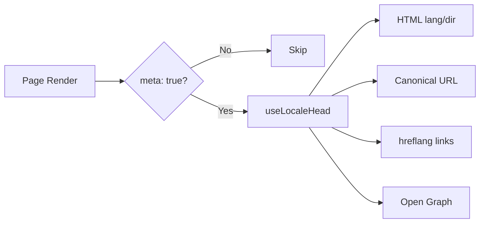

# 🌐 SEO-opas Nuxt I18n Microlle

## 📖 Johdanto

Tehokas SEO (hakukoneoptimointi) on olennaista varmistamaan, että monikielinen sivustosi on saavutettavissa ja näkyvissä käyttäjille maailmanlaajuisesti hakukoneiden kautta. `Nuxt I18n Micro` yksinkertaistaa monikielisten sivustojen SEO:n hallintaa generoimalla automaattisesti tarvittavat metatagit ja attribuutit, jotka kertovat hakukoneille sivustosi rakenteesta ja sisällöstä.

Tämä opas selittää, kuinka `Nuxt I18n Micro` käsittelee SEO:n parantaakseen sivustosi näkyvyyttä ja käyttökokemusta ilman lisäasetuksia.

## ⚙️ Automaattinen SEO-käsittely

### SEO-metatiedon generoinnin kulku



**Generoidut tagit:**

| Tagi            | Esimerkki                                                |
| --------------- | -------------------------------------------------------- |
| HTML-attribuutit | `<html lang="en" dir="ltr">`                            |
| Canonical       | `<link rel="canonical" href="...">`                      |
| hreflang        | `<link rel="alternate" hreflang="en" href="...">`        |
| x-default       | `<link rel="alternate" hreflang="x-default" href="...">` |
| Open Graph      | `<meta property="og:locale" content="en_US">`            |

#### `og` kielikohtaisesti (`og:locale` vs BCP 47)

`<html lang>` ja `hreflang` käyttävät **BCP 47** -muotoa `locale.iso`-arvon kautta (esim. `ar-AE`).  
Open Graph vaatii **`language_TERRITORY`**-muodon **alaviivalla** (`ar_AE`), [OG-protokollan](https://ogp.me/) mukaan.

Oletuksena `og:locale` johdetaan `iso`-arvosta, kun kartoitus on yksiselitteinen (`en-US` → `en_US`).  
Aseta eksplisiittinen **`og`**-merkkijono, kun tarvitset mukautetun arvon (esim. `zh-Hans` → `zh_CN`).  
Jos ei ole saatavilla `og`-arvoa eikä muunnettavaa `iso`-arvoa, `og:locale`-tageja ei generoida — kehityksessä saat konsolivaroituksen (kunnioittaa asetusta `missingWarn`).

```typescript
i18n: {
  meta: true,
  locales: [
    { code: 'ar', iso: 'ar-AE', og: 'ar_AE', dir: 'rtl' },
    { code: 'en', iso: 'en-US' }, // og:locale → en_US
    { code: 'zh', iso: 'zh-Hans', og: 'zh_CN' }, // script tags need explicit og
  ],
}
```

### 🔑 Keskeiset SEO-ominaisuudet

Kun `meta`-asetus on käytössä `Nuxt I18n Microssa`, moduuli hallinnoi automaattisesti seuraavia SEO-näkökohtia:

1. **🌍 Kieli- ja suunta-attribuutit**:
   - Moduuli asettaa `lang`- ja `dir`-attribuutit `<html>`-tagille nykyisen kielen ja tekstisuunnan mukaan (esim. `ltr` englannille tai `rtl` arabialle).

2. **🔗 Kanoniset URL-osoitteet**:
   - Moduuli generoi kanonisen linkin (`<link rel="canonical">`) jokaiselle sivulle varmistaen, että hakukoneet tunnistavat sisällön pääversion.

3. **🌐 Vaihtoehtoiset kielilinkit (`hreflang`)**:
   - Moduuli generoi automaattisesti `<link rel="alternate" hreflang="">` -tagit kaikille saatavilla oleville kielille. Tämä auttaa hakukoneita ymmärtämään, mitkä sisältösi kieliversiot ovat saatavilla, parantaen käyttökokemusta globaalille yleisölle.
   - Jokainen kieli lähettää **yhden** tagin: `hreflang = iso || code`. Kun `iso` on asetettu, reititys-`code`-arvoa ei koskaan käytetä `hreflang`-arvona (jotta markkina-avaimet kuten `mx` eivät muutu virheellisiksi kielitageiksi).
   - Valinnainen `hreflangBaseLanguage: true` lähettää myös paljaan kielitagin, joka johdetaan `iso`-arvosta (esim. `es-ES` → `es`), ja jonka ensimmäinen alueellinen kieli listalla `locales` ottaa haltuun.

4. **🌏 `x-default` Hreflang**:
   - Moduuli generoi automaattisesti `<link rel="alternate" hreflang="x-default">` -tagin, joka osoittaa oletuskielen URL-osoitteeseen. Tämä kertoo hakukoneille, mitä URL:ää näyttää käyttäjille, joiden kieli ei vastaa mitään määritettyjä kieliä. Lisäasetuksia ei tarvita — se toimii automaattisesti kun `meta: true` on asetettu.

5. **🔖 Open Graph -metadata**:
   - Moduuli generoi Open Graph -metatagit (`og:locale`, `og:url` jne.) jokaiselle kielelle, mikä on erityisen hyödyllistä sosiaalisen median jakamisessa ja hakukoneiden indeksoinnissa.

### 🛠️ Konfiguraatio

Ottaaksesi nämä SEO-ominaisuudet käyttöön varmista, että `meta`-asetus on `true` `nuxt.config.ts`-tiedostossasi:

```typescript
export default defineNuxtConfig({
  modules: ['nuxt-i18n-micro'],
  i18n: {
    locales: [
      { code: 'en', iso: 'en-US', dir: 'ltr' },
      { code: 'fr', iso: 'fr-FR', dir: 'ltr' },
      { code: 'ar', iso: 'ar-SA', dir: 'rtl' },
    ],
    defaultLocale: 'en',
    translationDir: 'locales',
    meta: true, // Enables automatic SEO management
  },
})
```

### 🌍 Dynaaminen `metaBaseUrl` monidomain-käyttöönotoille

Kun `metaBaseUrl` on asettamatta, absoluuttiset SEO-URL:t resolvoidaan tässä järjestyksessä (#240):

1. `site.url` moduulista [`nuxt-site-config`](https://nuxtseo.com/docs/site-config) (jos kyseinen moduuli on olemassa — esim. `@nuxtjs/seo`-moduulin kautta)
2. Muussa tapauksessa isäntänimi nykyisestä pyynnöstä (`useRequestURL()` / `window.location.origin`)

Pyynnön alkuperän fallback kunnioittaa käänteisen välityspalvelimen otsakkeita (`X-Forwarded-Host`, `X-Forwarded-Proto`), joten se toimii oikein nginxin, Cloudflaren, AWS ALB:n ja vastaavien välityspalvelimien takana.

Tämä tarkoittaa, että sovellukset, jotka jo asettavat `site.url`-arvon sitemapille / robotsille / schema.orgille, **eivät** tarvitse toista `metaBaseUrl`-määrittelyä:

```typescript
export default defineNuxtConfig({
  site: {
    url: process.env.NUXT_SITE_URL, // also used by micro for canonical / og:url / hreflang
  },
  i18n: {
    meta: true,
    // metaBaseUrl omitted — picks up site.url, then request origin
  },
})
```

Ilman `site.url`-arvoa yksi sovellusinstanssi voi silti tarjoilla **useita domaineja** oikeilla SEO-tageilla jokaiselle pyynnön alkuperän kautta:

```typescript
export default defineNuxtConfig({
  i18n: {
    meta: true,
    // metaBaseUrl is undefined by default — resolved dynamically from the request
  },
})
```

Esimerkiksi pyyntö osoitteeseen `https://site-a.com/en/about` tuottaa:

```html
<link rel="canonical" href="https://site-a.com/en/about" /> <meta property="og:url" content="https://site-a.com/en/about" />
```

Kun taas sama sovellus, joka tarjoilee osoitetta `https://site-b.com/en/about`, tuottaa:

```html
<link rel="canonical" href="https://site-b.com/en/about" /> <meta property="og:url" content="https://site-b.com/en/about" />
```

Jos tarvitset kiinteän base-URL:n, joka voittaa aina `site.url`-arvon, välitä staattinen merkkijono:

```typescript
metaBaseUrl: 'https://example.com'
```

### 🔍 Kanonisen kyselyn sallittujen lista

Oletuksena kyselyparametrit poistetaan kanonisista URL-osoitteista ja `og:url`-arvosta päällekkäisen sisällön välttämiseksi. Voit sallia tiettyjä kyselyparametrejä, jotka tulee säilyttää:

```typescript
i18n: {
  canonicalQueryWhitelist: ['page', 'sort', 'filter', 'search', 'q', 'query', 'tag']
}
```

Vain listalla `canonicalQueryWhitelist` mainitut parametrit näkyvät kanonisissa URL-osoitteissa. Kaikki muut kyselyparametrit (esim. seuranta, session-ID:t) poistetaan.

### 🚫 Metatagien poistaminen käytöstä sivukohtaisesti

Voit poistaa SEO-metatagien generoinnin käytöstä tietyille sivuille metodilla `defineI18nRoute()`:

```vue
<script setup>
// Disable all SEO meta tags for this page
defineI18nRoute({
  disableMeta: true,
})
</script>
```

Voit myös poistaa metan käytöstä vain tietyille kielille:

```vue
<script setup>
// Disable meta tags only for English locale on this page
defineI18nRoute({
  disableMeta: ['en'],
})
</script>
```

Kun `disableMeta` on aktiivinen, `hreflang`-, `canonical`-, `og:locale`-, `og:url`- tai `x-default`-tageja ei generoida kyseiselle sivulle/kielelle.

### 🔇 Poistetut kielet

Kielet, joilla on asetus `disabled: true`, jätetään automaattisesti pois kaikesta SEO-tagien generoinnista — niille ei luoda `hreflang`-, `og:locale:alternate`- tai vaihtoehtoisia linkkejä:

```typescript
i18n: {
  locales: [
    { code: 'en', iso: 'en-US' },
    { code: 'fr', iso: 'fr-FR', disabled: true }, // excluded from SEO tags
  ]
}
```

### 🙈 Opt-out-kielet (`seo: false`)

Kielille, joiden tulisi pysyä reitittävissä ja käännettyinä mutta jotka eivät saa näkyä kielten välisissä löytämistageissa, aseta `seo: false`. Nämä kielet jätetään pois `hreflang`-vaihtoehdoista ja `og:locale:alternate`-tagista. Jos määrittämälläsi **oletus**kielellä on `seo: false`, `x-default`-linkkiä ei myöskään lähetetä.

```typescript
i18n: {
  locales: [
    { code: 'en', iso: 'en-US' },
    { code: 'ru', iso: 'ru-RU', seo: false }, // internal / non-indexed locale
  ]
}
```

### 📌 Strategiakohtainen käyttäytyminen

| Strategia               | hreflang-linkit  | x-default             | canonical      | og:url |
| ----------------------- | ---------------- | --------------------- | -------------- | ------ |
| `prefix`                | ✅ Kaikki kielet | ✅ Oletuskielen URL   | ✅ Nykyinen URL | ✅     |
| `prefix_except_default` | ✅ Kaikki kielet | ✅ Prefiksitön URL    | ✅ Nykyinen URL | ✅     |
| `prefix_and_default`    | ✅ Kaikki kielet | ✅ Oletuskielen URL   | ✅ Nykyinen URL | ✅     |
| `no_prefix`             | ❌ Ei generoida  | ❌ Ei generoida       | ✅ Nykyinen URL | ✅     |

Strategialle `no_prefix` generoidaan vain `canonical`, `og:url`, `og:locale` ja `html`-attribuutit (`lang`, `dir`). Vaihtoehtoisia kielilinkkejä (`hreflang`) ja `x-default`-tagia ei generoida, koska kielikohtaisia erillisiä URL-osoitteita ei ole.

## Sivutason ohitukset (`useI18nHead`)

**Artikkeleille, oppaille tai millekään CMS-sisällölle**, jossa jokaista kieltä ei ole olemassa tai URL:t tulevat API:sta, käytä [`useI18nHead`](/api/composables/use-i18n-head)-metodia sivulla mukautetun i18n-head-pluginin sijasta.

### Artikkeli osittaisilla käännöksillä

```vue
<script setup lang="ts">
const article = await loadArticle()
// article.locales = { en: '...', de: '...' } — only translated locales

useI18nHead({
  meta: [{ property: 'og:title', content: article.title }],
  replace: {
    hreflang: Object.entries(article.locales).map(([locale, href]) => ({
      rel: 'alternate',
      hreflang: locale,
      href,
    })),
    ogAlternates: Object.keys(article.locales),
  },
})
</script>
```

### Kielikohtaiset slugit metodilla `$setI18nRouteParams`

Kun slugit eroavat kielittäin, aseta ensin reittiparametrit ja ohita sitten vaihtoehdot todellisilla URL-osoitteilla:

```vue
<script setup lang="ts">
const { $defineI18nRoute, $setI18nRouteParams } = useNuxtApp()
const { data: article } = await useFetch(`/api/articles/${slug}`)

$defineI18nRoute({
  localeRoutes: { en: '/blog/[slug]', de: '/de/blog/[slug]' },
})

$setI18nRouteParams({
  en: { slug: article.value.slugEn },
  de: { slug: article.value.slugDe },
})

useI18nHead({
  replace: {
    hreflang: ['en', 'de'].map((locale) => ({
      rel: 'alternate',
      hreflang: locale,
      href: article.value.urls[locale],
    })),
    ogAlternates: ['en', 'de'],
  },
})
</script>
```

### HTTPS-alkuperä välityspalvelimen takana

Absoluuttisten URL-osoitteiden oikeaan generointiin SSR:ssä ilman mukautettua alkuperäkoostetoimintoa:

```ts
i18n: {
  meta: true,
  metaBaseUrl: undefined,
  metaTrustForwardedHost: true,
  metaTrustForwardedProto: true,
}
```

Lisää esimerkkejä (kanonisen ohitus, `x-default`, reaktiivinen fetch, jaetut apurit): [useI18nHead-koostetoiminto](/api/composables/use-i18n-head).

### ⚠️ Trailing slash

Moduuli generoi kanonisen URL:n ja `hreflang`-URL:t todellisen polun perusteella `useRoute().fullPath`-arvosta. Jos sovelluksesi käyttää loppuvinoviivaa (esim. Nuxtin `router.options`-asetuksen kautta), generoidut URL-osoitteet heijastavat tätä. Metodi `$switchLocalePath` voi kuitenkin normalisoida polkuja ja poistaa loppuvinoviivat. Jos loppuvinoviivan johdonmukaisuus on kriittistä SEO:llesi, varmista että generoidut URL-osoitteet vastaavat sovelluksesi URL-rakennetta.

### 🎯 Hyödyt

`meta`-asetuksen ottaminen käyttöön hyödyttää sinua seuraavasti:

- **📈 Parantuneet hakukonesijoitukset**: Hakukoneet voivat indeksoida sivustosi paremmin ja ymmärtää eri kieliversioiden välisiä suhteita.
- **👥 Parempi käyttökokemus**: Käyttäjille tarjoillaan oikea kieliversio heidän mieltymystensä mukaan, mikä johtaa henkilökohtaisempaan kokemukseen.
- **🔧 Vähemmän manuaalisia asetuksia**: Moduuli hoitaa SEO-tehtävät automaattisesti, mikä vapauttaa sinut SEO-metatagien ja -attribuuttien manuaalisesta lisäämisestä.

## 🔗 Nuxt SEO (`@nuxtjs/seo`)

[`@nuxtjs/seo`](https://nuxtseo.com/) yhdistää sitemapin, robotsin, schema.orgin, OG-kuvat ja niihin liittyvät moduulit. Se integroituu **nuxt-i18n-micron** kanssa moduulin [`nuxt-site-config`](https://nuxtseo.com/docs/site-config/guides/i18n) (v4+) kautta.

### Vaatimukset

- **`@nuxtjs/seo` 3+** (nykyiset julkaisut käyttävät `nuxt-site-config` 4+ -versiota, joka rekisteröi `nuxt-site-config:i18n`-pluginin microlle)
- **`i18n.meta: true`** (suositeltu — micro toimittaa kielitietoiset head-tagit; Nuxt SEO lisää sitemapin, schema.orgin jne.)

### Moduulien järjestys

Listaa **nuxt-i18n-micro ennen `@nuxtjs/seo`**-moduulia, jotta site config voi lukea kieliasetuksesi:

```typescript
export default defineNuxtConfig({
  modules: ['nuxt-i18n-micro', '@nuxtjs/seo'],
  site: {
    url: 'https://example.com',
    name: 'My Site',
  },
  i18n: {
    meta: true,
    defaultLocale: 'en',
    locales: [
      { code: 'en', iso: 'en-US' },
      { code: 'de', iso: 'de-DE' },
    ],
  },
})
```

### Käännetty sivuston nimi ja kuvaus

Nuxt Site Config lukee valinnaiset käännösavaimet kielitiedostoistasi:

```json
{
  "nuxtSiteConfig": {
    "name": "My Site",
    "description": "My site description"
  }
}
```

Kielikohtaiset arvot tiedostoissa `locales/en.json`, `locales/de.json` jne. poimitaan automaattisesti.

### Vianmääritys

Jos näet `Plugin nuxt-seo:defaults depends on nuxt-site-config:i18n but they are not registered`, päivitä **`@nuxtjs/seo` versioon 3+** (katso [issue #133](https://github.com/s00d/nuxt-i18n-micro/issues/133)). Vanhempi `nuxt-site-config` 3.x kytki i18n:n vain moduulille `@nuxtjs/i18n`, ei microlle.

Lisää: [Sitemap i18n -opas](https://nuxtseo.com/docs/sitemap/guides/i18n), [Site Config i18n -opas](https://nuxtseo.com/docs/site-config/guides/i18n).
