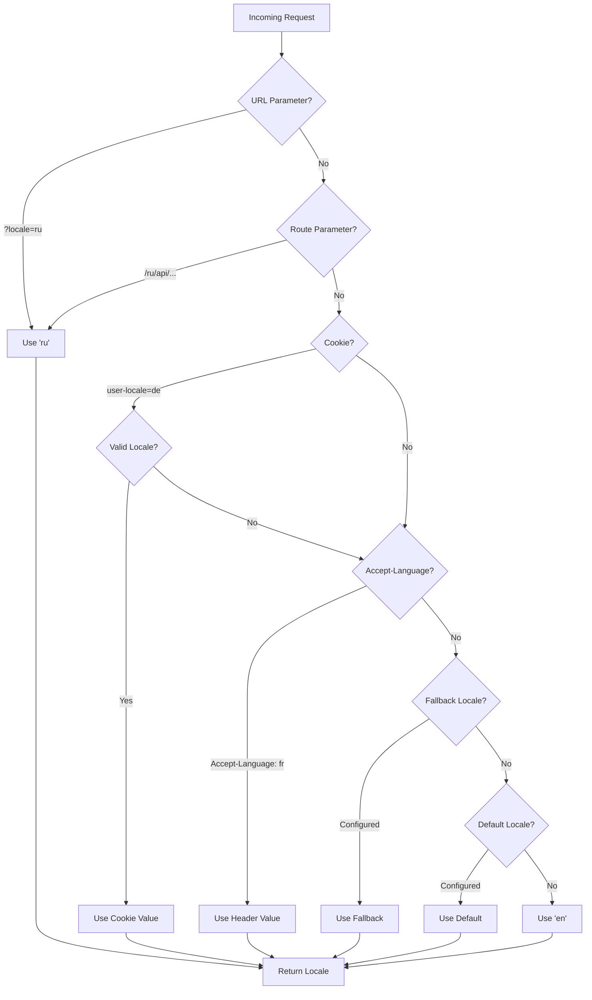

# 🌍 Palvelinpuolen käännökset ja kielitiedot Nuxt I18n Microssa

## 📖 Yleiskatsaus

Nuxt I18n Micro tukee palvelinpuolen käännöksiä ja kielitietoja, jolloin voit kääntää sisältöä ja käyttää kielitietoja palvelimella. Tämä on erityisen hyödyllistä API:ille tai palvelinrenderöidyille sovelluksille, joissa paikallistamista tarvitaan ennen asiakkaan tavoittamista.

Käännökset käyttävät Nuxt I18n -konfiguraatiossa määriteltyjä kieliviestejä ja ne resolvoidaan dynaamisesti havaitun kielen perusteella.

Oletuksena (`translationPayloads.mode: 'premerged'`) juuritason tiedostot leivotaan jokaiseen sivupayloadiin käännösaikana muodossa `\{page\}/\{locale\}/data.json`. Palvelin lataa samat esikäännetyt tiedostot, joita asiakas hakee osoitteesta `/\{apiBaseUrl\}/...`, joten kaikki avaimet (sekä jaetut että sivukohtaiset) ovat käytettävissä palvelinkäsittelijöissä.

Asetuksella `translationPayloads.mode: 'source'` tiiviit lähdetiedostot yhdistetään ajonaikaisesti, kun `loadTranslationsFromServer()`-metodia (tai `/_locales`-reittiä) kutsutaan — **Edgessä** Nitro `serverAssets`-tiedostojen kautta, **Nodessa** valinnaisesta julkisesta kopiosta. Katso [Suorituskykyopas — Serverless-payloadin tuotos](/guides/performance#serverless-payload-output) ja [Välimuistin ja tallennuksen arkkitehtuuri](/api/cache).

Katso yhtenäinen luettelo ajonaikaisista ja palvelinpuolen API:sta kohdasta [API-viite](/api/overview).

## 🛠️ Palvelinpuolen middlewaren asennus

Palvelinpuolen käännösten ja kielitietojen ottamiseksi käyttöön käytä tarjottuja middleware-funktioita:

- `useTranslationServerMiddleware` - sisällön kääntämiseen
- `useLocaleServerMiddleware` - kielitietojen käyttämiseen

Molemmat middleware-funktiot ovat automaattisesti saatavilla kaikilla palvelinreiteillä.

Kielentunnistuslogiikka on jaettu molempien middleware-funktioiden välillä `detectCurrentLocale`-apufunktion kautta johdonmukaisuuden varmistamiseksi moduulissa.

## ✨ Käännösten käyttö palvelinkäsittelijöissä

Voit kääntää sisältöä saumattomasti missä tahansa `eventHandler`-käsittelijässä käyttämällä käännösmiddlewarea.

### Esimerkki: Peruskäännösten käyttö

```typescript
import { defineEventHandler } from 'h3'

export default defineEventHandler(async (event) => {
  const t = await useTranslationServerMiddleware(event)
  return {
    message: t('greeting'), // Returns the translated value for the key "greeting"
  }
})
```

Tässä esimerkissä:

- Käyttäjän kieli tunnistetaan automaattisesti kyselyparametreista, evästeistä tai otsakkeista.
- `t`-funktio hakee sopivan käännöksen havaitulle kielelle.

## 🌍 Kielitietojen käyttö palvelinkäsittelijöissä

### Peruskielitietojen käyttö

```typescript
import { defineEventHandler } from 'h3'

export default defineEventHandler((event) => {
  const localeInfo = useLocaleServerMiddleware(event)

  return {
    success: true,
    data: localeInfo,
    timestamp: new Date().toISOString(),
  }
})
```

### Mukautettujen kieliparametrien tarjoaminen

```typescript
import { defineEventHandler } from 'h3'

export default defineEventHandler((event) => {
  // Force specific locale with custom default
  const localeInfo = useLocaleServerMiddleware(event, 'en', 'ru')

  return {
    success: true,
    data: localeInfo,
    timestamp: new Date().toISOString(),
  }
})
```

### Vastauksen rakenne

Kielimiddleware palauttaa `LocaleInfo`-objektin seuraavilla ominaisuuksilla:

```typescript
interface LocaleInfo {
  current: string // Current detected locale code
  default: string // Default locale code
  fallback: string // Fallback locale code
  available: string[] // Array of all available locale codes
  locale: Locale | null // Full locale configuration object
  isDefault: boolean // Whether current locale is the default
  isFallback: boolean // Whether current locale is the fallback
}
```

### Esimerkkivastaus

```json
{
  "success": true,
  "data": {
    "current": "ru",
    "default": "en",
    "fallback": "en",
    "available": ["en", "ru", "de"],
    "locale": {
      "code": "ru",
      "iso": "ru-RU",
      "dir": "ltr",
      "displayName": "Русский"
    },
    "isDefault": false,
    "isFallback": false
  },
  "timestamp": "2024-01-15T10:30:00.000Z"
}
```

## 🌐 Mukautetun kielen tarjoaminen

Jos sinun täytyy määrittää kieli manuaalisesti (esim. testausta tai tiettyjä pyyntöjä varten), voit välittää sen käännösmiddlewarelle:

### Esimerkki: Mukautettu kieli

```typescript
import { defineEventHandler } from 'h3'

function detectLocale(event): string | null {
  const urlSearchParams = new URLSearchParams(event.node.req.url?.split('?')[1])
  const localeFromQuery = urlSearchParams.get('locale')
  if (localeFromQuery) return localeFromQuery

  return 'en'
}

export default defineEventHandler(async (event) => {
  const t = await useTranslationServerMiddleware(event, 'en', detectLocale(event)) // Force French local, en - default locale
  return {
    message: t('welcome'), // Returns the French translation for "welcome"
  }
})
```

## 📋 Kielentunnistuslogiikka

Molemmat middleware-funktiot määrittävät käyttäjän kielen automaattisesti käyttäen seuraavaa prioriteettijärjestystä:



1. **URL-parametrit**: `?locale=ru`
2. **Reittiparametrit**: `/ru/api/endpoint`
3. **Evästeet**: `user-locale`-eväste
4. **HTTP-otsakkeet**: `Accept-Language`-otsake
5. **Fallback-kieli**: Kuten moduulin asetuksissa on määritetty
6. **Oletuskieli**: Kuten moduulin asetuksissa on määritetty
7. **Kovakoodattu fallback**: `'en'`

> **Huomautus**: Kielentunnistuslogiikka on jaettu funktioiden `useLocaleServerMiddleware` ja `useTranslationServerMiddleware` välillä johdonmukaisuuden varmistamiseksi moduulissa.

## 📋 Edistyneet käyttöesimerkit

### Ehdollinen vastaus kielen perusteella

```typescript
import { defineEventHandler } from 'h3'

export default defineEventHandler((event) => {
  const { current, isDefault, locale } = useLocaleServerMiddleware(event)

  // Return different content based on locale
  if (current === 'ru') {
    return {
      message: 'Привет, мир!',
      locale: current,
      isDefault,
    }
  }

  if (current === 'de') {
    return {
      message: 'Hallo, Welt!',
      locale: current,
      isDefault,
    }
  }

  // Default English response
  return {
    message: 'Hello, World!',
    locale: current,
    isDefault,
  }
})
```

### Mukautettu kielentunnistus

```typescript
import { defineEventHandler } from 'h3'

export default defineEventHandler((event) => {
  // Force German locale with English as fallback
  const { current, isDefault, locale } = useLocaleServerMiddleware(event, 'en', 'de')

  return {
    message: 'Hallo, Welt!',
    locale: current,
    isDefault: false, // Will be false since we forced German
  }
})
```

### Kielitietoinen API validoinnilla

```typescript
import { defineEventHandler, createError } from 'h3'

export default defineEventHandler((event) => {
  const { current, available, locale } = useLocaleServerMiddleware(event)

  // Validate if the detected locale is supported
  if (!available.includes(current)) {
    throw createError({
      statusCode: 400,
      statusMessage: `Unsupported locale: ${current}. Available locales: ${available.join(', ')}`,
    })
  }

  // Return locale-specific configuration
  return {
    locale: current,
    direction: locale?.dir || 'ltr',
    displayName: locale?.displayName || current,
    availableLocales: available,
  }
})
```

### Integrointi käännösmiddlewaren kanssa

Voit yhdistää kielitiedot käännösmiddlewaren kanssa kattavaan kansainvälistämiseen:

```typescript
import { defineEventHandler } from 'h3'

export default defineEventHandler(async (event) => {
  const localeInfo = useLocaleServerMiddleware(event)
  const t = await useTranslationServerMiddleware(event)

  return {
    locale: localeInfo.current,
    message: t('welcome_message'),
    availableLocales: localeInfo.available,
    isDefault: localeInfo.isDefault,
  }
})
```

## 📝 Parhaat käytännöt

1. **Validoi aina kielet**: Tarkista, onko havaittu kieli saatavilla olevien kieltesi listalla
2. **Käytä fallback-logiikkaa**: Tarjoa järkevät oletusarvot, kun kielentunnistus epäonnistuu
3. **Välimuistita kielitiedot**: Suorituskykykriittisissä sovelluksissa harkitse kielentunnistuksen tulosten välimuistittamista
4. **Käsittele reunatapaukset**: Ota huomioon tuettomat kielet ja tarjoa sopivat virhevastaukset
5. **Yhdistä käännösten kanssa**: Käytä kielitietoja yhdessä käännösmiddlewaren kanssa täydellistä i18n-tukea varten

## 🚀 Suorituskykyhuomioita

- Molemmat middleware-funktiot ovat kevyitä ja suunniteltu nopeaa suoritusta varten
- Kielentunnistus käyttää tehokkaita fallback-ketjuja
- Kielentunnistuksen aikana ei tehdä ulkoisia API-kutsuja
- Tulokset lasketaan synkronisesti optimaalista suorituskykyä varten
