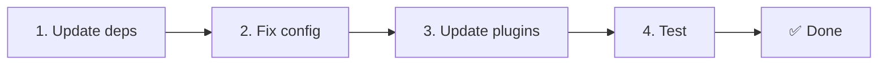

# 📦 Päivitys versiosta v2.x versioon v3.x

<Tip>
Katso [siirtymä paketista nuxt-i18n](/migration/from-nuxtjs-i18n) — se opas käsittelee siirtymistä vue-i18n-ekosysteemistä, ei nuxt-i18n-micron versiosta v2.
</Tip>

v3.0.0 tuo perustavanlaatuisia arkkitehtuurimuutoksia: strategiapaketit, uuden välimuistijärjestelmän, keskitetyn kielenhallinnan koostajan `useI18nLocale()` kautta ja uudelleensuunnitellun uudelleenohjausputken. Tämä osio kattaa kaikki rikkovat muutokset ja miten päivität koodisi.

## Siirtymän vaiheet



## Rikkovien muutosten yhteenveto

- **Kielitila** — `useState`/`useCookie` manuaalisesti → `useI18nLocale()`-koostaja
- **Konfiguraation käyttö** — `useRuntimeConfig().public.i18nConfig` → `getI18nConfig()` tiedostosta `#build/i18n.strategy.mjs`
- **Uudelleenohjauskomponentti** — `fallbackRedirectComponentPath`-asetus → palvelimen uudelleenohjausliitännäinen + asiakkaan reittivälimuisti (automaattinen)
- **`includeDefaultLocaleRoute`** — tuettu (vanhentunut) → poistettu, käytä `strategy`-asetusta
- **`experimental.hmr`** — alla `experimental` → juuritason asetus
- **`previousPageFallback`** — poistettu kokonaan (kumulatiivinen yhdistysstrategia hoitaa tämän automaattisesti)
- **Välimuistitus** — `useStorage('cache')` → `TranslationStorage`-singleton (`Symbol.for` `globalThis`-objektissa)
- **SSR-siirto** — Runtime-konfiguraatio → Nuxtin hyötykuorma (v3 käytti `useState`. Palat elävät nyt `payload.data`-objektissa. Katso [suorituskyky](/guides/performance#server-side-payload-transfer))
- **Strategialuokat** — sisäiset → erilliset paketit (`@i18n-micro/route-strategy`, `@i18n-micro/path-strategy`)

## Poistettu: `fallbackRedirectComponentPath`

`fallbackRedirectComponentPath`-asetus ja `locale-redirect.vue`-varakomponentti on poistettu. Uudelleenohjauslogiikkaa hoitavat nyt:

1. **Palvelinvälimuisti** (`i18n.global.ts`) — asettaa `event.context.i18n.locale`
2. **Palvelimen uudelleenohjausliitännäinen** (`06.redirect.ts`, vain palvelin) — 302-uudelleenohjaukset ennen renderöintiä
3. **Asiakkaan reittivälimuisti** (`i18n-redirect.global.ts`) — SPA-uudelleenohjaukset hydraation jälkeen

```diff
 i18n: {
   strategy: 'prefix_except_default',
-  fallbackRedirectComponentPath: '~/components/MyRedirect.vue',
 }
```

Jos sinulla oli mukautettu uudelleenohjauslogiikka varakomponentissa, toteuta se palvelinliitännäisessä sen sijaan:

```ts
// plugins/i18n-loader.server.ts
export default defineNuxtPlugin({
  name: 'i18n-custom-redirect',
  enforce: 'pre',
  order: -10,
  setup() {
    const { setLocale } = useI18nLocale()
    // Your custom detection logic
    setLocale(detectedLocale)
  },
})
```

## Poistettu: `includeDefaultLocaleRoute`

Käytä `strategy`-asetusta sen sijaan:

- `includeDefaultLocaleRoute: true` → `strategy: 'prefix'`
- `includeDefaultLocaleRoute: false` → `strategy: 'prefix_except_default'` (oletus)

```diff
 i18n: {
-  includeDefaultLocaleRoute: true,
+  strategy: 'prefix',
 }
```

## Konfiguraation käyttö: `getI18nConfig()` korvaa `useRuntimeConfig`

```diff
- const config = useRuntimeConfig()
- const cookieName = config.public.i18nConfig?.localeCookie || 'user-locale'
+ import { getI18nConfig } from '#build/i18n.strategy.mjs'
+ const { localeCookie: configCookie } = getI18nConfig()
+ const cookieName = configCookie ?? 'user-locale'
```

## Kielen hallinta: `useI18nLocale()` korvaa manuaalisen tilan

v2:ssa saatoit käyttää suoraan funktiota `useState('i18n-locale')` tai `useCookie('user-locale')`. v3:ssa käytä keskitettyä `useI18nLocale()`-koostajaa:

```diff
- const locale = useState('i18n-locale')
- const cookie = useCookie('user-locale')
- locale.value = 'fr'
- cookie.value = 'fr'
+ const { setLocale } = useI18nLocale()
+ setLocale('fr') // Updates both state and cookie atomically
```

Katso [mukautettu kielen tunnistus](/guides/custom-language-detection) yksityiskohtaisia esimerkkejä varten.

## Kokeelliset asetukset siirretty / poistettu

`hmr` on siirretty ryhmästä `experimental` juuritasolle. `previousPageFallback` on poistettu kokonaan. Moduuli käyttää nyt kumulatiivista syväyhdistysstrategiaa (2 tason syvyys), joka säilyttää edellisen sivun käännökset automaattisesti siirtymäanimaatioiden aikana, vaikka sivut jakaisivat päällekkäisiä sisäkkäisiä avaimia. Siirtymäanimaation valmistuttua `page:transition:finish`-koukku siivoaa vanhat sivun avaimet muistista.

```diff
 i18n: {
-  experimental: {
-    hmr: true,
-    previousPageFallback: true
-  }
+  hmr: true,
+  // previousPageFallback removed — handled automatically
 }
```

## Uudelleenohjausarkkitehtuuri (v3)

Uudelleenohjauksia hoitavat nyt automaattisesti kaksi komponenttia:

1. **Palvelinpuolella** (`06.redirect.ts`, vain palvelin): suoritetaan SSR:n aikana, tekee 302-uudelleenohjaukset ennen sivun renderöintiä. Ei "virhevälähdystä".
2. **Asiakaspuolella** (`i18n-redirect.global.ts`): globaali reittivälimuisti SPA-navigoinnissa. Säilyttää kyselymerkkijonon ja hashin.

Kielen prioriteetti uudelleenohjauksissa:

1. `useState('i18n-locale')` — asetetaan funktiolla `useI18nLocale().setLocale()`
2. Eväste — jos `localeCookie` on määritelty
3. `Accept-Language`-otsikko — jos `autoDetectLanguage: true`
4. `defaultLocale` — varakäyttö

Vakioasetuksille ei tarvita koodimuutoksia.

<Warning>
`prefix`- ja `prefix_except_default`-strategioille asetuksella `redirects: true`, aseta `localeCookie: 'user-locale'` mahdollistaaksesi kielen säilymisen sivujen uudelleenlatauksissa. Ilman sitä uudelleenohjaukset käyttävät vain `Accept-Language`-otsikkoa tai `defaultLocale`-arvoa.
</Warning>

## TypeScript: sisäiset moduulityypit (valinnainen)

Jos kohtaat tyyppivirheitä liittyen sisäisiin tuonteihin kuten `#i18n-internal/plural`, `#i18n-internal/strategy` tai `#i18n-internal/config`, lisää `imports`-osio projektisi `package.json`-tiedostoon:

```json
{
  "imports": {
    "#i18n-internal/plural": "nuxt-i18n-micro/internals",
    "#i18n-internal/strategy": "nuxt-i18n-micro/internals",
    "#i18n-internal/config": "nuxt-i18n-micro/internals"
  }
}
```
