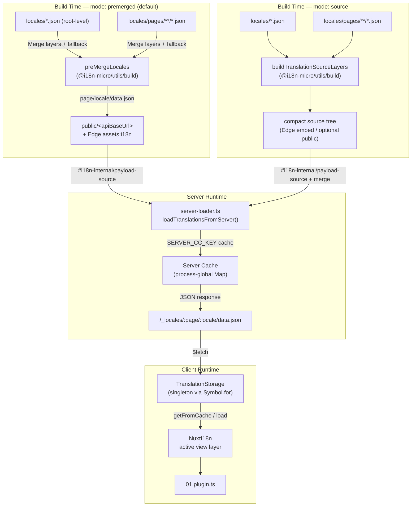

# 🗄️ Architecture du cache de traduction et du stockage

## 📖 Aperçu

Nuxt I18n Micro v3 utilise une architecture de cache multi-couches pour les traductions. Le chargement des charges utiles dépend de `translationPayloads.mode` :

- **`premerged`** (par défaut) — les fichiers racines, par page, de repli et de couches sont fusionnés à la compilation via `@i18n-micro/utils/build` dans `\{page\}/\{locale\}/data.json`
- **`source`** — les fichiers sources compacts sont conservés pour une fusion à l'exécution via `@i18n-micro/utils/source-loader` et `@i18n-micro/utils/merge-source` (Edge les intègre dans les `serverAssets` de Nitro ; Node les lit depuis `public/` lorsqu'ils y sont copiés)

Cette page décrit le fonctionnement du cache intégré et comment l'étendre pour des cas d'usage personnalisés (outils d'administration, API externes, invalidation de cache).

## 📊 Aperçu de l'architecture

### Flux de données



## 🧱 Composants principaux

### 1. `TranslationStorage` (client + serveur)

**Fichier** : `src/runtime/utils/storage.ts`

Une classe singleton qui fournit un stockage unifié des traductions pour le client et le serveur. Utilise `Symbol.for('__NUXT_I18N_STORAGE_CACHE__')` sur `globalThis` pour garantir qu'une seule instance existe, même lorsque plusieurs paquets sont chargés.

**Méthodes principales :**

| Méthode                              | Description                                                            |
| ----------------------------------- | ---------------------------------------------------------------------- |
| `getFromCache(locale, routeName?)`  | Vérification synchrone : retourne les données en cache en mémoire, ou `null`            |
| `load(locale, routeName?, options)` | Chargement asynchrone avec mise en cache : vérifie le cache d'abord, puis récupère via `$fetch` |
| `clear()`                           | Vide l'ensemble du cache                                                |

**Format de clé de cache** : `\{locale\}:\{routeName\}` (p. ex. `en:index`, `fr:about`)

```typescript
import { translationStorage } from '../utils/storage'

// Synchronous cache check
const cached = translationStorage.getFromCache('en', 'index')

// Async load (with automatic caching)
const result = await translationStorage.load('en', 'index', {
  apiBaseUrl: '_locales',
  baseURL: '/',
  dateBuild: '2024-01-01',
})
// result.data — merged translations
// result.cacheKey — cache key used
```

### ⚙️ Invalidation de cache déterministe (`i18n.dateBuild`)

Par défaut, ce module génère `dateBuild` à la compilation en utilisant `Date.now()`. Cette valeur est ensuite intégrée dans le `#build/i18n.strategy.mjs` généré et utilisée comme paramètre de requête (`?v=...`) pour invalider les caches de récupération des traductions après les recompilations.

Si vous avez besoin de compilations reproductibles (par exemple, pour améliorer le taux de succès du cache de fragments dans les déploiements progressifs), définissez une valeur stable dans `nuxt.config` :

```ts
export default defineNuxtConfig({
  i18n: {
    // Any stable string/number (git SHA, CI build number, release tag, etc.)
    dateBuild: process.env.GIT_SHA ?? 'local-dev',
  },
})
```

### 2. `loadTranslationsFromServer()` (serveur seulement)

**Fichier** : `src/runtime/server/utils/server-loader.ts`

Charge les traductions pour une langue/page et met en cache le résultat fusionné dans une `Map` `CacheControl` globale au processus, indexée par `@i18n-micro/hmr/cache-keys` (`SERVER_CC_KEY`).

Comportement : le SSR charge depuis `#i18n-internal/payload-source` — **Node** `readFile` sous `public/<apiBaseUrl>` (`\{page\}/\{locale\}/data.json` en mode premerged), **Edge** `assets:i18n`. `premerged` lit un seul fichier ; `source` fusionne racine/page/repli via `@i18n-micro/utils/source-loader`.

```typescript
import { loadTranslationsFromServer } from '../server/utils/server-loader'

// Returns { data: Translations, json: string }
const { data, json } = await loadTranslationsFromServer('en', 'index')
```

### 3. Chargement client (pas d'intégration HTML)

Les dictionnaires ne sont **pas** écrits dans `nuxtApp.payload`. Le serveur les garde en mémoire pour le rendu SSR ; le greffon client `await` `switchContext`, qui charge `/\{apiBaseUrl\}/:page/:locale/data.json`
(même posture par défaut que `@nuxtjs/i18n` avec `experimental.preload: false`).

`NuxtI18n` détient le dictionnaire de la couche de vue active utilisé par `$t()` et `$has()`. `NuxtTranslationLoader` change le contexte langue/route et fusionne les fragments dans cette couche.

### 4. Route API du serveur

**Route** : `/_locales/\{page\}/\{locale\}/data.json`

**Fichier** : `src/runtime/server/routes/i18n.ts`

Cette route Nitro sert les traductions fusionnées pour le mode de charge utile actif. Elle appelle `loadTranslationsFromServer()` et retourne le résultat sous forme de JSON.

En production, elle définit aussi :

```http
Cache-Control: public, max-age={httpCacheDuration}, immutable
```

La valeur par défaut de `httpCacheDuration` est `31536000` (1 an). C'est sûr, car les clients demandent les charges utiles avec un cache-busting `?v=\{dateBuild\}`. Définissez `httpCacheDuration: 0` pour omettre l'en-tête. L'en-tête n'est pas appliqué en développement.

## 📥 Extension : chargement de traductions personnalisé

### Lire depuis le cache (route serveur)

```ts
// server/api/i18n/load-cache.[post].ts
import { defineEventHandler, readBody } from 'h3'
import { loadTranslationsFromServer } from '#imports'

export default defineEventHandler(async (event) => {
  const { page, locale } = await readBody<{ page: string; locale: string }>(event)
  const { data } = await loadTranslationsFromServer(locale, page)
  return { locale, page, data }
})
```

### Mettre à jour les traductions (fichier + invalidation du cache)

```ts
// server/api/i18n/update.[post].ts
import { defineEventHandler, readBody, createError } from 'h3'
import { join } from 'node:path'
import { readFile, writeFile } from 'node:fs/promises'
import { deepMergeTranslations } from '@i18n-micro/utils/deep-merge'

export default defineEventHandler(async (event) => {
  const { path, updates } = await readBody<{ path: string; updates: Record<string, unknown> }>(event)

  if (!path || !updates) {
    throw createError({ statusCode: 400, statusMessage: 'Missing path or updates' })
  }

  const fullPath = join('locales', path)
  let existing: Record<string, unknown> = {}

  try {
    const content = await readFile(fullPath, 'utf-8')
    existing = JSON.parse(content) as Record<string, unknown>
  } catch {
    // File does not exist — create new
  }

  const merged = deepMergeTranslations(existing, updates)
  await writeFile(fullPath, JSON.stringify(merged, null, 2), 'utf-8')

  return { success: true, path, updated: merged }
})
```

<Tip>

</Tip>

## 🧹 Vider le cache

### Vidage programmatique du cache (client)

Utilisez la méthode intégrée `$clearCache` :

```vue
<script setup>
const { $clearCache } = useNuxtApp()

// Clears both TranslationStorage and plugin-level cache
$clearCache()
</script>
```

### Comportement du cache serveur

Le cache côté serveur (`loadTranslationsFromServer`) est global au processus et persiste jusqu'à ce que :

- Le processus serveur redémarre
- Un nouveau déploiement est détecté (valeur `dateBuild` différente)

Pour les environnements sans serveur, chaque démarrage à froid a un cache neuf.

## ⚙️ Configuration sans serveur

Pour les environnements sans serveur (Cloudflare Workers, AWS Lambda), le cache intégré utilise des objets `Map` en mémoire. Aucune configuration de stockage externe n'est nécessaire pour le cache de traduction lui-même.

Cependant, le stockage Nitro pour les fichiers sources de traduction peut nécessiter une configuration :

```ts
export default defineNuxtConfig({
  nitro: {
    storage: {
      // Only needed if default file-system storage is unavailable
      'assets:server': {
        driver: 'cloudflare-kv-binding',
        binding: 'MY_KV_NAMESPACE',
      },
    },
  },
})
```

## 💡 Différences clés par rapport à v2

| Aspect           | v2                            | v3                                                                       |
| ---------------- | ----------------------------- | ------------------------------------------------------------------------ |
| Cache client     | `useStorage('cache')`         | Singleton `TranslationStorage` (Symbol.for sur globalThis)                |
| Transfert SSR     | Configuration d'exécution                | Fragments complets via `payload.data` (v3.0 utilisait `useState`)                    |
| Cache serveur     | Stockage cache Nitro           | `Map` globale au processus via `Symbol.for`                                    |
| Logique de fusion      | Côté client                   | À la compilation (`premerged`) ou à l'exécution (`source`) via `@i18n-micro/utils/*` |
| Format de clé de cache | `i18n:merged:\{page\}:\{locale\}` | `\{locale\}:\{routeName\}`                                                   |

## 📚 Voir aussi

- [Guide de performance](/guides/performance) — comment la mise en cache influe sur les performances
- [Traductions côté serveur](/guides/server-side-translations) — utiliser les traductions dans les routes serveur
- [Déploiement Firebase](/guides/firebase) — considérations de cache propres au déploiement
