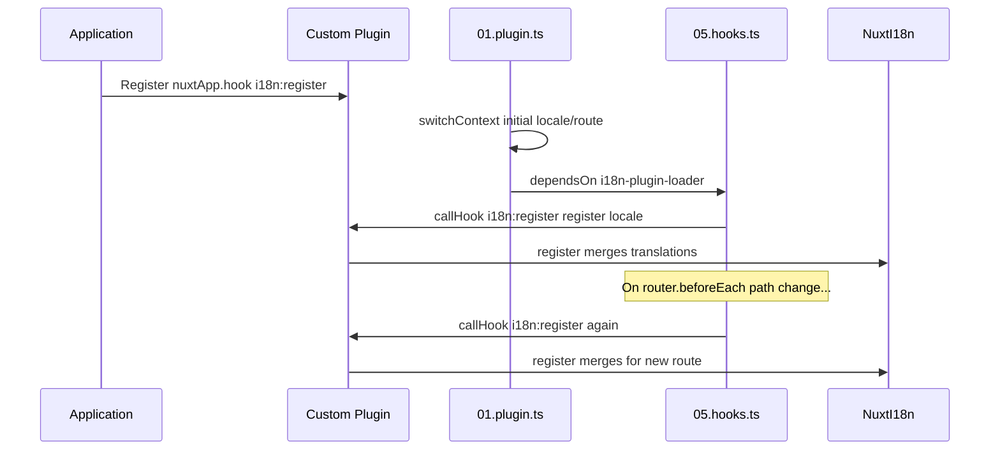

# 📢 Événements

## 🔄 `i18n:register`

L'événement `i18n:register` de `Nuxt I18n Micro` permet d'ajouter dynamiquement des traductions au contexte i18n de votre application, rendant le processus d'internationalisation fluide et flexible. Cet événement vous permet d'intégrer de nouvelles traductions au besoin, améliorant les capacités de localisation de votre application.

### 📝 Détails de l'événement

- **Objectif** :
  - Permet d'incorporer dynamiquement des traductions supplémentaires à l'ensemble existant pour une langue donnée.

- **Charge utile** :
  - **`register`** :
    - Une fonction fournie par l'événement qui prend deux arguments :
      - **`translations`** (`Translations`) :
        - Un objet contenant des paires clé-valeur représentant des traductions, organisées selon l'interface `Translations`.
      - **`locale`** (`string`, facultatif) :
        - Le code de langue (par exemple, `'en'`, `'ru'`) pour lequel les traductions sont enregistrées. Prend par défaut la langue fournie par l'événement s'il n'est pas précisé.

- **Comportement** :
  - Lorsqu'elle est déclenchée, la fonction `register` fusionne les nouvelles traductions dans le contexte courant pour la langue spécifiée, mettant à jour les traductions disponibles dans toute l'application.

### ⏱️ Quand il se déclenche

Le plugin hooks du module (`05.hooks.ts`, `dependsOn: ['i18n-plugin-loader']`) appelle `nuxtApp.callHook('i18n:register', …)` :

1. **Une fois au démarrage** : après que le plugin i18n principal (`01.plugin.ts`) a chargé les traductions pour la route initiale
2. **À la navigation** : dans `router.beforeEach` lorsque le chemin change, ou à chaque navigation quand `strategy: 'no_prefix'`

Enregistrez votre écouteur dans un plugin Nuxt normal avec `nuxtApp.hook('i18n:register', …)`. Le plugin hooks s'exécute après que le chargeur est prêt, donc votre rappel est invoqué lorsque les traductions doivent être étendues.

Définissez `hooks: false` dans `nuxt.config` pour désactiver les appels automatiques à `i18n:register` (voir [Configuration — `hooks`](/guides/configuration#hooks)).

### 💡 Exemple d'utilisation

L'exemple suivant montre comment utiliser l'événement `i18n:register` pour ajouter des traductions dynamiquement :

```typescript
nuxt.hook('i18n:register', async (register: (translations: unknown, locale?: string) => void, locale: string) => {
  register(
    {
      greeting: 'Hello',
      farewell: 'Goodbye',
    },
    locale,
  )
})
```

### 🛠️ Explication



- **Déclenchement de l'événement** :
  - Le plugin hooks (`05.hooks.ts`) déclenche `i18n:register` une fois le chargeur principal prêt et lors des navigations pertinentes.

- **Ajout de traductions** :
  - L'exemple enregistre des traductions anglaises pour `"greeting"` et `"farewell"`.
  - La fonction `register` fusionne ces traductions dans l'ensemble existant pour la langue fournie.

### 🔗 Avantages clés

- **Mises à jour dynamiques** :
  - Mettez à jour ou ajoutez des traductions facilement sans avoir à redéployer toute votre application.

- **Souplesse de localisation** :
  - Prend en charge les ajustements de localisation en temps réel selon les besoins de l'utilisateur ou de l'application.

Grâce à l'événement `i18n:register`, vous vous assurez que la stratégie de localisation de votre application reste flexible et adaptable, améliorant l'expérience utilisateur globale.

---

## 🛠️ Modifier les traductions avec des plugins

Pour modifier les traductions dynamiquement dans votre application Nuxt, l'utilisation de plugins est recommandée. Les plugins offrent une manière structurée de gérer les mises à jour de localisation, particulièrement lorsque vous travaillez avec des modules ou des fichiers de traduction externes.

### **Enregistrer le plugin**

Si vous utilisez un module, enregistrez le plugin où les modifications de traduction auront lieu en l'ajoutant à la configuration de votre module :

```javascript
addPlugin({
  src: resolve('./plugins/extend_locales'),
})
```

Cela enregistre le plugin situé à `./plugins/extend_locales`, qui gérera le chargement dynamique et l'enregistrement des traductions.

### **Implémenter le plugin**

Dans le plugin, vous pouvez gérer les modifications de langue. Voici un exemple d'implémentation dans un plugin Nuxt :

```typescript
import { defineNuxtPlugin } from '#app'

export default defineNuxtPlugin(async (nuxtApp) => {
  // Function to load translations from JSON files and register them
  const loadTranslations = async (lang: string) => {
    try {
      const translations = await import(`../locales/${lang}.json`)
      return translations.default
    } catch (error) {
      console.error(`Error loading translations for language: ${lang}`, error)
      return null
    }
  }

  // Hook into the 'i18n:register' event to dynamically add translations
  // eslint-disable-next-line @typescript-eslint/ban-ts-comment
  // @ts-expect-error
  nuxtApp.hook('i18n:register', async (register: (translations: unknown, locale?: string) => void, locale: string) => {
    const translations = await loadTranslations(locale)
    if (translations) {
      register(translations, locale)
    }
  })
})
```

### 📝 Explication détaillée

1. **Chargement des traductions** :

- La fonction `loadTranslations` importe dynamiquement les fichiers de traduction selon la langue. Les fichiers sont attendus dans le répertoire `locales`, nommés d'après les codes de langue (par exemple, `en.json`, `de.json`).
- En cas de succès, les traductions sont retournées; sinon, une erreur est journalisée.

2. **Enregistrement des traductions** :

- Le plugin s'accroche à l'événement `i18n:register` avec `nuxtApp.hook`.
- Lorsque l'événement est déclenché, la fonction `register` est appelée avec les traductions chargées et la langue correspondante.
- Cela fusionne les nouvelles traductions dans le contexte i18n pour la langue spécifiée, mettant à jour les traductions disponibles dans toute l'application.

### 🔗 Avantages d'utiliser des plugins pour les modifications de traduction

- **Séparation des responsabilités** :
  - Encapsulez la logique de localisation séparément du code principal de l'application, ce qui facilite la gestion et la maintenance.

- **Dynamique et évolutif** :
  - En chargeant et en enregistrant les traductions dynamiquement, vous pouvez mettre à jour le contenu sans redéployer complètement l'application, ce qui est particulièrement utile pour les applications au contenu fréquemment mis à jour ou multilingue.

- **Souplesse de localisation accrue** :
  - Les plugins vous permettent de modifier ou d'étendre les traductions au besoin, offrant une stratégie de localisation plus adaptable et réactive répondant aux préférences des utilisateurs ou aux exigences métier.

En adoptant cette approche, vous pouvez étendre et modifier efficacement la localisation de votre application par un processus structuré et maintenable via des plugins, gardant l'internationalisation adaptée aux besoins changeants et améliorant l'expérience utilisateur globale.
