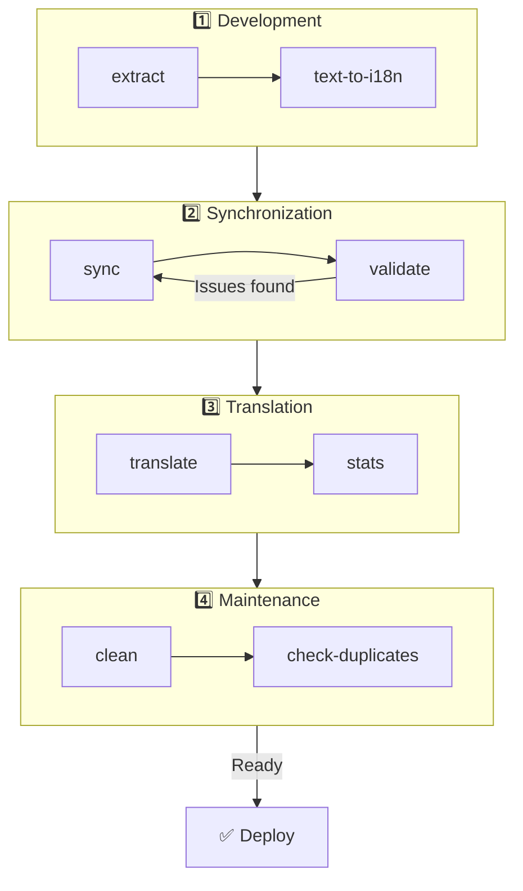

# 🌐 Guide nuxt-i18n-micro-cli

## 📖 Introduction

`nuxt-i18n-micro-cli` est un outil en ligne de commande conçu pour rationaliser le processus de localisation et d'internationalisation dans les projets Nuxt.js utilisant le module `nuxt-i18n-micro` (Nuxt I18n Micro). Il fournit des utilitaires pour extraire les clés de traduction de votre base de code, gérer les fichiers de traduction, synchroniser les traductions entre langues et automatiser le processus de traduction avec des services de traduction externes.

Ce guide vous accompagne pour installer, configurer et utiliser `nuxt-i18n-micro-cli` afin de gérer efficacement les traductions de votre projet. Paquet sur [npmjs.com](https://www.npmjs.com/package/nuxt-i18n-micro-cli).

## 🔧 Installation et configuration

### 📦 Installer nuxt-i18n-micro-cli

Installez globalement ou comme dépendance de développement dans votre projet Nuxt (recommandé pour IC) :

```bash
# global
npm install -g nuxt-i18n-micro-cli

# or per project
pnpm add -D nuxt-i18n-micro-cli
pnpm exec i18n-micro text-to-i18n --dryRun
```

Utilisez **`nuxt-i18n-micro-cli` ≥ 2.1.1** si votre projet utilise le répertoire `app/` de Nuxt 4 (`app/pages`, `app/components`, …). Les anciennes versions du CLI n'analysaient que `pages/` à la racine du projet.

### 🛠 Initialisation dans votre projet

Après l'installation, vous pouvez exécuter les commandes `i18n-micro` dans le répertoire de votre projet Nuxt.js.

Assurez-vous que votre projet est configuré avec `nuxt-i18n-micro` et possède la configuration nécessaire dans `nuxt.config.ts` (ou `nuxt.config.js`).

### 📄 Arguments courants

- `--cwd` : spécifiez le répertoire de travail courant (défaut : `.`).
- `--logLevel` : définissez le niveau de journalisation (`silent`, `info`, `verbose`).
- `--translationDir` : répertoire contenant les fichiers JSON de traduction (défaut : `locales`).

## 📊 Aperçu du flux CLI



### Étapes du flux

| Phase           | Commandes                    | But                                     |
| --------------- | --------------------------- | --------------------------------------- |
| **Développement** | `extract`, `text-to-i18n`   | Trouver et extraire les clés de traduction |
| **Sync**        | `sync`, `validate`          | S'assurer que toutes les langues ont les mêmes clés |
| **Traduire**    | `translate`, `stats`        | Traduire automatiquement les clés manquantes |
| **Maintenance** | `clean`, `check-duplicates` | Garder les traductions ordonnées         |

## 📋 Commandes

### 🔄 Commande `text-to-i18n`

Paquet CLI : [`nuxt-i18n-micro-cli`](https://www.npmjs.com/package/nuxt-i18n-micro-cli)

**Description** : analyse les fichiers Vue/TS/JS pour trouver les chaînes codées en dur destinées à l'utilisateur, les remplace par `$t('...')` et fusionne les nouvelles clés dans votre fichier JSON de traduction. Exécutez depuis la **racine du projet Nuxt** (où réside `nuxt.config`).

**Usage** :

```bash
i18n-micro text-to-i18n [options]
```

**Options** :

| Option                  | Défaut            | Description                                                           |
| ----------------------- | ----------------- | --------------------------------------------------------------------- |
| `--translationFile`     | `locales/en.json` | Fichier JSON pour les nouvelles clés (relatif à la racine du projet).  |
| `--path`                | —                 | Traiter un seul fichier ou répertoire (par exemple, `app/pages/about.vue`). |
| `--context`             | —                 | Préfixe de clé (par exemple, `auth` → `auth.*`).                     |
| `--dryRun`              | `false`           | Aperçu sans écrire les fichiers.                                      |
| `--verbose`             | `false`           | Journalisation supplémentaire.                                         |
| `--interactive`         | `false`           | Confirmer ou modifier chaque clé avant application.                    |
| `--extractOnlyDirs`     | `plugins`         | Répertoires où les clés sont extraites mais les fichiers sources ne sont **pas** réécrits. |
| `--extractOnlyPatterns` | —                 | Motifs style glob à extraction seulement (par exemple, `**/*.plugin.ts`). |

**Exemple** :

```bash
i18n-micro text-to-i18n --translationFile locales/en.json --context auth --dryRun
```

#### Quels dossiers sont analysés ?

<Info>
Depuis le CLI **v2.1.1**, `text-to-i18n` analyse à la fois les dossiers racines classiques et leurs équivalents `app/*`. Exécutez la commande depuis la **racine du projet**. Ne faites pas `cd app`.
</Info>

Collecte `*.vue`, `*.js` et `*.ts` sous :

| Nuxt 3 (racine du projet) | Nuxt 4 (répertoire `app/`) |
| --------------------- | ------------------------- |
| `pages/`              | `app/pages/`              |
| `components/`         | `app/components/`         |
| `plugins/`            | `app/plugins/`            |
| `layouts/`            | `app/layouts/`            |

Les autres dossiers (`server/`, `composables/`, `middleware/`, …) sont ignorés sauf si vous utilisez `--path`. Pour Nuxt 4, exécutez depuis la racine du projet (pas besoin de `cd app`). Alignez `i18n.translationDir` dans `--translationFile` s'il n'est pas `locales/`.

```bash
i18n-micro text-to-i18n --path app/pages
```

#### Comment ça fonctionne

1. Collecter les fichiers depuis les répertoires ci-dessus (ou depuis `--path`).
2. Remplacer les littéraux / texte de modèle par `$t('generated.key')` (`plugins/` est à extraction seulement par défaut).
3. Fusionner les nouvelles clés dans `--translationFile` sans retirer les entrées existantes.

**Exemples de transformation** :

Avant :

```vue
<template>
  <div>
    <h1>Welcome to our site</h1>
    <p>Please sign in to continue</p>
  </div>
</template>
```

Après :

```vue
<template>
  <div>
    <h1>{{ $t('pages.home.welcome_to_our_site') }}</h1>
    <p>{{ $t('pages.home.please_sign_in') }}</p>
  </div>
</template>
```

**Bonnes pratiques** : faites d'abord un dry run; validez avant une exécution complète; alignez `--translationFile` avec `i18n.translationDir` dans `nuxt.config`; gardez `--extractOnlyDirs plugins` pour le code d'amorçage.

**Limites** : paquet npm séparé (non intégré au module); ne lit pas `nuxt.config` automatiquement; sort `$t(...)`; les chaînes dynamiques complexes peuvent nécessiter plutôt `extract` / `search`.

### 📊 Commande `stats`

**Description** : la commande `stats` sert à afficher des statistiques de traduction pour chaque langue de votre projet Nuxt.js. Elle vous aide à comprendre l'avancement de vos traductions en montrant combien de clés sont traduites par rapport au nombre total de clés disponibles.

**Usage** :

```bash
i18n-micro stats [options]
```

**Options** :

- `--full` : afficher uniquement les statistiques combinées des traductions (défaut : `false`).

**Exemple** :

```bash
i18n-micro stats --full
```

### 🌍 Commande `translate`

**Description** : la commande `translate` traduit automatiquement les clés manquantes à l'aide de services de traduction externes. Cette commande simplifie le processus de traduction en tirant parti des API de services comme Google Translate, DeepL et d'autres pour remplir les traductions manquantes.

**Usage** :

```bash
i18n-micro translate [options]
```

**Options** :

- `--service` : service de traduction à utiliser (par exemple, `google`, `deepl`, `yandex`). Si non spécifié, la commande vous demandera d'en sélectionner un.
- `--token` : clé API correspondant au service de traduction choisi. Si non fournie, on vous demandera de la saisir.
- `--options` : options supplémentaires pour le service de traduction, fournies comme paires clé:valeur, séparées par des virgules (par exemple, `model:gpt-3.5-turbo,max_tokens:1000`).
- `--replace` : traduire toutes les clés, en remplaçant les traductions existantes (défaut : `false`).

**Exemple** :

```bash
i18n-micro translate --service deepl --token YOUR_DEEPL_API_KEY
```

#### 🌐 Services de traduction pris en charge

La commande `translate` prend en charge plusieurs services de traduction. Voici quelques-uns des services pris en charge :

- **Google Translate** (`google`)
- **DeepL** (`deepl`)
- **Yandex Translate** (`yandex`)
- **OpenAI** (`openai`)
- **Azure Translator** (`azure`)
- **IBM Watson** (`ibm`)
- **Baidu Translate** (`baidu`)
- **LibreTranslate** (`libretranslate`)
- **MyMemory** (`mymemory`)
- **Lingva Translate** (`lingvatranslate`)
- **Papago** (`papago`)
- **Tencent Translate** (`tencent`)
- **Systran Translate** (`systran`)
- **Yandex Cloud Translate** (`yandexcloud`)
- **ModernMT** (`modernmt`)
- **Lilt** (`lilt`)
- **Unbabel** (`unbabel`)
- **Reverso Translate** (`reverso`)

#### ⚙️ Configuration du service

Certains services requièrent des configurations spécifiques ou des clés API. En utilisant la commande `translate`, vous pouvez spécifier le service et fournir le `--token` (clé API) requis et des `--options` supplémentaires au besoin.

Par exemple :

```bash
i18n-micro translate --service openai --token YOUR_OPENAI_API_KEY --options openaiModel:gpt-3.5-turbo,max_tokens:1000
```

### 🛠️ Commande `extract`

**Description** : extrait les clés de traduction de votre base de code et les organise par portée.

**Usage** :

```bash
i18n-micro extract [options]
```

**Options** :

- `--prod, -p` : exécuter en mode production.

**Exemple** :

```bash
i18n-micro extract
```

### 🔄 Commande `sync`

**Description** : synchronise les fichiers de traduction entre langues, en s'assurant que toutes les langues ont les mêmes clés.

**Usage** :

```bash
i18n-micro sync [options]
```

**Exemple** :

```bash
i18n-micro sync
```

### ✅ Commande `validate`

**Description** : valide les fichiers de traduction pour repérer les clés manquantes ou supplémentaires par rapport à la langue de référence.

**Usage** :

```bash
i18n-micro validate [options]
```

**Exemple** :

```bash
i18n-micro validate
```

### 🧹 Commande `clean`

**Description** : retire les clés de traduction inutilisées des fichiers de traduction.

**Usage** :

```bash
i18n-micro clean [options]
```

**Exemple** :

```bash
i18n-micro clean
```

### 📤 Commande `import`

**Description** : convertit les fichiers PO en format JSON et les enregistre dans le répertoire de traduction.

**Usage** :

```bash
i18n-micro import [options]
```

**Options** :

- `--potsDir` : répertoire contenant les fichiers PO (défaut : `pots`).

**Exemple** :

```bash
i18n-micro import --potsDir pots
```

### 📥 Commande `export`

**Description** : exporte les traductions vers des fichiers PO pour la gestion externe des traductions.

**Usage** :

```bash
i18n-micro export [options]
```

**Options** :

- `--potsDir` : répertoire pour enregistrer les fichiers PO (défaut : `pots`).

**Exemple** :

```bash
i18n-micro export --potsDir pots
```

### 🗂️ Commande `export-csv`

**Description** : la commande `export-csv` exporte les clés et valeurs de traduction des fichiers JSON, incluant leurs chemins de fichiers, dans un format CSV. Cette commande est utile pour les équipes qui préfèrent travailler avec des données de traduction dans un tableur.

**Usage** :

```bash
i18n-micro export-csv [options]
```

**Options** :

- `--csvDir` : répertoire où les fichiers CSV exportés seront enregistrés.
- `--delimiter` : spécifiez un délimiteur pour le fichier CSV (défaut : `,`).

**Exemple** :

```bash
i18n-micro export-csv --csvDir csv_files
```

### 📑 Commande `import-csv`

**Description** : la commande `import-csv` importe des données de traduction depuis des fichiers CSV, en mettant à jour les fichiers JSON correspondants. C'est utile pour appliquer des mises à jour de traduction en lot à partir de tableurs.

**Usage** :

```bash
i18n-micro import-csv [options]
```

**Options** :

- `--csvDir` : répertoire contenant les fichiers CSV à importer.
- `--delimiter` : spécifiez le délimiteur utilisé dans le fichier CSV (défaut : `,`).

**Exemple** :

```bash
i18n-micro import-csv --csvDir csv_files
```

### 🧾 Commande `diff`

**Description** : compare les fichiers de traduction entre la langue par défaut et les autres langues du même répertoire (y compris les sous-répertoires). La commande identifie les clés manquantes et leurs valeurs dans la langue par défaut par rapport aux autres langues, ce qui facilite le suivi des progrès ou des écarts de traduction.

**Usage** :

```bash
i18n-micro diff [options]
```

**Exemple** :

```bash
i18n-micro diff
```

### 🔍 Commande `check-duplicates`

**Description** : la commande `check-duplicates` vérifie les valeurs de traduction dupliquées dans chaque langue à travers tous les fichiers de traduction, incluant les traductions à la racine et propres aux pages. Elle s'assure que différentes clés dans la même langue ne partagent pas des valeurs de traduction identiques, aidant à maintenir la clarté et la cohérence de vos traductions.

**Usage** :

```bash
i18n-micro check-duplicates [options]
```

**Exemple** :

```bash
i18n-micro check-duplicates
```

**Comment ça fonctionne** :

- La commande vérifie les fichiers de traduction à la racine et propres aux pages pour chaque langue.
- Si une valeur de traduction apparaît à plusieurs endroits (soit dans les traductions à la racine, soit dans différentes pages), elle rapporte les valeurs dupliquées avec le fichier et la clé où elles sont trouvées.
- Si aucun doublon n'est trouvé, la commande confirme que la langue est exempte de valeurs de traduction dupliquées.

Cette commande aide à s'assurer que les clés de traduction maintiennent des valeurs uniques, évitant les répétitions accidentelles dans la même langue.

### 🔄 Commande `replace-values`

**Description** : la commande `replace-values` vous permet d'effectuer des remplacements en lot de valeurs de traduction dans toutes les langues. Elle prend en charge à la fois les remplacements de texte simples et les remplacements avancés utilisant des expressions régulières (regex). Vous pouvez aussi utiliser des groupes de capture dans les motifs regex et les référencer dans la chaîne de remplacement, ce qui est idéal pour des scénarios de remplacement plus complexes.

**Usage** :

```bash
i18n-micro replace-values [options]
```

**Options** :

- `--search` : le texte ou motif regex à rechercher dans les traductions. C'est une option obligatoire.
- `--replace` : le texte de remplacement à utiliser pour les traductions trouvées. C'est une option obligatoire.
- `--useRegex` : activer la recherche avec un motif d'expression régulière (défaut : `false`).

**Exemple 1** : remplacement simple

Remplacer la chaîne « Hello » par « Hi » dans toutes les langues :

```bash
i18n-micro replace-values --search "Hello" --replace "Hi"
```

**Exemple 2** : remplacement par regex

Activer la recherche regex et remplacer toute chaîne commençant par « Hello » suivi de chiffres (par exemple, « Hello123 ») par « Hi » dans toutes les langues :

```bash
i18n-micro replace-values --search "Hello\\d+" --replace "Hi" --useRegex
```

**Exemple 3** : utilisation de groupes de capture regex

Utilisez des groupes de capture pour insérer dynamiquement une partie de la chaîne correspondante dans le remplacement. Par exemple, remplacer « Hello [name] » par « Hi [name] » tout en gardant le nom intact :

```bash
i18n-micro replace-values --search "Hello (\\w+)" --replace "Hi $1" --useRegex
```

Dans ce cas, `$1` fait référence au premier groupe de capture, qui correspond à la partie `[name]` après « Hello ». Le remplacement conservera le nom de la chaîne d'origine.

**Comment ça fonctionne** :

- La commande parcourt tous les fichiers de traduction (globaux et propres aux pages).
- Lorsqu'une correspondance est trouvée selon la chaîne de recherche ou le motif regex, elle remplace le texte correspondant par le remplacement fourni.
- Avec regex, les groupes de capture peuvent être utilisés dans la chaîne de remplacement en les référençant avec `$1`, `$2`, etc.
- Tous les changements sont journalisés, montrant le chemin de fichier, la clé de traduction et l'état avant/après de la valeur de traduction.

**Journalisation** :
Pour chaque remplacement, la commande journalise des détails incluant :

- La langue et le chemin du fichier
- La clé de traduction modifiée
- L'ancienne valeur et la nouvelle valeur après remplacement
- Avec regex et groupes de capture, les journaux montreront les correspondances de groupes et comment elles ont été remplacées.

Cela vous permet de suivre exactement où et quels changements ont été effectués durant l'opération de remplacement, offrant un historique clair des modifications dans vos fichiers de traduction.

## 🛠 Exemples

- **Extraire les traductions** :

  ```bash
  i18n-micro extract
  ```

- **Traduire les clés manquantes avec Google Translate** :

  ```bash
  i18n-micro translate --service google --token YOUR_GOOGLE_API_KEY
  ```

- **Traduire toutes les clés en remplaçant les traductions existantes** :

  ```bash
  i18n-micro translate --service deepl --token YOUR_DEEPL_API_KEY --replace
  ```

- **Valider les fichiers de traduction** :

  ```bash
  i18n-micro validate
  ```

- **Nettoyer les clés de traduction inutilisées** :

  ```bash
  i18n-micro clean
  ```

- **Synchroniser les fichiers de traduction** :

  ```bash
  i18n-micro sync
  ```

## ⚙️ Guide de configuration

`nuxt-i18n-micro-cli` s'appuie sur votre configuration i18n Nuxt.js dans `nuxt.config.ts` (ou `nuxt.config.js`). Assurez-vous d'avoir le module `nuxt-i18n-micro` installé et configuré.

### 🔑 Exemple de nuxt.config.js

```ts
export default defineNuxtConfig({
  modules: ['nuxt-i18n-micro'],
  i18n: {
    locales: [
      { code: 'en', iso: 'en-US' },
      { code: 'fr', iso: 'fr-FR' },
    ],
    defaultLocale: 'en',
    fallbackLocale: 'en',
    translationDir: 'locales', // or 'app/locales' for Nuxt 4 colocation
  },
})
```

Assurez-vous que `translationDir` correspond au répertoire utilisé par `nuxt-i18n-micro-cli` (défaut : `locales`).

## 📝 Bonnes pratiques

### 🔑 Nommage cohérent des clés

Assurez-vous que les clés de traduction sont cohérentes et descriptives pour éviter confusion et duplication.

### 🧹 Entretien régulier

Utilisez régulièrement la commande `clean` pour retirer les clés de traduction inutilisées et garder vos fichiers de traduction propres.

### 🛠 Automatiser le flux de traduction

Intégrez les commandes de `nuxt-i18n-micro-cli` à votre flux de développement ou à votre pipeline d'IC/DC pour automatiser l'extraction, la traduction, la validation et la synchronisation des fichiers de traduction.

### 🛡️ Sécuriser les clés API

En utilisant des services de traduction qui nécessitent des clés API, assurez-vous que vos clés restent sécurisées et ne sont pas versionnées dans un système de contrôle de version. Envisagez d'utiliser des variables d'environnement ou des solutions sécurisées de gestion de clés.

## 📞 Soutien et contributions

Si vous rencontrez des problèmes ou avez des suggestions d'amélioration, n'hésitez pas à contribuer au projet ou à ouvrir un ticket sur le dépôt du projet.

---

En suivant ce guide, vous pourrez gérer efficacement les traductions dans votre projet Nuxt.js avec `nuxt-i18n-micro-cli`, rationalisant vos efforts d'internationalisation et garantissant une expérience fluide aux utilisateurs de différentes langues.
