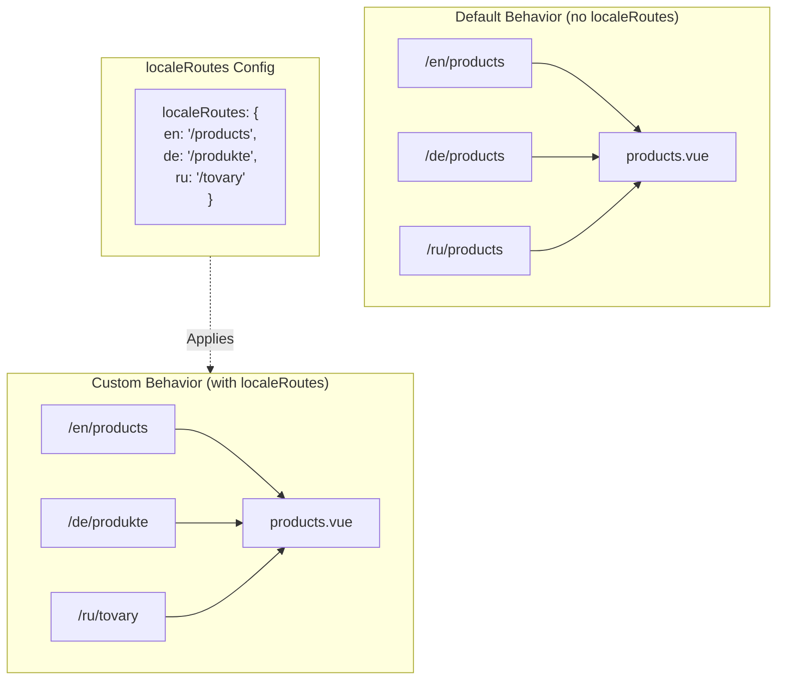

# 🔗 Routes localisées personnalisées avec `localeRoutes` dans `Nuxt I18n Micro`

## 📖 Introduction à `localeRoutes`

La fonctionnalité `localeRoutes` dans `Nuxt I18n Micro` vous permet de définir des routes personnalisées pour des langues spécifiques, offrant flexibilité et contrôle sur la structure de routage de votre application. Cette fonctionnalité est particulièrement utile lorsque certaines langues nécessitent des structures d'URL différentes, des chemins adaptés ou doivent suivre des conventions régionales ou linguistiques précises.

## 🚀 Cas d'utilisation principal de `localeRoutes`

Le cas d'utilisation principal de `localeRoutes` est de fournir des routes distinctes pour différentes langues, améliorant l'expérience utilisateur en s'assurant que les URL sont intuitives et pertinentes pour le public visé. Par exemple, vous pouvez avoir différents chemins pour les versions anglaise et russe d'une page, la langue russe suivant un format d'URL localisé.

### 📄 Exemple : définir `localeRoutes` dans `$defineI18nRoute`

Voici un exemple de définition de routes personnalisées pour des langues spécifiques avec `localeRoutes` dans votre fonction `$defineI18nRoute` :

```typescript
import { useNuxtApp } from '#imports'

const { $defineI18nRoute } = useNuxtApp()

$defineI18nRoute({
  localeRoutes: {
    ru: '/localesubpage', // Custom route path for the Russian locale
    de: '/lokaleseite', // Custom route path for the German locale
  },
})
```

> [!IMPORTANT]
> `$defineI18nRoute` n'est pas une fonction globale. Dans `script setup`, récupérez-la d'abord depuis `useNuxtApp()`, puis appelez-la.

### 🔄 Comment fonctionnent les `localeRoutes`



- **Comportement par défaut** : sans `localeRoutes`, toutes les langues utilisent une structure de route commune définie par le chemin principal.
- **Comportement personnalisé** : avec `localeRoutes`, certaines langues peuvent avoir leurs propres routes, remplaçant le chemin par défaut par des routes propres à chaque langue définies dans la configuration.

## 🌱 Cas d'utilisation pour `localeRoutes`

### 📄 Exemple : utiliser `localeRoutes` dans une page

Voici un composant Vue simple démontrant l'utilisation de `$defineI18nRoute` avec `localeRoutes` :

```vue
<template>
  <div>
    <!-- Display greeting message based on the current locale -->
    <p>{{ $t('greeting') }}</p>

    <!-- Navigation links -->
    <div>
      <NuxtLink :to="$localeRoute({ name: 'index' })"> Go to Index </NuxtLink>
      |
      <NuxtLink :to="$localeRoute({ name: 'about' })"> Go to About Page </NuxtLink>
    </div>
  </div>
</template>

<script setup>
import { useNuxtApp } from '#imports'

const { $getLocale, $switchLocale, $getLocales, $localeRoute, $t, $defineI18nRoute } = useNuxtApp()

// Define translations and custom routes for specific locales
$defineI18nRoute({
  localeRoutes: {
    ru: '/localesubpage', // Custom route path for Russian locale
  },
})
</script>
```

### 🛠️ Utiliser `localeRoutes` dans différents contextes

- **Pages de destination** : utilisez des routes personnalisées pour localiser les URL des pages de destination, en s'assurant qu'elles s'alignent avec les campagnes de marketing.
- **Sites de documentation** : fournissez des routes distinctes pour chaque langue pour mieux correspondre à la structure de contenu localisée.
- **Sites de commerce en ligne** : adaptez les URL de produits ou de catégories par langue pour améliorer le SEO et l'expérience utilisateur.

## Navigation avec `localeRoutes`

Comme les routes localisées ne correspondent pas directement à des noms de fichiers dans le répertoire des pages, vous devez référencer votre navigation par objet plutôt que par nom.

```vue
<template>
  /**
   * Exemple page: /pages/about-us.vue
   * EN /about-us
   * ES /sobre-nosotros
   * FR /a-propos
   */

  // Using NuxtLink
  <NuxtLink :to="$localeRoute({ name: 'about-us' })">
    Go to About Page
  </NuxtLink>

  // Using I18nLink
  <I18nLink :to="{ name: 'about-us' }">
    Go to About Page
  </NuxtLink>

  // The string literal navigation wouldn't work for any locale but english
  <I18nLink to="/about-us">
    Go to About Page
  </NuxtLink>
</template>
```

### Nommage des pages imbriquées

Par défaut, vos pages sont nommées selon leur nom de fichier et de chemin. Voici ce que cela signifie :

- `/pages/about-us.vue` est accessible avec `$localeRoute(\{ name: 'about-us' \})`
- `/pages/about-us/physical-stores.vue` est accessible avec `$localeRoute(\{ name: 'about-us-physical-stores' \})`

Pour surcharger ce comportement, nommez explicitement votre page avec `definePageMeta`.

```vue
// /pages/about-us/physical-stores.vue
<script setup>
definePageMeta({
  name: 'our-stores'
})
```

Cette page peut maintenant être référencée avec `$localeRoute` ou `I18nLink` par son nom `:to='\{ name: "our-stores" \}'`.

## 🎯 Routes dynamiques avec slugs et `$setI18nRouteParams`

Lorsque vous travaillez avec des routes dynamiques contenant des slugs ou des paramètres, vous pouvez utiliser `localeRoutes` avec des segments dynamiques et `$setI18nRouteParams` pour fournir des slugs propres à chaque langue.

### Paramètres de route dynamiques dans `localeRoutes`

Vous pouvez définir des routes dynamiques avec la syntaxe de paramètres de route de Nuxt (`[...slug]` pour les routes fourre-tout, `[param]` pour les paramètres uniques, ou `:param()` pour les paramètres nommés) :

```vue
<script setup lang="ts">
import { useNuxtApp, useRoute, useFetch, createError } from '#imports'

const { $defineI18nRoute, $setI18nRouteParams } = useNuxtApp()

// Define custom routes with dynamic segments
$defineI18nRoute({
  localeRoutes: {
    en: '/our-products/[...slug]',
    es: '/nuestros-productos/[...slug]',
  },
})
</script>
```

### Définir des paramètres de route propres à chaque langue

La fonction `$setI18nRouteParams` vous permet de définir différentes valeurs de paramètres (comme les slugs) pour chaque langue. C'est particulièrement utile quand votre contenu a des URL propres à chaque langue.

**Important** : `$setI18nRouteParams` doit être appelée après la récupération des données qui contiennent les slugs propres aux langues, généralement dans `useFetch` ou `useAsyncData`.

```vue
<script setup lang="ts">
import { useNuxtApp, useRoute, useFetch, createError } from '#imports'

interface Product {
  title: string
  price: string
  urlEn: string // English slug
  urlEs: string // Spanish slug
}

const { $defineI18nRoute, $setI18nRouteParams } = useNuxtApp()

const route = useRoute()
const slug = Array.isArray(route.params.slug) ? route.params.slug[0] : route.params.slug

// Fetch product data that includes locale-specific slugs
const { data: product, error } = await useFetch<Product>(`/api/product/${slug}`)
if (error.value)
  throw createError({
    statusCode: error.value?.statusCode,
    statusMessage: error.value?.statusMessage,
    fatal: true,
  })

// Define custom routes with dynamic segments
$defineI18nRoute({
  localeRoutes: {
    en: '/our-products/[...slug]',
    es: '/nuestros-productos/[...slug]',
  },
})

// Set different slugs for different locales
if (product.value) {
  $setI18nRouteParams({
    en: { slug: product.value.urlEn },
    es: { slug: product.value.urlEs },
  })
}
</script>
```

### Exemple complet : pages de produits avec slugs propres à chaque langue

Voici un exemple complet montrant comment utiliser `localeRoutes` et `$setI18nRouteParams` ensemble pour une page de détails de produit :

```vue
<template>
  <div v-if="product">
    <h1>{{ product.title }}</h1>
    <p>{{ $t('price') }}: {{ product.price }}</p>
    <div class="locale-switcher">
      <a :href="$switchLocalePath('en')">English</a>
      <a :href="$switchLocalePath('es')">Español</a>
    </div>
  </div>
</template>

<script setup lang="ts">
import { useNuxtApp, useRoute, useFetch, createError } from '#imports'

interface Product {
  title: string
  price: string
  urlEn: string
  urlEs: string
}

const { $t, $defineI18nRoute, $setI18nRouteParams, $switchLocalePath } = useNuxtApp()

// Set page name for easier navigation
definePageMeta({ name: 'product-slug' })

const route = useRoute()
const slug = Array.isArray(route.params.slug) ? route.params.slug[0] : route.params.slug

// Fetch product data
const { data: product, error } = await useFetch<Product>(`/api/product/${slug}`)
if (error.value)
  throw createError({
    statusCode: error.value?.statusCode,
    statusMessage: error.value?.statusMessage,
    fatal: true,
  })

// Define locale-specific routes with dynamic segments
$defineI18nRoute({
  localeRoutes: {
    en: '/our-products/[...slug]',
    es: '/nuestros-productos/[...slug]',
  },
})

// Set locale-specific slugs so $switchLocalePath works correctly
if (product.value) {
  $setI18nRouteParams({
    en: { slug: product.value.urlEn },
    es: { slug: product.value.urlEs },
  })
}
</script>
```

### Exemple : page de liste de produits

Lorsque vous liez vers des routes dynamiques depuis une page de liste, utilisez le nom de la route avec des paramètres :

```vue
<template>
  <div>
    <h1>{{ $t('title') }}</h1>
    <ul>
      <li v-for="product in products?.[$getLocale()] || []" :key="product.id">
        <I18nLink :to="{ name: 'product-slug', params: { slug: product.url } }"> {{ product.title }} – {{ product.price }} </I18nLink>
      </li>
    </ul>
  </div>
</template>

<script setup lang="ts">
import { useNuxtApp, useFetch, createError } from '#imports'

interface Product {
  id: string
  title: string
  price: string
  url: string
}

type ProductsByLocale = Record<string, Product[]>

const { $t, $defineI18nRoute, $getLocale } = useNuxtApp()

const { data: products, error } = await useFetch<ProductsByLocale>('/api/product')
if (error.value)
  throw createError({
    statusCode: error.value?.statusCode,
    statusMessage: error.value?.statusMessage,
    fatal: true,
  })

$defineI18nRoute({
  locales: {
    en: {
      title: 'Our Product Range',
      description: 'Discover our collection of high-quality products.',
    },
    es: {
      title: 'Nuestra Gama de Productos',
      description: 'Descubra nuestra colección de productos de alta calidad.',
    },
  },
  localeRoutes: {
    en: '/our-products',
    es: '/nuestros-productos',
  },
})
</script>
```

### Comment ça fonctionne

1. **Définition de la route** : `localeRoutes` définit la structure de chemin de base pour chaque langue, incluant les segments dynamiques comme `[...slug]` ou `[id]`.

2. **Définition des paramètres** : `$setI18nRouteParams` définit les valeurs réelles des paramètres pour chaque langue. Lorsqu'un utilisateur change de langue avec `$switchLocalePath`, le module utilise ces paramètres pour construire l'URL correcte.

3. **Format des paramètres** : l'objet de paramètres doit correspondre à la structure :

   ```typescript
   {
     [localeCode]: {
       [paramName]: paramValue
     }
   }
   ```

4. **Navigation** : utilisez `I18nLink` ou `$localeRoute` avec le nom de la route et les paramètres pour naviguer entre les versions localisées des routes dynamiques.

### Notes importantes

- **Chronologie** : `$setI18nRouteParams` doit être appelée après la récupération des données qui contiennent les slugs propres aux langues, généralement dans `useFetch` ou `useAsyncData`.

- **Noms de paramètres** : les noms de paramètres dans `$setI18nRouteParams` doivent correspondre aux noms de paramètres de route (par exemple, `slug` pour `[...slug]` ou `id` pour `[id]`).

- **Noms de routes** : lorsque vous utilisez `definePageMeta(\{ name: 'route-name' \})`, utilisez ce nom pour lier vers la route avec `I18nLink` ou `$localeRoute`.

- **Routes fourre-tout** : pour les routes fourre-tout (`[...slug]`), le paramètre slug doit être un tableau ou une chaîne qui sera convertie en tableau.

## 🧩 Routes programmatiques (`pages:extend`) — #244

Les routes créées dans `pages:extend` n'ont pas de place pour `defineI18nRoute()`, et plusieurs routes partagent souvent une SFC d'enveloppe. L'analyse indexée par fichier les regroupe alors sur une seule entrée.

Ne mettez **pas** les chemins localisés dans `route.meta` (ils seraient embarqués dans la table de routes client). Gardez un seul registre et projetez-le deux fois :

1. dans `pages:extend` (crée les routes Nuxt)
2. dans `i18n.globalLocaleRoutes` indexé par **nom** de route (pas par chemin de fichier)

Utilisez `splitLocaleRoutes` de `@i18n-micro/utils/split-locale-routes` :

```typescript
import { splitLocaleRoutes } from '@i18n-micro/utils/split-locale-routes'

const dynamic = splitLocaleRoutes([
  {
    name: 'products_tag',
    path: '/products/:tag',
    file: '~/pages/_dynamic.vue',
    paths: { fr: '/produits/:tag', de: '/produkte/:tag' },
  },
  {
    name: 'products_category',
    path: '/products/category/:category',
    file: '~/pages/_dynamic.vue',
    paths: { fr: '/produits/categorie/:category' },
  },
  // Disable localization for a programmatic route:
  // { name: 'internal', path: '/internal', file: '~/pages/_dynamic.vue', paths: false },
])

export default defineNuxtConfig({
  hooks: {
    'pages:extend'(pages) {
      pages.push(...dynamic.pages)
    },
  },
  i18n: {
    globalLocaleRoutes: dynamic.globalLocaleRoutes,
  },
})
```

Les deux moitiés restent synchronisées; les enveloppes partagées ne s'écrasent plus. `globalLocaleRoutes` seul ne suffit pas. Il ne personnalise que les chemins pour les routes qui existent déjà dans la table des pages Nuxt.

## 📝 Bonnes pratiques pour utiliser `localeRoutes`

- **🚀 Utilisez pour les langues pertinentes** : appliquez `localeRoutes` principalement là où la structure d'URL a un impact significatif sur l'expérience utilisateur ou le SEO. Évitez la surutilisation pour des différences mineures.
- **🔧 Maintenez la cohérence** : gardez un motif de routage cohérent entre les langues sauf s'il y a une raison forte de dévier. Cette approche aide à maintenir la clarté et à réduire la complexité.
- **📚 Documentez les routes personnalisées** : documentez clairement toute route personnalisée que vous définissez avec `localeRoutes`, surtout dans les applications modulaires, pour vous assurer que les membres de l'équipe comprennent la logique de routage.
