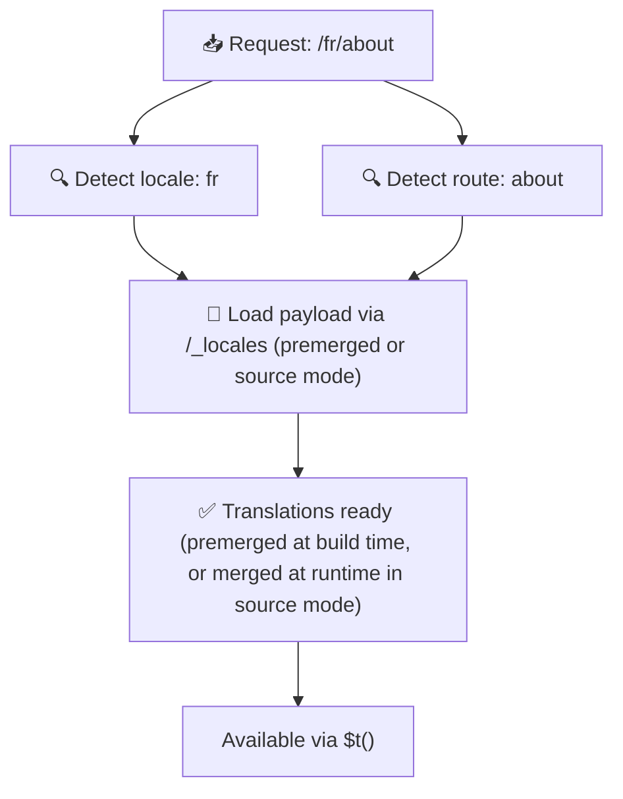

# 📂 Guide de structure de dossiers

## 📖 Introduction

Organiser efficacement vos fichiers de traduction est essentiel pour maintenir un système d'internationalisation (i18n) évolutif et efficace. `Nuxt I18n Micro` simplifie ce processus en offrant une approche claire pour gérer les traductions racines et propres aux pages. Ce guide vous accompagnera à travers la structure de dossiers recommandée et expliquera comment `Nuxt I18n Micro` gère ces traductions.

## 🗂️ Structure de dossiers recommandée

`Nuxt I18n Micro` organise les traductions dans des fichiers racines et des fichiers propres aux pages à l'intérieur du répertoire `pages`. Avec `translationPayloads.mode: 'premerged'` (par défaut), les traductions racines sont automatiquement fusionnées dans chaque fichier de page à la compilation, de sorte que chaque page dispose d'un ensemble complet de traductions sans coût de fusion à l'exécution.

Avec `mode: 'source'`, les fichiers sources restent séparés dans les ressources Nitro et sont fusionnés à l'exécution via la route `/_locales`. Consultez [Sortie de charge utile sans serveur](/guides/performance#serverless-payload-output).

### 🔧 Structure de base

Voici un exemple de base de la structure de dossiers que vous devriez suivre :

```text
locales/
├── pages/
│   ├── index/
│   │   ├── en.json
│   │   ├── fr.json
│   │   └── ar.json
│   ├── about/
│   │   ├── en.json
│   │   ├── fr.json
│   │   └── ar.json
├── en.json
├── fr.json
└── ar.json

```

### 📄 Explication de la structure

#### 1. 🌍 Fichiers de traduction racines

- **Chemin** : `/locales/\{locale\}.json` (p. ex. `/locales/en.json`)
- **Objectif** : ces fichiers contiennent les traductions partagées dans toute l'application (menus de navigation, en-têtes, pieds de page, etc.). Avec `mode: 'premerged'` (par défaut), ils sont automatiquement fusionnés dans chaque fichier propre à une page à la compilation, de sorte que le serveur retourne un unique fichier pré-construit par page.

  **Exemple de contenu (`/locales/en.json`) :**

  ```json
  {
    "menu": {
      "home": "Home",
      "about": "About Us",
      "contact": "Contact"
    },
    "footer": {
      "copyright": "© 2024 Your Company"
    }
  }
  ```

#### 2. 📄 Fichiers de traduction propres aux pages

- **Chemin** : `/locales/pages/\{routeName\}/\{locale\}.json` (p. ex. `/locales/pages/index/en.json`)
- **Objectif** : ces fichiers contiennent les traductions propres à des pages individuelles. Avec `mode: 'premerged'` (par défaut), les traductions racines sont fusionnées comme base à la compilation, de sorte que chaque fichier de page devient autonome.

  **Exemple de contenu (`/locales/pages/index/en.json`) :**

  ```json
  {
    "title": "Welcome to Our Website",
    "description": "We offer a wide range of products and services to meet your needs."
  }
  ```

  **Exemple de contenu (`/locales/pages/about/en.json`) :**

  ```json
  {
    "title": "About Us",
    "description": "Learn more about our mission, vision, and values."
  }
  ```

### 📂 Gestion des routes dynamiques et des chemins imbriqués

`Nuxt I18n Micro` transforme automatiquement les segments dynamiques et les chemins imbriqués des routes en une structure de dossiers plate à l'aide d'une convention de renommage précise. Cela garantit que toutes les traductions sont stockées de manière cohérente et facilement accessible.

#### Structure de dossiers pour les routes dynamiques

Lorsque vous gérez des routes dynamiques, comme `/products/[id]`, le module convertit le segment dynamique `[id]` en un format statique dans la structure des fichiers.

**Exemple de structure de dossiers pour des routes dynamiques :**

Pour une route comme `/products/[id]`, les fichiers de traduction seraient stockés dans un dossier nommé `products-id` :

```text
locales/pages/
├── products-id/
│   ├── en.json
│   ├── fr.json
│   └── ar.json

```

**Exemple de structure de dossiers pour des routes dynamiques imbriquées :**

Pour une route imbriquée comme `/products/key/[id]`, les fichiers de traduction seraient stockés dans un dossier nommé `products-key-id` :

```text
locales/pages/
├── products-key-id/
│   ├── en.json
│   ├── fr.json
│   └── ar.json

```

**Exemple de structure de dossiers pour des routes imbriquées à plusieurs niveaux :**

Pour une route imbriquée plus complexe comme `/products/category/[id]/details`, les fichiers de traduction seraient stockés dans un dossier nommé `products-category-id-details` :

```text
locales/pages/
├── products-category-id-details/
│   ├── en.json
│   ├── fr.json
│   └── ar.json

```

### 🛠 Personnalisation de la structure de répertoires

Si vous préférez stocker les traductions dans un répertoire différent, `Nuxt I18n Micro` vous permet de personnaliser le répertoire où sont stockés les fichiers de traduction. Vous pouvez configurer cela dans votre fichier `nuxt.config.ts`.

**Exemple : personnaliser le répertoire de traduction**

```typescript
export default defineNuxtConfig({
  i18n: {
    translationDir: 'i18n', // Custom directory path
  },
})
```

Cela indique à `Nuxt I18n Micro` de chercher les fichiers de traduction dans le répertoire `/i18n` au lieu du répertoire par défaut `/locales`.

## ⚙️ Comment les traductions sont chargées

### 🌍 Routes de langue dynamiques

`Nuxt I18n Micro` utilise des routes de langue dynamiques pour charger les traductions efficacement. Lorsqu'un utilisateur visite une page, le module détermine la langue appropriée et charge les fichiers de traduction correspondants en fonction de la route et de la langue courantes.



Par exemple :

- Visiter `/en/index` chargera les traductions depuis `/locales/pages/index/en.json`.
- Visiter `/fr/about` chargera les traductions depuis `/locales/pages/about/fr.json`.

Cette méthode garantit que seules les traductions nécessaires sont chargées, ce qui optimise à la fois la charge du serveur et les performances côté client.

### 💾 Mise en cache et prérendu

Pour améliorer encore les performances, `Nuxt I18n Micro` prend en charge la mise en cache et le prérendu des fichiers de traduction :

- **Mise en cache** : une fois qu'un fichier de traduction est chargé, il est mis en cache pour les requêtes suivantes, ce qui réduit la nécessité d'aller chercher plusieurs fois les mêmes données.
- **Prérendu** : durant le processus de compilation, vous pouvez prérendre les fichiers de traduction pour toutes les langues et routes configurées, ce qui permet de les servir directement depuis le serveur sans délai à l'exécution.

## 📝 Bonnes pratiques

### 📂 Utilisez judicieusement les fichiers propres aux pages

Tirez parti des fichiers propres aux pages pour garder vos traductions organisées. Cela permet de rendre les traductions de chaque page épurées et rapides à charger, ce qui est particulièrement important pour les pages au contenu complexe ou volumineux.

### 🔑 Gardez les clés de traduction cohérentes

Utilisez des conventions de nommage cohérentes pour vos clés de traduction à travers les fichiers. Cela aide à maintenir la clarté et évite les problèmes de gestion des traductions, surtout à mesure que votre application grandit.

### 🗂️ Organisez les traductions par contexte

Regroupez les traductions apparentées dans vos fichiers. Par exemple, regroupez toutes les étiquettes de boutons sous une clé `buttons` et tous les textes liés aux formulaires sous une clé `forms`. Cela améliore non seulement la lisibilité, mais facilite aussi la gestion des traductions à travers différentes langues.

### ⚠️ Limite de profondeur d'imbrication (2 niveaux recommandés)

Durant la navigation côté client, `Nuxt I18n Micro` utilise une fusion profonde optimisée à 2 niveaux pour combiner les traductions des pages quittée et entrée. Cela garantit que les clés imbriquées qui se chevauchent (p. ex. les deux pages ont des clés sous `common.*`) sont préservées durant les animations de transition.

**Cela fonctionne correctement pour la structure standard `Section → Clé → Valeur` (2 niveaux) :**

```json
// Page A translations
{ "common": { "fromA": "Text A" } }

// Page B translations
{ "common": { "fromB": "Text B" } }

// During transition, both are available:
// { "common": { "fromA": "Text A", "fromB": "Text B" } }
```

**Cependant, si vous utilisez 3 niveaux d'imbrication ou plus, les clés plus profondes peuvent être écrasées durant les transitions :**

```json
// Page A translations
{ "auth": { "form": { "login": "Login" } } }

// Page B translations
{ "auth": { "form": { "register": "Register" } } }

// During transition: "login" key is lost
// { "auth": { "form": { "register": "Register" } } }
```

<Tip>

</Tip>

### 🧹 Nettoyez régulièrement les traductions inutilisées

Avec le temps, votre application peut accumuler des clés de traduction inutilisées, surtout si des fonctionnalités sont retirées ou restructurées. Passez périodiquement en revue et nettoyez vos fichiers de traduction pour les garder épurés et maintenables.
