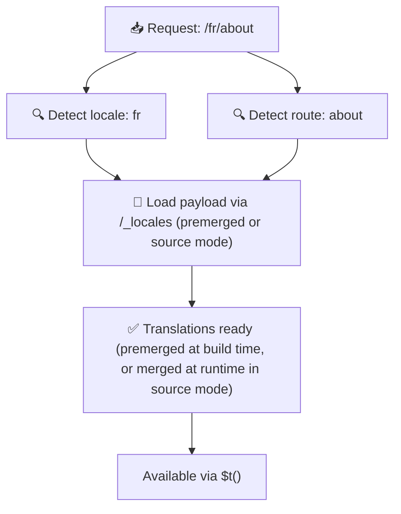

# 📂 Guide de la structure des dossiers

## 📖 Introduction

Organiser vos fichiers de traduction efficacement est essentiel pour maintenir un système d'internationalisation (i18n) évolutif et efficace. `Nuxt I18n Micro` simplifie ce processus en offrant une approche claire pour gérer les traductions à la racine et par page. Ce guide vous fera parcourir la structure de dossiers recommandée et explique comment `Nuxt I18n Micro` gère ces traductions.

## 🗂️ Structure de dossiers recommandée

`Nuxt I18n Micro` organise les traductions en fichiers racines et fichiers par page dans le répertoire `pages`. Avec `translationPayloads.mode: 'premerged'` (par défaut), les traductions à la racine sont fusionnées automatiquement dans chaque fichier de page au moment de la compilation, de sorte que chaque page possède un ensemble complet de traductions sans surcoût de fusion à l'exécution.

Avec `mode: 'source'`, les fichiers sources restent séparés dans les ressources Nitro et sont fusionnés à l'exécution via la route `/_locales`. Consultez [Sortie de charge utile sans serveur](/guides/performance#serverless-payload-output).

### 🔧 Structure de base

Voici un exemple de base de la structure de dossiers à suivre :

```text
locales/
├── pages/
│   ├── index/
│   │   ├── en.json
│   │   ├── fr.json
│   │   └── ar.json
│   ├── about/
│   │   ├── en.json
│   │   ├── fr.json
│   │   └── ar.json
├── en.json
├── fr.json
└── ar.json

```

### 📄 Explication de la structure

#### 1. 🌍 Fichiers de traduction à la racine

- **Chemin :** `/locales/\{locale\}.json` (par exemple, `/locales/en.json`)
- **But :** ces fichiers contiennent des traductions partagées dans toute l'application (menus de navigation, en-têtes, pieds de page, etc.). Avec `mode: 'premerged'` (par défaut), ils sont fusionnés automatiquement dans chaque fichier propre à une page au moment de la compilation, de sorte que le serveur retourne un seul fichier pré-construit par page.

  **Exemple de contenu (`/locales/en.json`) :**

  ```json
  {
    "menu": {
      "home": "Home",
      "about": "About Us",
      "contact": "Contact"
    },
    "footer": {
      "copyright": "© 2024 Your Company"
    }
  }
  ```

#### 2. 📄 Fichiers de traduction propres aux pages

- **Chemin :** `/locales/pages/\{routeName\}/\{locale\}.json` (par exemple, `/locales/pages/index/en.json`)
- **But :** ces fichiers contiennent des traductions propres à des pages précises. Avec `mode: 'premerged'` (par défaut), les traductions à la racine sont fusionnées comme base au moment de la compilation, de sorte que chaque fichier de page devient autonome.

  **Exemple de contenu (`/locales/pages/index/en.json`) :**

  ```json
  {
    "title": "Welcome to Our Website",
    "description": "We offer a wide range of products and services to meet your needs."
  }
  ```

  **Exemple de contenu (`/locales/pages/about/en.json`) :**

  ```json
  {
    "title": "About Us",
    "description": "Learn more about our mission, vision, and values."
  }
  ```

### 📂 Gestion des routes dynamiques et des chemins imbriqués

`Nuxt I18n Micro` transforme automatiquement les segments dynamiques et les chemins imbriqués dans les routes en une structure de dossiers plate grâce à une convention de renommage précise. Cela garantit que toutes les traductions sont stockées de manière cohérente et facilement accessible.

#### Structure de dossiers pour les traductions de routes dynamiques

Pour des routes dynamiques comme `/products/[id]`, le module convertit le segment dynamique `[id]` en un format statique dans la structure de fichiers.

**Exemple de structure pour les routes dynamiques :**

Pour une route comme `/products/[id]`, les fichiers de traduction seraient stockés dans un dossier nommé `products-id` :

```text
locales/pages/
├── products-id/
│   ├── en.json
│   ├── fr.json
│   └── ar.json

```

**Exemple de structure pour les routes dynamiques imbriquées :**

Pour une route imbriquée comme `/products/key/[id]`, les fichiers de traduction seraient stockés dans un dossier nommé `products-key-id` :

```text
locales/pages/
├── products-key-id/
│   ├── en.json
│   ├── fr.json
│   └── ar.json

```

**Exemple de structure pour les routes imbriquées multi-niveaux :**

Pour une route imbriquée plus complexe comme `/products/category/[id]/details`, les fichiers de traduction seraient stockés dans un dossier nommé `products-category-id-details` :

```text
locales/pages/
├── products-category-id-details/
│   ├── en.json
│   ├── fr.json
│   └── ar.json

```

### 🛠 Personnaliser la structure du répertoire

Si vous préférez stocker les traductions dans un répertoire différent, `Nuxt I18n Micro` vous permet de personnaliser le répertoire où les fichiers de traduction sont stockés. Vous pouvez configurer cela dans votre fichier `nuxt.config.ts`.

**Exemple : personnaliser le répertoire des traductions**

```typescript
export default defineNuxtConfig({
  i18n: {
    translationDir: 'i18n', // Custom directory path
  },
})
```

Cela indiquera à `Nuxt I18n Micro` de chercher les fichiers de traduction dans le répertoire `/i18n` plutôt que dans le répertoire `/locales` par défaut.

## ⚙️ Comment les traductions sont chargées

### 🌍 Routes de langue dynamiques

`Nuxt I18n Micro` utilise des routes de langue dynamiques pour charger les traductions efficacement. Lorsqu'un utilisateur visite une page, le module détermine la langue appropriée et charge les fichiers de traduction correspondants selon la route et la langue courantes.



Par exemple :

- Visiter `/en/index` chargera les traductions depuis `/locales/pages/index/en.json`.
- Visiter `/fr/about` chargera les traductions depuis `/locales/pages/about/fr.json`.

Cette méthode garantit que seules les traductions nécessaires sont chargées, optimisant à la fois la charge serveur et la performance côté client.

### 💾 Mise en cache et pré-rendu

Pour améliorer encore la performance, `Nuxt I18n Micro` prend en charge la mise en cache et le pré-rendu des fichiers de traduction :

- **Mise en cache** : une fois un fichier de traduction chargé, il est mis en cache pour les requêtes ultérieures, réduisant le besoin de récupérer les mêmes données de façon répétée.
- **Pré-rendu** : pendant la compilation, vous pouvez pré-rendre les fichiers de traduction pour toutes les langues et routes configurées, ce qui leur permet d'être servis directement depuis le serveur sans délai à l'exécution.

## 📝 Bonnes pratiques

### 📂 Utilisez les fichiers par page à bon escient

Tirez parti des fichiers par page pour garder les traductions organisées. Cela garde les traductions de chaque page légères et rapides à charger, ce qui est particulièrement important pour les pages au contenu complexe ou volumineux.

### 🔑 Maintenez la cohérence des clés de traduction

Utilisez des conventions de nommage cohérentes pour vos clés de traduction dans tous les fichiers. Cela aide à maintenir la clarté et évite les problèmes lors de la gestion des traductions, surtout à mesure que votre application grandit.

### 🗂️ Organisez les traductions par contexte

Regroupez les traductions liées dans vos fichiers. Par exemple, regroupez toutes les étiquettes de boutons sous une clé `buttons` et tous les textes de formulaires sous une clé `forms`. Cela améliore la lisibilité et facilite la gestion des traductions dans plusieurs langues.

### ⚠️ Limite de profondeur d'imbrication (2 niveaux recommandés)

Pendant la navigation côté client, `Nuxt I18n Micro` utilise une fusion profonde optimisée sur 2 niveaux pour combiner les traductions des pages qui quittent et qui entrent. Cela garantit que les clés imbriquées se chevauchant (par exemple, les deux pages ont des clés sous `common.*`) sont préservées pendant les animations de transition.

**Cela fonctionne correctement pour la structure standard `Section → Clé → Valeur` (2 niveaux) :**

```json
// Page A translations
{ "common": { "fromA": "Text A" } }

// Page B translations
{ "common": { "fromB": "Text B" } }

// During transition, both are available:
// { "common": { "fromA": "Text A", "fromB": "Text B" } }
```

**Toutefois, si vous utilisez 3 niveaux ou plus d'imbrication, les clés plus profondes peuvent être écrasées pendant les transitions :**

```json
// Page A translations
{ "auth": { "form": { "login": "Login" } } }

// Page B translations
{ "auth": { "form": { "register": "Register" } } }

// During transition: "login" key is lost
// { "auth": { "form": { "register": "Register" } } }
```


### 🧹 Nettoyez régulièrement les traductions inutilisées

Avec le temps, votre application peut accumuler des clés de traduction inutilisées, surtout si des fonctionnalités sont retirées ou restructurées. Passez périodiquement en revue et nettoyez vos fichiers de traduction pour les garder légers et faciles à maintenir.
