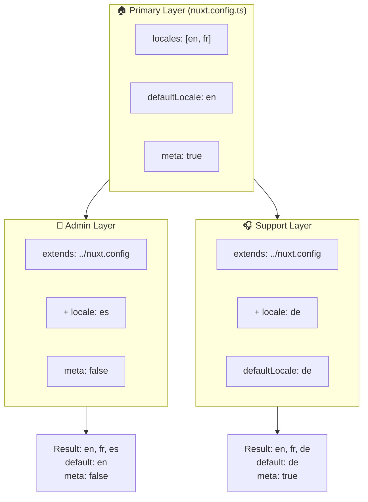

# 🗂️ Couches dans `Nuxt I18n Micro`

## 📖 Introduction aux couches

Les couches (layers) dans `Nuxt I18n Micro` vous permettent de gérer et de personnaliser de manière souple les paramètres de localisation à travers différentes parties de votre application. En définissant différentes couches, vous pouvez ajuster la configuration selon divers contextes, comme remplacer les paramètres pour des sections spécifiques de votre site ou créer des configurations de base réutilisables qui peuvent être étendues par d'autres parties de votre application.

### Flux d'héritage des couches



## 🛠️ Couche de configuration principale

La **couche de configuration principale** est l'endroit où vous configurez les paramètres de localisation par défaut pour l'ensemble de votre application. Cette couche est essentielle, car elle définit la configuration globale, y compris les langues prises en charge, la langue par défaut et d'autres paramètres i18n critiques.

### 📄 Exemple : définir la couche de configuration principale

Voici un exemple de la manière dont vous pouvez définir la couche de configuration principale dans votre fichier `nuxt.config.ts` :

```typescript
export default defineNuxtConfig({
  i18n: {
    locales: [
      { code: 'en', iso: 'en-EN', dir: 'ltr' },
      { code: 'fr', iso: 'fr-FR', dir: 'ltr' },
      { code: 'ar', iso: 'ar-SA', dir: 'rtl' },
    ],
    defaultLocale: 'en', // The default locale for the entire app
    translationDir: 'locales', // Directory where translations are stored
    meta: true, // Automatically generate SEO-related meta tags like `alternate`
    autoDetectLanguage: true, // Automatically detect and use the user's preferred language
  },
})
```

## 🌱 Couches enfants

Les couches enfants sont utilisées pour étendre ou remplacer la configuration principale pour des parties spécifiques de votre application. Par exemple, vous pourriez vouloir ajouter des langues supplémentaires ou modifier la langue par défaut pour une section particulière de votre site. Les couches enfants sont particulièrement utiles dans les applications modulaires où différentes parties de l'application peuvent avoir des exigences de localisation différentes.

### 📄 Exemple : étendre la couche principale dans une couche enfant

Supposons que vous ayez une section de votre site qui doit prendre en charge des langues supplémentaires, ou que vous vouliez désactiver une langue particulière dans un certain contexte. Voici comment y parvenir en étendant la couche de configuration principale :

```typescript
// basic/nuxt.config.ts (Primary Layer)
export default defineNuxtConfig({
  i18n: {
    locales: [
      { code: 'en', iso: 'en-EN', dir: 'ltr' },
      { code: 'fr', iso: 'fr-FR', dir: 'ltr' },
    ],
    defaultLocale: 'en',
    meta: true,
    translationDir: 'locales',
  },
})
```

```typescript
// extended/nuxt.config.ts (Child Layer)
export default defineNuxtConfig({
  extends: '../basic', // Inherit the base configuration from the 'basic' layer
  i18n: {
    locales: [
      { code: 'en', iso: 'en-EN', dir: 'ltr' }, // Inherited from the base layer
      { code: 'fr', iso: 'fr-FR', dir: 'ltr' }, // Inherited from the base layer
      { code: 'de', iso: 'de-DE', dir: 'ltr' }, // Added in the child layer
    ],
    defaultLocale: 'fr', // Override the default locale to French for this section
    autoDetectLanguage: false, // Disable automatic language detection in this section
  },
})
```

### 🌐 Utiliser les couches dans une application modulaire

Dans une application Nuxt plus grande et modulaire, vous pouvez avoir plusieurs sections, chacune nécessitant ses propres paramètres i18n. En tirant parti des couches, vous pouvez maintenir une structure de configuration propre et évolutive.

### 📄 Exemple : configuration en couches dans une application modulaire

Imaginez un site de commerce électronique avec des sections distinctes comme le site principal, le panneau d'administration et le portail de soutien à la clientèle. Chaque section peut avoir besoin d'un ensemble de langues différent ou d'autres paramètres i18n.

#### **Couche principale (configuration globale) :**

```typescript
// nuxt.config.ts
export default defineNuxtConfig({
  i18n: {
    locales: [
      { code: 'en', iso: 'en-EN', dir: 'ltr' },
      { code: 'fr', iso: 'fr-FR', dir: 'ltr' },
    ],
    defaultLocale: 'en',
    meta: true,
    translationDir: 'locales',
    autoDetectLanguage: true,
  },
})
```

#### **Couche enfant pour le panneau d'administration :**

```typescript
// admin/nuxt.config.ts
export default defineNuxtConfig({
  extends: '../nuxt.config', // Inherit the global settings
  i18n: {
    locales: [
      { code: 'en', iso: 'en-EN', dir: 'ltr' }, // Inherited
      { code: 'fr', iso: 'fr-FR', dir: 'ltr' }, // Inherited
      { code: 'es', iso: 'es-ES', dir: 'ltr' }, // Specific to the admin panel
    ],
    defaultLocale: 'en',
    meta: false, // Disable automatic meta generation in the admin panel
  },
})
```

#### **Couche enfant pour le portail de soutien à la clientèle :**

```typescript
// support/nuxt.config.ts
export default defineNuxtConfig({
  extends: '../nuxt.config', // Inherit the global settings
  i18n: {
    locales: [
      { code: 'en', iso: 'en-EN', dir: 'ltr' }, // Inherited
      { code: 'fr', iso: 'fr-FR', dir: 'ltr' }, // Inherited
      { code: 'de', iso: 'de-DE', dir: 'ltr' }, // Specific to the support portal
    ],
    defaultLocale: 'de', // Default to German in the support portal
    autoDetectLanguage: false, // Disable automatic language detection
  },
})
```

Dans cet exemple modulaire :

- Chaque section (admin, support) a ses propres paramètres i18n, mais elles héritent toutes de la configuration de base.
- Le panneau d'administration ajoute l'espagnol (`es`) comme langue et désactive la génération des balises meta.
- Le portail de soutien ajoute l'allemand (`de`) comme langue et met l'allemand par défaut pour l'interface utilisateur.

## 📝 Bonnes pratiques pour l'utilisation des couches

- **🔧 Gardez la couche principale simple :** la couche principale doit contenir les paramètres les plus couramment utilisés qui s'appliquent globalement à votre application. Gardez-la simple pour assurer la cohérence.
- **⚙️ Utilisez les couches enfants pour des personnalisations spécifiques :** ne remplacez ou n'étendez les paramètres dans les couches enfants qu'en cas de nécessité. Cette approche évite la complexité inutile dans votre configuration.
- **📚 Documentez vos couches :** documentez clairement l'objectif et les particularités de chaque couche dans votre projet. Cela aidera à maintenir la clarté et facilitera la compréhension de la configuration par d'autres (ou par vous-même à l'avenir).
