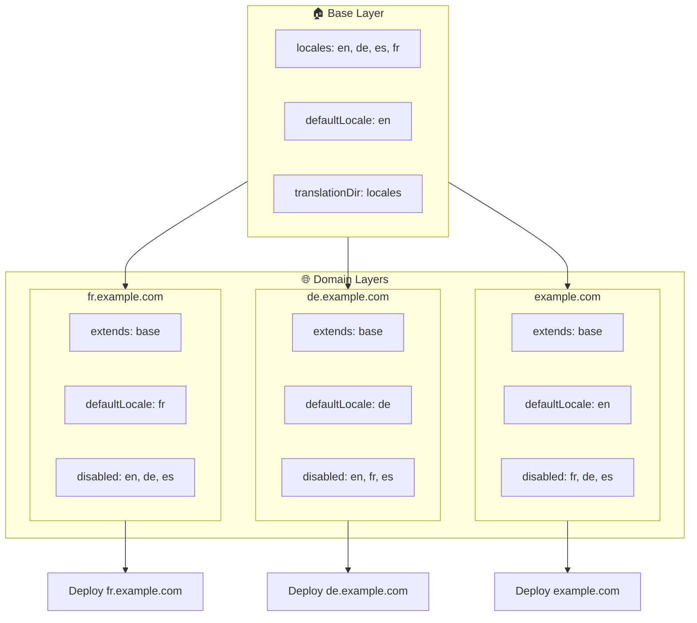

# 🌍 Configurer des langues multidomaines avec `Nuxt I18n Micro` en utilisant les couches

## 📝 Introduction

En tirant parti des couches dans `Nuxt I18n Micro`, vous pouvez créer une configuration multilingue multidomaine flexible et facile à maintenir. Cette approche simplifie la gestion des domaines en éliminant le besoin de fonctionnalités complexes. Elle permet aussi une distribution de charge efficace et réduit la complexité du projet. En exécutant des projets séparés pour différentes langues, votre application peut facilement évoluer et s'adapter à des exigences linguistiques variées sur plusieurs domaines, offrant une solution robuste et évolutive pour les applications mondiales.

## 🎯 Objectif

Créer une configuration où différents domaines servent des langues spécifiques en personnalisant les configurations dans des couches enfants. Cette méthode tire parti du système de couches de Nuxt, ce qui vous permet de maintenir une configuration de base tout en l'étendant ou en la modifiant pour chaque domaine.

### Architecture multidomaine



## 🛠 Étapes pour mettre en œuvre les langues multidomaines

### 1. **Créer la couche de base**

Commencez par créer une couche de configuration de base qui inclut tous les paramètres linguistiques communs à votre application. Cette configuration servira de fondement aux autres configurations propres à chaque domaine.

#### **Configuration de la couche de base**

Créez le fichier de configuration de base `base/nuxt.config.ts` :

```typescript
// base/nuxt.config.ts

export default defineNuxtConfig({
  i18n: {
    locales: [
      { code: 'en', iso: 'en-US', dir: 'ltr' },
      { code: 'de', iso: 'de-DE', dir: 'ltr' },
      { code: 'es', iso: 'es-ES', dir: 'ltr' },
    ],
    defaultLocale: 'en',
    translationDir: 'locales',
    meta: true,
    autoDetectLanguage: true,
  },
})
```

### 2. **Créer des couches enfants propres à chaque domaine**

Pour chaque domaine, créez une couche enfant qui modifie la configuration de base pour répondre aux exigences spécifiques de ce domaine. Vous pouvez désactiver les langues qui ne sont pas nécessaires pour un domaine donné.

#### **Exemple : configuration pour le domaine français**

Créez une configuration de couche enfant pour le domaine français dans `fr/nuxt.config.ts` :

```typescript
// fr/nuxt.config.ts

export default defineNuxtConfig({
  extends: '../base', // Inherit from the base configuration

  i18n: {
    locales: [
      { code: 'en', iso: 'en-US', dir: 'ltr', disabled: true }, // Disable English
      { code: 'fr', iso: 'fr-FR', dir: 'ltr' }, // Add and enable the French locale
      { code: 'de', iso: 'de-DE', dir: 'ltr', disabled: true }, // Disable German
      { code: 'es', iso: 'es-ES', dir: 'ltr', disabled: true }, // Disable Spanish
    ],
    defaultLocale: 'fr', // Set French as the default locale
    autoDetectLanguage: false, // Disable automatic language detection
  },
})
```

#### **Exemple : configuration pour le domaine allemand**

De la même façon, créez une configuration de couche enfant pour le domaine allemand dans `de/nuxt.config.ts` :

```typescript
// de/nuxt.config.ts

export default defineNuxtConfig({
  extends: '../base', // Inherit from the base configuration

  i18n: {
    locales: [
      { code: 'en', iso: 'en-US', dir: 'ltr', disabled: true }, // Disable English
      { code: 'fr', iso: 'fr-FR', dir: 'ltr', disabled: true }, // Disable French
      { code: 'de', iso: 'de-DE', dir: 'ltr' }, // Use the German locale
      { code: 'es', iso: 'es-ES', dir: 'ltr', disabled: true }, // Disable Spanish
    ],
    defaultLocale: 'de', // Set German as the default locale
    autoDetectLanguage: false, // Disable automatic language detection
  },
})
```

### 3. **Déployer l'application pour chaque domaine**

Déployez l'application avec la configuration appropriée pour chaque domaine. Par exemple :

- Déployez la configuration de la couche `fr` sur `fr.example.com`.
- Déployez la configuration de la couche `de` sur `de.example.com`.

### 4. **Configurer plusieurs projets pour différentes langues**

Pour chaque langue et domaine, vous devrez exécuter une instance distincte de l'application. Cela garantit que chaque domaine sert la bonne configuration linguistique, optimisant la distribution de la charge et simplifiant la structure du projet. En exécutant plusieurs projets adaptés à chaque langue, vous maintenez une séparation claire entre les configurations et réduisez la complexité globale de la configuration.

### 5. **Configurer le routage selon le domaine**

Assurez-vous que votre routage est configuré pour diriger les utilisateurs vers le bon projet selon le domaine auquel ils accèdent. Cela garantira que chaque domaine sert la langue appropriée, améliorant l'expérience utilisateur et maintenant la cohérence entre les différentes régions.

### 6. **Déployer et vérifier**

Après avoir configuré les couches et les avoir déployées sur leurs domaines respectifs, assurez-vous que chaque domaine sert la bonne langue. Testez l'application soigneusement pour confirmer que la bonne langue est chargée selon le domaine.

## 📝 Bonnes pratiques

- **Gardez la configuration de base générique** : la configuration de base doit couvrir les paramètres généraux applicables à tous les domaines.
- **Isolez la logique propre à chaque domaine** : conservez les configurations propres à chaque domaine dans leurs couches respectives pour préserver la clarté et la séparation des responsabilités.

## 🎉 Conclusion

En tirant parti des couches dans `Nuxt I18n Micro`, vous pouvez créer une configuration multilingue multidomaine flexible et facile à maintenir. Cette approche élimine le besoin de fonctionnalités complexes de gestion de domaines. Elle vous permet aussi de distribuer la charge efficacement et de réduire la complexité du projet. Exécuter des projets séparés pour différentes langues garantit que votre application peut évoluer facilement et s'adapter à différentes exigences linguistiques sur plusieurs domaines, offrant une solution robuste et évolutive pour les applications mondiales.
