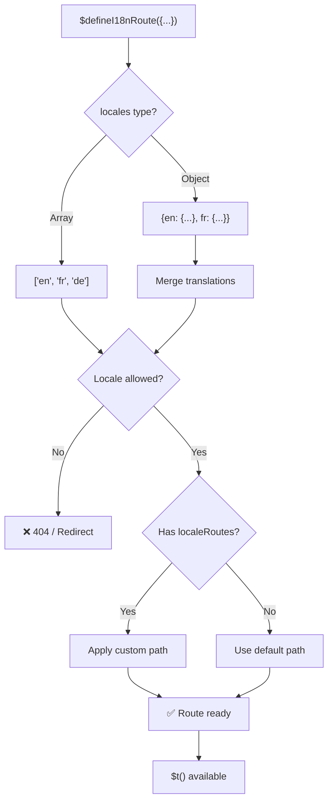
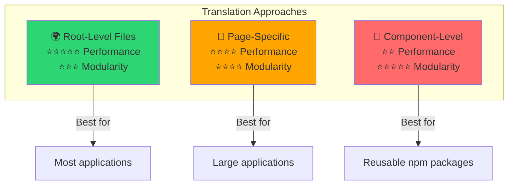

# 📖 Traductions par composant

Apprenez à définir des traductions directement dans les composants Vue avec `$defineI18nRoute` pour une localisation modulaire et facile à maintenir.

## 📖 Aperçu

Les traductions par composant dans `Nuxt I18n Micro` vous permettent de définir des traductions directement dans des composants ou pages spécifiques via la fonction `$defineI18nRoute`. Cette approche est idéale pour gérer du contenu localisé propre à des composants individuels, offrant une méthode plus modulaire et facile à maintenir pour gérer les traductions.

## 🚀 Démarrage rapide

### Utilisation de base

```vue
<template>
  <div>
    <h1>{{ $t('greeting') }}</h1>
    <p>{{ $t('farewell') }}</p>
  </div>
</template>

<script setup lang="ts">
import { useNuxtApp } from '#imports'

const { $defineI18nRoute, $t } = useNuxtApp()

$defineI18nRoute({
  locales: {
    en: { greeting: 'Hello', farewell: 'Goodbye' },
    fr: { greeting: 'Bonjour', farewell: 'Au revoir' },
    de: { greeting: 'Hallo', farewell: 'Auf Wiedersehen' },
  },
})
</script>
```

### Configuration requise (`script setup`)

`$defineI18nRoute` est une injection d'application Nuxt, pas une macro globale.  
Récupérez-la toujours depuis `useNuxtApp()` avant de l'appeler.

```ts
import { useNuxtApp } from '#imports'

const { $defineI18nRoute } = useNuxtApp()
```

## 🏗️ Meta de route à la compilation

Au moment de la compilation, un unplugin Vite analyse les fichiers `.vue` de page pour les appels `defineI18nRoute(...)` / `$defineI18nRoute(...)` et extrait les restrictions de langue, `localeRoutes` et `disableMeta` dans les métadonnées de route utilisées par `@i18n-micro/route-strategy`.

- **Compilation** : l'unplugin (`src/unplugin-define-i18n-route.ts`) s'exécute pendant la transformation Vite et écrit `i18n-route-meta.json` sous le répertoire de compilation Nuxt.
- **Exécution** : le plugin define (`03.define.ts`) expose toujours `$defineI18nRoute` dans `script setup` pour le dev et la configuration en ligne.

Vous n'appelez normalement `$defineI18nRoute` que dans les pages. Le module gère l'extraction à la compilation automatiquement.

## 🔧 Fonction `$defineI18nRoute`

La fonction `$defineI18nRoute` configure le comportement des routes selon la langue courante, offrant une solution polyvalente pour :

- Contrôler l'accès à certaines routes selon les langues disponibles
- Fournir des traductions pour certaines langues
- Définir des routes personnalisées pour différentes langues
- Contrôler la génération des balises meta

### Comment ça fonctionne



### Signature de la méthode

```typescript
const { $defineI18nRoute } = useNuxtApp();
$defineI18nRoute(routeDefinition: DefineI18nRouteConfig);
```

### Paramètres

| Paramètre      | Type                                       | Description                              |
| -------------- | ------------------------------------------ | ---------------------------------------- |
| `locales`      | `string[] \| Record<string, Translations>` | Langues disponibles pour la route         |
| `localeRoutes` | `Record<string, string>`                   | Routes personnalisées pour des langues précises |
| `disableMeta`  | `boolean \| string[]`                      | Contrôle la génération de balises meta i18n |

### Descriptions détaillées des paramètres

#### `locales`

Définit quelles langues sont disponibles pour la route :

<CodeGroup>
```typescript Array Format
$defineI18nRoute({
  locales: ['en', 'fr', 'de'], // Simple array of locale codes
})
```

```typescript Object Format
$defineI18nRoute({
  locales: {
    en: { greeting: 'Hello', farewell: 'Goodbye' },
    fr: { greeting: 'Bonjour', farewell: 'Au revoir' },
    de: { greeting: 'Hallo', farewell: 'Auf Wiedersehen' },
    ru: {}, // Russian locale allowed but no translations provided
  },
})
```
</CodeGroup>

#### `localeRoutes`

Permet des routes personnalisées pour certaines langues :

```typescript
$defineI18nRoute({
  localeRoutes: {
    en: '/welcome',
    fr: '/bienvenue',
    de: '/willkommen',
    ru: '/privet', // Custom route path for Russian locale
  },
})
```

#### `disableMeta`

Contrôle la génération de balises meta i18n :

<CodeGroup>
```typescript Disable All Meta
$defineI18nRoute({
  locales: ['en', 'fr', 'de'],
  disableMeta: true, // Disables all i18n meta tags
})
```

```typescript Disable Specific Locales
$defineI18nRoute({
  locales: ['en', 'fr', 'de'],
  disableMeta: ['en', 'fr'], // Only English and French won't have meta tags
})
```
</CodeGroup>

## 💡 Cas d'utilisation

### 1. Contrôler l'accès selon les langues

Définissez quelles langues sont permises pour certaines routes :

```typescript
$defineI18nRoute({
  locales: ['en', 'fr', 'de'], // Only these locales are allowed for this route
})
```

### 2. Fournir des traductions propres à un composant

Utilisez l'objet `locales` pour fournir des traductions spécifiques pour chaque route :

```typescript
$defineI18nRoute({
  locales: {
    en: {
      greeting: 'Hello',
      farewell: 'Goodbye',
      description: 'Welcome to our application',
    },
    fr: {
      greeting: 'Bonjour',
      farewell: 'Au revoir',
      description: 'Bienvenue dans notre application',
    },
    de: {
      greeting: 'Hallo',
      farewell: 'Auf Wiedersehen',
      description: 'Willkommen in unserer Anwendung',
    },
  },
})
```

### 3. Routage personnalisé pour les langues

Définissez des chemins personnalisés pour certaines langues :

```typescript
$defineI18nRoute({
  locales: ['en', 'fr', 'de'],
  localeRoutes: {
    en: '/welcome',
    fr: '/bienvenue',
    de: '/willkommen',
  },
})
```

### 4. Désactiver les balises meta

Contrôlez la génération de balises meta SEO pour certaines routes ou langues :

```typescript
// Disable meta tags for all locales
$defineI18nRoute({
  locales: ['en', 'fr', 'de'],
  disableMeta: true,
})

// Disable meta tags only for specific locales
$defineI18nRoute({
  locales: ['en', 'fr', 'de'],
  disableMeta: ['en', 'fr'],
})
```

## ✅ Formats de configuration pris en charge

L'analyseur `$defineI18nRoute` prend en charge diverses configurations JavaScript :

### Configurations statiques

<CodeGroup>
```typescript Static Arrays
$defineI18nRoute({
  locales: ['en', 'de', 'fr'],
})
```

```typescript Static Objects
$defineI18nRoute({
  locales: {
    en: { greeting: 'Hello' },
    de: { greeting: 'Hallo' },
  },
  localeRoutes: {
    en: '/welcome',
    de: '/willkommen',
  },
})
```
</CodeGroup>

### Configurations dynamiques

<CodeGroup>
```typescript Variables and Functions
const locales = ['en', 'de', 'fr']
const routes = { en: '/welcome', de: '/willkommen' }

$defineI18nRoute({
  locales: locales,
  localeRoutes: routes,
})
```

```typescript Template Literals
const prefix = 'api'

$defineI18nRoute({
  locales: [`${prefix}-en`, `${prefix}-de`],
  localeRoutes: {
    [`${prefix}-en`]: `/api/welcome`,
    [`${prefix}-de`]: `/api/willkommen`,
  },
})
```
</CodeGroup>

### Configurations avancées

<CodeGroup>
```typescript Spread Operator
const baseLocales = ['en', 'de']
const additionalLocales = ['fr', 'es']

$defineI18nRoute({
  locales: [...baseLocales, ...additionalLocales],
})
```

```typescript Array of Objects
$defineI18nRoute({
  locales: [
    { code: 'en', name: 'English' },
    { code: 'de', name: 'German' },
  ],
})
```
</CodeGroup>

### Logique conditionnelle

```typescript
$defineI18nRoute({
  locales: process.env.NODE_ENV === 'production' ? ['en', 'de'] : ['en', 'de', 'fr', 'es'],
})
```

### Objets imbriqués complexes

```typescript
$defineI18nRoute({
  locales: {
    'en-us': {
      region: 'US',
      currency: 'USD',
      format: {
        date: 'MM/DD/YYYY',
        time: '12h',
      },
    },
    'de-de': {
      region: 'DE',
      currency: 'EUR',
      format: {
        date: 'DD.MM.YYYY',
        time: '24h',
      },
    },
  },
})
```

### Commentaires et formatage

```typescript
$defineI18nRoute({
  // Supported locales for this component
  locales: [
    'en', // English
    'de', // German
    'fr', // French
  ],
  // Custom routes for each locale
  localeRoutes: {
    en: '/welcome',
    de: '/willkommen',
    fr: '/bienvenue',
  },
})
```

## ❌ Non pris en charge

L'analyseur a des limitations et ne peut pas gérer :

- **Imports externes** (instructions `import`)
- **Fonctions async/await**
- **Méthodes de classe**
- **Contrôle de flux complexe** (boucles, try-catch, switch)
- **Fonctions fléchées** dans la configuration
- **Fonctions génératrices**

## 📝 Exemple complet

Voici un exemple exhaustif montrant toutes les fonctionnalités :

```vue
<template>
  <div class="welcome-page">
    <header>
      <h1>{{ $t('title') }}</h1>
      <p>{{ $t('subtitle') }}</p>
    </header>

    <main>
      <section>
        <h2>{{ $t('features.title') }}</h2>
        <ul>
          <li v-for="feature in $t('features.list')" :key="feature">
            {{ feature }}
          </li>
        </ul>
      </section>

      <section>
        <h2>{{ $t('contact.title') }}</h2>
        <p>{{ $t('contact.description') }}</p>
        <a :href="$t('contact.email')">{{ $t('contact.email') }}</a>
      </section>
    </main>

    <footer>
      <p>{{ $t('footer.copyright') }}</p>
    </footer>
  </div>
</template>

<script setup lang="ts">
import { useNuxtApp } from '#imports'

const { $defineI18nRoute, $t } = useNuxtApp()

// Define comprehensive i18n route configuration
$defineI18nRoute({
  locales: {
    en: {
      title: 'Welcome to Our Platform',
      subtitle: 'The best solution for your needs',
      features: {
        title: 'Key Features',
        list: ['High Performance', 'Easy to Use', 'Scalable Architecture'],
      },
      contact: {
        title: 'Get in Touch',
        description: "We'd love to hear from you",
        email: 'mailto:contact@example.com',
      },
      footer: {
        copyright: '© 2024 Example Company. All rights reserved.',
      },
    },
    fr: {
      title: 'Bienvenue sur Notre Plateforme',
      subtitle: 'La meilleure solution pour vos besoins',
      features: {
        title: 'Fonctionnalités Clés',
        list: ['Haute Performance', 'Facile à Utiliser', 'Architecture Évolutive'],
      },
      contact: {
        title: 'Contactez-Nous',
        description: 'Nous aimerions avoir de vos nouvelles',
        email: 'mailto:contact@example.com',
      },
      footer: {
        copyright: '© 2024 Example Company. Tous droits réservés.',
      },
    },
    de: {
      title: 'Willkommen auf Unserer Plattform',
      subtitle: 'Die beste Lösung für Ihre Bedürfnisse',
      features: {
        title: 'Hauptfunktionen',
        list: ['Hohe Leistung', 'Einfach zu Verwenden', 'Skalierbare Architektur'],
      },
      contact: {
        title: 'Kontaktieren Sie Uns',
        description: 'Wir würden gerne von Ihnen hören',
        email: 'mailto:contact@example.com',
      },
      footer: {
        copyright: '© 2024 Example Company. Alle Rechte vorbehalten.',
      },
    },
  },
  localeRoutes: {
    en: '/welcome',
    fr: '/bienvenue',
    de: '/willkommen',
  },
  disableMeta: false, // Enable SEO meta tags
})
</script>

<style scoped>
.welcome-page {
  max-width: 800px;
  margin: 0 auto;
  padding: 2rem;
}

header {
  text-align: center;
  margin-bottom: 3rem;
}

section {
  margin-bottom: 2rem;
}

footer {
  text-align: center;
  margin-top: 3rem;
  padding-top: 2rem;
  border-top: 1px solid #eee;
}
</style>
```

## ⚡ Considérations de performance

Intégrer des traductions dans des composants à fichier unique (SFC) peut avoir un impact sur la performance :

### Problèmes potentiels

- **Taille de fichier accrue** : toutes les langues résident dans la SFC, contrairement aux fichiers de traduction séparés qui permettent un chargement sensible à la langue.
- **Rendu plus lent** : les traductions dans le fichier sont traitées à l'exécution.
- **Utilisation de la mémoire** : toutes les traductions sont chargées quelle que soit la langue courante.

### Bonnes pratiques

- **Utilisez des traductions page par page** pour une performance optimale
- **Réservez les traductions au niveau du composant** aux cas spécifiques comme :
  - Composants réutilisables publiés sur npm
  - Traductions inadaptées aux fichiers racines
  - Composants qui doivent être autonomes

### Performance vs modularité

Équilibrez les besoins de votre projet quand vous choisissez une approche :



| Approche             | Performance | Modularité | Cas d'usage         |
| -------------------- | ----------- | ---------- | ------------------- |
| **Fichiers à la racine** | ⭐⭐⭐⭐⭐  | ⭐⭐⭐     | La plupart des applications |
| **Par page**         | ⭐⭐⭐⭐    | ⭐⭐⭐⭐   | Grandes applications |
| **Par composant**    | ⭐⭐        | ⭐⭐⭐⭐⭐ | Composants réutilisables |

## 🎯 Bonnes pratiques

### 1. Gardez les traductions près des composants

Définissez les traductions directement dans le composant concerné pour garder le contenu localisé organisé et facile à maintenir.

### 2. Utilisez des objets de langue pour la flexibilité

Utilisez le format objet pour la propriété `locales` quand des traductions précises ou un contrôle d'accès basé sur les langues sont requis.

### 3. Documentez les routes personnalisées

Documentez clairement toute route personnalisée définie pour différentes langues afin de maintenir la clarté et de simplifier le développement et la maintenance.

### 4. Considérez l'impact sur la performance

Évaluez si les traductions au niveau du composant sont nécessaires pour votre cas d'usage, en tenant compte des implications de performance.

### 5. Utilisez TypeScript

Tirez parti de TypeScript pour une meilleure sécurité des types et un meilleur support IntelliSense :

```typescript
interface ComponentTranslations {
  title: string
  subtitle: string
  features: {
    title: string
    list: string[]
  }
}

$defineI18nRoute({
  locales: {
    en: {
      title: 'Welcome',
      subtitle: 'Subtitle',
      features: {
        title: 'Features',
        list: ['Feature 1', 'Feature 2'],
      },
    } as ComponentTranslations,
  },
})
```

## 📚 Sujets connexes

- **[Démarrage rapide](/quickstart)** : configuration et paramétrage de base
- **[Référence de l'API](/api/methods)** : documentation complète des méthodes
- **[Exemples](/examples)** : cas d'utilisation concrets

## Résumé

La fonctionnalité de traductions par composant, alimentée par la fonction `$defineI18nRoute`, offre une manière puissante et flexible de gérer la localisation dans votre application Nuxt. En permettant au contenu localisé et au routage d'être définis au niveau du composant, elle aide à créer une expérience hautement personnalisée et conviviale adaptée aux préférences linguistiques et régionales de votre public.

Choisissez l'approche qui convient le mieux aux besoins de votre projet, en considérant à la fois les exigences de performance et les préoccupations de maintenance.
