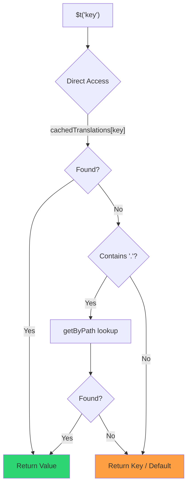

# 🚀 Guide de performance

## 📖 Introduction

`Nuxt I18n Micro` est conçu avec la performance en tête, offrant une amélioration significative par rapport aux modules d'internationalisation (i18n) traditionnels comme `nuxt-i18n`. Ce guide propose un regard approfondi sur les avantages de performance qu'apporte `Nuxt I18n Micro` et comment il se compare aux autres solutions.

## 🤔 Pourquoi se concentrer sur la performance ?

Dans les projets à grande échelle et les environnements à fort trafic, les goulots d'étranglement de performance peuvent entraîner des temps de compilation lents, une utilisation accrue de la mémoire et des temps de réponse serveur médiocres. Ces problèmes deviennent plus prononcés avec des configurations i18n complexes impliquant de gros fichiers de traduction. `Nuxt I18n Micro` a été bâti pour affronter ces défis directement en optimisant la vitesse, l'efficacité mémoire et l'impact minimal sur la taille du bundle de votre application.

## 📊 Comparaison de performance

Nous avons mené une série de tests sur des fixtures identiques via `pnpm test:performance` (`pnpm -C scripts cli performance`) contre **`@nuxtjs/i18n@10.6.0`**. Méthodologie complète et graphiques : [Résultats des tests de performance](/guides/performance-results).

Profil CLI par défaut : **4 langues** × **2 pages** (`index`, `page`) × environ 10 k clés feuille d'index. Augmentez `--locales` / `--keys` pour une charge de radar de régression plus lourde. Le rapport sépare **code**, **traductions** (incluant `chunks/raw/*` de `@nuxtjs/i18n`) et sortie déployable **totale**.

```bash
pnpm test:performance
pnpm -C scripts cli performance --only micro --skip-stress
pnpm -C scripts cli performance --locales 12 --keys 100000 --runs 3
```

### ⏱️ Temps de compilation et consommation de ressources

<Accordion title="**@nuxtjs/i18n v10.6**">
- **Bundle de code** : 2,16 Mo
- **Traductions** : 7,21 Mo (morceaux de messages + charges utiles de langue)
- **Total déployable** : 9,37 Mo
- **Utilisation mémoire max** : 1 821 Mo
- **Temps écoulé** : 8,34 s (moyenne de 3)
</Accordion>

<Tip>
- **Bundle de code** : 1,74 Mo, **environ 19 % de code en moins que `@nuxtjs/i18n` v10.6**
- **Traductions** : 6,8 Mo (JSON chargé à la demande)
- **Total déployable** : 8,54 Mo
- **Utilisation mémoire max** : 1 065 Mo, **environ 41 % de mémoire en moins que `@nuxtjs/i18n` v10.6**
- **Temps écoulé** : 5,34 s, **environ 36 % plus rapide que `@nuxtjs/i18n` v10.6** (à peu près la référence plain-nuxt)
</Tip>

> Les documents plus anciens qui montraient `@nuxtjs/i18n` avec « code ≈ 15 Mo / traductions 0 B » comptaient les fichiers de messages `chunks/raw` comme du code d'application. Le classificateur actuel les sépare; l'écart sur le **code** est plus petit, et micro conduit encore sur le temps de compilation, le pic RSS et les tests de charge.

Consultez le [rapport de banc d'essai complet](/guides/performance-results) pour les graphiques, les résultats Autocannon et les détails des fixtures.

### 🌐 Performance serveur sous charge

Artillery (6 s@6 + 60 s@60) et Autocannon (10c / 10s), moyenne de 3 exécutions consécutives par fixture.

<Accordion title="**@nuxtjs/i18n v10.6**">
- **Requêtes par seconde (Artillery)** : 143 [#/s]
- **Temps de réponse moyen** : 956 ms
- **RPS Autocannon / latence moy** : 72 / 139 ms
</Accordion>

<Tip>
- **Requêtes par seconde (Artillery)** : 275 [#/s], **environ 93 % de plus que `@nuxtjs/i18n` v10.6**
- **Temps de réponse moyen** : 483 ms, **environ 49 % plus rapide que `@nuxtjs/i18n` v10.6**
- **RPS Autocannon / latence moy** : 162 / 62 ms
</Tip>

### 📈 Comparaison visuelle

<Note>
Graphique interactif omis dans la documentation Mintlify. Consultez les tableaux de bancs d'essai de cette page ou la [documentation VitePress](https://s00d.github.io/nuxt-i18n-micro/guide/performance-results) pour le graphique : `chart`.
</Note>

<Note>
Graphique interactif omis dans la documentation Mintlify. Consultez les tableaux de bancs d'essai de cette page ou la [documentation VitePress](https://s00d.github.io/nuxt-i18n-micro/guide/performance-results) pour le graphique : `chart`.
</Note>

| Métrique          | @nuxtjs/i18n v10.6 | i18n-micro | Amélioration        |
| ----------------- | ------------------ | ---------- | ------------------- |
| Temps de compilation | 8,34 s           | 5,34 s     | **environ 36 % plus rapide** |
| Mémoire (compilation) | 1 821 Mo         | 1 065 Mo   | **environ 41 % de moins** |
| Bundle de code    | 2,16 Mo            | 1,74 Mo    | **environ 19 % plus petit** |
| Temps de réponse  | 956 ms             | 483 ms     | **environ 49 % plus rapide** |
| RPS (Artillery)   | 143                | 275        | **environ 93 % de plus** |

### 🔍 Interprétation des résultats

Face à la `@nuxtjs/i18n` actuelle **v10.6** (profil CLI par défaut, moyenne de 3) :

- 🗜️ **Graphe de code plus petit** : environ 1,74 Mo contre environ 2,16 Mo une fois que les morceaux de messages ne sont plus mal étiquetés comme « code ».
- 🧠 **RSS de compilation plus faible** : pic d'environ 1,1 Go contre environ 1,8 Go.
- 🕒 **Compilations plus rapides** : environ 5,3 s contre environ 8,3 s (micro rejoint la référence Nuxt simple sur ce profil).
- ⚡ **Beaucoup mieux sous charge** : environ 275 contre environ 143 RPS Artillery, environ 162 contre environ 72 RPS Autocannon, latence moyenne plus faible.

Les valeurs absolues diffèrent des anciens tableaux publiés (dictionnaires plus petits, ancienne version de Nuxt et division injuste « 0 B de traductions » pour `@nuxtjs/i18n`). La direction reste la même : micro reste en tête sur le coût de compilation et le débit de requêtes.

## ⚙️ Optimisations clés

### 🛠️ Conception minimaliste

`Nuxt I18n Micro` est bâti autour d'une architecture minimaliste avec un noyau réduit et des paquets de stratégies dédiés. Cela réduit le surcoût et simplifie la logique interne, ce qui améliore la performance.

### 🚦 Routage efficace

En v3, la génération de routes et la logique de chemin à l'exécution sont réparties dans des paquets dédiés pour un tree-shaking optimal :

- **`@i18n-micro/route-strategy`** : génération de routes à la compilation. Étend les pages Nuxt avec des routes localisées. Seule la stratégie sélectionnée (`no_prefix`, `prefix`, `prefix_except_default`, `prefix_and_default`) est incluse.
- **`@i18n-micro/path-strategy`** : résolution de chemins à l'exécution, redirections et génération de liens. Utilise des fonctions pures et des indicateurs de contexte pré-calculés pour minimiser les allocations sur les chemins chauds. Les exports par sous-chemin (`/prefix`, `/no-prefix`, etc.) garantissent que seule l'implémentation choisie est intégrée.

Cette approche garde la configuration de routage légère et assure une résolution de route rapide, quel que soit le nombre de langues.

### 📂 Chargement de traduction simplifié

Le module prend en charge uniquement les fichiers JSON pour les traductions, avec une séparation claire entre les fichiers globaux et propres aux pages. Cela garantit que seules les données de traduction nécessaires sont chargées à un moment donné, ce qui améliore encore la performance.

### 🔒 Cache singleton GlobalThis

À partir de la v3.0.0, le module utilise un motif singleton `globalThis` avec `Symbol.for` pour garantir une seule instance de cache dans tout le processus Node.js. Cela prévient :

- La duplication de cache lorsque le même module est intégré plusieurs fois
- La recréation d'objets par requête qui provoque une pression sur la collecte de déchets
- Les fuites de mémoire dues aux instances de cache orphelines

```mermaid
flowchart LR
    subgraph Process["Node.js Process"]
        G["globalThis[Symbol.for('CACHE')]"]

        subgraph R1["SSR Request 1"]
            P1[Plugin Instance] --> G
        end

        subgraph R2["SSR Request 2"]
            P2[Plugin Instance] --> G
        end

        subgraph R3["SSR Request 3"]
            P3[Plugin Instance] --> G
        end
    end

    G --> Cache["Single Map Instance"]
    Cache --> D1["en:index → translations"]
    Cache --> D2["en:about → translations"
```

```typescript
// Internal implementation pattern
const CACHE_KEY = Symbol.for('__NUXT_I18N_STORAGE_CACHE__')
if (!globalThis[CACHE_KEY]) {
  globalThis[CACHE_KEY] = new Map()
}
```

### ⚡ Fonction de traduction optimisée (tFast)

La fonction `$t()` utilise une stratégie de recherche directe optimisée pour la vitesse :

1. **Contexte pré-calculé** : la langue et le nom de route sont calculés une seule fois pendant la navigation, pas à chaque appel à `$t()`.
2. **Recherche à source unique** : toutes les traductions (racine + propres à la page + repli) sont préfusionnées au moment de la compilation dans un seul fichier par page. Aucune recherche en couches n'est nécessaire.
3. **Fusion profonde cumulative à la navigation** : lors de la navigation dans la même langue, les nouvelles traductions de page sont fusionnées profondément (2 niveaux de profondeur) dans le dictionnaire actif, si bien que les clés de la page précédente restent visibles pendant les animations de transition, même quand les pages partagent des préfixes imbriqués se chevauchant (par exemple, les deux pages ont des clés sous `common.*`).
4. **Collecte de déchets via `page:transition:finish`** : une fois l'animation de transition entièrement terminée, le dictionnaire fusionné est remplacé par les traductions propres à la nouvelle page uniquement, libérant la mémoire des clés de l'ancienne page.
5. **Accès direct aux propriétés** : utilise `obj[key]` plutôt que des recherches Map pour les chemins chauds.



```typescript
// Simplified lookup logic — single active dictionary
let val = cachedTranslations[key]
if (val === undefined && key.includes('.')) {
  val = getByPath(cachedTranslations, key)
}
```

### 💉 Chargement côté serveur (pas d'intégration HTML)

Les traductions chargées pendant le SSR restent en **mémoire serveur** pour `$t` pendant le rendu. Elles ne sont **pas** copiées dans `nuxtApp.payload` / le document HTML (même idée que `@nuxtjs/i18n` avec `experimental.preload: false`).

Côté client, `01.plugin.ts` fait un `await` sur `switchContext`, qui charge `/\{apiBaseUrl\}/:page/:locale/data.json` avant que l'application continue. Une seule requête, pas une bulle intégrée de 8 Mo.

`NuxtI18n` conserve toujours le dictionnaire fusionné actif (`cachedTranslations`) pour `$t()` / `$has()`. Les navigations dans la même langue fusionnent profondément les morceaux de page jusqu'à ce que `page:transition:finish` nettoie les clés obsolètes.

#### Où on en est aujourd'hui

Les valeurs ci-dessous sont lues depuis le fichier de budget que `pnpm run budget:payload` mesure et fait respecter.

{/* generated:payload-budget — do not edit; run `pnpm run docs:generate` */}

Mesuré sur `playground` à travers `/`, `/de` :

| Mesure | Taille |
| --- | --- |
| Sources de traduction sur disque | 15,2 Mo |
| Servies comme fichiers de charge utile séparés | 76,3 Mo |
| Plus grand `__NUXT_DATA__` en ligne | 6,9 Mo |
| Ressources client | 449,5 Ko |

Le playground transporte un dictionnaire volontairement surdimensionné, donc ce ne sont pas des valeurs à attendre d'une application réelle. C'est un point fixe pour la mesure. Le budget échoue lorsqu'elles grossissent de façon inattendue, ce qui permet de remarquer un changement accidentel à ce que la charge utile transporte.

{/* /generated:payload-budget */}

### 💾 Mise en cache et pré-rendu

Les traductions passent par plusieurs caches, et savoir lequel a répondu à une requête est la différence entre une session de débogage de cinq minutes et de cinq heures. Il y en a quatre, dans l'ordre où une requête les rencontre :

| Couche | Où | Durée de vie | Vidé par |
| --- | --- | --- | --- |
| Navigateur / CDN | `Cache-Control` sur `/\{apiBaseUrl\}/**` | `httpCacheDuration`, `immutable` | un nouveau `?v=`, soit un déploiement qui a changé les traductions |
| Cache de route Nitro | `routeRules['/\{apiBaseUrl\}/**'].cache` | 60 s, stale-while-revalidate | redémarrage du serveur |
| Chargeur serveur | `CacheControl` en cours de processus, indexé `locale:routeName` | durée de vie du processus, ou `cacheTtl` | redémarrage du serveur, HMR en dev |
| Stockage client | `translationStorage` + le morceau actif dans `NuxtI18n` | durée de vie de la page | rechargement |

Deux règles les empêchent de se contredire :

- **Le cache de route Nitro n'existe que lorsque `?v=` existe.** Avec un invalidateur de cache, chaque URL est unique à son contenu, donc la mettre en cache côté serveur est exempt de contenu obsolète. Définissez `dateBuild: 0` et cette couche est désactivée, parce que l'URL est alors stable et que la réponse dit `must-revalidate`. Un cache côté serveur répondrait à partir d'une entrée obsolète pendant jusqu'à une minute et la déjouerait silencieusement.
- **`immutable` requiert également `?v=`.** Sans invalidateur, l'en-tête est `public, max-age=0, must-revalidate`, quoi que dise `httpCacheDuration` : un long `max-age` sur une URL qui ne change jamais épingle la première réponse qu'un navigateur a vue.

<Warning>
Avec `translationPayloads.publicAssets` (par défaut en mode premerged), les charges utiles sont copiées vers `public/<apiBaseUrl>/\{page\}/\{locale\}/data.json`. Une plateforme qui sert ce répertoire elle-même (Cloudflare Pages, Firebase Hosting, `npx serve`) applique ses propres en-têtes. L'en-tête `routeRules` de Nitro n'atteint que les réponses qui passent par le serveur. Définissez la politique de cache pour ces fichiers statiques dans la configuration propre à la plateforme.
</Warning>

🏁 **Pré-rendu** : en mode premerged, `publicAssets` écrit déjà l'arbre d'URL client dans `public/`. Adhérez à `prerenderRoutes` uniquement si vous avez besoin que Nitro matérialise les routes de gestionnaire quand cette copie est désactivée.

### 🗜️ Charges utiles publiques compressées

Lorsque `nitro.compressPublicAssets` est activé, les charges utiles de traduction copiées dans le répertoire public reçoivent aussi des voisins `.gz` et `.br` :

```ts
export default defineNuxtConfig({
  nitro: { compressPublicAssets: true },
})
```

Nitro compresse les ressources publiques avant le hook qui copie les charges utiles. Sans cela, elles seraient la seule partie non compressée d'une compilation statique. Le module n'active pas la compression de lui-même. Il applique uniquement le réglage que vous avez choisi. La sélection par encodage (`\{ gzip: true, brotli: false \}`) est respectée.

Charge utile d'index du playground : 6 651 984 B brut, 1 012 831 B gzip, 821 617 B brotli.

### ☁️ Sortie de charge utile sans serveur

Sur **Node**, le SSR lit le JSON de traduction depuis `public/<apiBaseUrl>` (`readFile`, pas de `serverAssets` Nitro / `raw:` Rollup). Sur **Edge**, les `serverAssets` Nitro intègrent le même arbre (préférez `mode: 'source'` pour les gros catalogues).

```typescript
export default defineNuxtConfig({
  i18n: {
    translationPayloads: {
      serverAssets: true, // default — Node → public copy; Edge → serverAssets embed
      publicAssets: true, // default in premerged mode
    },
  },
})
```

Utilisez `translationPayloads.mode: 'source'` pour des intégrations Edge compactes (et des copies publiques compactes facultatives) :

```typescript
export default defineNuxtConfig({
  i18n: {
    translationPayloads: {
      mode: 'source',
    },
  },
})
```

`mode: 'source'` garde les fichiers sources fusionnés par couches compacts et fusionne racine/page/repli à l'exécution via la route intégrée `/_locales` (ou `assets:i18n` Edge). Par défaut, il désactive les copies de ressources publiques et les routes de charge utile pré-rendues.

<Warning>
`prerenderRoutes` prend `false` par défaut. Avec `mode: 'source'`, `publicAssets` prend aussi `false` par défaut. L'hébergement purement statique sans exécution Nitro/edge ne peut donc pas charger les traductions côté client sauf si vous activez l'une de ces sorties, gardez `serverHandler` disponible à l'exécution, ou hébergez les charges utiles à l'externe.

Par défaut, premerged + `publicAssets` place déjà `/\{apiBaseUrl\}/\{page\}/\{locale\}/data.json` sous `public/`, donc les hôtes statiques peuvent servir les récupérations client sans Nitro.
</Warning>

<Warning>
Définir `apiBaseServerHost` ou `apiBaseClientHost` déplace le service des charges utiles vers cette origine, avec ses propres exigences. Consultez [Configuration → Hôtes CDN externes](/guides/configuration#external-cdn-hosts).
</Warning>

Ou désactivez les sorties HTTP/publiques individuelles et hébergez les charges utiles à l'externe :

```typescript
export default defineNuxtConfig({
  i18n: {
    apiBaseClientHost: 'https://cdn.example.com',
    apiBaseServerHost: 'https://cdn.example.com',
    translationPayloads: {
      serverHandler: false,
      publicAssets: false,
      prerenderRoutes: false,
    },
  },
})
```

Gardez `serverHandler` activé lorsque vous vous fiez à la route locale intégrée `/\{apiBaseUrl\}/:page/:locale/data.json`. Désactivez-le lorsque les charges utiles sont hébergées à l'externe et que `apiBaseServerHost` pointe vers cette origine externe. Activez `prerenderRoutes` uniquement lorsque vous avez besoin que Nitro matérialise les routes de charge utile statiques et que `publicAssets` ne les a pas déjà écrites.

Pendant la compilation, le module avertit lorsque la sortie de charge utile générée dépasse `translationPayloads.warnFileCount` (par défaut 500) ou `translationPayloads.warnSizeBytes` (par défaut 10 Mo). Il avertit aussi quand toutes les sorties locales sont désactivées sans hôtes de charge utile externes configurés.

## 📝 Astuces pour maximiser la performance

Voici quelques conseils pour obtenir la meilleure performance possible avec `Nuxt I18n Micro` :

- 📉 **Limitez les données de langue** : n'incluez que les langues dont vous avez besoin dans votre projet pour garder la taille du bundle petite.
- 🗂️ **Utilisez les traductions propres aux pages** : organisez vos fichiers de traduction par page pour éviter de charger des données inutiles.
- 💾 **Activez la mise en cache** : tirez parti des fonctionnalités de cache pour réduire la charge serveur et améliorer les temps de réponse.
- 🏁 **Tirez parti du pré-rendu** : pré-rendez vos traductions pour accélérer les chargements de page et réduire le surcoût à l'exécution.

Pour les résultats détaillés des tests de performance, consultez les [Résultats des tests de performance](/guides/performance-results).
