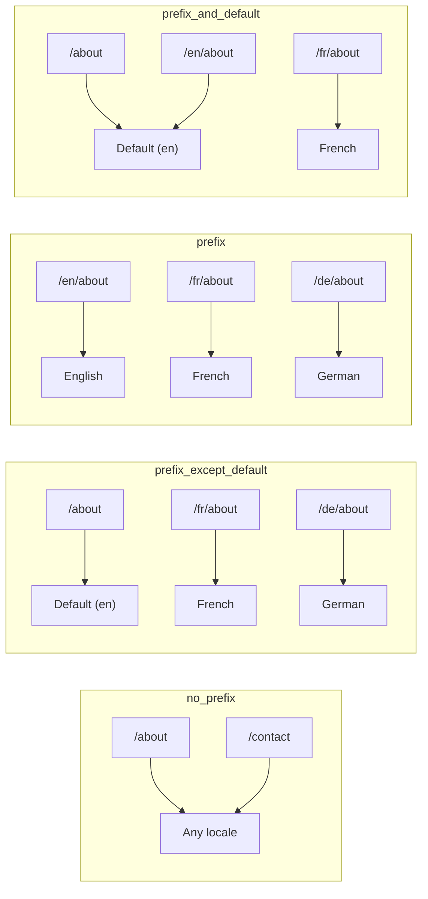
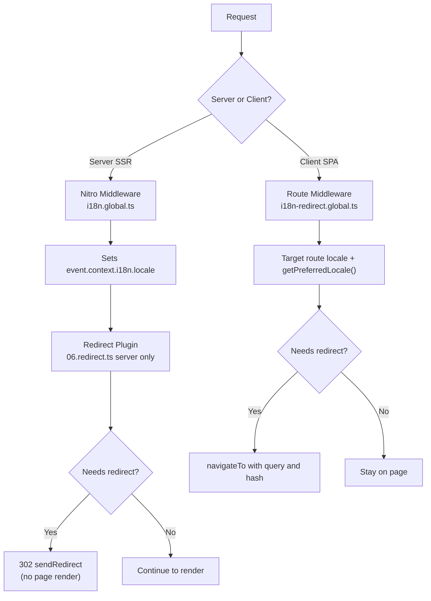

# 🗂️ Stratégies de routage dans Nuxt I18n Micro

## 📖 Aperçu

Nuxt I18n Micro contrôle la façon dont les préfixes de langue apparaissent dans les URL via l'option `strategy`. Sous le capot, deux paquets implémentent cela :

- **`@i18n-micro/route-strategy`** : génération de routes à la compilation (étend les pages Nuxt avec des routes localisées)
- **`@i18n-micro/path-strategy`** : résolution de chemins à l'exécution, redirections, attributs SEO et génération de liens

Le module Nuxt sélectionne la bonne classe de stratégie au moment de la compilation et l'aliase via `#i18n-strategy`, de sorte que seule l'implémentation choisie est intégrée.

## 🚦 Stratégies disponibles

{/* generated:option:strategy — do not edit; run `pnpm run docs:generate` */}

**Type** `Strategies` · **Défaut** `'prefix_except_default'`

Stratégie de routage d'URL pour les préfixes de langue.

- `'no_prefix'` : pas de langue dans l'URL; la langue est stockée dans un témoin.
- `'prefix_except_default'` : préfixe toutes les langues sauf la langue par défaut.
- `'prefix'` : toujours préfixer, y compris la langue par défaut.
- `'prefix_and_default'` : comme `prefix`, mais la langue par défaut est aussi accessible sans préfixe.

{/* /generated:option:strategy */}

### Comparaison des stratégies



### 🛑 `no_prefix`

Les URL n'ont aucun segment de langue. La langue est déterminée par les témoins, l'état `useI18nLocale()` ou la détection du navigateur.

- **Routes** : `/about`, `/contact`. Même motif d'URL pour toutes les langues (pas de préfixe `/en/`, `/fr/`).
- **Persistance de la langue** : via `localeCookie` (défini automatiquement à `'user-locale'` s'il n'est pas spécifié).
- **Chemins personnalisés** : pris en charge via [`globalLocaleRoutes`](/guides/configuration#globallocaleroutes) et [`defineI18nRoute`](/guides/custom-locale-routes). Des slugs localisés sont générés sans ajouter de préfixe de langue aux URL (par exemple, `/about` vs `/ueber-uns`). Les routes imbriquées, les alias et les restrictions par langue sont plus simples que dans `prefix_except_default`.

<Tip>
En utilisant `no_prefix`, `localeCookie` est défini automatiquement à `'user-locale'` s'il n'est pas spécifié. C'est nécessaire parce que l'URL ne contient aucune information de langue.
</Tip>

```typescript
i18n: {
  strategy: 'no_prefix'
  // localeCookie is automatically set to 'user-locale'
}
```

### 🚧 `prefix_except_default`

Toutes les routes ont un préfixe de langue **sauf** la langue par défaut.

- **Langue par défaut** : `/about`, `/contact`
- **Autres langues** : `/fr/about`, `/de/contact`
- **La langue par défaut avec préfixe retourne 404** : `/en/about` → 404 (quand `en` est la langue par défaut)

```typescript
i18n: {
  strategy: 'prefix_except_default' // This is the default
}
```

### 🌍 `prefix`

Chaque route a un préfixe de langue, y compris la langue par défaut.

- **Toutes les langues** : `/en/about`, `/fr/about`, `/de/about`
- **Racine `/`** : redirige vers `/\{locale\}/` selon la préférence de l'utilisateur

```typescript
i18n: {
  strategy: 'prefix'
}
```

### 🔄 `prefix_and_default`

La langue par défaut est disponible avec et sans préfixe. Les langues non par défaut ont toujours un préfixe.

- **Langue par défaut** : `/about` et `/en/about` sont valides
- **Autres langues** : `/fr/about`, `/de/about`
- **Pas de redirection depuis `/`** : `/` et `/en/` servent tous deux la langue par défaut

```typescript
i18n: {
  strategy: 'prefix_and_default'
}
```

## 🔀 Architecture de redirection (v3)

En v3, la logique de redirection est répartie en deux couches pour une performance optimale :

### Comment ça fonctionne



### Côté serveur (pas de flash)

1. **Middleware Nitro** (`i18n.global.ts`) s'exécute en premier. Détecte la langue depuis l'URL, le témoin ou l'en-tête `Accept-Language` et définit `event.context.i18n.locale`.
2. **Plugin de redirection** (`06.redirect.ts`, serveur uniquement) vérifie si le chemin courant nécessite une redirection avec `i18nStrategy.getClientRedirect()` et émet un 302 **avant** tout rendu de page.
3. Cela empêche le « flash d'erreur » où les utilisateurs voient brièvement une mauvaise page avant la redirection.

### Côté client (navigation SPA)

1. Le middleware de route global (`i18n-redirect.global.ts`) s'exécute à chaque navigation client lorsque `redirects` est activé.
2. Il dérive la langue préférée d'abord de la **route cible**, puis retombe sur `useI18nLocale().getPreferredLocale()`.
3. Il utilise `i18nStrategy.getClientRedirect()` pour décider si une redirection est nécessaire.
4. Il préserve `query` et `hash` lors de la redirection.

### Ordre de priorité de la langue

Côté serveur, le plugin de redirection détermine la langue préférée dans cet ordre :

1. **`useState('i18n-locale')`** : priorité la plus haute (définie par programmation via `useI18nLocale().setLocale()`)
2. **Témoin** : si `localeCookie` est configuré
3. **En-tête `Accept-Language`** : si `autoDetectLanguage: true`
4. **`defaultLocale`** : repli final

Côté client, le middleware de route préfère la langue de la route cible, puis utilise la même chaîne de repli état/témoin.

### Comportement de redirection par stratégie

| Stratégie               | Comportement `GET /`                              | Témoin requis ?  |
| ----------------------- | ------------------------------------------------- | ---------------- |
| `no_prefix`             | Pas de redirection (langue depuis témoin/état)     | Défini auto      |
| `prefix`                | 302 → `/\{locale\}/`                                | Recommandé       |
| `prefix_except_default` | 302 → `/\{locale\}/` si langue ≠ défaut             | Recommandé       |
| `prefix_and_default`    | Pas de redirection (`/` et `/\{locale\}/` valides)  | Facultatif       |

### Désactiver les redirections

```typescript
i18n: {
  redirects: false // Disables automatic locale redirects
}
```

Lorsque `redirects: false`, les redirections automatiques de langue sont désactivées :

- **Serveur** : le plugin de redirection (`06.redirect.ts`, serveur uniquement) reste enregistré mais ignore la logique de redirection. Il effectue encore les **vérifications 404** pour les préfixes de langue invalides (par exemple, `/xx/about` où `xx` n'est pas une langue valide) et la **synchronisation du témoin** depuis le préfixe d'URL (par exemple, visiter `/fr/about` synchronise le témoin à `fr`).
- **Client** : le middleware de route global `i18n-redirect` n'est **pas enregistré**. Aucune redirection automatique SPA.

## 🍪 Persistance de langue basée sur les témoins

<Warning>
Lorsque vous utilisez `prefix` ou `prefix_except_default` avec `redirects: true` (par défaut), vous **devez** définir `localeCookie` pour que les redirections fonctionnent correctement. Sans témoin, le plugin de redirection ne peut pas se souvenir de la préférence linguistique de l'utilisateur d'un rechargement à l'autre.

```typescript
i18n: {
  strategy: 'prefix_except_default',
  localeCookie: 'user-locale' // Required for redirects to work properly
}
```
</Warning>

**Comment `localeCookie` fonctionne en v3 :**

- Géré en interne par `useI18nLocale()`. **Ne le définissez pas manuellement** via `useCookie()`.
- Quand un utilisateur visite une URL préfixée (par exemple, `/fr/about`), le témoin est automatiquement synchronisé à `fr`.
- Lors de la prochaine visite à `/`, la valeur du témoin est utilisée pour rediriger vers `/\{locale\}/`.
- Si le témoin contient une langue invalide (absente de la liste `locales`), il retombe sur `defaultLocale`.

| Stratégie               | Défaut `localeCookie`  | Notes                                     |
| ----------------------- | ---------------------- | ----------------------------------------- |
| `no_prefix`             | Auto : `'user-locale'` | Requis; défini automatiquement            |
| `prefix`                | `null` (désactivé)     | Définir à `'user-locale'` pour redirections |
| `prefix_except_default` | `null` (désactivé)     | Définir à `'user-locale'` pour redirections |
| `prefix_and_default`    | `null` (désactivé)     | Facultatif                                 |

## 🔍 `autoDetectLanguage` et `autoDetectPath`

### `autoDetectLanguage`

{/* generated:option:autoDetectLanguage — do not edit; run `pnpm run docs:generate` */}

**Type** `boolean` · **Défaut** `true`

Détecte automatiquement la langue préférée de l'utilisateur depuis l'en-tête HTTP `Accept-Language`. Utilisée en combinaison avec `autoDetectPath` pour décider quand la détection se produit.

{/* /generated:option:autoDetectLanguage */}

La vérification s'exécute dans le middleware serveur et sert de repli : un témoin ou un état existant l'emporte.

```typescript
i18n: {
  autoDetectLanguage: true
}
```

### `autoDetectPath`

{/* generated:option:autoDetectPath — do not edit; run `pnpm run docs:generate` */}

**Type** `string` · **Défaut** `'/'`

Où les redirections de préférence par témoin/`Accept-Language` peuvent s'exécuter (lorsque `redirects` est activé).

- `'/'` : uniquement `/` (les liens profonds dans la langue par défaut restent accessibles; défaut)
- `'no_prefix'` : uniquement les chemins sans préfixe de langue
- `'*'` : chaque chemin, y compris la réécriture d'un préfixe de langue explicite (par exemple `/fr/about` → `/de/about` quand le témoin préfère `de`)

- toute autre chaîne : correspondance exacte du chemin (par exemple `'/welcome'`)

Le nettoyage de la stratégie préfixée (par exemple `/en` → `/` sous `prefix_except_default`) n'est pas conditionné.

{/* /generated:option:autoDetectPath */}

```typescript
i18n: {
  autoDetectPath: '/' // Default: only root
  // autoDetectPath: '*' // All paths — redirects even /fr/about to /de/about
}
```

<Warning>
Avec `autoDetectPath: '*'`, même les URL avec un préfixe de langue explicite (par exemple, `/fr/about`) seront redirigées si la langue préférée de l'utilisateur diffère. Cela peut être utile pour les configurations basées sur les domaines, mais peut dérouter les utilisateurs qui partagent des URL.
</Warning>

Avec `autoDetectPath: '/'` par défaut et un témoin de langue :

| requête | témoin | résultat |
| --- | --- | --- |
| `/` | `de` | 302 → `/de` |
| `/about` | `de` | 200, langue par défaut (pas de réécriture) |

```typescript
i18n: {
  localeCookie: 'user-locale',
  strategy: 'prefix_except_default',
  // Default — remember language on entry, keep deep links stable
  autoDetectPath: '/',
  // Or redirect on every unprefixed path (but not /de/… → /fr/…):
  // autoDetectPath: 'no_prefix',
}
```

## ⚠️ Problèmes connus et bonnes pratiques

### 1. Décalage d'hydratation dans la stratégie `no_prefix`

En utilisant `no_prefix`, la langue est déterminée dynamiquement. Si le serveur et le client ne s'accordent pas sur la langue, vous verrez un décalage d'hydratation.

**Solution** : utilisez `useI18nLocale().setLocale()` dans un plugin serveur (avec `order: -10`) pour définir la langue avant l'initialisation d'i18n :

```ts
// plugins/i18n-loader.server.ts
export default defineNuxtPlugin({
  name: 'i18n-custom-loader',
  enforce: 'pre',
  order: -10,
  setup() {
    const { setLocale } = useI18nLocale()
    setLocale('ja') // Your detection logic here
  },
})
```

Consultez [Détection de langue personnalisée](/guides/custom-language-detection) pour des exemples détaillés.

### 2. Utilisez des routes nommées avec `localeRoute`

Le routage basé sur les chemins peut causer des problèmes de résolution :

```typescript
// May cause issues
$localeRoute('/page')

// Preferred approach
$localeRoute({ name: 'page' })
```

### 3. Utilisation de `pages: false` avec i18n

Lorsque vous utilisez Nuxt avec `pages: false` :

```typescript
export default defineNuxtConfig({
  pages: false,
  i18n: {
    strategy: 'no_prefix', // Recommended
    disablePageLocales: true, // Required
    localeCookie: 'user-locale', // Required for persistence
  },
})
```

**Limitations avec `pages: false` :**

- Pas de redirections automatiques
- Pas de détection de langue basée sur l'URL
- Le changement de langue côté client nécessite un rechargement de page ou un chargement manuel des traductions

### 4. Gestion des témoins invalides

Si un témoin contient une langue invalide (absente de la liste `locales`), le module retombe gracieusement sur `defaultLocale`. Aucune erreur n'est levée.

## 📝 Résumé des bonnes pratiques

| Recommandation            | Détails                                                                             |
| ------------------------- | ----------------------------------------------------------------------------------- |
| **Définir `localeCookie`**    | Toujours défini pour les stratégies préfixées avec `redirects: true`                             |
| **Utiliser `useI18nLocale()`** | La façon centralisée de gérer l'état linguistique (remplace `useState`/`useCookie` manuels) |
| **Utiliser des routes nommées**   | `$localeRoute(\{ name: 'page' \})` plutôt que `$localeRoute('/page')`                       |
| **Langue programmée**     | Utilisez `useI18nLocale().setLocale()` dans un plugin serveur avec `order: -10`              |
| **Éviter les témoins manuels**  | N'utilisez pas `useCookie('user-locale')` directement; `useI18nLocale()` gère cela      |
