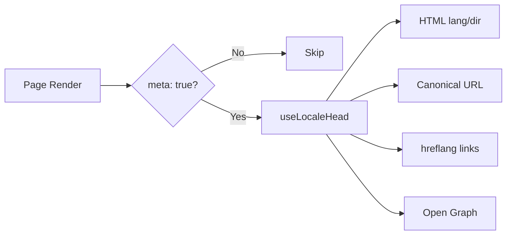

# 🌐 Guide SEO pour Nuxt I18n Micro

## 📖 Introduction

Un SEO (optimisation pour moteurs de recherche) efficace est essentiel pour garantir que votre site multilingue soit accessible et visible aux utilisateurs du monde entier via les moteurs de recherche. `Nuxt I18n Micro` simplifie la gestion du SEO pour les sites multilingues en générant automatiquement les balises meta et attributs essentiels qui informent les moteurs de recherche sur la structure et le contenu de votre site.

Ce guide explique comment `Nuxt I18n Micro` gère le SEO pour améliorer la visibilité de votre site et l'expérience utilisateur sans nécessiter de configuration supplémentaire.

## ⚙️ Gestion automatique du SEO

### Flux de génération des balises meta SEO



**Balises générées :**

| Balise          | Exemple                                                  |
| --------------- | -------------------------------------------------------- |
| Attributs HTML  | `<html lang="en" dir="ltr">`                             |
| Canonique       | `<link rel="canonical" href="...">`                      |
| hreflang        | `<link rel="alternate" hreflang="en" href="...">`        |
| x-default       | `<link rel="alternate" hreflang="x-default" href="...">` |
| Open Graph      | `<meta property="og:locale" content="en_US">`            |

#### `og` par langue (`og:locale` vs BCP 47)

`<html lang>` et `hreflang` utilisent **BCP 47** via `locale.iso` (par exemple, `ar-AE`).  
Open Graph requiert **`language_TERRITORY`** avec un **soulignement** (`ar_AE`), selon le [protocole OG](https://ogp.me/).

Par défaut, `og:locale` est dérivé de `iso` lorsque le mappage est sans ambiguïté (`en-US` → `en_US`).  
Définissez une chaîne **`og`** explicite lorsque vous avez besoin d'une valeur personnalisée (par exemple, `zh-Hans` → `zh_CN`).  
Si ni `og` ni un `iso` convertible n'est disponible, les balises `og:locale` ne sont pas générées. En développement, vous obtenez un avertissement dans la console (respecte `missingWarn`).

```typescript
i18n: {
  meta: true,
  locales: [
    { code: 'ar', iso: 'ar-AE', og: 'ar_AE', dir: 'rtl' },
    { code: 'en', iso: 'en-US' }, // og:locale → en_US
    { code: 'zh', iso: 'zh-Hans', og: 'zh_CN' }, // script tags need explicit og
  ],
}
```

### 🔑 Fonctionnalités SEO clés

Lorsque l'option `meta` est activée dans `Nuxt I18n Micro`, le module gère automatiquement les aspects SEO suivants :

1. **🌍 Attributs de langue et de direction** :
   - Le module définit les attributs `lang` et `dir` sur la balise `<html>` selon la langue courante et la direction du texte (par exemple, `ltr` pour l'anglais ou `rtl` pour l'arabe).

2. **🔗 URL canoniques** :
   - Le module génère un lien canonique (`<link rel="canonical">`) pour chaque page, garantissant que les moteurs de recherche reconnaissent la version principale du contenu.

3. **🌐 Liens de langue alternative (`hreflang`)** :
   - Le module génère automatiquement des balises `<link rel="alternate" hreflang="">` pour toutes les langues disponibles. Cela aide les moteurs de recherche à comprendre quelles versions linguistiques de votre contenu sont disponibles, améliorant l'expérience utilisateur pour un public mondial.
   - Chaque langue émet **une** balise : `hreflang = iso || code`. Lorsque `iso` est défini, le `code` de routage n'est jamais utilisé comme `hreflang` (les clés de marché comme `mx` ne deviennent pas des balises de langue invalides).
   - Facultatif : `hreflangBaseLanguage: true` émet aussi une balise de langue nue dérivée de `iso` (par exemple, `es-ES` → `es`), revendiquée par la première langue régionale dans `locales`.

4. **🌏 Hreflang `x-default`** :
   - Le module génère automatiquement une balise `<link rel="alternate" hreflang="x-default">` pointant vers l'URL de la langue par défaut. Elle indique aux moteurs de recherche quelle URL afficher aux utilisateurs dont la langue ne correspond à aucune des langues définies. Aucune configuration supplémentaire n'est requise. Elle fonctionne automatiquement quand `meta: true` est défini.

5. **🔖 Métadonnées Open Graph** :
   - Le module génère des balises meta Open Graph (`og:locale`, `og:url`, etc.) pour chaque langue, ce qui est particulièrement utile pour le partage sur les médias sociaux et l'indexation par les moteurs de recherche.

### 🛠️ Configuration

Pour activer ces fonctionnalités SEO, assurez-vous que l'option `meta` est définie à `true` dans votre fichier `nuxt.config.ts` :

```typescript
export default defineNuxtConfig({
  modules: ['nuxt-i18n-micro'],
  i18n: {
    locales: [
      { code: 'en', iso: 'en-US', dir: 'ltr' },
      { code: 'fr', iso: 'fr-FR', dir: 'ltr' },
      { code: 'ar', iso: 'ar-SA', dir: 'rtl' },
    ],
    defaultLocale: 'en',
    translationDir: 'locales',
    meta: true, // Enables automatic SEO management
  },
})
```

### 🌍 `metaBaseUrl` dynamique pour les déploiements multidomaines

Lorsque `metaBaseUrl` n'est pas défini, les URL SEO absolues se résolvent dans cet ordre (#240) :

1. `site.url` de [`nuxt-site-config`](https://nuxtseo.com/docs/site-config) (si ce module est présent, par exemple via `@nuxtjs/seo`)
2. Sinon, le nom d'hôte de la requête courante (`useRequestURL()` / `window.location.origin`)

Le repli sur l'origine de la requête respecte les en-têtes de proxy inverse (`X-Forwarded-Host`, `X-Forwarded-Proto`), donc il fonctionne correctement derrière nginx, Cloudflare, AWS ALB et des proxys similaires.

Cela signifie que les applications qui définissent déjà `site.url` pour le plan de site / robots / schema.org **n'ont pas besoin** d'une deuxième déclaration de `metaBaseUrl` :

```typescript
export default defineNuxtConfig({
  site: {
    url: process.env.NUXT_SITE_URL, // also used by micro for canonical / og:url / hreflang
  },
  i18n: {
    meta: true,
    // metaBaseUrl omitted — picks up site.url, then request origin
  },
})
```

Sans `site.url`, une seule instance d'application peut quand même servir **plusieurs domaines** avec des balises SEO correctes pour chacun via l'origine de la requête :

```typescript
export default defineNuxtConfig({
  i18n: {
    meta: true,
    // metaBaseUrl is undefined by default — resolved dynamically from the request
  },
})
```

Par exemple, une requête vers `https://site-a.com/en/about` produira :

```html
<link rel="canonical" href="https://site-a.com/en/about" /> <meta property="og:url" content="https://site-a.com/en/about" />
```

Alors que la même application servant `https://site-b.com/en/about` produira :

```html
<link rel="canonical" href="https://site-b.com/en/about" /> <meta property="og:url" content="https://site-b.com/en/about" />
```

Si vous avez besoin d'une URL de base fixe qui l'emporte toujours sur `site.url`, passez une chaîne statique :

```typescript
metaBaseUrl: 'https://example.com'
```

### 🔍 Liste blanche des requêtes canoniques

Par défaut, les paramètres de requête sont retirés des URL canoniques et `og:url` pour éviter le contenu dupliqué. Vous pouvez lister certains paramètres de requête à préserver :

```typescript
i18n: {
  canonicalQueryWhitelist: ['page', 'sort', 'filter', 'search', 'q', 'query', 'tag']
}
```

Seuls les paramètres listés dans `canonicalQueryWhitelist` apparaîtront dans les URL canoniques. Tous les autres paramètres de requête (par exemple, pistage, ID de session) sont retirés.

### 🚫 Désactiver les balises meta par page

Vous pouvez désactiver la génération de balises meta SEO pour certaines pages avec `defineI18nRoute()` :

```vue
<script setup>
// Disable all SEO meta tags for this page
defineI18nRoute({
  disableMeta: true,
})
</script>
```

Vous pouvez aussi désactiver les meta uniquement pour certaines langues :

```vue
<script setup>
// Disable meta tags only for English locale on this page
defineI18nRoute({
  disableMeta: ['en'],
})
</script>
```

Lorsque `disableMeta` est actif, aucune balise `hreflang`, `canonical`, `og:locale`, `og:url` ou `x-default` n'est générée pour la page/langue concernée.

### 🔇 Langues désactivées

Les langues avec `disabled: true` sont automatiquement exclues de toute génération de balises SEO. Aucune balise `hreflang`, `og:locale:alternate` ou lien alternatif n'est créée pour elles :

```typescript
i18n: {
  locales: [
    { code: 'en', iso: 'en-US' },
    { code: 'fr', iso: 'fr-FR', disabled: true }, // excluded from SEO tags
  ]
}
```

### 🙈 Langues opt-out (`seo: false`)

Pour les langues qui doivent rester routables et traduites mais ne pas apparaître dans les balises de découverte entre langues, définissez `seo: false`. Ces langues sont omises des alternatifs `hreflang` et de `og:locale:alternate`. Si votre langue **par défaut** configurée a `seo: false`, le lien `x-default` n'est pas émis non plus.

```typescript
i18n: {
  locales: [
    { code: 'en', iso: 'en-US' },
    { code: 'ru', iso: 'ru-RU', seo: false }, // internal / non-indexed locale
  ]
}
```

### 📌 Comportement selon la stratégie

| Stratégie                | Liens hreflang   | x-default             | canonique      | og:url |
| ----------------------- | ---------------- | --------------------- | -------------- | ------ |
| `prefix`                | ✅ Toutes langues | ✅ URL langue par défaut | ✅ URL courante | ✅     |
| `prefix_except_default` | ✅ Toutes langues | ✅ URL sans préfixe     | ✅ URL courante | ✅     |
| `prefix_and_default`    | ✅ Toutes langues | ✅ URL langue par défaut | ✅ URL courante | ✅     |
| `no_prefix`             | ❌ Non générés   | ❌ Non générés          | ✅ URL courante | ✅     |

Pour la stratégie `no_prefix`, seuls `canonical`, `og:url`, `og:locale` et les attributs `html` (`lang`, `dir`) sont générés. Les liens de langue alternative (`hreflang`) et `x-default` ne sont pas générés parce qu'il n'y a pas d'URL distinctes par langue.

## Surcharges au niveau de la page (`useI18nHead`)

Pour les **articles, guides ou tout contenu CMS** où toutes les langues n'existent pas ou où les URL proviennent d'une API, utilisez [`useI18nHead`](/api/composables/use-i18n-head) sur la page plutôt qu'un plugin de head i18n personnalisé.

### Article avec traductions partielles

```vue
<script setup lang="ts">
const article = await loadArticle()
// article.locales = { en: '...', de: '...' } — only translated locales

useI18nHead({
  meta: [{ property: 'og:title', content: article.title }],
  replace: {
    hreflang: Object.entries(article.locales).map(([locale, href]) => ({
      rel: 'alternate',
      hreflang: locale,
      href,
    })),
    ogAlternates: Object.keys(article.locales),
  },
})
</script>
```

### Slugs par langue avec `$setI18nRouteParams`

Lorsque les slugs diffèrent selon la langue, définissez d'abord les params de route, puis surchargez les alternatifs avec des URL réelles :

```vue
<script setup lang="ts">
const { $defineI18nRoute, $setI18nRouteParams } = useNuxtApp()
const { data: article } = await useFetch(`/api/articles/${slug}`)

$defineI18nRoute({
  localeRoutes: { en: '/blog/[slug]', de: '/de/blog/[slug]' },
})

$setI18nRouteParams({
  en: { slug: article.value.slugEn },
  de: { slug: article.value.slugDe },
})

useI18nHead({
  replace: {
    hreflang: ['en', 'de'].map((locale) => ({
      rel: 'alternate',
      hreflang: locale,
      href: article.value.urls[locale],
    })),
    ogAlternates: ['en', 'de'],
  },
})
</script>
```

### Origine HTTPS derrière un proxy

Pour des URL absolues correctes en SSR sans composable d'origine personnalisée :

```ts
i18n: {
  meta: true,
  metaBaseUrl: undefined,
  metaTrustForwardedHost: true,
  metaTrustForwardedProto: true,
}
```

Plus d'exemples (surcharge canonique, `x-default`, récupération réactive, assistants partagés) : [composable useI18nHead](/api/composables/use-i18n-head).

### ⚠️ Barre oblique de fin

Le module génère les URL canoniques et `hreflang` selon le chemin réel de `useRoute().fullPath`. Si votre application utilise des barres obliques de fin (par exemple, via `router.options` de Nuxt), les URL générées les refléteront. Cependant, `$switchLocalePath` peut normaliser les chemins et retirer les barres obliques de fin. Si la cohérence des barres obliques de fin est critique pour votre SEO, vérifiez que les URL générées correspondent à la structure d'URL de votre application.

### 🎯 Avantages

En activant l'option `meta`, vous profitez de :

- **📈 Meilleur classement des moteurs de recherche** : les moteurs de recherche peuvent mieux indexer votre site, en comprenant les relations entre les différentes versions linguistiques.
- **👥 Meilleure expérience utilisateur** : les utilisateurs voient la bonne version linguistique selon leurs préférences, ce qui mène à une expérience plus personnalisée.
- **🔧 Configuration manuelle réduite** : le module gère automatiquement les tâches SEO, vous libérant d'avoir à ajouter manuellement des balises meta et attributs liés au SEO.

## 🔗 Nuxt SEO (`@nuxtjs/seo`)

[`@nuxtjs/seo`](https://nuxtseo.com/) regroupe le plan de site, robots, schema.org, les images OG et les modules connexes. Il s'intègre à **nuxt-i18n-micro** via [`nuxt-site-config`](https://nuxtseo.com/docs/site-config/guides/i18n) (v4+).

### Exigences

- **`@nuxtjs/seo` 3+** (les versions actuelles utilisent `nuxt-site-config` 4+, qui enregistre le plugin `nuxt-site-config:i18n` pour micro)
- **`i18n.meta: true`** (recommandé; micro fournit les balises head sensibles à la langue; Nuxt SEO ajoute plan de site, schema.org, etc.)

### Ordre des modules

Listez **nuxt-i18n-micro avant `@nuxtjs/seo`** afin que la configuration du site puisse lire votre configuration de langue :

```typescript
export default defineNuxtConfig({
  modules: ['nuxt-i18n-micro', '@nuxtjs/seo'],
  site: {
    url: 'https://example.com',
    name: 'My Site',
  },
  i18n: {
    meta: true,
    defaultLocale: 'en',
    locales: [
      { code: 'en', iso: 'en-US' },
      { code: 'de', iso: 'de-DE' },
    ],
  },
})
```

### Nom du site et description traduits

Nuxt Site Config lit des clés de traduction facultatives depuis vos fichiers de langue :

```json
{
  "nuxtSiteConfig": {
    "name": "My Site",
    "description": "My site description"
  }
}
```

Les valeurs par langue dans `locales/en.json`, `locales/de.json`, etc. sont détectées automatiquement.

### Dépannage

Si vous voyez `Plugin nuxt-seo:defaults depends on nuxt-site-config:i18n but they are not registered`, mettez à niveau **`@nuxtjs/seo` vers 3+** (voir [issue #133](https://github.com/s00d/nuxt-i18n-micro/issues/133)). L'ancienne `nuxt-site-config` 3.x câblait seulement i18n pour `@nuxtjs/i18n`, pas pour micro.

Plus : [Guide i18n du plan de site](https://nuxtseo.com/docs/sitemap/guides/i18n), [Guide i18n de Site Config](https://nuxtseo.com/docs/site-config/guides/i18n).
