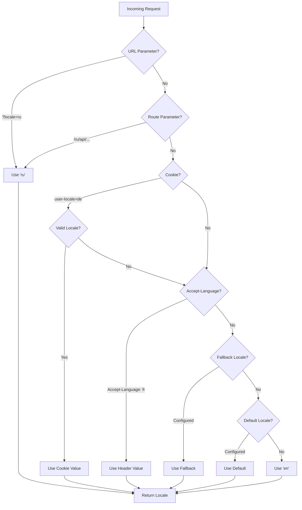

# 🌍 Traductions côté serveur et informations de langue dans Nuxt I18n Micro

## 📖 Aperçu

Nuxt I18n Micro prend en charge les traductions et les informations de langue côté serveur, ce qui vous permet de traduire du contenu et d'accéder aux détails de langue sur le serveur. C'est particulièrement utile pour les API ou les applications rendues côté serveur, où la localisation est nécessaire avant d'atteindre le client.

Les traductions utilisent les messages de langue définis dans la configuration Nuxt I18n et sont résolues dynamiquement selon la langue détectée.

Par défaut (`translationPayloads.mode: 'premerged'`), les fichiers à la racine sont intégrés à chaque charge utile de page au moment de la compilation, sous la forme `\{page\}/\{locale\}/data.json`. Le serveur charge les mêmes fichiers pré-construits que ceux récupérés par le client sous `/\{apiBaseUrl\}/...`, si bien que toutes les clés (partagées et propres à la page) sont disponibles dans les gestionnaires serveur.

Avec `translationPayloads.mode: 'source'`, des fichiers sources compacts sont fusionnés à l'exécution lorsque `loadTranslationsFromServer()` (ou la route `/_locales`) est appelée. Sur **Edge** via les `serverAssets` Nitro, sur **Node** depuis la copie publique facultative. Consultez le [guide de performance — Sortie de charge utile sans serveur](/guides/performance#serverless-payload-output) et [Architecture du cache et du stockage](/api/cache) pour plus de détails.

Pour une liste consolidée des API d'exécution et serveur, consultez la [référence de l'API](/api/overview).

## 🛠️ Configurer le middleware côté serveur

Pour activer les traductions et les informations de langue côté serveur, utilisez les fonctions middleware fournies :

- `useTranslationServerMiddleware` : pour traduire du contenu
- `useLocaleServerMiddleware` : pour accéder aux informations de langue

Ces deux fonctions middleware sont automatiquement disponibles dans toutes les routes serveur.

La logique de détection de langue est partagée entre les deux fonctions middleware via la fonction utilitaire `detectCurrentLocale` pour garantir la cohérence dans le module.

## ✨ Utiliser les traductions dans les gestionnaires serveur

Vous pouvez traduire du contenu de façon fluide dans n'importe quel `eventHandler` en utilisant le middleware de traduction.

### Exemple : utilisation de base des traductions

```typescript
import { defineEventHandler } from 'h3'

export default defineEventHandler(async (event) => {
  const t = await useTranslationServerMiddleware(event)
  return {
    message: t('greeting'), // Returns the translated value for the key "greeting"
  }
})
```

Dans cet exemple :

- La langue de l'utilisateur est détectée automatiquement depuis les paramètres de requête, les témoins ou les en-têtes.
- La fonction `t` récupère la traduction appropriée pour la langue détectée.

## 🌍 Utiliser les informations de langue dans les gestionnaires serveur

### Utilisation de base des informations de langue

```typescript
import { defineEventHandler } from 'h3'

export default defineEventHandler((event) => {
  const localeInfo = useLocaleServerMiddleware(event)

  return {
    success: true,
    data: localeInfo,
    timestamp: new Date().toISOString(),
  }
})
```

### Fournir des paramètres de langue personnalisés

```typescript
import { defineEventHandler } from 'h3'

export default defineEventHandler((event) => {
  // Force specific locale with custom default
  const localeInfo = useLocaleServerMiddleware(event, 'en', 'ru')

  return {
    success: true,
    data: localeInfo,
    timestamp: new Date().toISOString(),
  }
})
```

### Structure de la réponse

Le middleware de langue retourne un objet `LocaleInfo` avec les propriétés suivantes :

```typescript
interface LocaleInfo {
  current: string // Current detected locale code
  default: string // Default locale code
  fallback: string // Fallback locale code
  available: string[] // Array of all available locale codes
  locale: Locale | null // Full locale configuration object
  isDefault: boolean // Whether current locale is the default
  isFallback: boolean // Whether current locale is the fallback
}
```

### Exemple de réponse

```json
{
  "success": true,
  "data": {
    "current": "ru",
    "default": "en",
    "fallback": "en",
    "available": ["en", "ru", "de"],
    "locale": {
      "code": "ru",
      "iso": "ru-RU",
      "dir": "ltr",
      "displayName": "Русский"
    },
    "isDefault": false,
    "isFallback": false
  },
  "timestamp": "2024-01-15T10:30:00.000Z"
}
```

## 🌐 Fournir une langue personnalisée

Si vous devez spécifier une langue manuellement (par exemple, pour des tests ou certaines requêtes), vous pouvez la passer au middleware de traduction :

### Exemple : langue personnalisée

```typescript
import { defineEventHandler } from 'h3'

function detectLocale(event): string | null {
  const urlSearchParams = new URLSearchParams(event.node.req.url?.split('?')[1])
  const localeFromQuery = urlSearchParams.get('locale')
  if (localeFromQuery) return localeFromQuery

  return 'en'
}

export default defineEventHandler(async (event) => {
  const t = await useTranslationServerMiddleware(event, 'en', detectLocale(event)) // Force French local, en - default locale
  return {
    message: t('welcome'), // Returns the French translation for "welcome"
  }
})
```

## 📋 Logique de détection de la langue

Les deux fonctions middleware déterminent automatiquement la langue de l'utilisateur en suivant l'ordre de priorité suivant :



1. **Paramètres d'URL** : `?locale=ru`
2. **Paramètres de route** : `/ru/api/endpoint`
3. **Témoins** : témoin `user-locale`
4. **En-têtes HTTP** : en-tête `Accept-Language`
5. **Langue de repli** : telle que configurée dans les options du module
6. **Langue par défaut** : telle que configurée dans les options du module
7. **Repli codé en dur** : `'en'`

> **Note** : la logique de détection de la langue est partagée entre `useLocaleServerMiddleware` et `useTranslationServerMiddleware` pour garantir la cohérence dans le module.

## 📋 Exemples d'utilisation avancée

### Réponse conditionnelle basée sur la langue

```typescript
import { defineEventHandler } from 'h3'

export default defineEventHandler((event) => {
  const { current, isDefault, locale } = useLocaleServerMiddleware(event)

  // Return different content based on locale
  if (current === 'ru') {
    return {
      message: 'Привет, мир!',
      locale: current,
      isDefault,
    }
  }

  if (current === 'de') {
    return {
      message: 'Hallo, Welt!',
      locale: current,
      isDefault,
    }
  }

  // Default English response
  return {
    message: 'Hello, World!',
    locale: current,
    isDefault,
  }
})
```

### Détection de langue personnalisée

```typescript
import { defineEventHandler } from 'h3'

export default defineEventHandler((event) => {
  // Force German locale with English as fallback
  const { current, isDefault, locale } = useLocaleServerMiddleware(event, 'en', 'de')

  return {
    message: 'Hallo, Welt!',
    locale: current,
    isDefault: false, // Will be false since we forced German
  }
})
```

### API sensible à la langue avec validation

```typescript
import { defineEventHandler, createError } from 'h3'

export default defineEventHandler((event) => {
  const { current, available, locale } = useLocaleServerMiddleware(event)

  // Validate if the detected locale is supported
  if (!available.includes(current)) {
    throw createError({
      statusCode: 400,
      statusMessage: `Unsupported locale: ${current}. Available locales: ${available.join(', ')}`,
    })
  }

  // Return locale-specific configuration
  return {
    locale: current,
    direction: locale?.dir || 'ltr',
    displayName: locale?.displayName || current,
    availableLocales: available,
  }
})
```

### Intégration avec le middleware de traduction

Vous pouvez combiner les informations de langue avec le middleware de traduction pour une internationalisation complète :

```typescript
import { defineEventHandler } from 'h3'

export default defineEventHandler(async (event) => {
  const localeInfo = useLocaleServerMiddleware(event)
  const t = await useTranslationServerMiddleware(event)

  return {
    locale: localeInfo.current,
    message: t('welcome_message'),
    availableLocales: localeInfo.available,
    isDefault: localeInfo.isDefault,
  }
})
```

## 📝 Bonnes pratiques

1. **Validez toujours les langues** : vérifiez si la langue détectée est dans votre liste de langues disponibles.
2. **Utilisez une logique de repli** : fournissez des valeurs par défaut sensées lorsque la détection échoue.
3. **Mettez en cache les informations de langue** : pour les applications critiques en performance, envisagez de mettre en cache les résultats de détection de langue.
4. **Gérez les cas limites** : tenez compte des langues non prises en charge et fournissez des réponses d'erreur appropriées.
5. **Combinez avec les traductions** : utilisez les informations de langue en parallèle avec le middleware de traduction pour un soutien i18n complet.

## 🚀 Considérations de performance

- Les deux fonctions middleware sont légères et conçues pour une exécution rapide.
- La détection de langue utilise des chaînes de repli efficaces.
- Aucun appel d'API externe n'est effectué pendant la détection de langue.
- Les résultats sont calculés de manière synchrone pour une performance optimale.
