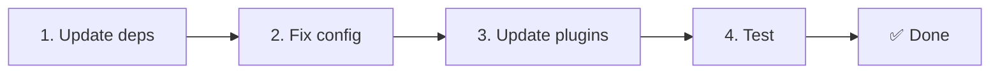

# 📦 Migration de v2.x vers v3.x

<Tip>
Consultez [Migration depuis nuxt-i18n](/migration/from-nuxtjs-i18n) — ce guide couvre le passage depuis l'écosystème vue-i18n, pas depuis nuxt-i18n-micro v2.
</Tip>

v3.0.0 introduit des changements architecturaux fondamentaux : paquets de stratégies, nouveau système de mise en cache, gestion centralisée de la langue via `useI18nLocale()` et pipeline de redirection redessiné. Cette section couvre tous les changements incompatibles et comment mettre à jour votre code.

## Étapes de migration



## Résumé des changements incompatibles

- **État de la langue** — `useState` / `useCookie` manuellement → composable `useI18nLocale()`
- **Accès à la config** — `useRuntimeConfig().public.i18nConfig` → `getI18nConfig()` depuis `#build/i18n.strategy.mjs`
- **Composant de redirection** — option `fallbackRedirectComponentPath` → greffon de redirection serveur + intergiciel de route client (automatique)
- **`includeDefaultLocaleRoute`** — pris en charge (déprécié) → retiré, utilisez l'option `strategy`
- **`experimental.hmr`** — sous `experimental` → option au niveau racine
- **`previousPageFallback`** — entièrement retiré (la stratégie de fusion cumulative gère cela automatiquement)
- **Mise en cache** — `useStorage('cache')` → singleton `TranslationStorage` (`Symbol.for` sur `globalThis`)
- **Transfert SSR** — configuration d'exécution → charge utile Nuxt (v3 utilisait `useState` ; les fragments vivent maintenant dans `payload.data`, voir [Performance](/guides/performance#server-side-payload-transfer))
- **Classes de stratégie** — internes → paquets séparés (`@i18n-micro/route-strategy`, `@i18n-micro/path-strategy`)

## Retiré : `fallbackRedirectComponentPath`

L'option `fallbackRedirectComponentPath` et le composant de repli `locale-redirect.vue` ont été retirés. La logique de redirection est maintenant gérée par :

1. **Intergiciel serveur** (`i18n.global.ts`) — définit `event.context.i18n.locale`
2. **Greffon de redirection serveur** (`06.redirect.ts`, serveur seulement) — redirections 302 avant le rendu
3. **Intergiciel de route client** (`i18n-redirect.global.ts`) — redirections SPA après l'hydratation

```diff
 i18n: {
   strategy: 'prefix_except_default',
-  fallbackRedirectComponentPath: '~/components/MyRedirect.vue',
 }
```

Si vous aviez une logique de redirection personnalisée dans le composant de repli, implémentez-la plutôt dans un greffon serveur :

```ts
// plugins/i18n-loader.server.ts
export default defineNuxtPlugin({
  name: 'i18n-custom-redirect',
  enforce: 'pre',
  order: -10,
  setup() {
    const { setLocale } = useI18nLocale()
    // Your custom detection logic
    setLocale(detectedLocale)
  },
})
```

## Retiré : `includeDefaultLocaleRoute`

Utilisez plutôt l'option `strategy` :

- `includeDefaultLocaleRoute: true` → `strategy: 'prefix'`
- `includeDefaultLocaleRoute: false` → `strategy: 'prefix_except_default'` (la valeur par défaut)

```diff
 i18n: {
-  includeDefaultLocaleRoute: true,
+  strategy: 'prefix',
 }
```

## Accès à la config : `getI18nConfig()` remplace `useRuntimeConfig`

```diff
- const config = useRuntimeConfig()
- const cookieName = config.public.i18nConfig?.localeCookie || 'user-locale'
+ import { getI18nConfig } from '#build/i18n.strategy.mjs'
+ const { localeCookie: configCookie } = getI18nConfig()
+ const cookieName = configCookie ?? 'user-locale'
```

## Gestion de la langue : `useI18nLocale()` remplace la gestion d'état manuelle

En v2, vous avez peut-être utilisé `useState('i18n-locale')` ou `useCookie('user-locale')` directement. En v3, utilisez le composable centralisé `useI18nLocale()` :

```diff
- const locale = useState('i18n-locale')
- const cookie = useCookie('user-locale')
- locale.value = 'fr'
- cookie.value = 'fr'
+ const { setLocale } = useI18nLocale()
+ setLocale('fr') // Updates both state and cookie atomically
```

Consultez [Détection de langue personnalisée](/guides/custom-language-detection) pour des exemples détaillés.

## Options expérimentales déplacées / retirées

`hmr` a été déplacé de `experimental` au niveau racine. `previousPageFallback` a été entièrement retiré — le module utilise maintenant une stratégie de fusion profonde cumulative (2 niveaux de profondeur) qui préserve automatiquement les traductions de la page précédente durant les animations de transition, même lorsque les pages partagent des clés imbriquées qui se chevauchent. Après la fin de l'animation de transition, le crochet `page:transition:finish` nettoie les clés de l'ancienne page en mémoire.

```diff
 i18n: {
-  experimental: {
-    hmr: true,
-    previousPageFallback: true
-  }
+  hmr: true,
+  // previousPageFallback removed — handled automatically
 }
```

## Architecture des redirections (v3)

Les redirections sont maintenant gérées automatiquement par deux composants :

1. **Côté serveur** (`06.redirect.ts`, serveur seulement) : s'exécute pendant le SSR, émet des redirections 302 avant tout rendu de page — pas de « flash d'erreur »
2. **Côté client** (`i18n-redirect.global.ts`) : intergiciel de route global lors de la navigation SPA ; préserve la chaîne de requête et le hash

Priorité de langue pour les redirections :

1. `useState('i18n-locale')` — défini via `useI18nLocale().setLocale()`
2. Témoin — si `localeCookie` est configuré
3. En-tête `Accept-Language` — si `autoDetectLanguage: true`
4. `defaultLocale` — repli

Aucun changement de code n'est requis pour les configurations standard.

<Warning>
Pour les stratégies `prefix` et `prefix_except_default` avec `redirects: true`, définissez `localeCookie: 'user-locale'` pour activer la persistance de la langue entre les rechargements de page. Sans cela, les redirections utilisent uniquement `Accept-Language` ou `defaultLocale`.
</Warning>

## TypeScript : types de module internes (optionnel)

Si vous rencontrez des erreurs de type liées aux importations internes comme `#i18n-internal/plural`, `#i18n-internal/strategy` ou `#i18n-internal/config`, ajoutez la section `imports` au `package.json` de votre projet :

```json
{
  "imports": {
    "#i18n-internal/plural": "nuxt-i18n-micro/internals",
    "#i18n-internal/strategy": "nuxt-i18n-micro/internals",
    "#i18n-internal/config": "nuxt-i18n-micro/internals"
  }
}
```

<Tip>

</Tip>
