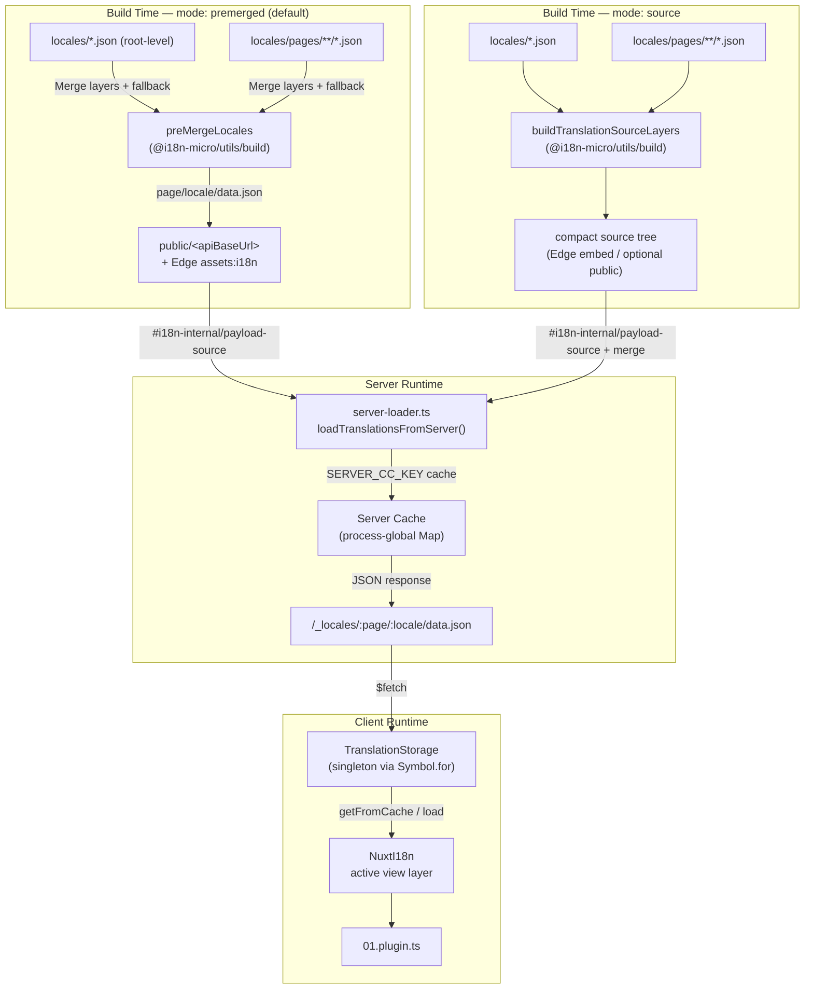

# 🗄️ Architecture du cache et du stockage des traductions

## 📖 Vue d'ensemble

Nuxt I18n Micro v3 utilise une architecture de mise en cache multi-couches pour les traductions. Le chargement des payloads dépend de `translationPayloads.mode` :

- **`premerged`** (par défaut) — les fichiers racine, page, fallback et layer sont fusionnés au moment du build via `@i18n-micro/utils/build` en `\{page\}/\{locale\}/data.json`
- **`source`** — les fichiers source compacts sont conservés pour une fusion à l'exécution via `@i18n-micro/utils/source-loader` et `@i18n-micro/utils/merge-source` (Edge les intègre dans les `serverAssets` de Nitro ; Node les lit depuis `public/` s'ils sont copiés)

Cette page décrit comment fonctionne le cache intégré et comment l'étendre pour des cas d'usage personnalisés (outils d'administration, APIs externes, invalidation de cache).

## 📊 Aperçu de l'architecture

### Flux de données



## 🧱 Composants clés

### 1. `TranslationStorage` (client + serveur)

**Fichier** : `src/runtime/utils/storage.ts`

Une classe singleton qui fournit un stockage de traduction unifié pour le client et le serveur. Utilise `Symbol.for('__NUXT_I18N_STORAGE_CACHE__')` sur `globalThis` pour garantir qu'une seule instance existe, même lorsque plusieurs bundles sont chargés.

**Méthodes clés :**

| Méthode                              | Description                                                            |
| ----------------------------------- | ---------------------------------------------------------------------- |
| `getFromCache(locale, routeName?)`  | Vérification synchrone : renvoie les données en cache en mémoire, ou `null` |
| `load(locale, routeName?, options)` | Chargement asynchrone avec mise en cache : vérifie d'abord le cache, puis récupère via `$fetch` |
| `clear()`                           | Vide tout le cache                                                     |

**Format de la clé de cache** : `\{locale\}:\{routeName\}` (par ex. `en:index`, `fr:about`)

```typescript
import { translationStorage } from '../utils/storage'

// Synchronous cache check
const cached = translationStorage.getFromCache('en', 'index')

// Async load (with automatic caching)
const result = await translationStorage.load('en', 'index', {
  apiBaseUrl: '_locales',
  baseURL: '/',
  dateBuild: '2024-01-01',
})
// result.data — merged translations
// result.cacheKey — cache key used
```

### ⚙️ Invalidation de cache déterministe (`i18n.dateBuild`)

Par défaut, ce module génère `dateBuild` au moment du build en utilisant `Date.now()`. Il est ensuite intégré dans le `#build/i18n.strategy.mjs` généré et utilisé comme paramètre de requête (`?v=...`) pour invalider les caches de fetch de traduction après les rebuilds.

Si vous avez besoin de builds reproductibles (par exemple, pour améliorer les taux de succès du cache de chunks dans les déploiements rolling), définissez une valeur stable dans `nuxt.config` :

```ts
export default defineNuxtConfig({
  i18n: {
    // Any stable string/number (git SHA, CI build number, release tag, etc.)
    dateBuild: process.env.GIT_SHA ?? 'local-dev',
  },
})
```

### 2. `loadTranslationsFromServer()` (serveur uniquement)

**Fichier** : `src/runtime/server/utils/server-loader.ts`

Charge les traductions pour une paire locale/page et met en cache le résultat fusionné dans une map `CacheControl` globale au processus, indexée par `@i18n-micro/hmr/cache-keys` (`SERVER_CC_KEY`).

Comportement : le SSR charge depuis `#i18n-internal/payload-source` — **Node** `readFile` sous `public/<apiBaseUrl>` (`\{page\}/\{locale\}/data.json` en mode premerged), **Edge** `assets:i18n`. `premerged` lit un seul fichier ; `source` fusionne root/page/fallback via `@i18n-micro/utils/source-loader`.

```typescript
import { loadTranslationsFromServer } from '../server/utils/server-loader'

// Returns { data: Translations, json: string }
const { data, json } = await loadTranslationsFromServer('en', 'index')
```

### 3. Chargement client (pas d'intégration HTML)

Les dictionnaires ne sont **pas** écrits dans `nuxtApp.payload`. Le serveur les garde en mémoire pour le rendu SSR ; le plugin client `await`s `switchContext`, qui charge `/\{apiBaseUrl\}/:page/:locale/data.json` (même posture par défaut que `@nuxtjs/i18n` avec `experimental.preload: false`).

`NuxtI18n` contient le dictionnaire de la couche de vue active utilisé par `$t()` et `$has()`. `NuxtTranslationLoader` bascule le contexte locale/route et fusionne les chunks dans cette couche.

### 4. Route API serveur

**Route** : `/_locales/\{page\}/\{locale\}/data.json`

**Fichier** : `src/runtime/server/routes/i18n.ts`

Cette route Nitro sert les traductions fusionnées pour le mode de payload actif. Elle appelle `loadTranslationsFromServer()` et renvoie le résultat au format JSON.

En production, elle définit également :

```http
Cache-Control: public, max-age={httpCacheDuration}, immutable
```

La valeur par défaut de `httpCacheDuration` est `31536000` (1 an). Cela est sûr car les clients demandent les payloads avec un cache-busting `?v=\{dateBuild\}`. Mettez `httpCacheDuration: 0` pour omettre l'en-tête. L'en-tête n'est pas appliqué en développement.

## 📥 Extension : chargement de traduction personnalisé

### Lire depuis le cache (route serveur)

```ts
// server/api/i18n/load-cache.[post].ts
import { defineEventHandler, readBody } from 'h3'
import { loadTranslationsFromServer } from '#imports'

export default defineEventHandler(async (event) => {
  const { page, locale } = await readBody<{ page: string; locale: string }>(event)
  const { data } = await loadTranslationsFromServer(locale, page)
  return { locale, page, data }
})
```

### Mettre à jour les traductions (fichier + invalider le cache)

```ts
// server/api/i18n/update.[post].ts
import { defineEventHandler, readBody, createError } from 'h3'
import { join } from 'node:path'
import { readFile, writeFile } from 'node:fs/promises'
import { deepMergeTranslations } from '@i18n-micro/utils/deep-merge'

export default defineEventHandler(async (event) => {
  const { path, updates } = await readBody<{ path: string; updates: Record<string, unknown> }>(event)

  if (!path || !updates) {
    throw createError({ statusCode: 400, statusMessage: 'Missing path or updates' })
  }

  const fullPath = join('locales', path)
  let existing: Record<string, unknown> = {}

  try {
    const content = await readFile(fullPath, 'utf-8')
    existing = JSON.parse(content) as Record<string, unknown>
  } catch {
    // File does not exist — create new
  }

  const merged = deepMergeTranslations(existing, updates)
  await writeFile(fullPath, JSON.stringify(merged, null, 2), 'utf-8')

  return { success: true, path, updated: merged }
})
```

<Tip>

</Tip>

## 🧹 Vider le cache

### Vidage programmatique du cache (client)

Utilisez la méthode intégrée `$clearCache` :

```vue
<script setup>
const { $clearCache } = useNuxtApp()

// Clears both TranslationStorage and plugin-level cache
$clearCache()
</script>
```

### Comportement du cache serveur

Le cache côté serveur (`loadTranslationsFromServer`) est global au processus et persiste jusqu'à :

- Redémarrage du processus serveur
- Détection d'un nouveau déploiement (valeur différente de `dateBuild`)

Pour les environnements serverless, chaque démarrage à froid a un cache vierge.

## ⚙️ Configuration serverless

Pour les environnements serverless (Cloudflare Workers, AWS Lambda), le cache intégré utilise des objets `Map` en mémoire. Aucune configuration de stockage externe n'est requise pour le cache de traduction lui-même.

Cependant, le stockage Nitro pour les fichiers de traduction sources peut nécessiter une configuration :

```ts
export default defineNuxtConfig({
  nitro: {
    storage: {
      // Only needed if default file-system storage is unavailable
      'assets:server': {
        driver: 'cloudflare-kv-binding',
        binding: 'MY_KV_NAMESPACE',
      },
    },
  },
})
```

## 💡 Principales différences par rapport à v2

| Aspect           | v2                            | v3                                                                       |
| ---------------- | ----------------------------- | ------------------------------------------------------------------------ |
| Cache client     | `useStorage('cache')`         | Singleton `TranslationStorage` (Symbol.for sur globalThis)               |
| Transfert SSR    | Configuration d'exécution     | Chunks complets via `payload.data` (v3.0 utilisait `useState`)           |
| Cache serveur    | Stockage de cache Nitro       | `Map` globale au processus via `Symbol.for`                              |
| Logique de fusion | Côté client                  | Au moment du build (`premerged`) ou à l'exécution (`source`) via `@i18n-micro/utils/*` |
| Format de clé de cache | `i18n:merged:\{page\}:\{locale\}` | `\{locale\}:\{routeName\}`                                             |

## 📚 Voir aussi

- [Guide de performance](/guides/performance) — Comment la mise en cache impacte les performances
- [Traductions côté serveur](/guides/server-side-translations) — Utiliser les traductions dans les routes serveur
- [Déploiement Firebase](/guides/firebase) — Considérations de cache spécifiques au déploiement
