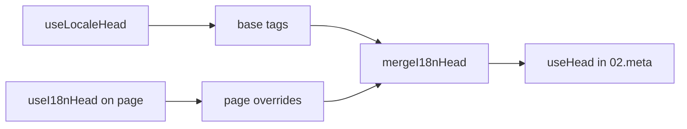

# Composable `useI18nHead`

`useI18nHead` vous permet de personnaliser les balises SEO i18n **par page** sans plugin de meta personnalisé. Lorsque `meta: true`, le module fusionne votre entrée par-dessus la sortie de [`useLocaleHead`](/api/composables/use-locale-head).

Cas typiques :

- **Articles CMS / blog** — seules certaines locales sont traduites ; les URLs alternatives diffèrent selon la langue (slugs ou chemins différents).
- **Canonique dynamique** — l'URL canonique doit correspondre à l'URL d'article de l'API, et non à `$switchLocalePath`.
- **Open Graph supplémentaire** — `og:title`, `og:description`, `og:image` en plus des `og:locale` / `og:url` générés automatiquement.
- **Contrôle partiel** — conserver le canonique et `og:url` générés par le module, mais remplacer uniquement `hreflang` et `og:locale:alternate`.

---

## Signature

{/* generated:symbol:useI18nHead — do not edit; run `pnpm run docs:generate` */}

```ts
useI18nHead(input?: MaybeRefOrGetter<I18nHeadInput | null>): { pageHead: any; resetPageHead: () => void }
```

Enregistre les surcharges de niveau page pour les balises head SEO i18n.
Fusionnées par-dessus la sortie de `useLocaleHead` par le plugin `02.meta`.

| Paramètre | Type | Description |
| --- | --- | --- |
| `input` *(optionnel)* | `MaybeRefOrGetter<I18nHeadInput \| null>` |  |

{/* /generated:symbol:useI18nHead */}

## Comment il s'intègre dans le pipeline



Vous appelez `useI18nHead` dans un composant de page. Le plugin `02.meta` applique les surcharges après chaque `updateMeta()` (changement de route, `$setI18nRouteParams`, `page:finish` sur le client).

---

## Exemple 1 — Article avec traductions dans certaines locales seulement

Un motif courant : l'API renvoie les locales qui existent et leurs URLs absolues ou relatives.

```ts
interface Article {
  title: string
  slug: string
  /** Locale code → page URL (absolute or site-relative) */
  locales: Record<string, string>
}
```

```vue
<script setup lang="ts">
const route = useRoute()
const { data: article } = await useFetch<Article>(`/api/articles/${route.params.slug}`)

const localeCodes = computed(() => Object.keys(article.value?.locales ?? {}))

useI18nHead(() => {
  if (!article.value) return null

  return {
    meta: [
      { property: 'og:title', content: article.value.title },
      { property: 'og:type', content: 'article' },
    ],
    replace: {
      hreflang: localeCodes.value.map((locale) => ({
        rel: 'alternate',
        hreflang: locale,
        href: article.value!.locales[locale]!,
      })),
      ogAlternates: localeCodes.value,
    },
  }
})
</script>
```

`ogAlternates` prend les **codes de locale** de votre configuration `i18n.locales`. Les valeurs pour `og:locale:alternate` sont résolues via `locale.og` ou `iso` (format Open Graph `en_US`).

---

## Exemple 2 — Article avec slugs par locale (`$defineI18nRoute` + `$setI18nRouteParams`)

Lorsque les URLs sont construites à partir de modèles de routes localisées et de paramètres dynamiques :

```vue
<script setup lang="ts">
const { $defineI18nRoute, $setI18nRouteParams } = useNuxtApp()
const route = useRoute()

const { data: article } = await useFetch(`/api/articles/${route.params.slug}`)

$defineI18nRoute({
  localeRoutes: {
    en: '/blog/[slug]',
    de: '/de/blog/[slug]',
    fr: '/fr/blog/[slug]',
  },
})

if (article.value) {
  $setI18nRouteParams({
    en: { slug: article.value.slugEn },
    de: { slug: article.value.slugDe },
    fr: { slug: article.value.slugFr },
  })

  const availableLocales = article.value.availableLocales as string[]

  useI18nHead({
    meta: [{ property: 'og:title', content: article.value.title }],
    replace: {
      hreflang: availableLocales.map((locale) => ({
        rel: 'alternate',
        hreflang: locale,
        href: article.value!.urls[locale],
      })),
      ogAlternates: availableLocales,
    },
  })
}
</script>
```

Les alternatives générées par le module listeraient **toutes** les locales configurées. `replace.hreflang` limite les balises aux locales qui ont réellement une traduction.

---

## Exemple 3 — `x-default` personnalisé pour l'URL d'article dans la locale par défaut

Par défaut, `x-default` pointe vers l'URL de la locale par défaut depuis `$switchLocalePath`. Pour les articles, faites-le pointer vers l'URL de la traduction par défaut :

```vue
<script setup lang="ts">
const { $defaultLocale } = useNuxtApp()
const article = await loadArticle()

const defaultLocale = $defaultLocale() ?? 'en'
const defaultHref = article.locales[defaultLocale]

useI18nHead({
  replace: {
    hreflang: Object.entries(article.locales).map(([locale, href]) => ({
      rel: 'alternate',
      hreflang: locale,
      href,
    })),
    xDefault: defaultHref ? { rel: 'alternate', hreflang: 'x-default', href: defaultHref } : false,
    ogAlternates: Object.keys(article.locales),
  },
})
</script>
```

---

## Exemple 4 — Remplacer le canonique et `og:url` avec des données de l'API

Lorsque le canonique doit correspondre à une URL fournie par le CMS (multi-domaine, chemin personnalisé ou URL absolue prédéfinie) :

```vue
<script setup lang="ts">
const article = await loadArticle()
const canonical = article.canonicalUrl // e.g. https://www.example.com/en/blog/my-post

useI18nHead({
  replace: {
    canonical,
    ogUrl: canonical,
    hreflang: buildAlternateLinks(article),
    ogAlternates: Object.keys(article.locales),
  },
  meta: [
    { property: 'og:title', content: article.title },
    { name: 'description', content: article.excerpt },
  ],
})
</script>
```

---

## Exemple 5 — Conserver le canonique / `og:url` automatique, ne remplacer que les alternatives

Si `$switchLocalePath` + `$setI18nRouteParams` produisent déjà un canonique et `og:url` corrects, ne remplacez que les balises de découverte :

```vue
<script setup lang="ts">
const article = await loadArticle()

useI18nHead({
  replace: {
    hreflang: buildAlternateLinks(article),
    ogAlternates: Object.keys(article.locales),
  },
})
</script>
```

---

## Exemple 6 — Head complet pour une page de détail de contenu (meta + links)

Modèle similaire à la répartition des « meta de page » et « liens alternatifs » dans des helpers séparés — combiné en un seul appel :

```vue
<script setup lang="ts">
const article = await loadArticle()
const alternates = Object.entries(article.locales).map(([locale, href]) => ({
  rel: 'alternate' as const,
  hreflang: locale,
  href: normalizeSeoUrl(href), // strip ?query and #hash if needed
}))

useI18nHead({
  meta: [
    { property: 'og:title', content: article.title },
    { property: 'og:description', content: article.description },
    { property: 'og:image', content: article.imageUrl },
    { name: 'twitter:card', content: 'summary_large_image' },
    { name: 'twitter:title', content: article.title },
  ],
  replace: {
    canonical: article.canonicalUrl,
    ogUrl: article.canonicalUrl,
    hreflang: alternates,
    ogAlternates: Object.keys(article.locales),
  },
})
</script>
```

```ts
/** Remove query and hash — useful when CMS URLs must be clean for SEO */
function normalizeSeoUrl(href: string): string {
  try {
    const url = new URL(href, 'https://placeholder.local')
    url.search = ''
    url.hash = ''
    return href.startsWith('http') ? url.href : `${url.pathname}`
  } catch {
    return href.split(/[?#]/)[0] ?? href
  }
}
```

---

## Exemple 7 — Deux types de contenu, même motif (actualités vs guides)

Même forme d'API, noms de routes différents — réutilisez un petit helper :

```ts
// composables/useArticleHead.ts
import type { I18nHeadInput } from '@i18n-micro/types'

interface LocalizedContent {
  title: string
  locales: Record<string, string>
  canonicalUrl?: string
}

export function buildArticleHead(content: LocalizedContent): I18nHeadInput {
  const localeCodes = Object.keys(content.locales)
  const canonical = content.canonicalUrl ?? content.locales.en

  return {
    meta: [{ property: 'og:title', content: content.title }],
    replace: {
      canonical,
      ogUrl: canonical,
      hreflang: localeCodes.map((locale) => ({
        rel: 'alternate',
        hreflang: locale,
        href: content.locales[locale]!,
      })),
      ogAlternates: localeCodes,
    },
  }
}
```

```vue
<!-- pages/blog/[slug].vue -->
<script setup lang="ts">
const article = await loadArticle()
useI18nHead(buildArticleHead(article))
</script>
```

```vue
<!-- pages/guides/[slug].vue -->
<script setup lang="ts">
const guide = await loadGuide()
useI18nHead(buildArticleHead(guide))
</script>
```

---

## Exemple 8 — Désactiver les alternatives intégrées, fournir votre propre liste

Équivalent à désactiver le générateur hreflang du module et à passer une liste personnalisée (pas de doublons d'ensembles alternates) :

```vue
<script setup lang="ts">
const article = await loadArticle()

useI18nHead({
  disable: ['hreflang', 'x-default', 'og-alternates'],
  link: Object.entries(article.locales).map(([locale, href]) => ({
    rel: 'alternate',
    hreflang: locale,
    href,
  })),
  replace: {
    ogAlternates: Object.keys(article.locales),
  },
})
</script>
```

Ou préférez `replace.hreflang` sans `disable` — cela remplace tous les liens `rel="alternate"` en une seule étape.

---

## Exemple 9 — Landing page : uniquement OG supplémentaire, conserver toutes les balises i18n

```vue
<script setup lang="ts">
const { t } = useI18n()

useI18nHead({
  meta: [
    { property: 'og:title', content: t('landing.ogTitle') },
    { property: 'og:description', content: t('landing.ogDescription') },
  ],
})
</script>
```

---

## Exemple 10 — Page produit : désactiver hreflang pour une expérimentation sur une locale

```vue
<script setup lang="ts">
useI18nHead({
  disable: ['hreflang', 'x-default'],
  // canonical, og:locale, og:url still generated
})
</script>
```

---

## Exemple 11 — Mises à jour réactives après un fetch côté client

```vue
<script setup lang="ts">
const article = ref<Article | null>(null)

onMounted(async () => {
  article.value = await $fetch('/api/articles/latest')
})

useI18nHead(() => {
  if (!article.value) return null
  return {
    meta: [{ property: 'og:title', content: article.value.title }],
    replace: {
      hreflang: Object.entries(article.value.locales).map(([locale, href]) => ({
        rel: 'alternate',
        hreflang: locale,
        href,
      })),
    },
  }
})
</script>
```

Le head est actualisé sur `page:finish` et lorsque l'état `pageHead` change.

---

## Exemple 12 — Origine HTTPS derrière un reverse proxy

Si vous résolviez auparavant un composable « d'origine publique » pour les URLs absolues canoniques / alternatives, utilisez plutôt la configuration du module :

```ts
// nuxt.config.ts
export default defineNuxtConfig({
  i18n: {
    meta: true,
    // undefined = origin from current request (multi-domain friendly)
    metaBaseUrl: undefined,
    metaTrustForwardedHost: true,
    metaTrustForwardedProto: true,
  },
})
```

Puis passez des **chemins ou URLs complètes** dans `replace.hreflang` / `replace.canonical`. Le module utilise `useRequestURL` avec `X-Forwarded-Host` / `X-Forwarded-Proto` en SSR.

---

## Référence de l'API

### `meta`

Balises `<meta>` supplémentaires. Dédupliquées par `id`, `property` ou `name`.

### `link`

Balises `<link>` supplémentaires. Dédupliquées par `id` ou `rel` + `hreflang`.

### `htmlAttrs`

Fusionnées dans les attributs `<html>` depuis `useLocaleHead` (`lang`, `dir`).

### `replace`

| Clé            | Type                      | Effet                                          |
| -------------- | ------------------------- | ---------------------------------------------- |
| `canonical`    | `string \| false`         | Remplace ou supprime le lien canonique         |
| `hreflang`     | `I18nHeadLink[] \| false` | Remplace ou supprime tous les liens `rel="alternate"` |
| `xDefault`     | `I18nHeadLink \| false`   | Remplace ou supprime `hreflang="x-default"`    |
| `ogLocale`     | `string \| false`         | Remplace ou supprime `og:locale`               |
| `ogUrl`        | `string \| false`         | Remplace ou supprime `og:url`                  |
| `ogAlternates` | `string[] \| false`       | Reconstruit `og:locale:alternate` pour les codes de locale |

### `disable`

| Valeur          | Supprime                                 |
| --------------- | ---------------------------------------- |
| `hreflang`      | Liens alternatifs de locale (pas `x-default`) |
| `x-default`     | Lien `hreflang="x-default"`              |
| `canonical`     | Lien canonique                           |
| `og`            | `og:locale` et `og:url`                  |
| `og-alternates` | Balises `og:locale:alternate`            |
| `html`          | `lang` / `dir` sur `<html>`              |

---

## `useLocaleHead` vs `useI18nHead`

| Composable      | Portée               | Quand l'utiliser                            |
| --------------- | -------------------- | ------------------------------------------ |
| `useLocaleHead` | Global / head manuel | `meta: false`, configuration `useHead` entièrement personnalisée |
| `useI18nHead`   | Surcharges par page  | `meta: true`, personnaliser des pages spécifiques |

Lorsque `meta: true`, vous n'avez **pas** besoin de `useLocaleHead` sur les pages qui utilisent uniquement `useI18nHead`.

---

## Migration depuis un plugin i18n head personnalisé

De nombreux projets maintiennent un plugin personnalisé qui :

- fusionne les liens alternatifs spécifiques à la page depuis un état partagé ;
- filtre les entrées `hreflang` régionales en doublon ;
- normalise les valeurs `og:locale` ;
- supprime les chaînes de requête des URLs SEO.

Vous pouvez remplacer cela par `useI18nHead` sur chaque page de contenu et les valeurs par défaut du module.

| Approche précédente                                    | Avec `useI18nHead`                                   |
| ----------------------------------------------------- | ---------------------------------------------------- |
| État partagé + « quelles locales existent pour cet article » | `replace: \{ ogAlternates: localeCodes \}`         |
| Helper séparé construisant les liens `rel="alternate"` | `replace: \{ hreflang: links \}`                    |
| Plugin personnalisé fusionnant l'état de la page dans le head | Fusion intégrée dans `02.meta`                |
| « Origine publique » personnalisée pour les URLs absolues | `metaBaseUrl` + en-têtes forwarded (voir Exemple 12) |
| `og:locale` court (`en` au lieu de `en_US`)           | Définir `locale.og` ou utiliser `iso` → `en_US` (protocole OG) |

**`hreflang` depuis `iso`** : chaque locale émet une alternative avec `hreflang = iso || code`. Le `code` de routage n'est jamais utilisé lorsque `iso` est défini (évite les balises invalides comme `hreflang="mx"`). Optez pour les repli en langue nue (`es-ES` → aussi `es`) avec `hreflangBaseLanguage: true` — dérivé de `iso`, pas de `code`. Pour des listes entièrement personnalisées, utilisez `replace.hreflang`.

**JSON-LD** : `useI18nHead` ne génère pas de données structurées. Conservez `useHead(\{ script: [...] \})` ou un helper JSON-LD dédié à côté.

---

## Voir aussi

- [Guide SEO](/guides/seo) — génération automatique des meta et surcharges au niveau page
- [`useLocaleHead`](/api/composables/use-locale-head) — API head de bas niveau
