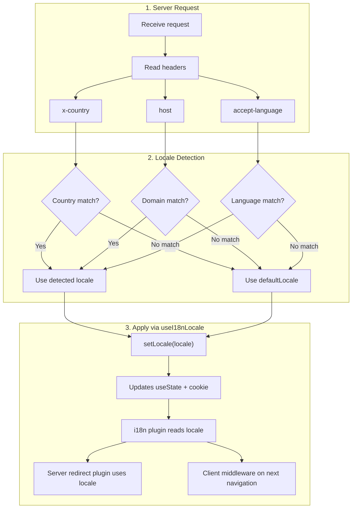

# 🔧 Détection de langue personnalisée dans Nuxt I18n Micro

## 📖 Vue d'ensemble

Nuxt I18n Micro v3 fournit un composable centralisé — `useI18nLocale()` — pour toute la gestion des locales. Cela remplace les patterns manuels `useState`/`useCookie` de la v2. En utilisant `useI18nLocale().setLocale()` dans un plugin serveur, vous pouvez implémenter n'importe quelle logique de détection personnalisée tout en conservant une compatibilité totale avec les systèmes de redirection et de cookies du module.

## 🏗️ Architecture

```mermaid
flowchart TB
    subgraph Plugins["Plugin Execution Order"]
        A["Your plugin<br/>order: -10"] -->|setLocale()| B["01.plugin.ts<br/>order: -5"]
        B --> C["06.redirect.ts server<br/>order: 10"]
    end

    subgraph Client["Client SPA Navigation"]
        D["i18n-redirect.global.ts<br/>route middleware"]
    end

    subgraph State["Locale State"]
        E["useState('i18n-locale')"]
        F["localeCookie"]
    end

    A -->|"setLocale() updates both"| E
    A -->|"setLocale() updates both"| F
    B -->|reads| E
    C -->|reads| E
    C -->|reads| F
    D -->|reads target route +| E
```

**Principe clé** : appelez `useI18nLocale().setLocale()` dans un plugin serveur avec `order: -10`. Cela met à jour à la fois `useState('i18n-locale')` et le cookie de locale de manière atomique, si bien que le plugin i18n (`order: -5`) et le plugin de redirection serveur (`order: 10`) voient la bonne locale dès la première requête SSR. Les redirections automatiques côté client s'exécutent dans le middleware global de route lors des navigations suivantes.

## 🛠️ Désactiver la détection automatique intégrée

Si vous voulez le contrôle total de la détection de locale, désactivez le mécanisme intégré :

```ts
export default defineNuxtConfig({
  i18n: {
    autoDetectLanguage: false,
  },
})
```

## ✨ Exemple : détection côté serveur avec `useI18nLocale`

C'est l'**approche recommandée** pour toutes les stratégies.

### Étape 1 : configurer `nuxt.config.ts`

```ts
export default defineNuxtConfig({
  modules: ['nuxt-i18n-micro'],
  i18n: {
    strategy: 'no_prefix', // Works with ANY strategy
    defaultLocale: 'en',
    localeCookie: 'user-locale',
    autoDetectLanguage: false,
    locales: [
      { code: 'en', iso: 'en-US' },
      { code: 'de', iso: 'de-DE' },
      { code: 'ja', iso: 'ja-JP' },
    ],
  },
})
```

### Étape 2 : créer `plugins/i18n-loader.server.ts`

```ts
import { defineNuxtPlugin, useRequestHeaders } from '#imports'

export default defineNuxtPlugin({
  name: 'i18n-custom-loader',
  enforce: 'pre',
  order: -10, // Execute BEFORE the i18n plugin (which has order -5)

  setup() {
    const { setLocale } = useI18nLocale()
    const headers = useRequestHeaders(['host', 'x-country', 'accept-language'])
    let detectedLocale = 'en'

    // --- YOUR DETECTION LOGIC ---

    // Example 1: By domain
    const host = headers['host']
    if (host?.includes('example.de')) {
      detectedLocale = 'de'
    }
    // Example 2: By custom header
    else if (headers['x-country'] === 'JP') {
      detectedLocale = 'ja'
    }
    // Example 3: By Accept-Language header
    else if (headers['accept-language']?.includes('de')) {
      detectedLocale = 'de'
    }

    // --- APPLY THE LOCALE ---
    setLocale(detectedLocale)
  },
})
```

### Comment cela fonctionne



1. **Le plugin s'exécute en premier** (`order: -10`) — détecte la locale depuis les en-têtes, le domaine ou d'autres sources
2. **`setLocale()` met à jour à la fois** `useState('i18n-locale')` et le cookie — garantit la visibilité immédiate pour tous les plugins suivants
3. **Le plugin i18n** (`order: -5`) lit la locale et charge les bonnes traductions
4. **Le plugin de redirection serveur** (`order: 10`) utilise la locale pour les décisions de redirection en SSR
5. **Le middleware de route client** (`i18n-redirect`) applique les redirections lors de la navigation SPA quand la locale de l'URL ne correspond pas à la préférence

## 🌐 Comportement spécifique à la stratégie

`useI18nLocale().setLocale()` fonctionne avec **toutes les stratégies**. Le comportement de redirection dépend de la stratégie :

<Tip>
| Stratégie | Effet de `setLocale('de')` |
|----------|---------------------------|
| `no_prefix` | Affiche en allemand, pas de changement d'URL |
| `prefix` | 302 → `/de/` (redirection côté serveur) |
| `prefix_except_default` | 302 → `/de/` si `de` ≠ défaut ; pas de redirection si `de` = défaut |
| `prefix_and_default` | Pas de redirection (à la fois `/` et `/de/` sont valides) |
</Tip>

**Notes importantes :**

- La détection de locale basée sur cookie est désactivée par défaut (`localeCookie: null`)
- Définissez `localeCookie: 'user-locale'` pour activer la persistance par cookie
- Si la valeur cookie/état n'est pas dans la liste `locales`, elle retombe sur `defaultLocale`

## 🏢 Avancé : détection basée sur le domaine

Pour les configurations multi-domaines où chaque domaine sert une locale différente :

```ts
import { defineNuxtPlugin, useRequestHeaders } from '#imports'

export default defineNuxtPlugin({
  name: 'i18n-domain-loader',
  enforce: 'pre',
  order: -10,

  setup() {
    const { setLocale } = useI18nLocale()
    const headers = useRequestHeaders(['host'])
    const host = headers['host'] || ''

    let detectedLocale = 'en'

    if (host.endsWith('.de') || host.includes('german.')) {
      detectedLocale = 'de'
    } else if (host.endsWith('.fr') || host.includes('french.')) {
      detectedLocale = 'fr'
    } else if (host.endsWith('.jp') || host.includes('japanese.')) {
      detectedLocale = 'ja'
    }

    setLocale(detectedLocale)
  },
})
```

## 🔄 Avancé : respecter la préférence utilisateur

Si les utilisateurs peuvent changer manuellement de langue, respectez leur choix plutôt que la détection automatique :

```ts
import { defineNuxtPlugin, useRequestHeaders } from '#imports'

export default defineNuxtPlugin({
  name: 'i18n-smart-loader',
  enforce: 'pre',
  order: -10,

  setup() {
    const { getLocale, setLocale } = useI18nLocale()

    // If user already has a preference (from cookie), respect it
    if (getLocale()) {
      return
    }

    // Otherwise, detect locale from headers
    const headers = useRequestHeaders(['accept-language'])
    let detectedLocale = 'en'

    const acceptLanguage = headers['accept-language'] || ''
    if (acceptLanguage.includes('de')) {
      detectedLocale = 'de'
    } else if (acceptLanguage.includes('ja')) {
      detectedLocale = 'ja'
    }

    setLocale(detectedLocale)
  },
})
```

## ⚙️ Plugins serveur uniquement ou client uniquement

Utilisez les [conventions de nom de fichier Nuxt](https://nuxt.com/docs/getting-started/directory-structure#plugins) pour contrôler où votre plugin s'exécute :

- **Serveur uniquement** : `i18n-loader.server.ts` — s'exécute uniquement pendant le SSR (recommandé pour la détection basée sur les en-têtes)
- **Client uniquement** : `i18n-loader.client.ts` — s'exécute uniquement dans le navigateur (pour `localStorage` ou détection basée sur le DOM)


## ✅ Résumé

| Fonctionnalité                         | Description                                                       |
| -------------------------------------- | ----------------------------------------------------------------- |
| `useI18nLocale().setLocale()`          | Met à jour `useState` + cookie de manière atomique ; fonctionne avec toutes les stratégies |
| `useI18nLocale().getLocale()`          | Renvoie la locale courante depuis l'état ou le cookie             |
| `useI18nLocale().getPreferredLocale()` | Renvoie la locale préférée (validée contre la liste `locales`)    |
| Plugin `order: -10`                    | Garantit que votre plugin s'exécute avant l'initialisation i18n   |
| `enforce: 'pre'`                       | S'exécute dans le groupe de plugins « pre »                        |

**À NE PAS FAIRE :**

- Utiliser `useCookie('user-locale')` directement — `useI18nLocale()` gère les cookies en interne
- Utiliser `useState('i18n-locale')` directement — utilisez plutôt `useI18nLocale().setLocale()`
- Définir `order` >= -5 — votre plugin doit s'exécuter avant le plugin i18n
