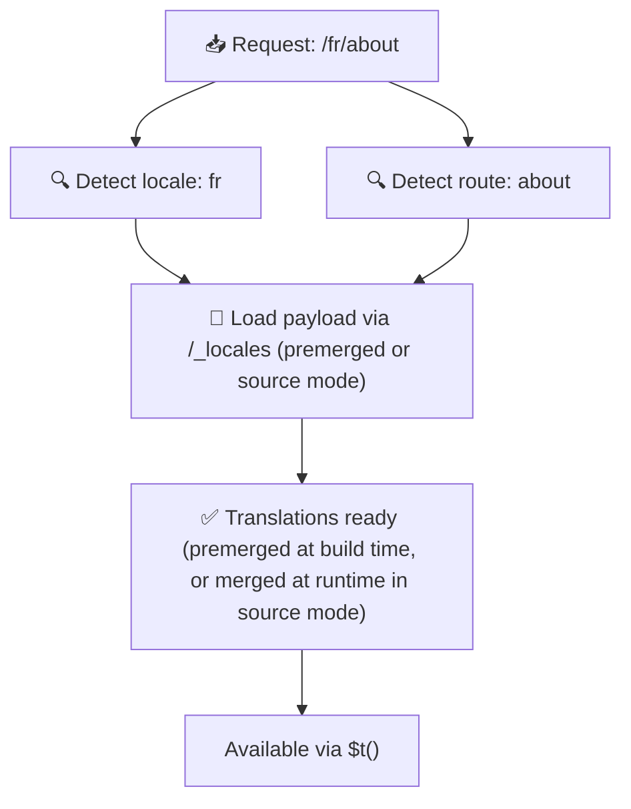

# 📂 Guide de structure des dossiers

## 📖 Introduction

Organiser vos fichiers de traduction de manière efficace est essentiel pour maintenir un système d'internationalisation (i18n) évolutif et efficient. `Nuxt I18n Micro` simplifie ce processus en offrant une approche claire pour gérer les traductions racines et spécifiques à chaque page. Ce guide vous présente la structure de dossiers recommandée et explique comment `Nuxt I18n Micro` gère ces traductions.

## 🗂️ Structure de dossiers recommandée

`Nuxt I18n Micro` organise les traductions en fichiers au niveau racine et en fichiers spécifiques aux pages dans le dossier `pages`. Avec `translationPayloads.mode: 'premerged'` (par défaut), les traductions racines sont automatiquement fusionnées dans chaque fichier de page au moment du build, si bien que chaque page dispose d'un ensemble complet de traductions sans surcoût de fusion à l'exécution.

Avec `mode: 'source'`, les fichiers source restent séparés dans les assets Nitro et sont fusionnés à l'exécution via la route `/_locales`. Voir [Sortie de payload serverless](/guides/performance#serverless-payload-output).

### 🔧 Structure de base

Voici un exemple de base de la structure de dossiers à suivre :

```text
locales/
├── pages/
│   ├── index/
│   │   ├── en.json
│   │   ├── fr.json
│   │   └── ar.json
│   ├── about/
│   │   ├── en.json
│   │   ├── fr.json
│   │   └── ar.json
├── en.json
├── fr.json
└── ar.json

```

### 📄 Explication de la structure

#### 1. 🌍 Fichiers de traduction au niveau racine

- **Chemin :** `/locales/\{locale\}.json` (par exemple, `/locales/en.json`)
- **Objectif :** ces fichiers contiennent les traductions partagées dans toute l'application (menus de navigation, en-têtes, pieds de page, etc.). Avec `mode: 'premerged'` (par défaut), ils sont fusionnés automatiquement dans chaque fichier spécifique à une page au moment du build, si bien que le serveur retourne un unique fichier préconstruit par page.

  **Exemple de contenu (`/locales/en.json`) :**

  ```json
  {
    "menu": {
      "home": "Home",
      "about": "About Us",
      "contact": "Contact"
    },
    "footer": {
      "copyright": "© 2024 Your Company"
    }
  }
  ```

#### 2. 📄 Fichiers de traduction spécifiques aux pages

- **Chemin :** `/locales/pages/\{routeName\}/\{locale\}.json` (par exemple, `/locales/pages/index/en.json`)
- **Objectif :** ces fichiers contiennent des traductions propres aux pages individuelles. Avec `mode: 'premerged'` (par défaut), les traductions racines sont fusionnées comme base au moment du build, si bien que chaque fichier de page devient autonome.

  **Exemple de contenu (`/locales/pages/index/en.json`) :**

  ```json
  {
    "title": "Welcome to Our Website",
    "description": "We offer a wide range of products and services to meet your needs."
  }
  ```

  **Exemple de contenu (`/locales/pages/about/en.json`) :**

  ```json
  {
    "title": "About Us",
    "description": "Learn more about our mission, vision, and values."
  }
  ```

### 📂 Gestion des routes dynamiques et des chemins imbriqués

`Nuxt I18n Micro` transforme automatiquement les segments dynamiques et les chemins imbriqués dans les routes en une structure de dossiers plate en utilisant une convention de renommage spécifique. Cela garantit que toutes les traductions sont stockées de manière cohérente et facilement accessible.

#### Structure de dossiers pour la traduction des routes dynamiques

Pour les routes dynamiques comme `/products/[id]`, le module convertit le segment dynamique `[id]` en un format statique dans la structure de fichiers.

**Exemple de structure de dossiers pour les routes dynamiques :**

Pour une route comme `/products/[id]`, les fichiers de traduction seraient stockés dans un dossier nommé `products-id` :

```text
locales/pages/
├── products-id/
│   ├── en.json
│   ├── fr.json
│   └── ar.json

```

**Exemple de structure de dossiers pour les routes dynamiques imbriquées :**

Pour une route imbriquée comme `/products/key/[id]`, les fichiers de traduction seraient stockés dans un dossier nommé `products-key-id` :

```text
locales/pages/
├── products-key-id/
│   ├── en.json
│   ├── fr.json
│   └── ar.json

```

**Exemple de structure de dossiers pour les routes imbriquées multi-niveaux :**

Pour une route imbriquée plus complexe comme `/products/category/[id]/details`, les fichiers de traduction seraient stockés dans un dossier nommé `products-category-id-details` :

```text
locales/pages/
├── products-category-id-details/
│   ├── en.json
│   ├── fr.json
│   └── ar.json

```

### 🛠 Personnaliser la structure des dossiers

Si vous préférez stocker les traductions dans un autre dossier, `Nuxt I18n Micro` vous permet de personnaliser le dossier où sont stockés les fichiers de traduction. Vous pouvez configurer cela dans votre fichier `nuxt.config.ts`.

**Exemple : personnaliser le dossier des traductions**

```typescript
export default defineNuxtConfig({
  i18n: {
    translationDir: 'i18n', // Custom directory path
  },
})
```

Cela indiquera à `Nuxt I18n Micro` de chercher les fichiers de traduction dans le dossier `/i18n` au lieu du dossier `/locales` par défaut.

## ⚙️ Comment les traductions sont chargées

### 🌍 Routes de locale dynamiques

`Nuxt I18n Micro` utilise des routes de locale dynamiques pour charger les traductions efficacement. Quand un utilisateur visite une page, le module détermine la locale appropriée et charge les fichiers de traduction correspondants en fonction de la route et de la locale courantes.



Par exemple :

- Visiter `/en/index` chargera les traductions depuis `/locales/pages/index/en.json`.
- Visiter `/fr/about` chargera les traductions depuis `/locales/pages/about/fr.json`.

Cette méthode garantit que seules les traductions nécessaires sont chargées, ce qui optimise à la fois la charge serveur et la performance côté client.

### 💾 Cache et prerendering

Pour améliorer encore les performances, `Nuxt I18n Micro` prend en charge la mise en cache et le prerendering des fichiers de traduction :

- **Cache** : une fois qu'un fichier de traduction est chargé, il est mis en cache pour les requêtes suivantes, réduisant le besoin de récupérer répétitivement les mêmes données.
- **Prerendering** : pendant le build, vous pouvez prerender les fichiers de traduction pour toutes les locales et routes configurées, ce qui permet de les servir directement depuis le serveur sans délai à l'exécution.

## 📝 Bonnes pratiques

### 📂 Utilisez les fichiers spécifiques aux pages judicieusement

Tirez parti des fichiers spécifiques aux pages pour garder les traductions organisées. Cela permet à chaque page d'avoir des traductions légères et rapides à charger, ce qui est particulièrement important pour les pages avec du contenu complexe ou volumineux.

### 🔑 Gardez des clés de traduction cohérentes

Utilisez des conventions de nommage cohérentes pour vos clés de traduction dans tous les fichiers. Cela aide à maintenir la clarté et à éviter les problèmes lors de la gestion des traductions, en particulier à mesure que votre application grandit.

### 🗂️ Organisez les traductions par contexte

Regroupez les traductions liées ensemble dans vos fichiers. Par exemple, regroupez tous les libellés de boutons sous une clé `buttons` et tous les textes liés aux formulaires sous une clé `forms`. Cela améliore non seulement la lisibilité mais facilite aussi la gestion des traductions entre différentes locales.

### ⚠️ Limite de profondeur d'imbrication (2 niveaux recommandés)

Pendant la navigation côté client, `Nuxt I18n Micro` utilise une fusion profonde optimisée sur 2 niveaux pour combiner les traductions des pages sortante et entrante. Cela garantit que les clés imbriquées qui se chevauchent (par exemple, si les deux pages ont des clés sous `common.*`) sont préservées pendant les animations de transition.

**Cela fonctionne correctement pour la structure standard `Section → Clé → Valeur` (2 niveaux) :**

```json
// Page A translations
{ "common": { "fromA": "Text A" } }

// Page B translations
{ "common": { "fromB": "Text B" } }

// During transition, both are available:
// { "common": { "fromA": "Text A", "fromB": "Text B" } }
```

**Cependant, si vous utilisez 3+ niveaux d'imbrication, les clés plus profondes peuvent être écrasées pendant les transitions :**

```json
// Page A translations
{ "auth": { "form": { "login": "Login" } } }

// Page B translations
{ "auth": { "form": { "register": "Register" } } }

// During transition: "login" key is lost
// { "auth": { "form": { "register": "Register" } } }
```


### 🧹 Nettoyez régulièrement les traductions inutilisées

Au fil du temps, votre application peut accumuler des clés de traduction inutilisées, en particulier si des fonctionnalités sont supprimées ou restructurées. Passez périodiquement en revue et nettoyez vos fichiers de traduction pour les garder légers et maintenables.
