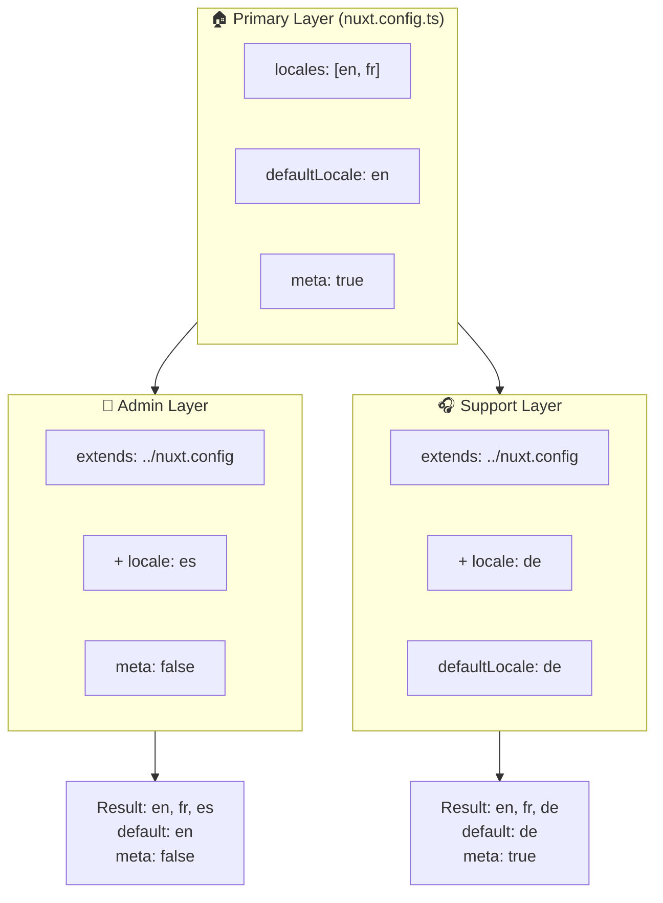

# 🗂️ Layers dans `Nuxt I18n Micro`

## 📖 Introduction aux layers

Les layers dans `Nuxt I18n Micro` vous permettent de gérer et personnaliser les paramètres de localisation avec flexibilité à travers différentes parties de votre application. En définissant différents layers, vous pouvez ajuster la configuration pour divers contextes, comme remplacer les paramètres pour des sections spécifiques de votre site ou créer des configurations de base réutilisables extensibles par d'autres parties de votre application.

### Flux d'héritage des layers



## 🛠️ Layer de configuration principal

Le **Layer de configuration principal** est l'endroit où vous configurez les paramètres de localisation par défaut pour toute votre application. Ce layer est essentiel car il définit la configuration globale, y compris les locales prises en charge, la langue par défaut et d'autres paramètres i18n critiques.

### 📄 Exemple : définir le layer de configuration principal

Voici un exemple de définition du layer de configuration principal dans votre fichier `nuxt.config.ts` :

```typescript
export default defineNuxtConfig({
  i18n: {
    locales: [
      { code: 'en', iso: 'en-EN', dir: 'ltr' },
      { code: 'fr', iso: 'fr-FR', dir: 'ltr' },
      { code: 'ar', iso: 'ar-SA', dir: 'rtl' },
    ],
    defaultLocale: 'en', // The default locale for the entire app
    translationDir: 'locales', // Directory where translations are stored
    meta: true, // Automatically generate SEO-related meta tags like `alternate`
    autoDetectLanguage: true, // Automatically detect and use the user's preferred language
  },
})
```

## 🌱 Layers enfants

Les layers enfants sont utilisés pour étendre ou remplacer la configuration principale pour des parties spécifiques de votre application. Par exemple, vous pouvez vouloir ajouter des locales supplémentaires ou modifier la locale par défaut pour une section particulière de votre site. Les layers enfants sont particulièrement utiles dans les applications modulaires où différentes parties peuvent avoir différentes exigences de localisation.

### 📄 Exemple : étendre le layer principal dans un layer enfant

Supposons que vous ayez une section de votre site qui doit prendre en charge des locales supplémentaires, ou que vous souhaitiez désactiver une locale particulière dans un certain contexte. Voici comment y parvenir en étendant le layer de configuration principal :

```typescript
// basic/nuxt.config.ts (Primary Layer)
export default defineNuxtConfig({
  i18n: {
    locales: [
      { code: 'en', iso: 'en-EN', dir: 'ltr' },
      { code: 'fr', iso: 'fr-FR', dir: 'ltr' },
    ],
    defaultLocale: 'en',
    meta: true,
    translationDir: 'locales',
  },
})
```

```typescript
// extended/nuxt.config.ts (Child Layer)
export default defineNuxtConfig({
  extends: '../basic', // Inherit the base configuration from the 'basic' layer
  i18n: {
    locales: [
      { code: 'en', iso: 'en-EN', dir: 'ltr' }, // Inherited from the base layer
      { code: 'fr', iso: 'fr-FR', dir: 'ltr' }, // Inherited from the base layer
      { code: 'de', iso: 'de-DE', dir: 'ltr' }, // Added in the child layer
    ],
    defaultLocale: 'fr', // Override the default locale to French for this section
    autoDetectLanguage: false, // Disable automatic language detection in this section
  },
})
```

### 🌐 Utiliser des layers dans une application modulaire

Dans une application Nuxt plus grande et modulaire, vous pouvez avoir plusieurs sections, chacune nécessitant ses propres paramètres i18n. En tirant parti des layers, vous pouvez maintenir une structure de configuration propre et évolutive.

### 📄 Exemple : configuration en layers dans une application modulaire

Imaginez que vous ayez un site e-commerce avec des sections distinctes comme le site principal, le panneau d'administration et le portail de support client. Chaque section peut avoir besoin d'un ensemble différent de locales ou d'autres paramètres i18n.

#### **Layer principal (configuration globale) :**

```typescript
// nuxt.config.ts
export default defineNuxtConfig({
  i18n: {
    locales: [
      { code: 'en', iso: 'en-EN', dir: 'ltr' },
      { code: 'fr', iso: 'fr-FR', dir: 'ltr' },
    ],
    defaultLocale: 'en',
    meta: true,
    translationDir: 'locales',
    autoDetectLanguage: true,
  },
})
```

#### **Layer enfant pour le panneau d'administration :**

```typescript
// admin/nuxt.config.ts
export default defineNuxtConfig({
  extends: '../nuxt.config', // Inherit the global settings
  i18n: {
    locales: [
      { code: 'en', iso: 'en-EN', dir: 'ltr' }, // Inherited
      { code: 'fr', iso: 'fr-FR', dir: 'ltr' }, // Inherited
      { code: 'es', iso: 'es-ES', dir: 'ltr' }, // Specific to the admin panel
    ],
    defaultLocale: 'en',
    meta: false, // Disable automatic meta generation in the admin panel
  },
})
```

#### **Layer enfant pour le portail de support client :**

```typescript
// support/nuxt.config.ts
export default defineNuxtConfig({
  extends: '../nuxt.config', // Inherit the global settings
  i18n: {
    locales: [
      { code: 'en', iso: 'en-EN', dir: 'ltr' }, // Inherited
      { code: 'fr', iso: 'fr-FR', dir: 'ltr' }, // Inherited
      { code: 'de', iso: 'de-DE', dir: 'ltr' }, // Specific to the support portal
    ],
    defaultLocale: 'de', // Default to German in the support portal
    autoDetectLanguage: false, // Disable automatic language detection
  },
})
```

Dans cet exemple modulaire :

- Chaque section (admin, support) possède ses propres paramètres i18n, mais toutes héritent de la configuration de base.
- Le panneau d'administration ajoute l'espagnol (`es`) comme locale et désactive la génération des balises meta.
- Le portail de support ajoute l'allemand (`de`) comme locale et définit l'allemand par défaut pour l'interface utilisateur.

## 📝 Bonnes pratiques pour utiliser les layers

- **🔧 Gardez le layer principal simple :** Le layer principal doit contenir les paramètres les plus couramment utilisés qui s'appliquent globalement à votre application. Gardez-le simple pour garantir la cohérence.
- **⚙️ Utilisez les layers enfants pour des personnalisations spécifiques :** Ne remplacez ou n'étendez les paramètres dans les layers enfants qu'en cas de besoin. Cette approche évite une complexité inutile dans votre configuration.
- **📚 Documentez vos layers :** Documentez clairement l'objectif et les spécificités de chaque layer dans votre projet. Cela contribuera à maintenir la clarté et facilitera la compréhension de la configuration par les autres (ou par votre futur vous).
