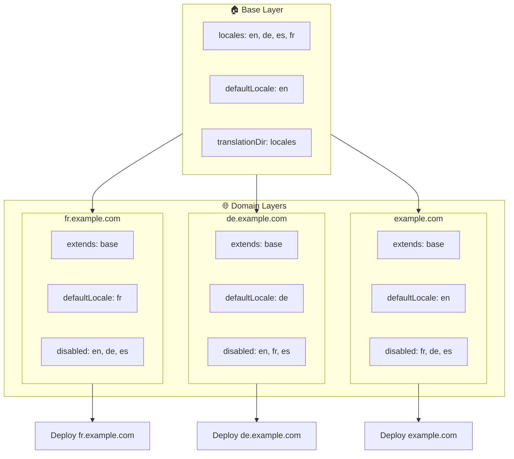

# 🌍 Mettre en place des locales multi-domaines avec `Nuxt I18n Micro` en utilisant les couches

## 📝 Introduction

En tirant parti des couches dans `Nuxt I18n Micro`, vous pouvez créer une configuration de localisation multi-domaine flexible et maintenable. Cette approche simplifie la gestion des domaines en supprimant le besoin de fonctionnalités complexes, et permet également une distribution de charge efficace et une réduction de la complexité du projet. En exécutant des projets distincts pour différentes locales, votre application peut facilement passer à l'échelle et s'adapter à des exigences de locale variées sur plusieurs domaines, offrant ainsi une solution robuste et scalable pour les applications mondiales.

## 🎯 Objectif

Créer une configuration où différents domaines servent des locales spécifiques en personnalisant les configurations dans les couches enfants. Cette méthode s'appuie sur le système de couches de Nuxt, ce qui vous permet de maintenir une configuration de base tout en l'étendant ou en la modifiant pour chaque domaine.

### Architecture multi-domaine



## 🛠 Étapes pour implémenter des locales multi-domaines

### 1. **Créer la couche de base**

Commencez par créer une couche de configuration de base qui inclut tous les paramètres de locale communs à votre application. Cette configuration servira de fondation aux autres configurations spécifiques à un domaine.

#### **Configuration de la couche de base**

Créez le fichier de configuration de base `base/nuxt.config.ts` :

```typescript
// base/nuxt.config.ts

export default defineNuxtConfig({
  i18n: {
    locales: [
      { code: 'en', iso: 'en-US', dir: 'ltr' },
      { code: 'de', iso: 'de-DE', dir: 'ltr' },
      { code: 'es', iso: 'es-ES', dir: 'ltr' },
    ],
    defaultLocale: 'en',
    translationDir: 'locales',
    meta: true,
    autoDetectLanguage: true,
  },
})
```

### 2. **Créer des couches enfants spécifiques au domaine**

Pour chaque domaine, créez une couche enfant qui modifie la configuration de base pour répondre aux exigences spécifiques de ce domaine. Vous pouvez désactiver les locales qui ne sont pas nécessaires pour un domaine donné.

#### **Exemple : configuration pour le domaine français**

Créez une configuration de couche enfant pour le domaine français dans `fr/nuxt.config.ts` :

```typescript
// fr/nuxt.config.ts

export default defineNuxtConfig({
  extends: '../base', // Inherit from the base configuration

  i18n: {
    locales: [
      { code: 'en', iso: 'en-US', dir: 'ltr', disabled: true }, // Disable English
      { code: 'fr', iso: 'fr-FR', dir: 'ltr' }, // Add and enable the French locale
      { code: 'de', iso: 'de-DE', dir: 'ltr', disabled: true }, // Disable German
      { code: 'es', iso: 'es-ES', dir: 'ltr', disabled: true }, // Disable Spanish
    ],
    defaultLocale: 'fr', // Set French as the default locale
    autoDetectLanguage: false, // Disable automatic language detection
  },
})
```

#### **Exemple : configuration pour le domaine allemand**

De la même manière, créez une configuration de couche enfant pour le domaine allemand dans `de/nuxt.config.ts` :

```typescript
// de/nuxt.config.ts

export default defineNuxtConfig({
  extends: '../base', // Inherit from the base configuration

  i18n: {
    locales: [
      { code: 'en', iso: 'en-US', dir: 'ltr', disabled: true }, // Disable English
      { code: 'fr', iso: 'fr-FR', dir: 'ltr', disabled: true }, // Disable French
      { code: 'de', iso: 'de-DE', dir: 'ltr' }, // Use the German locale
      { code: 'es', iso: 'es-ES', dir: 'ltr', disabled: true }, // Disable Spanish
    ],
    defaultLocale: 'de', // Set German as the default locale
    autoDetectLanguage: false, // Disable automatic language detection
  },
})
```

### 3. **Déployer l'application pour chaque domaine**

Déployez l'application avec la configuration appropriée pour chaque domaine. Par exemple :

- Déployez la configuration de la couche `fr` vers `fr.example.com`.
- Déployez la configuration de la couche `de` vers `de.example.com`.

### 4. **Mettre en place plusieurs projets pour différentes locales**

Pour chaque locale et domaine, vous devez exécuter une instance distincte de l'application. Cela garantit que chaque domaine sert la bonne configuration de locale, optimise la distribution de charge et simplifie la structure du projet. En exécutant plusieurs projets adaptés à chaque locale, vous pouvez maintenir une séparation propre entre les configurations et réduire la complexité globale.

### 5. **Configurer le routage en fonction du domaine**

Assurez-vous que votre routage est configuré pour diriger les utilisateurs vers le bon projet en fonction du domaine auquel ils accèdent. Cela garantit que chaque domaine sert la locale appropriée, améliorant l'expérience utilisateur et maintenant la cohérence entre les différentes régions.

### 6. **Déployer et vérifier**

Après avoir configuré les couches et les avoir déployées sur leurs domaines respectifs, assurez-vous que chaque domaine sert la bonne locale. Testez soigneusement l'application pour confirmer que la bonne locale est chargée selon le domaine.

## 📝 Bonnes pratiques

- **Gardez la configuration de base générique** : la configuration de base doit couvrir les paramètres généraux applicables à tous les domaines.
- **Isolez la logique spécifique au domaine** : conservez les configurations spécifiques à un domaine dans leurs couches respectives pour maintenir clarté et séparation des responsabilités.

## 🎉 Conclusion

En tirant parti des couches dans `Nuxt I18n Micro`, vous pouvez créer une configuration de localisation multi-domaine flexible et maintenable. Cette approche supprime non seulement le besoin de fonctionnalités complexes de gestion de domaines, mais permet également de distribuer la charge efficacement et de réduire la complexité du projet. Exécuter des projets distincts pour différentes locales garantit que votre application peut passer à l'échelle facilement et s'adapter à différentes exigences de locale sur divers domaines, offrant ainsi une solution robuste et scalable pour les applications mondiales.
