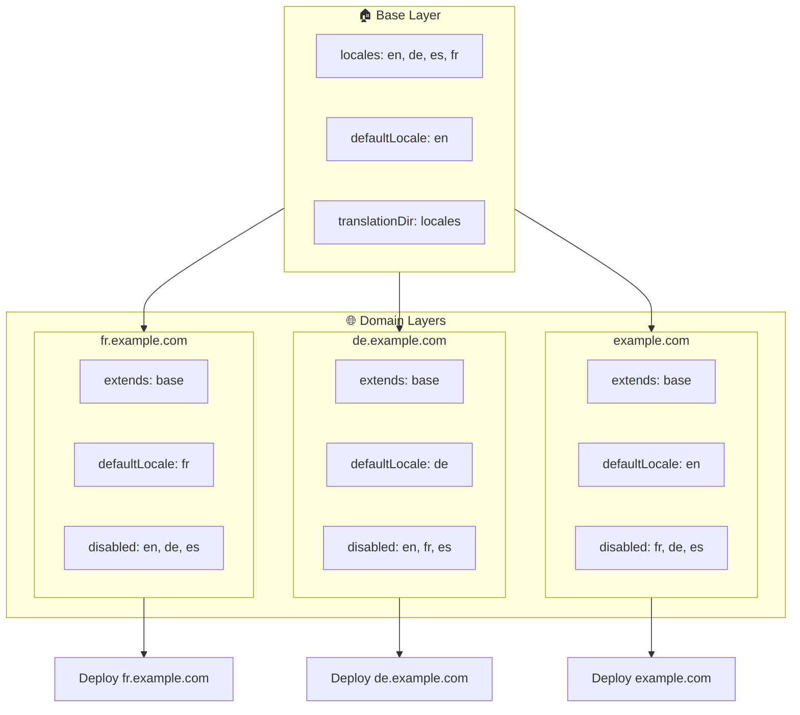

# 🌍 Configurer des locales multi-domaines avec `Nuxt I18n Micro` en utilisant des layers

## 📝 Introduction

En tirant parti des layers dans `Nuxt I18n Micro`, vous pouvez créer une configuration de localisation multi-domaine flexible et maintenable. Cette approche simplifie non seulement la gestion des domaines en éliminant le besoin de fonctionnalités complexes, mais permet également une distribution de charge efficace et une complexité de projet réduite. En exécutant des projets séparés pour différentes locales, votre application peut facilement s'adapter et évoluer selon les exigences de locale variées sur plusieurs domaines, offrant une solution robuste et évolutive pour les applications globales.

## 🎯 Objectif

Créer une configuration où différents domaines servent des locales spécifiques en personnalisant les configurations dans des layers enfants. Cette méthode s'appuie sur le système de layers de Nuxt, vous permettant de maintenir une configuration de base tout en l'étendant ou en la modifiant pour chaque domaine.

### Architecture multi-domaine



## 🛠 Étapes pour implémenter des locales multi-domaines

### 1. **Créer le layer de base**

Commencez par créer un layer de configuration de base qui inclut tous les paramètres de locale communs à votre application. Cette configuration servira de fondation aux autres configurations spécifiques aux domaines.

#### **Configuration du layer de base**

Créez le fichier de configuration de base `base/nuxt.config.ts` :

```typescript
// base/nuxt.config.ts

export default defineNuxtConfig({
  i18n: {
    locales: [
      { code: 'en', iso: 'en-US', dir: 'ltr' },
      { code: 'de', iso: 'de-DE', dir: 'ltr' },
      { code: 'es', iso: 'es-ES', dir: 'ltr' },
    ],
    defaultLocale: 'en',
    translationDir: 'locales',
    meta: true,
    autoDetectLanguage: true,
  },
})
```

### 2. **Créer des layers enfants spécifiques aux domaines**

Pour chaque domaine, créez un layer enfant qui modifie la configuration de base pour répondre aux exigences spécifiques de ce domaine. Vous pouvez désactiver les locales qui ne sont pas nécessaires pour un domaine spécifique.

#### **Exemple : configuration pour le domaine français**

Créez une configuration de layer enfant pour le domaine français dans `fr/nuxt.config.ts` :

```typescript
// fr/nuxt.config.ts

export default defineNuxtConfig({
  extends: '../base', // Inherit from the base configuration

  i18n: {
    locales: [
      { code: 'en', iso: 'en-US', dir: 'ltr', disabled: true }, // Disable English
      { code: 'fr', iso: 'fr-FR', dir: 'ltr' }, // Add and enable the French locale
      { code: 'de', iso: 'de-DE', dir: 'ltr', disabled: true }, // Disable German
      { code: 'es', iso: 'es-ES', dir: 'ltr', disabled: true }, // Disable Spanish
    ],
    defaultLocale: 'fr', // Set French as the default locale
    autoDetectLanguage: false, // Disable automatic language detection
  },
})
```

#### **Exemple : configuration pour le domaine allemand**

De la même façon, créez une configuration de layer enfant pour le domaine allemand dans `de/nuxt.config.ts` :

```typescript
// de/nuxt.config.ts

export default defineNuxtConfig({
  extends: '../base', // Inherit from the base configuration

  i18n: {
    locales: [
      { code: 'en', iso: 'en-US', dir: 'ltr', disabled: true }, // Disable English
      { code: 'fr', iso: 'fr-FR', dir: 'ltr', disabled: true }, // Disable French
      { code: 'de', iso: 'de-DE', dir: 'ltr' }, // Use the German locale
      { code: 'es', iso: 'es-ES', dir: 'ltr', disabled: true }, // Disable Spanish
    ],
    defaultLocale: 'de', // Set German as the default locale
    autoDetectLanguage: false, // Disable automatic language detection
  },
})
```

### 3. **Déployer l'application pour chaque domaine**

Déployez l'application avec la configuration appropriée pour chaque domaine. Par exemple :

- Déployez la configuration du layer `fr` sur `fr.example.com`.
- Déployez la configuration du layer `de` sur `de.example.com`.

### 4. **Configurer plusieurs projets pour différentes locales**

Pour chaque locale et chaque domaine, vous devrez exécuter une instance distincte de l'application. Cela garantit que chaque domaine sert la configuration de locale correcte, en optimisant la distribution de charge et en simplifiant la structure du projet. En exécutant plusieurs projets adaptés à chaque locale, vous pouvez maintenir une séparation nette entre les configurations et réduire la complexité de l'ensemble.

### 5. **Configurer le routage en fonction du domaine**

Assurez-vous que votre routage est configuré pour diriger les utilisateurs vers le bon projet en fonction du domaine auquel ils accèdent. Cela garantit que chaque domaine sert la locale appropriée, améliorant l'expérience utilisateur et maintenant la cohérence entre les différentes régions.

### 6. **Déployer et vérifier**

Après avoir configuré les layers et les avoir déployés sur leurs domaines respectifs, assurez-vous que chaque domaine sert la locale correcte. Testez l'application minutieusement pour confirmer que la locale correcte est chargée en fonction du domaine.

## 📝 Bonnes pratiques

- **Gardez la configuration de base générique** : La configuration de base doit couvrir les paramètres généraux applicables à tous les domaines.
- **Isoler la logique spécifique aux domaines** : Gardez les configurations spécifiques aux domaines dans leurs layers respectifs pour maintenir la clarté et la séparation des responsabilités.

## 🎉 Conclusion

En tirant parti des layers dans `Nuxt I18n Micro`, vous pouvez créer une configuration de localisation multi-domaine flexible et maintenable. Cette approche élimine non seulement le besoin de fonctionnalités complexes de gestion des domaines, mais vous permet également de distribuer la charge efficacement et de réduire la complexité du projet. Exécuter des projets séparés pour différentes locales garantit que votre application peut s'adapter facilement et évoluer selon les différentes exigences de locale sur divers domaines, offrant une solution robuste et évolutive pour les applications globales.
