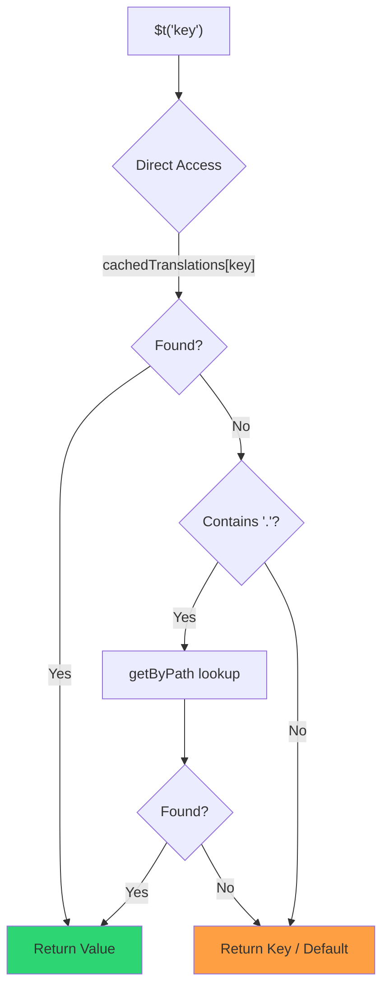

# 🚀 Guide de performance

## 📖 Introduction

`Nuxt I18n Micro` est conçu avec la performance à l'esprit, offrant une amélioration significative par rapport aux modules d'internationalisation (i18n) traditionnels comme `nuxt-i18n`. Ce guide fournit une analyse approfondie des bénéfices de performance liés à l'utilisation de `Nuxt I18n Micro` et compare avec d'autres solutions.

## 🤔 Pourquoi se concentrer sur la performance ?

Dans les projets à grande échelle et les environnements à fort trafic, les goulots d'étranglement de performance peuvent entraîner des temps de build lents, une utilisation accrue de la mémoire et de faibles temps de réponse serveur. Ces problèmes deviennent plus prononcés avec les configurations i18n complexes impliquant de gros fichiers de traduction. `Nuxt I18n Micro` a été construit pour répondre à ces défis en optimisant la vitesse, l'efficacité mémoire et l'impact minimal sur la taille du bundle de votre application.

## 📊 Comparaison de performance

Nous avons mené une série de tests sur des fixtures identiques via `pnpm test:performance` (`pnpm -C scripts cli performance`) contre **`@nuxtjs/i18n@10.6.0`**. Méthodologie complète et graphiques : [Résultats des tests de performance](/guides/performance-results).

Profil CLI par défaut : **4 locales** × **2 pages** (`index`, `page`) × ~10k clés feuilles d'index. Augmentez `--locales` / `--keys` pour une charge radar-régression plus lourde. Le rapport sépare le **code**, les **traductions** (y compris `@nuxtjs/i18n` `chunks/raw/*`) et la **sortie totale** déployable.

```bash
pnpm test:performance
pnpm -C scripts cli performance --only micro --skip-stress
pnpm -C scripts cli performance --locales 12 --keys 100000 --runs 3
```

### ⏱️ Temps de build et consommation de ressources

<Accordion title="**@nuxtjs/i18n v10.6**">
- **Bundle de code** : 2,16 Mo
- **Traductions** : 7,21 Mo (chunks de messages + payloads de locale)
- **Total déployable** : 9,37 Mo
- **Utilisation mémoire max** : 1 821 Mo
- **Temps écoulé** : 8,34s (moyenne de 3)
</Accordion>

<Tip>
- **Bundle de code** : 1,74 Mo — **~19 % de code en moins que `@nuxtjs/i18n` v10.6**
- **Traductions** : 6,8 Mo (JSON chargé à la demande)
- **Total déployable** : 8,54 Mo
- **Utilisation mémoire max** : 1 065 Mo — **~41 % de mémoire en moins que `@nuxtjs/i18n` v10.6**
- **Temps écoulé** : 5,34s — **~36 % plus rapide que `@nuxtjs/i18n` v10.6** (≈ référence plain-nuxt)
</Tip>

> Les anciens docs qui affichaient « `@nuxtjs/i18n` code ≈ 15 Mo / traductions 0 B » comptaient les fichiers de messages `chunks/raw` comme du code applicatif. Le classifieur actuel les sépare ; l'écart sur le **code** est plus petit, et micro reste en tête sur le temps de build, le RSS pic et les tests de charge.

Voir le [rapport complet de benchmark](/guides/performance-results) pour les graphiques, les résultats Autocannon et les détails des fixtures.

### 🌐 Performance serveur sous charge

Artillery (6s@6 + 60s@60) et Autocannon (10c / 10s), moyenne de 3 exécutions consécutives par fixture.

<Accordion title="**@nuxtjs/i18n v10.6**">
- **Requêtes par seconde (Artillery)** : 143 [#/sec]
- **Temps de réponse moyen** : 956 ms
- **RPS Autocannon / latence moy.** : 72 / 139 ms
</Accordion>

<Tip>
- **Requêtes par seconde (Artillery)** : 275 [#/sec] — **~93 % de plus que `@nuxtjs/i18n` v10.6**
- **Temps de réponse moyen** : 483 ms — **~49 % plus rapide que `@nuxtjs/i18n` v10.6**
- **RPS Autocannon / latence moy.** : 162 / 62 ms
</Tip>

### 📈 Comparaison visuelle

<Note>
Graphique interactif omis dans la doc Mintlify. Voir les tableaux de benchmark sur cette page ou la [doc VitePress](https://s00d.github.io/nuxt-i18n-micro/guide/performance-results) pour le graphique : `chart`.
</Note>

<Note>
Graphique interactif omis dans la doc Mintlify. Voir les tableaux de benchmark sur cette page ou la [doc VitePress](https://s00d.github.io/nuxt-i18n-micro/guide/performance-results) pour le graphique : `chart`.
</Note>

| Métrique        | @nuxtjs/i18n v10.6 | i18n-micro | Amélioration       |
| --------------- | ------------------ | ---------- | ------------------ |
| Temps de build  | 8,34s              | 5,34s      | **~36 % plus rapide** |
| Mémoire (build) | 1 821 Mo           | 1 065 Mo   | **~41 % de moins** |
| Bundle de code  | 2,16 Mo            | 1,74 Mo    | **~19 % plus petit** |
| Temps de réponse | 956 ms            | 483 ms     | **~49 % plus rapide** |
| RPS (Artillery) | 143                | 275        | **~93 % de plus**  |

### 🔍 Interprétation des résultats

Contre `@nuxtjs/i18n` actuel **v10.6** (profil CLI par défaut, moyenne de 3) :

- 🗜️ **Graphe de code plus petit** : ~1,74 Mo vs ~2,16 Mo une fois que les chunks de messages ne sont plus mal étiquetés comme « code ».
- 🧠 **RSS de build plus bas** : pic ~1,1 Go vs ~1,8 Go.
- 🕒 **Builds plus rapides** : ~5,3s vs ~8,3s (micro rejoint la référence plain-Nuxt sur ce profil).
- ⚡ **Bien meilleur sous charge** : ~275 vs ~143 RPS Artillery, ~162 vs ~72 RPS Autocannon, latence moyenne plus faible.

Les chiffres absolus diffèrent des tableaux plus anciens (dictionnaires plus petits, Nuxt plus ancien et découpage inéquitable « 0 B de traductions » pour `@nuxtjs/i18n`). Directionnellement pareil : micro reste devant en coût de build et débit de requêtes.

## ⚙️ Optimisations clés

### 🛠️ Conception minimaliste

`Nuxt I18n Micro` est construit autour d'une architecture minimaliste avec un petit noyau et des paquets de stratégie dédiés. Cela réduit le surcoût et simplifie la logique interne, ce qui améliore les performances.

### 🚦 Routage efficace

En v3, la génération de routes et la logique de chemin à l'exécution sont divisées en paquets dédiés pour un tree-shaking optimal :

- **`@i18n-micro/route-strategy`** — Génération de routes au moment du build : étend les pages Nuxt avec des routes localisées. Seule la stratégie sélectionnée (`no_prefix`, `prefix`, `prefix_except_default`, `prefix_and_default`) est incluse.
- **`@i18n-micro/path-strategy`** — Résolution de chemin à l'exécution, redirections et génération de liens. Utilise des fonctions pures et des drapeaux de contexte précalculés pour minimiser les allocations sur les chemins chauds. Les exports de sous-chemin (`/prefix`, `/no-prefix`, etc.) garantissent que seule l'implémentation choisie est incluse.

Cette approche maintient la configuration de routage légère et garantit une résolution rapide des routes indépendamment du nombre de locales.

### 📂 Chargement de traductions simplifié

Le module ne prend en charge que les fichiers JSON pour les traductions, avec une séparation claire entre les fichiers globaux et spécifiques à une page. Cela garantit que seules les données de traduction nécessaires sont chargées à tout moment, améliorant encore les performances.

### 🔒 Cache singleton via GlobalThis

À partir de la v3.0.0, le module utilise un pattern singleton `globalThis` avec `Symbol.for` pour garantir une seule instance de cache dans tout le processus Node.js. Cela empêche :

- La duplication du cache quand le même module est empaqueté plusieurs fois
- La recréation d'objets par requête qui exerce une pression sur le ramasse-miettes
- Les fuites mémoire d'instances de cache orphelines

```mermaid
flowchart LR
    subgraph Process["Node.js Process"]
        G["globalThis[Symbol.for('CACHE')]"]

        subgraph R1["SSR Request 1"]
            P1[Plugin Instance] --> G
        end

        subgraph R2["SSR Request 2"]
            P2[Plugin Instance] --> G
        end

        subgraph R3["SSR Request 3"]
            P3[Plugin Instance] --> G
        end
    end

    G --> Cache["Single Map Instance"]
    Cache --> D1["en:index → translations"]
    Cache --> D2["en:about → translations"
```

```typescript
// Internal implementation pattern
const CACHE_KEY = Symbol.for('__NUXT_I18N_STORAGE_CACHE__')
if (!globalThis[CACHE_KEY]) {
  globalThis[CACHE_KEY] = new Map()
}
```

### ⚡ Fonction de traduction optimisée (tFast)

La fonction `$t()` utilise une stratégie de lookup direct optimisée pour la vitesse :

1. **Contexte précalculé** : la locale et le nom de route sont calculés une fois pendant la navigation, pas à chaque appel `$t()`
2. **Lookup à source unique** : toutes les traductions (racine + spécifique à la page + repli) sont préfusionnées au moment du build dans un fichier unique par page — pas de recherche par couches
3. **Fusion profonde cumulative à la navigation** : lors de la navigation dans la même locale, les nouvelles traductions de page sont fusionnées en profondeur (profondeur 2) dans le dictionnaire actif, si bien que les clés de la page précédente restent visibles pendant les animations de transition — même quand les pages partagent des préfixes imbriqués qui se chevauchent (par exemple, les deux pages ont des clés sous `common.*`)
4. **Ramasse-miettes via `page:transition:finish`** : après que l'animation de transition est complètement terminée, le dictionnaire fusionné est remplacé par les traductions propres à la nouvelle page uniquement, libérant la mémoire des clés de l'ancienne page
5. **Accès direct à la propriété** : utilise `obj[key]` plutôt que des lookups Map pour les chemins chauds



```typescript
// Simplified lookup logic — single active dictionary
let val = cachedTranslations[key]
if (val === undefined && key.includes('.')) {
  val = getByPath(cachedTranslations, key)
}
```

### 💉 Chargement côté serveur (pas d'intégration HTML)

Les traductions chargées pendant le SSR restent en **mémoire serveur** pour `$t` pendant le rendu. Elles ne sont **pas** copiées dans `nuxtApp.payload` / le document HTML (même idée que `@nuxtjs/i18n` avec `experimental.preload: false`).

Côté client, `01.plugin.ts` `await` `switchContext`, qui charge `/\{apiBaseUrl\}/:page/:locale/data.json` avant que l'app ne continue — une requête, pas un blob inline de 8 Mo.

`NuxtI18n` conserve toujours le dictionnaire fusionné actif (`cachedTranslations`) pour `$t()` / `$has()`. Les navigations dans la même locale fusionnent en profondeur les fragments de page jusqu'à ce que `page:transition:finish` nettoie les clés obsolètes.

#### État actuel

Les chiffres ci-dessous sont lus depuis le fichier de budget que `pnpm run budget:payload` mesure et fait respecter.

{/* generated:payload-budget — do not edit; run `pnpm run docs:generate` */}

Mesuré sur `playground` sur `/`, `/de` :

| Mesure | Taille |
| --- | --- |
| Sources de traduction sur disque | 15,2 Mo |
| Servi comme fichiers de payload séparés | 76,3 Mo |
| Plus grand `__NUXT_DATA__` inline | 6,9 Mo |
| Assets client | 449,5 Ko |

Le playground porte un dictionnaire délibérément surdimensionné, donc ce ne sont pas des chiffres à attendre d'une vraie application. Ce sont un point fixe contre lequel mesurer. Le budget échoue quand ils augmentent de façon inattendue, ce qui est la manière dont un changement accidentel de ce que porte le payload est remarqué.

{/* /generated:payload-budget */}

### 💾 Cache et prerendering

Les traductions passent par plusieurs caches, et savoir lequel a répondu à une requête fait la différence entre une session de debug de cinq minutes et une de cinq heures. Il y en a quatre, dans l'ordre où une requête les rencontre :

| Couche | Où | Durée de vie | Vidée par |
| --- | --- | --- | --- |
| Navigateur / CDN | `Cache-Control` sur `/\{apiBaseUrl\}/**` | `httpCacheDuration`, `immutable` | un nouveau `?v=` — c'est-à-dire un déploiement qui a modifié les traductions |
| Cache de route Nitro | `routeRules['/\{apiBaseUrl\}/**'].cache` | 60 s, stale-while-revalidate | redémarrage du serveur |
| Loader serveur | `CacheControl` en processus, indexé `locale:routeName` | durée de vie du processus, ou `cacheTtl` | redémarrage du serveur, HMR en dev |
| Store client | `translationStorage` + le fragment actif dans `NuxtI18n` | durée de vie de la page | rechargement |

Deux règles les empêchent de se contredire :

- **Le cache de route Nitro n'existe que quand `?v=` existe.** Avec un cache-buster, chaque URL est unique à son contenu, donc la mettre en cache côté serveur est sans risque d'obsolescence. Définissez `dateBuild: 0` et cette couche est désactivée, car l'URL est alors stable et la réponse indique `must-revalidate`. Un cache côté serveur répondrait alors depuis une entrée obsolète jusqu'à une minute et le contournerait discrètement.
- **`immutable` requiert aussi `?v=`.** Sans buster, l'en-tête est `public, max-age=0, must-revalidate`, quoi que dise `httpCacheDuration` : un long `max-age` sur une URL qui ne change jamais fige la première réponse qu'un navigateur ait jamais vue.

<Warning>
Avec `translationPayloads.publicAssets` (par défaut en mode premerged), les payloads sont copiés vers `public/<apiBaseUrl>/\{page\}/\{locale\}/data.json`. Une plateforme qui sert elle-même ce dossier (Cloudflare Pages, Firebase Hosting, `npx serve`) applique ses propres en-têtes. L'en-tête `routeRules` Nitro n'atteint que les réponses qui passent par le serveur. Définissez la politique de cache pour ces fichiers statiques dans la configuration propre à la plateforme.
</Warning>

🏁 **Prerendering** : en mode premerged, `publicAssets` écrit déjà l'arbre d'URL client dans `public/`. Optez pour `prerenderRoutes` uniquement si vous avez besoin que Nitro matérialise les routes handler quand cette copie est désactivée.

### 🗜️ Payloads publics compressés

Quand `nitro.compressPublicAssets` est activé, les payloads de traduction copiés dans le dossier public obtiennent également des frères `.gz` et `.br` :

```ts
export default defineNuxtConfig({
  nitro: { compressPublicAssets: true },
})
```

Nitro compresse les assets publics avant le hook qui copie les payloads. Sans cela, ils seraient la seule partie non compressée d'un build statique. Le module n'active pas la compression de lui-même — il applique uniquement le réglage que vous avez choisi. La sélection par encodage (`\{ gzip: true, brotli: false \}`) est respectée.

Payload d'index du playground : 6 651 984 B brut, 1 012 831 B gzip, 821 617 B brotli.

### ☁️ Sortie de payload serverless

Sur **Node**, le SSR lit les JSON de traduction depuis `public/<apiBaseUrl>` (`readFile`, pas de `serverAssets` Nitro / `raw:` Rollup). Sur **Edge**, les `serverAssets` Nitro intègrent le même arbre (préférez `mode: 'source'` pour de gros catalogues).

```typescript
export default defineNuxtConfig({
  i18n: {
    translationPayloads: {
      serverAssets: true, // default — Node → public copy; Edge → serverAssets embed
      publicAssets: true, // default in premerged mode
    },
  },
})
```

Utilisez `translationPayloads.mode: 'source'` pour des intégrations Edge compactes (et copies publiques compactes optionnelles) :

```typescript
export default defineNuxtConfig({
  i18n: {
    translationPayloads: {
      mode: 'source',
    },
  },
})
```

`mode: 'source'` conserve les fichiers source fusionnés par couches compacts et fusionne racine/page/repli à l'exécution via la route intégrée `/_locales` (ou `assets:i18n` Edge). Par défaut, il désactive les copies d'assets publiques et les routes de payload prerendues.

<Warning>
`prerenderRoutes` vaut par défaut `false`. Avec `mode: 'source'`, `publicAssets` vaut également par défaut `false`. Un hébergement statique pur sans runtime Nitro/edge ne peut donc pas charger les traductions côté client sauf si vous activez l'une de ces sorties, gardez `serverHandler` disponible à l'exécution, ou hébergez les payloads en externe.

Le premerged par défaut + `publicAssets` place déjà `/\{apiBaseUrl\}/\{page\}/\{locale\}/data.json` sous `public/`, si bien que les hôtes statiques peuvent servir les fetch client sans Nitro.
</Warning>

<Warning>
Définir `apiBaseServerHost` ou `apiBaseClientHost` déplace le service des payloads vers cette origine, ce qui vient avec ses propres exigences — voir [Configuration → Hôtes CDN externes](/guides/configuration#external-cdn-hosts).
</Warning>

Ou désactivez les sorties HTTP/publiques individuelles et hébergez les payloads en externe :

```typescript
export default defineNuxtConfig({
  i18n: {
    apiBaseClientHost: 'https://cdn.example.com',
    apiBaseServerHost: 'https://cdn.example.com',
    translationPayloads: {
      serverHandler: false,
      publicAssets: false,
      prerenderRoutes: false,
    },
  },
})
```

Gardez `serverHandler` activé lorsque vous vous appuyez sur la route locale intégrée `/\{apiBaseUrl\}/:page/:locale/data.json`. Désactivez-le lorsque les payloads sont hébergés en externe et que `apiBaseServerHost` pointe vers cette origine externe. Activez `prerenderRoutes` uniquement quand vous avez besoin que Nitro matérialise des routes de payload statiques et que `publicAssets` ne les a pas déjà écrites.

Pendant le build, le module avertit lorsque la sortie de payload générée dépasse `translationPayloads.warnFileCount` (défaut 500) ou `translationPayloads.warnSizeBytes` (défaut 10 Mo). Il avertit également lorsque toutes les sorties locales sont désactivées sans hôtes de payload externes configurés.

## 📝 Conseils pour maximiser les performances

Voici quelques conseils pour vous assurer d'obtenir les meilleures performances avec `Nuxt I18n Micro` :

- 📉 **Limitez les données de locale** : n'incluez que les locales dont vous avez besoin dans votre projet pour garder la taille du bundle petite.
- 🗂️ **Utilisez les traductions spécifiques aux pages** : organisez vos fichiers de traduction par page pour éviter de charger des données inutiles.
- 💾 **Activez le cache** : utilisez les fonctionnalités de cache pour réduire la charge serveur et améliorer les temps de réponse.
- 🏁 **Tirez parti du prerendering** : prerender vos traductions pour accélérer les chargements de page et réduire le surcoût à l'exécution.

Pour des résultats détaillés des tests de performance, référez-vous aux [Résultats des tests de performance](/guides/performance-results).
