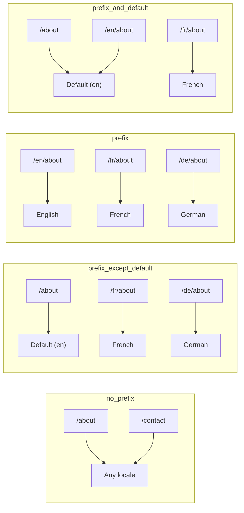
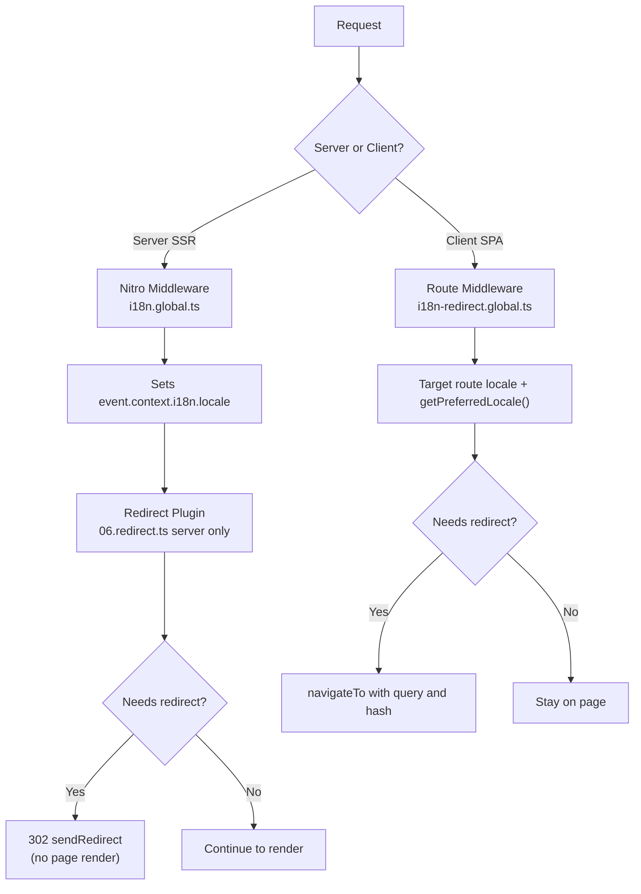

# 🗂️ Stratégies de routage dans Nuxt I18n Micro

## 📖 Vue d'ensemble

Nuxt I18n Micro contrôle la façon dont les préfixes de locale apparaissent dans les URL via l'option `strategy`. Sous le capot, deux paquets l'implémentent :

- **`@i18n-micro/route-strategy`** — génération de routes au moment du build (étend les pages Nuxt avec des routes localisées)
- **`@i18n-micro/path-strategy`** — résolution de chemin à l'exécution, redirections, attributs SEO et génération de liens

Le module Nuxt sélectionne la bonne classe de stratégie au moment du build et l'aliase via `#i18n-strategy`, si bien que seule l'implémentation choisie est incluse dans le bundle.

## 🚦 Stratégies disponibles

{/* generated:option:strategy — do not edit; run `pnpm run docs:generate` */}

**Type** `Strategies` · **Défaut** `'prefix_except_default'`

Stratégie de routage URL pour les préfixes de locale.

- `'no_prefix'` — pas de locale dans l'URL ; locale stockée dans un cookie.
- `'prefix_except_default'` — préfixe toutes les locales sauf celle par défaut.
- `'prefix'` — toujours préfixer, y compris la locale par défaut.
- `'prefix_and_default'` — comme `prefix`, mais la locale par défaut est également accessible sans préfixe.

{/* /generated:option:strategy */}

### Comparaison des stratégies



### 🛑 `no_prefix`

Les URL n'ont pas de segment de locale. La locale est déterminée par les cookies, l'état `useI18nLocale()` ou la détection navigateur.

- **Routes** : `/about`, `/contact` — même motif d'URL pour toutes les locales (pas de préfixe `/en/`, `/fr/`)
- **Persistance de la locale** : via `localeCookie` (automatiquement défini à `'user-locale'` s'il n'est pas spécifié)
- **Chemins personnalisés** : pris en charge via [`globalLocaleRoutes`](/guides/configuration#globallocaleroutes) et [`defineI18nRoute`](/guides/custom-locale-routes) — les slugs localisés sont générés sans ajouter de préfixe de locale aux URL (par exemple `/about` vs `/ueber-uns`). Les routes imbriquées, alias et restrictions par locale sont plus simples qu'en `prefix_except_default`.

<Tip>
Lors de l'utilisation de `no_prefix`, `localeCookie` est défini automatiquement à `'user-locale'` s'il n'est pas spécifié. C'est requis car l'URL ne contient aucune information de locale.
</Tip>

```typescript
i18n: {
  strategy: 'no_prefix'
  // localeCookie is automatically set to 'user-locale'
}
```

### 🚧 `prefix_except_default`

Toutes les routes ont un préfixe de locale **sauf** la locale par défaut.

- **Locale par défaut** : `/about`, `/contact`
- **Autres locales** : `/fr/about`, `/de/contact`
- **Locale par défaut avec préfixe renvoie 404** : `/en/about` → 404 (quand `en` est la valeur par défaut)

```typescript
i18n: {
  strategy: 'prefix_except_default' // This is the default
}
```

### 🌍 `prefix`

Toutes les routes ont un préfixe de locale, y compris la locale par défaut.

- **Toutes les locales** : `/en/about`, `/fr/about`, `/de/about`
- **Racine `/`** : redirige vers `/\{locale\}/` selon la préférence utilisateur

```typescript
i18n: {
  strategy: 'prefix'
}
```

### 🔄 `prefix_and_default`

La locale par défaut est disponible avec et sans préfixe. Les locales non par défaut ont toujours un préfixe.

- **Locale par défaut** : à la fois `/about` et `/en/about` sont valides
- **Autres locales** : `/fr/about`, `/de/about`
- **Pas de redirection depuis `/`** : à la fois `/` et `/en/` servent la locale par défaut

```typescript
i18n: {
  strategy: 'prefix_and_default'
}
```

## 🔀 Architecture des redirections (v3)

En v3, la logique de redirection est divisée en deux couches pour des performances optimales :

### Comment cela fonctionne



### Côté serveur (pas de flash)

1. Le **middleware Nitro** (`i18n.global.ts`) s'exécute en premier — détecte la locale depuis l'URL, le cookie ou l'en-tête `Accept-Language` et définit `event.context.i18n.locale`.
2. Le **plugin de redirection** (`06.redirect.ts`, serveur uniquement) vérifie si le chemin courant a besoin d'une redirection via `i18nStrategy.getClientRedirect()` et émet un 302 **avant** tout rendu de page.
3. Cela évite le « flash d'erreur » où les utilisateurs voient brièvement la mauvaise page avant la redirection.

### Côté client (navigation SPA)

1. Le middleware global de route (`i18n-redirect.global.ts`) s'exécute à chaque navigation client quand `redirects` est activé.
2. Dérive la locale préférée depuis la **route cible** d'abord, puis retombe sur `useI18nLocale().getPreferredLocale()`.
3. Utilise `i18nStrategy.getClientRedirect()` pour décider si une redirection est nécessaire.
4. Préserve `query` et `hash` lors de la redirection.

### Ordre de priorité des locales

Côté serveur, le plugin de redirection détermine la locale préférée dans cet ordre :

1. **`useState('i18n-locale')`** — priorité la plus élevée (défini programmatiquement via `useI18nLocale().setLocale()`)
2. **Cookie** — si `localeCookie` est configuré
3. **En-tête `Accept-Language`** — si `autoDetectLanguage: true`
4. **`defaultLocale`** — repli final

Côté client, le middleware de route préfère la locale de la route cible, puis utilise la même chaîne de repli état/cookie.

### Comportement de redirection par stratégie

| Stratégie               | Comportement `GET /`                          | Cookie requis ?  |
| ----------------------- | --------------------------------------------- | ---------------- |
| `no_prefix`             | Pas de redirection (locale depuis cookie/état) | Auto-défini      |
| `prefix`                | 302 → `/\{locale\}/`                            | Recommandé       |
| `prefix_except_default` | 302 → `/\{locale\}/` si locale ≠ défaut         | Recommandé       |
| `prefix_and_default`    | Pas de redirection (à la fois `/` et `/\{locale\}/` valides) | Optionnel |

### Désactiver les redirections

```typescript
i18n: {
  redirects: false // Disables automatic locale redirects
}
```

Quand `redirects: false`, les redirections automatiques de locale sont désactivées :

- **Serveur** : le plugin de redirection (`06.redirect.ts`, serveur uniquement) reste enregistré mais ignore la logique de redirection. Il effectue toujours des **vérifications 404** pour les préfixes de locale invalides (par exemple `/xx/about` où `xx` n'est pas une locale valide) et la **synchronisation du cookie** depuis le préfixe URL (par exemple visiter `/fr/about` synchronise le cookie à `fr`).
- **Client** : le middleware global de route `i18n-redirect` n'est **pas enregistré** — pas d'auto-redirections SPA.

## 🍪 Persistance de locale basée sur cookie

<Warning>
Lors de l'utilisation de `prefix` ou `prefix_except_default` avec `redirects: true` (par défaut), vous **devez** définir `localeCookie` pour que les redirections fonctionnent correctement. Sans cookie, le plugin de redirection ne peut pas se souvenir de la préférence de locale de l'utilisateur entre les rechargements de page.

```typescript
i18n: {
  strategy: 'prefix_except_default',
  localeCookie: 'user-locale' // Required for redirects to work properly
}
```
</Warning>

**Comment fonctionne `localeCookie` en v3 :**

- Géré en interne par `useI18nLocale()` — **ne le définissez pas manuellement** via `useCookie()`.
- Quand un utilisateur visite une URL préfixée (par exemple, `/fr/about`), le cookie est synchronisé automatiquement à `fr`.
- Lors de la prochaine visite à `/`, la valeur du cookie est utilisée pour rediriger vers `/\{locale\}/`.
- Si le cookie contient une locale invalide (pas dans la liste `locales`), il retombe sur `defaultLocale`.

| Stratégie               | `localeCookie` par défaut | Notes                                |
| ----------------------- | ------------------------- | ------------------------------------ |
| `no_prefix`             | Auto : `'user-locale'`    | Requis ; défini automatiquement      |
| `prefix`                | `null` (désactivé)        | Définissez `'user-locale'` pour les redirections |
| `prefix_except_default` | `null` (désactivé)        | Définissez `'user-locale'` pour les redirections |
| `prefix_and_default`    | `null` (désactivé)        | Optionnel                            |

## 🔍 `autoDetectLanguage` et `autoDetectPath`

### `autoDetectLanguage`

{/* generated:option:autoDetectLanguage — do not edit; run `pnpm run docs:generate` */}

**Type** `boolean` · **Défaut** `true`

Détecte automatiquement la langue préférée de l'utilisateur depuis l'en-tête HTTP `Accept-Language`.
Utilisé en combinaison avec `autoDetectPath` pour décider quand la détection intervient.

{/* /generated:option:autoDetectLanguage */}

La vérification s'exécute dans le middleware serveur et est un repli : un cookie ou un état existant l'emporte.

```typescript
i18n: {
  autoDetectLanguage: true
}
```

### `autoDetectPath`

{/* generated:option:autoDetectPath — do not edit; run `pnpm run docs:generate` */}

**Type** `string` · **Défaut** `'/'`

Où les redirections basées sur cookie / Accept-Language peuvent s'exécuter (quand `redirects` est activé).

- `'/'` — uniquement `/` (les deep links dans la locale par défaut restent accessibles ; défaut).
- `'no_prefix'` — uniquement les chemins sans préfixe de locale.
- `'*'` — chaque chemin, y compris pour réécrire un préfixe de locale explicite
  (par exemple `/fr/about` → `/de/about` quand le cookie préfère `de`).

- toute autre chaîne — correspondance exacte de chemin (par exemple `'/welcome'`).

Le nettoyage de la stratégie préfixée (par exemple `/en` → `/` sous `prefix_except_default`) n'est pas soumis à cette porte.

{/* /generated:option:autoDetectPath */}

```typescript
i18n: {
  autoDetectPath: '/' // Default: only root
  // autoDetectPath: '*' // All paths — redirects even /fr/about to /de/about
}
```

<Warning>
Avec `autoDetectPath: '*'`, même les URL avec un préfixe de locale explicite (par exemple `/fr/about`) seront redirigées si la locale préférée de l'utilisateur diffère. Cela peut être utile pour les configurations basées sur le domaine mais peut dérouter les utilisateurs qui partagent des URL.
</Warning>

Avec la valeur par défaut `autoDetectPath: '/'` et un cookie de locale :

| requête | cookie | résultat |
| --- | --- | --- |
| `/` | `de` | 302 → `/de` |
| `/about` | `de` | 200, locale par défaut (pas de réécriture) |

```typescript
i18n: {
  localeCookie: 'user-locale',
  strategy: 'prefix_except_default',
  // Default — remember language on entry, keep deep links stable
  autoDetectPath: '/',
  // Or redirect on every unprefixed path (but not /de/… → /fr/…):
  // autoDetectPath: 'no_prefix',
}
```

## ⚠️ Problèmes connus et bonnes pratiques

### 1. Décalage d'hydratation dans la stratégie `no_prefix`

Lors de l'utilisation de `no_prefix`, la locale est déterminée dynamiquement. Si le serveur et le client ne sont pas d'accord sur la locale, vous verrez un décalage d'hydratation.

**Solution** : utilisez `useI18nLocale().setLocale()` dans un plugin serveur (avec `order: -10`) pour définir la locale avant l'initialisation d'i18n :

```ts
// plugins/i18n-loader.server.ts
export default defineNuxtPlugin({
  name: 'i18n-custom-loader',
  enforce: 'pre',
  order: -10,
  setup() {
    const { setLocale } = useI18nLocale()
    setLocale('ja') // Your detection logic here
  },
})
```

Voir [Détection de langue personnalisée](/guides/custom-language-detection) pour des exemples détaillés.

### 2. Utilisez les routes nommées avec `localeRoute`

Le routage basé sur les chemins peut poser des problèmes de résolution de route :

```typescript
// May cause issues
$localeRoute('/page')

// Preferred approach
$localeRoute({ name: 'page' })
```

### 3. Utiliser `pages: false` avec i18n

Lors de l'utilisation de Nuxt avec `pages: false` :

```typescript
export default defineNuxtConfig({
  pages: false,
  i18n: {
    strategy: 'no_prefix', // Recommended
    disablePageLocales: true, // Required
    localeCookie: 'user-locale', // Required for persistence
  },
})
```

**Limitations avec `pages: false` :**

- Pas de redirections automatiques
- Pas de détection de locale basée sur l'URL
- Le changement de locale côté client nécessite un rechargement de page ou un chargement manuel des traductions

### 4. Gestion des cookies invalides

Si un cookie contient une locale invalide (pas dans la liste `locales`), le module retombe gracieusement sur `defaultLocale`. Aucune erreur n'est levée.

## 📝 Résumé des bonnes pratiques

| Recommandation            | Détails                                                                            |
| ------------------------- | ---------------------------------------------------------------------------------- |
| **Définir `localeCookie`** | Définissez-le toujours pour les stratégies préfixées avec `redirects: true`        |
| **Utiliser `useI18nLocale()`** | La façon centralisée de gérer l'état de locale (remplace `useState`/`useCookie` manuels) |
| **Utiliser les routes nommées** | `$localeRoute(\{ name: 'page' \})` plutôt que `$localeRoute('/page')`             |
| **Locale programmatique** | Utilisez `useI18nLocale().setLocale()` dans un plugin serveur avec `order: -10`    |
| **Éviter les cookies manuels** | N'utilisez pas `useCookie('user-locale')` directement — `useI18nLocale()` gère cela |
