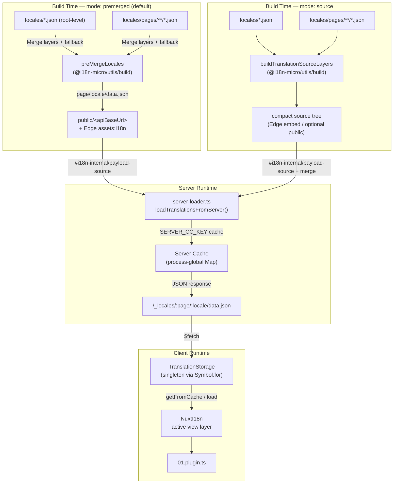

# 🗄️ ארכיטקטורת מטמון ואחסון תרגומים

## 📖 סקירה

Nuxt I18n Micro v3 משתמש בארכיטקטורת מטמון רב־שכבתית עבור תרגומים. טעינת ה־payload תלויה ב־`translationPayloads.mode`:

- **`premerged`** (ברירת מחדל) — קבצי שורש, עמוד, fallback ושכבה ממוזגים בזמן בנייה דרך `@i18n-micro/utils/build` ל־`\{page\}/\{locale\}/data.json`
- **`source`** — קובצי מקור קומפקטיים נשמרים למיזוג בזמן ריצה דרך `@i18n-micro/utils/source-loader` ו־`@i18n-micro/utils/merge-source` ‏(Edge מטמיע אותם ב־`serverAssets` של Nitro; ‏Node קורא אותם מ־`public/` כאשר הועתקו)

עמוד זה מתאר כיצד המטמון המובנה עובד וכיצד להרחיב אותו למקרי שימוש מותאמים (כלי אדמין, APIs חיצוניים, ביטול מטמון).

## 📊 סקירת ארכיטקטורה

### זרימת נתונים



## 🧱 רכיבי ליבה

### 1. `TranslationStorage` (לקוח + שרת)

**קובץ**: `src/runtime/utils/storage.ts`

מחלקת singleton המספקת אחסון תרגומים מאוחד הן ללקוח והן לשרת. משתמשת ב־`Symbol.for('__NUXT_I18N_STORAGE_CACHE__')` על `globalThis` כדי להבטיח שרק instance אחד קיים, אפילו כאשר נטענים מספר bundles.

**מתודות מרכזיות:**

| מתודה                              | תיאור                                                            |
| ----------------------------------- | ---------------------------------------------------------------------- |
| `getFromCache(locale, routeName?)`  | בדיקה סינכרונית: מחזירה נתונים במטמון בזיכרון, או `null`            |
| `load(locale, routeName?, options)` | טעינה אסינכרונית עם caching: בודקת מטמון תחילה, ואז מביאה דרך `$fetch` |
| `clear()`                           | מנקה את כל המטמון                                                |

**פורמט מפתח מטמון**: ‏`\{locale\}:\{routeName\}` (למשל, `en:index`, ‏`fr:about`)

```typescript
import { translationStorage } from '../utils/storage'

// Synchronous cache check
const cached = translationStorage.getFromCache('en', 'index')

// Async load (with automatic caching)
const result = await translationStorage.load('en', 'index', {
  apiBaseUrl: '_locales',
  baseURL: '/',
  dateBuild: '2024-01-01',
})
// result.data — merged translations
// result.cacheKey — cache key used
```

### ⚙️ ביטול מטמון דטרמיניסטי (`i18n.dateBuild`)

כברירת מחדל, מודול זה מייצר `dateBuild` בזמן בנייה באמצעות `Date.now()`. הוא ואז מוטמע ב־`#build/i18n.strategy.mjs` שנוצר ומשמש כפרמטר query ‏(`?v=...`) כדי לבטל מטמוני הבאת תרגומים לאחר בנייה מחדש.

אם אתה צריך בניות ניתנות לשחזור (לדוגמה, לשיפור קצב פגיעות מטמון של chunks בפריסות rolling), הגדר ערך יציב ב־`nuxt.config`:

```ts
export default defineNuxtConfig({
  i18n: {
    // Any stable string/number (git SHA, CI build number, release tag, etc.)
    dateBuild: process.env.GIT_SHA ?? 'local-dev',
  },
})
```

### 2. `loadTranslationsFromServer()` (שרת בלבד)

**קובץ**: `src/runtime/server/utils/server-loader.ts`

טוענת תרגומים עבור שפה/עמוד ושומרת את התוצאה הממוזגת במטמון במפה `CacheControl` גלובלית לתהליך עם מפתח לפי `@i18n-micro/hmr/cache-keys` ‏(`SERVER_CC_KEY`).

התנהגות: ‏SSR טוען מ־`#i18n-internal/payload-source` — ‏**Node** ‏`readFile` תחת `public/<apiBaseUrl>` ‏(`\{page\}/\{locale\}/data.json` במצב premerged), ‏**Edge** ‏`assets:i18n`. ‏`premerged` קורא קובץ אחד; ‏`source` ממזג שורש/עמוד/fallback דרך `@i18n-micro/utils/source-loader`.

```typescript
import { loadTranslationsFromServer } from '../server/utils/server-loader'

// Returns { data: Translations, json: string }
const { data, json } = await loadTranslationsFromServer('en', 'index')
```

### 3. טעינת לקוח (ללא הטמעת HTML)

מילונים **אינם** נכתבים ל־`nuxtApp.payload`. השרת שומר אותם בזיכרון עבור עיבוד SSR; תוסף הלקוח `await`s את `switchContext`, אשר טוען את `/\{apiBaseUrl\}/:page/:locale/data.json` (אותה תנוחת ברירת מחדל כמו `@nuxtjs/i18n` עם `experimental.preload: false`).

`NuxtI18n` מחזיק את מילון שכבת התצוגה הפעילה המשמש את `$t()` ו־`$has()`. ‏`NuxtTranslationLoader` מחליף הקשר שפה/מסלול וממזג chunks לתוך אותה שכבה.

### 4. מסלול API של השרת

**מסלול**: ‏`/_locales/\{page\}/\{locale\}/data.json`

**קובץ**: `src/runtime/server/routes/i18n.ts`

מסלול Nitro זה מגיש תרגומים ממוזגים עבור מצב ה־payload הפעיל. הוא קורא ל־`loadTranslationsFromServer()` ומחזיר את התוצאה כ־JSON.

בייצור הוא גם מגדיר:

```http
Cache-Control: public, max-age={httpCacheDuration}, immutable
```

ברירת המחדל של `httpCacheDuration` היא `31536000` (שנה 1). זה בטוח כי לקוחות מבקשים payloads עם ביטול מטמון `?v=\{dateBuild\}`. הגדר `httpCacheDuration: 0` כדי להשמיט את הכותרת. הכותרת אינה מוחלת בפיתוח.

## 📥 הרחבה: טעינת תרגום מותאמת

### קרא ממטמון (מסלול שרת)

```ts
// server/api/i18n/load-cache.[post].ts
import { defineEventHandler, readBody } from 'h3'
import { loadTranslationsFromServer } from '#imports'

export default defineEventHandler(async (event) => {
  const { page, locale } = await readBody<{ page: string; locale: string }>(event)
  const { data } = await loadTranslationsFromServer(locale, page)
  return { locale, page, data }
})
```

### עדכן תרגומים (קובץ + ביטול מטמון)

```ts
// server/api/i18n/update.[post].ts
import { defineEventHandler, readBody, createError } from 'h3'
import { join } from 'node:path'
import { readFile, writeFile } from 'node:fs/promises'
import { deepMergeTranslations } from '@i18n-micro/utils/deep-merge'

export default defineEventHandler(async (event) => {
  const { path, updates } = await readBody<{ path: string; updates: Record<string, unknown> }>(event)

  if (!path || !updates) {
    throw createError({ statusCode: 400, statusMessage: 'Missing path or updates' })
  }

  const fullPath = join('locales', path)
  let existing: Record<string, unknown> = {}

  try {
    const content = await readFile(fullPath, 'utf-8')
    existing = JSON.parse(content) as Record<string, unknown>
  } catch {
    // File does not exist — create new
  }

  const merged = deepMergeTranslations(existing, updates)
  await writeFile(fullPath, JSON.stringify(merged, null, 2), 'utf-8')

  return { success: true, path, updated: merged }
})
```


## 🧹 ניקוי מטמון

### ניקוי מטמון תכנותי (לקוח)

השתמש במתודה המובנית `$clearCache`:

```vue
<script setup>
const { $clearCache } = useNuxtApp()

// Clears both TranslationStorage and plugin-level cache
$clearCache()
</script>
```

### התנהגות מטמון שרת

מטמון צד השרת ‏(`loadTranslationsFromServer`) הוא גלובלי לתהליך ונשמר עד:

- תהליך השרת מופעל מחדש
- מזוהה פריסה חדשה (ערך `dateBuild` שונה)

לסביבות serverless, לכל התחלה קרה יש מטמון טרי.

## ⚙️ תצורת Serverless

לסביבות serverless (Cloudflare Workers, AWS Lambda), המטמון המובנה משתמש באובייקטי `Map` בזיכרון. אין צורך בתצורת אחסון חיצוני עבור מטמון התרגומים עצמו.

עם זאת, אחסון Nitro עבור קובצי תרגום מקור עשוי לדרוש תצורה:

```ts
export default defineNuxtConfig({
  nitro: {
    storage: {
      // Only needed if default file-system storage is unavailable
      'assets:server': {
        driver: 'cloudflare-kv-binding',
        binding: 'MY_KV_NAMESPACE',
      },
    },
  },
})
```

## 💡 הבדלים מרכזיים מ־v2

| היבט           | v2                            | v3                                                                       |
| ---------------- | ----------------------------- | ------------------------------------------------------------------------ |
| מטמון לקוח     | `useStorage('cache')`         | singleton של `TranslationStorage` ‏(Symbol.for on globalThis)                |
| העברת SSR     | תצורת זמן ריצה                | chunks מלאים דרך `payload.data` ‏(v3.0 השתמש ב־`useState`)                    |
| מטמון שרת     | אחסון מטמון של Nitro           | `Map` גלובלי לתהליך דרך `Symbol.for`                                    |
| לוגיקת מיזוג      | בצד הלקוח                   | זמן בנייה ‏(`premerged`) או זמן ריצה ‏(`source`) דרך `@i18n-micro/utils/*` |
| פורמט מפתח מטמון | `i18n:merged:\{page\}:\{locale\}` | `\{locale\}:\{routeName\}`                                                   |

## 📚 קשור

- [מדריך ביצועים](/guides/performance) — כיצד caching משפיע על ביצועים
- [תרגומים בצד השרת](/guides/server-side-translations) — שימוש בתרגומים במסלולי שרת
- [פריסת Firebase](/guides/firebase) — שיקולי מטמון ספציפיים לפריסה
