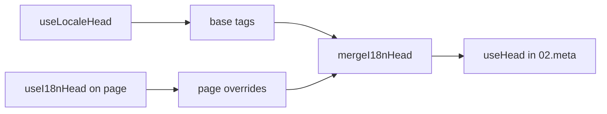

# Composable `useI18nHead`

`useI18nHead` מאפשר לך להתאים אישית תגי SEO של i18n **לכל עמוד** ללא תוסף meta מותאם. כאשר `meta: true`, המודול ממזג את הקלט שלך על גבי הפלט של [`useLocaleHead`](/api/composables/use-locale-head).

מקרים טיפוסיים:

- **מאמרי CMS / בלוג** — רק חלק מהשפות מתורגמות; כתובות URL חלופיות שונות לכל שפה (slugs או נתיבים שונים).
- **Canonical דינמי** — כתובת ה־URL הקנונית חייבת להתאים לכתובת ה־URL של המאמר מה־API, לא ל־`$switchLocalePath`.
- **Open Graph נוסף** — ‏`og:title`, ‏`og:description`, ‏`og:image` לצד `og:locale` / ‏`og:url` שנוצרים אוטומטית.
- **בקרה חלקית** — שמור על canonical שנוצר על ידי המודול ועל `og:url`, אבל החלף רק את `hreflang` ואת `og:locale:alternate`.

---

## חתימה

{/* generated:symbol:useI18nHead — do not edit; run `pnpm run docs:generate` */}

```ts
useI18nHead(input?: MaybeRefOrGetter<I18nHeadInput | null>): { pageHead: any; resetPageHead: () => void }
```

רשום עקיפות ברמת עמוד עבור תגי head של SEO של i18n. ממוזג על גבי פלט `useLocaleHead` על ידי תוסף `02.meta`.

| פרמטר | טיפוס | תיאור |
| --- | --- | --- |
| `input` *(אופציונלי)* | `MaybeRefOrGetter<I18nHeadInput \| null>` |  |

{/* /generated:symbol:useI18nHead */}

## כיצד הוא משתלב בצינור



אתה קורא ל־`useI18nHead` ברכיב עמוד. תוסף `02.meta` מיישם עקיפות לאחר כל `updateMeta()` (שינוי מסלול, ‏`$setI18nRouteParams`, ‏`page:finish` בלקוח).

---

## דוגמה 1 — מאמר עם תרגומים רק בחלק מהשפות

תבנית נפוצה: ה־API מחזיר אילו שפות קיימות ואת כתובות ה־URL המוחלטות או היחסיות שלהן.

```ts
interface Article {
  title: string
  slug: string
  /** Locale code → page URL (absolute or site-relative) */
  locales: Record<string, string>
}
```

```vue
<script setup lang="ts">
const route = useRoute()
const { data: article } = await useFetch<Article>(`/api/articles/${route.params.slug}`)

const localeCodes = computed(() => Object.keys(article.value?.locales ?? {}))

useI18nHead(() => {
  if (!article.value) return null

  return {
    meta: [
      { property: 'og:title', content: article.value.title },
      { property: 'og:type', content: 'article' },
    ],
    replace: {
      hreflang: localeCodes.value.map((locale) => ({
        rel: 'alternate',
        hreflang: locale,
        href: article.value!.locales[locale]!,
      })),
      ogAlternates: localeCodes.value,
    },
  }
})
</script>
```

`ogAlternates` מקבל **קודי שפה** מתצורת `i18n.locales` שלך. הערכים עבור `og:locale:alternate` נפתרים דרך `locale.og` או `iso` (פורמט `en_US` של Open Graph).

---

## דוגמה 2 — מאמר עם slugs לכל שפה ‏(`$defineI18nRoute` + ‏`$setI18nRouteParams`)

כאשר כתובות URL בנויות מתבניות מסלול מקומיות ופרמטרים דינמיים:

```vue
<script setup lang="ts">
const { $defineI18nRoute, $setI18nRouteParams } = useNuxtApp()
const route = useRoute()

const { data: article } = await useFetch(`/api/articles/${route.params.slug}`)

$defineI18nRoute({
  localeRoutes: {
    en: '/blog/[slug]',
    de: '/de/blog/[slug]',
    fr: '/fr/blog/[slug]',
  },
})

if (article.value) {
  $setI18nRouteParams({
    en: { slug: article.value.slugEn },
    de: { slug: article.value.slugDe },
    fr: { slug: article.value.slugFr },
  })

  const availableLocales = article.value.availableLocales as string[]

  useI18nHead({
    meta: [{ property: 'og:title', content: article.value.title }],
    replace: {
      hreflang: availableLocales.map((locale) => ({
        rel: 'alternate',
        hreflang: locale,
        href: article.value!.urls[locale],
      })),
      ogAlternates: availableLocales,
    },
  })
}
</script>
```

חלופות שנוצרו על ידי המודול יפרטו את **כל** השפות המוגדרות. ‏`replace.hreflang` מגביל תגים לשפות שבפועל יש להן תרגום.

---

## דוגמה 3 — ‏`x-default` מותאם עבור כתובת URL של מאמר בשפת ברירת המחדל

כברירת מחדל, ‏`x-default` מצביע על כתובת ה־URL של שפת ברירת המחדל מ־`$switchLocalePath`. עבור מאמרים, הצבע עליו לכתובת ה־URL של תרגום ברירת המחדל:

```vue
<script setup lang="ts">
const { $defaultLocale } = useNuxtApp()
const article = await loadArticle()

const defaultLocale = $defaultLocale() ?? 'en'
const defaultHref = article.locales[defaultLocale]

useI18nHead({
  replace: {
    hreflang: Object.entries(article.locales).map(([locale, href]) => ({
      rel: 'alternate',
      hreflang: locale,
      href,
    })),
    xDefault: defaultHref ? { rel: 'alternate', hreflang: 'x-default', href: defaultHref } : false,
    ogAlternates: Object.keys(article.locales),
  },
})
</script>
```

---

## דוגמה 4 — החלף canonical ו־`og:url` מנתוני API

כאשר ה־canonical חייב להתאים לכתובת URL שסופקה מ־CMS ‏(רב־תחומי, נתיב מותאם או כתובת URL מוחלטת מוכנה מראש):

```vue
<script setup lang="ts">
const article = await loadArticle()
const canonical = article.canonicalUrl // e.g. https://www.example.com/en/blog/my-post

useI18nHead({
  replace: {
    canonical,
    ogUrl: canonical,
    hreflang: buildAlternateLinks(article),
    ogAlternates: Object.keys(article.locales),
  },
  meta: [
    { property: 'og:title', content: article.title },
    { name: 'description', content: article.excerpt },
  ],
})
</script>
```

---

## דוגמה 5 — שמור על canonical / ‏`og:url` אוטומטיים, החלף רק חלופות

אם `$switchLocalePath` + ‏`$setI18nRouteParams` כבר מייצרים canonical ו־`og:url` נכונים, החלף רק תגי גילוי:

```vue
<script setup lang="ts">
const article = await loadArticle()

useI18nHead({
  replace: {
    hreflang: buildAlternateLinks(article),
    ogAlternates: Object.keys(article.locales),
  },
})
</script>
```

---

## דוגמה 6 — head מלא עבור עמוד פרטי תוכן ‏(meta + קישורים)

תבנית דומה לפיצול של "meta של עמוד" ו־"קישורים חלופיים" לעוזרים נפרדים — משולבת בקריאה אחת:

```vue
<script setup lang="ts">
const article = await loadArticle()
const alternates = Object.entries(article.locales).map(([locale, href]) => ({
  rel: 'alternate' as const,
  hreflang: locale,
  href: normalizeSeoUrl(href), // strip ?query and #hash if needed
}))

useI18nHead({
  meta: [
    { property: 'og:title', content: article.title },
    { property: 'og:description', content: article.description },
    { property: 'og:image', content: article.imageUrl },
    { name: 'twitter:card', content: 'summary_large_image' },
    { name: 'twitter:title', content: article.title },
  ],
  replace: {
    canonical: article.canonicalUrl,
    ogUrl: article.canonicalUrl,
    hreflang: alternates,
    ogAlternates: Object.keys(article.locales),
  },
})
</script>
```

```ts
/** Remove query and hash — useful when CMS URLs must be clean for SEO */
function normalizeSeoUrl(href: string): string {
  try {
    const url = new URL(href, 'https://placeholder.local')
    url.search = ''
    url.hash = ''
    return href.startsWith('http') ? url.href : `${url.pathname}`
  } catch {
    return href.split(/[?#]/)[0] ?? href
  }
}
```

---

## דוגמה 7 — שני סוגי תוכן, אותה תבנית ‏(חדשות לעומת מדריכים)

אותה צורת API, שמות מסלול שונים — השתמש שוב בעוזר קטן:

```ts
// composables/useArticleHead.ts
import type { I18nHeadInput } from '@i18n-micro/types'

interface LocalizedContent {
  title: string
  locales: Record<string, string>
  canonicalUrl?: string
}

export function buildArticleHead(content: LocalizedContent): I18nHeadInput {
  const localeCodes = Object.keys(content.locales)
  const canonical = content.canonicalUrl ?? content.locales.en

  return {
    meta: [{ property: 'og:title', content: content.title }],
    replace: {
      canonical,
      ogUrl: canonical,
      hreflang: localeCodes.map((locale) => ({
        rel: 'alternate',
        hreflang: locale,
        href: content.locales[locale]!,
      })),
      ogAlternates: localeCodes,
    },
  }
}
```

```vue
<!-- pages/blog/[slug].vue -->
<script setup lang="ts">
const article = await loadArticle()
useI18nHead(buildArticleHead(article))
</script>
```

```vue
<!-- pages/guides/[slug].vue -->
<script setup lang="ts">
const guide = await loadGuide()
useI18nHead(buildArticleHead(guide))
</script>
```

---

## דוגמה 8 — השבת חלופות מובנות, ספק את הרשימה שלך

מקביל להשבתת מחולל hreflang של המודול והעברת רשימה מותאמת ‏(ללא סטים כפולים של חלופות):

```vue
<script setup lang="ts">
const article = await loadArticle()

useI18nHead({
  disable: ['hreflang', 'x-default', 'og-alternates'],
  link: Object.entries(article.locales).map(([locale, href]) => ({
    rel: 'alternate',
    hreflang: locale,
    href,
  })),
  replace: {
    ogAlternates: Object.keys(article.locales),
  },
})
</script>
```

או העדף `replace.hreflang` ללא `disable` — הוא מחליף את כל הקישורים `rel="alternate"` בשלב אחד.

---

## דוגמה 9 — עמוד נחיתה: רק OG נוסף, שמור על כל תגי i18n

```vue
<script setup lang="ts">
const { t } = useI18n()

useI18nHead({
  meta: [
    { property: 'og:title', content: t('landing.ogTitle') },
    { property: 'og:description', content: t('landing.ogDescription') },
  ],
})
</script>
```

---

## דוגמה 10 — עמוד מוצר: השבת hreflang עבור ניסוי שפה יחידה

```vue
<script setup lang="ts">
useI18nHead({
  disable: ['hreflang', 'x-default'],
  // canonical, og:locale, og:url still generated
})
</script>
```

---

## דוגמה 11 — עדכונים ריאקטיביים לאחר הבאה בצד לקוח

```vue
<script setup lang="ts">
const article = ref<Article | null>(null)

onMounted(async () => {
  article.value = await $fetch('/api/articles/latest')
})

useI18nHead(() => {
  if (!article.value) return null
  return {
    meta: [{ property: 'og:title', content: article.value.title }],
    replace: {
      hreflang: Object.entries(article.value.locales).map(([locale, href]) => ({
        rel: 'alternate',
        hreflang: locale,
        href,
      })),
    },
  }
})
</script>
```

Head מרענן ב־`page:finish` וכאשר מצב `pageHead` משתנה.

---

## דוגמה 12 — מקור HTTPS מאחורי reverse proxy

אם בעבר פתרת composable של "מקור ציבורי" עבור כתובות URL מוחלטות של canonical / חלופיות, השתמש בתצורת מודול במקום:

```ts
// nuxt.config.ts
export default defineNuxtConfig({
  i18n: {
    meta: true,
    // undefined = origin from current request (multi-domain friendly)
    metaBaseUrl: undefined,
    metaTrustForwardedHost: true,
    metaTrustForwardedProto: true,
  },
})
```

לאחר מכן העבר **נתיבים או כתובות URL מלאות** ב־`replace.hreflang` / ‏`replace.canonical`. המודול משתמש ב־`useRequestURL` עם `X-Forwarded-Host` / ‏`X-Forwarded-Proto` ב־SSR.

---

## הפניית API

### `meta`

תגי `<meta>` נוספים. מסוננים כפולים לפי `id`, ‏`property` או `name`.

### `link`

תגי `<link>` נוספים. מסוננים כפולים לפי `id` או `rel` + ‏`hreflang`.

### `htmlAttrs`

ממוזג לתכונות `<html>` מ־`useLocaleHead` ‏(`lang`, ‏`dir`).

### `replace`

| מפתח            | טיפוס                      | אפקט                                         |
| -------------- | ------------------------- | ---------------------------------------------- |
| `canonical`    | `string \| false`         | החלף או הסר קישור canonical               |
| `hreflang`     | `I18nHeadLink[] \| false` | החלף או הסר את כל הקישורים `rel="alternate"`  |
| `xDefault`     | `I18nHeadLink \| false`   | החלף או הסר `hreflang="x-default"`       |
| `ogLocale`     | `string \| false`         | החלף או הסר `og:locale`                  |
| `ogUrl`        | `string \| false`         | החלף או הסר `og:url`                     |
| `ogAlternates` | `string[] \| false`       | בנה מחדש `og:locale:alternate` עבור קודי שפה |

### `disable`

| ערך           | מסיר                                  |
| --------------- | ---------------------------------------- |
| `hreflang`      | קישורי שפה חלופיים (לא `x-default`) |
| `x-default`     | קישור `hreflang="x-default"`              |
| `canonical`     | קישור Canonical                           |
| `og`            | `og:locale` ו־`og:url`                 |
| `og-alternates` | תגי `og:locale:alternate`                |
| `html`          | `lang` / ‏`dir` על `<html>`               |

---

## `useLocaleHead` לעומת `useI18nHead`

| Composable      | היקף                | מתי להשתמש                                |
| --------------- | -------------------- | ------------------------------------------ |
| `useLocaleHead` | Head גלובלי / ידני | `meta: false`, הגדרת `useHead` מותאמת מלאה |
| `useI18nHead`   | עקיפות לכל עמוד   | `meta: true`, התאמת עמודים ספציפיים     |

כאשר `meta: true`, אתה **לא** צריך `useLocaleHead` בעמודים שמשתמשים רק ב־`useI18nHead`.

---

## הגירה מתוסף head של i18n מותאם

פרויקטים רבים מתחזקים תוסף מותאם ש:

- ממזג קישורים חלופיים ספציפיים לעמוד ממצב משותף;
- מסנן ערכי `hreflang` אזוריים כפולים;
- מנרמל ערכי `og:locale`;
- מסיר מחרוזות query מכתובות URL של SEO.

תוכל להחליף זאת ב־`useI18nHead` בכל עמוד תוכן ובברירות מחדל של המודול.

| גישה קודמת                                     | עם `useI18nHead`                                   |
| ----------------------------------------------------- | ---------------------------------------------------- |
| מצב משותף + "אילו שפות קיימות למאמר זה" | `replace: \{ ogAlternates: localeCodes \}`             |
| עוזר נפרד לבניית קישורי `rel="alternate"`      | `replace: \{ hreflang: links \}`                       |
| תוסף מותאם הממזג מצב עמוד ל־head            | מיזוג מובנה ב־`02.meta`                          |
| "מקור ציבורי" מותאם עבור כתובות URL מוחלטות              | `metaBaseUrl` + כותרות מועברות (ראה דוגמה 12)   |
| `og:locale` קצר ‏(`en` במקום `en_US`)           | הגדר `locale.og` או השתמש ב־`iso` → `en_US` (פרוטוקול OG) |

**`hreflang` מ־`iso`:** כל שפה מנפיקה חלופה אחת עם `hreflang = iso || code`. ‏`code` של ניתוב לעולם אינו בשימוש כאשר `iso` מוגדר (נמנע מתגים לא תקינים כמו `hreflang="mx"`). הצטרף ל־fallbacks של שפה חשופה ‏(`es-ES` → גם `es`) עם `hreflangBaseLanguage: true` — נגזר מ־`iso`, לא מ־`code`. עבור רשימות מותאמות אישית מלאות, השתמש ב־`replace.hreflang`.

**JSON-LD:** ‏`useI18nHead` אינו מייצר נתונים מובנים. שמור על `useHead(\{ script: [...] \})` או עוזר JSON-LD ייעודי לצדו.

---

## ראה גם

- [מדריך SEO](/guides/seo) — יצירת meta אוטומטית ועקיפות ברמת עמוד
- [`useLocaleHead`](/api/composables/use-locale-head) — API של head ברמה נמוכה
