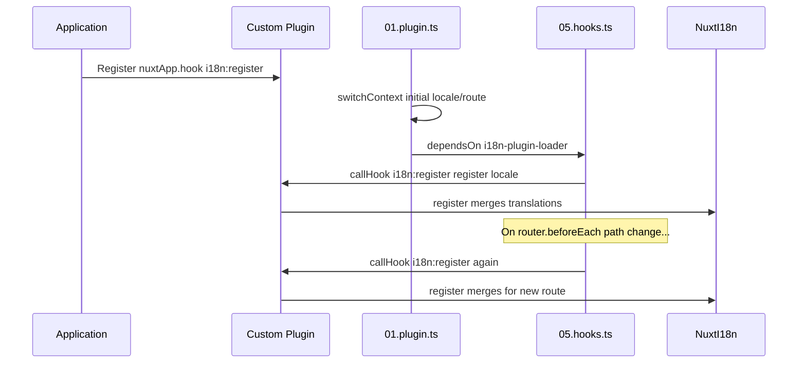

# 📢 אירועים

## 🔄 `i18n:register`

האירוע `i18n:register` ב־`Nuxt I18n Micro` מאפשר הוספה דינמית של תרגומים להקשר ה־i18n של האפליקציה שלך, מה שהופך את תהליך הבין־לאומיזציה לחלק וגמיש. אירוע זה מאפשר לך לשלב תרגומים חדשים לפי הצורך, ומשפר את יכולות הלוקליזציה של האפליקציה שלך.

### 📝 פרטי האירוע

- **מטרה**:
  - מאפשר שילוב דינמי של תרגומים נוספים לתוך הסט הקיים עבור שפה ספציפית.

- **Payload**:
  - **`register`**:
    - פונקציה שסופקה על ידי האירוע שמקבלת שני ארגומנטים:
      - **`translations`** (`Translations`):
        - אובייקט המכיל צמדי מפתח־ערך המייצגים תרגומים, המאורגנים בהתאם לממשק `Translations`.
      - **`locale`** (`string`, אופציונלי):
        - קוד השפה (למשל, `'en'`, `'ru'`) שעבורה התרגומים רשומים. ברירת המחדל היא השפה שסופקה על ידי האירוע אם לא צוין.

- **התנהגות**:
  - כאשר מופעל, הפונקציה `register` ממזגת את התרגומים החדשים להקשר הנוכחי עבור השפה שצוינה, ומעדכנת את התרגומים הזמינים ברחבי האפליקציה.

### ⏱️ מתי הוא נפעל

תוסף ה־hooks של המודול (`05.hooks.ts`, ‏`dependsOn: ['i18n-plugin-loader']`) קורא ל־`nuxtApp.callHook('i18n:register', …)`:

1. **פעם אחת בהפעלה** — לאחר שתוסף ה־i18n הראשי (`01.plugin.ts`) טען תרגומים עבור המסלול ההתחלתי
2. **בניווט** — ב־`router.beforeEach` כאשר הנתיב משתנה, או בכל ניווט כאשר `strategy: 'no_prefix'`

רשום את המאזין שלך בתוסף Nuxt רגיל עם `nuxtApp.hook('i18n:register', …)`. תוסף ה־hooks רץ לאחר שהמטען מוכן, כך שה־callback שלך מופעל כאשר יש צורך להרחיב תרגומים.

הגדר `hooks: false` ב־`nuxt.config` כדי להשבית קריאות אוטומטיות של `i18n:register` (עיין ב־[תצורה — ‏`hooks`](/guides/configuration#hooks)).

### 💡 דוגמת שימוש

הדוגמה הבאה מדגימה כיצד להשתמש באירוע `i18n:register` להוספת תרגומים באופן דינמי:

```typescript
nuxt.hook('i18n:register', async (register: (translations: unknown, locale?: string) => void, locale: string) => {
  register(
    {
      greeting: 'Hello',
      farewell: 'Goodbye',
    },
    locale,
  )
})
```

### 🛠️ הסבר



- **הפעלת האירוע**:
  - תוסף ה־hooks ‏(`05.hooks.ts`) מפעיל את `i18n:register` לאחר שהמטען הראשי מוכן ובניווטים רלוונטיים.

- **הוספת תרגומים**:
  - הדוגמה רושמת תרגומים לאנגלית עבור `"greeting"` ו־`"farewell"`.
  - הפונקציה `register` ממזגת את התרגומים האלה לסט הקיים עבור השפה שסופקה.

### 🔗 יתרונות מרכזיים

- **עדכונים דינמיים**:
  - עדכן או הוסף תרגומים בקלות ללא צורך לפרוס מחדש את כל האפליקציה שלך.

- **גמישות לוקליזציה**:
  - תומך בהתאמות לוקליזציה בזמן אמת בהתבסס על צרכי המשתמש או האפליקציה.

באמצעות האירוע `i18n:register`, אתה יכול להבטיח שאסטרטגיית הלוקליזציה של האפליקציה שלך תישאר גמישה ומסתגלת, ומשפרת את חוויית המשתמש הכוללת.

---

## 🛠️ שינוי תרגומים עם תוספים

לשינוי תרגומים באופן דינמי באפליקציית Nuxt שלך, מומלץ להשתמש בתוספים. תוספים מספקים דרך מובנית לטיפול בעדכוני לוקליזציה, במיוחד בעבודה עם מודולים או קובצי תרגום חיצוניים.

### **רישום התוסף**

אם אתה משתמש במודול, רשום את התוסף היכן שיתרחשו שינויי התרגום על ידי הוספתו לתצורת המודול שלך:

```javascript
addPlugin({
  src: resolve('./plugins/extend_locales'),
})
```

זה רושם את התוסף הממוקם ב־`./plugins/extend_locales`, אשר יטפל בטעינה דינמית וברישום של תרגומים.

### **מימוש התוסף**

בתוסף, אתה יכול לנהל שינויי שפה. הנה דוגמה למימוש בתוסף Nuxt:

```typescript
import { defineNuxtPlugin } from '#app'

export default defineNuxtPlugin(async (nuxtApp) => {
  // Function to load translations from JSON files and register them
  const loadTranslations = async (lang: string) => {
    try {
      const translations = await import(`../locales/${lang}.json`)
      return translations.default
    } catch (error) {
      console.error(`Error loading translations for language: ${lang}`, error)
      return null
    }
  }

  // Hook into the 'i18n:register' event to dynamically add translations
  // eslint-disable-next-line @typescript-eslint/ban-ts-comment
  // @ts-expect-error
  nuxtApp.hook('i18n:register', async (register: (translations: unknown, locale?: string) => void, locale: string) => {
    const translations = await loadTranslations(locale)
    if (translations) {
      register(translations, locale)
    }
  })
})
```

### 📝 הסבר מפורט

1. **טעינת תרגומים**:

- הפונקציה `loadTranslations` מייבאת דינמית קובצי תרגום בהתבסס על השפה. הקבצים צפויים להיות בתיקיית `locales` ולהיקרא בהתאם לקודי השפה (למשל, `en.json`, `de.json`).
- בטעינה מוצלחת, התרגומים מוחזרים; אחרת, נרשמת שגיאה.

2. **רישום תרגומים**:

- התוסף מתחבר לאירוע `i18n:register` באמצעות `nuxtApp.hook`.
- כאשר האירוע מופעל, הפונקציה `register` נקראת עם התרגומים שנטענו והשפה המתאימה.
- זה ממזג את התרגומים החדשים להקשר ה־i18n עבור השפה שצוינה, ומעדכן את התרגומים הזמינים ברחבי האפליקציה.

### 🔗 יתרונות של שימוש בתוספים לשינויי תרגום

- **הפרדת עניינים**:
  - עטוף את לוגיקת הלוקליזציה בנפרד מקוד האפליקציה הראשי, מה שהופך את הניהול והתחזוקה לקלים יותר.

- **דינמי וניתן להרחבה**:
  - על ידי טעינה ורישום תרגומים באופן דינמי, אתה יכול לעדכן תוכן ללא צורך בפריסה מחדש של האפליקציה המלאה, מה שמועיל במיוחד לאפליקציות עם תוכן המתעדכן לעתים קרובות או רב־לשוני.

- **גמישות לוקליזציה משופרת**:
  - תוספים מאפשרים לך לשנות או להרחיב תרגומים לפי הצורך, ומספקים אסטרטגיית לוקליזציה מסתגלת ומגיבה יותר שעונה על העדפות משתמש או דרישות עסקיות.

על ידי אימוץ גישה זו, אתה יכול להרחיב ולשנות ביעילות את הלוקליזציה של האפליקציה שלך באמצעות תהליך מובנה ובר תחזוקה תוך שימוש בתוספים, שומר על בין־לאומיזציה מסתגלת לצרכים משתנים ומשפר את חוויית המשתמש הכוללת.
