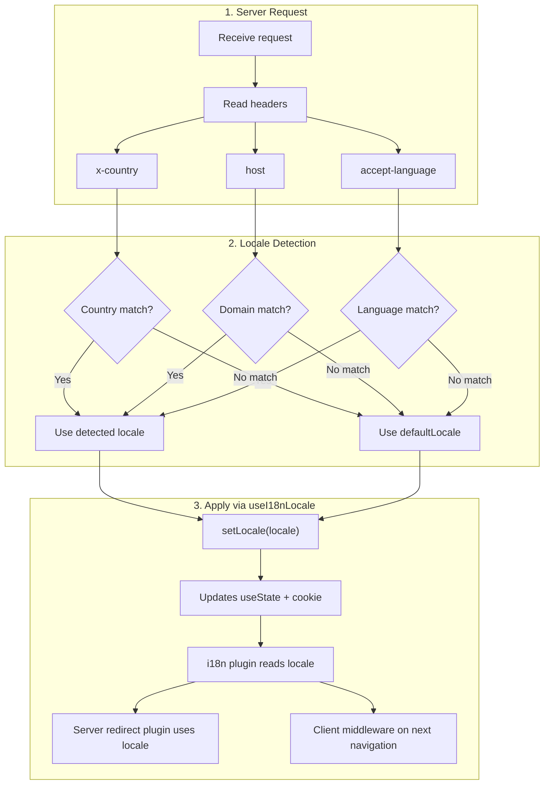

# 🔧 זיהוי שפה מותאם אישית ב-Nuxt I18n Micro

## 📖 סקירה

Nuxt I18n Micro v3 מספק composable מרכזי — `useI18nLocale()` — לכל ניהול ה-locale. זה מחליף את דפוסי `useState`/`useCookie` הידניים מ-v2. על ידי שימוש ב-`useI18nLocale().setLocale()` בתוסף שרת, תוכלו ליישם כל לוגיקת זיהוי מותאמת אישית תוך שמירה על תאימות מלאה עם מערכות ההפניה והעוגיות של המודול.

## 🏗️ ארכיטקטורה

```mermaid
flowchart TB
    subgraph Plugins["Plugin Execution Order"]
        A["Your plugin<br/>order: -10"] -->|setLocale()| B["01.plugin.ts<br/>order: -5"]
        B --> C["06.redirect.ts server<br/>order: 10"]
    end

    subgraph Client["Client SPA Navigation"]
        D["i18n-redirect.global.ts<br/>route middleware"]
    end

    subgraph State["Locale State"]
        E["useState('i18n-locale')"]
        F["localeCookie"]
    end

    A -->|"setLocale() updates both"| E
    A -->|"setLocale() updates both"| F
    B -->|reads| E
    C -->|reads| E
    C -->|reads| F
    D -->|reads target route +| E
```

**עיקרון מרכזי**: קראו ל-`useI18nLocale().setLocale()` בתוסף שרת עם `order: -10`. זה מעדכן את `useState('i18n-locale')` ואת עוגיית ה-locale באופן אטומי, כך שתוסף ה-i18n (`order: -5`) ותוסף ההפניה של השרת (`order: 10`) רואים את ה-locale הנכון בבקשת ה-SSR הראשונה. הפניות אוטומטיות בצד לקוח פועלות ב-middleware הגלובלי של ה-route בניווטים עוקבים.

## 🛠️ השבתת זיהוי אוטומטי מובנה

אם ברצונכם שליטה מלאה על זיהוי locale, השביתו את המנגנון המובנה:

```ts
export default defineNuxtConfig({
  i18n: {
    autoDetectLanguage: false,
  },
})
```

## ✨ דוגמה: זיהוי בצד שרת עם `useI18nLocale`

זו **הגישה המומלצת** עבור כל האסטרטגיות.

### שלב 1: הגדירו את `nuxt.config.ts`

```ts
export default defineNuxtConfig({
  modules: ['nuxt-i18n-micro'],
  i18n: {
    strategy: 'no_prefix', // Works with ANY strategy
    defaultLocale: 'en',
    localeCookie: 'user-locale',
    autoDetectLanguage: false,
    locales: [
      { code: 'en', iso: 'en-US' },
      { code: 'de', iso: 'de-DE' },
      { code: 'ja', iso: 'ja-JP' },
    ],
  },
})
```

### שלב 2: צרו `plugins/i18n-loader.server.ts`

```ts
import { defineNuxtPlugin, useRequestHeaders } from '#imports'

export default defineNuxtPlugin({
  name: 'i18n-custom-loader',
  enforce: 'pre',
  order: -10, // Execute BEFORE the i18n plugin (which has order -5)

  setup() {
    const { setLocale } = useI18nLocale()
    const headers = useRequestHeaders(['host', 'x-country', 'accept-language'])
    let detectedLocale = 'en'

    // --- YOUR DETECTION LOGIC ---

    // Example 1: By domain
    const host = headers['host']
    if (host?.includes('example.de')) {
      detectedLocale = 'de'
    }
    // Example 2: By custom header
    else if (headers['x-country'] === 'JP') {
      detectedLocale = 'ja'
    }
    // Example 3: By Accept-Language header
    else if (headers['accept-language']?.includes('de')) {
      detectedLocale = 'de'
    }

    // --- APPLY THE LOCALE ---
    setLocale(detectedLocale)
  },
})
```

### כיצד זה עובד



1. **התוסף פועל תחילה** (`order: -10`) — מזהה locale מ-headers, domain או מקורות אחרים
2. **`setLocale()` מעדכן את שניהם** `useState('i18n-locale')` ואת ה-cookie — מבטיח נראות מיידית לכל התוספים העוקבים
3. **תוסף i18n** (`order: -5`) קורא את ה-locale וטוען את התרגומים הנכונים
4. **תוסף הפניית שרת** (`order: 10`) משתמש ב-locale להחלטות הפניה ב-SSR
5. **middleware של ניתוב לקוח** (`i18n-redirect`) מיישם הפניות בניווט SPA כאשר locale ה-URL אינו תואם להעדפה

## 🌐 התנהגות ספציפית לאסטרטגיה

`useI18nLocale().setLocale()` עובד עם **כל האסטרטגיות**. התנהגות ההפניה תלויה באסטרטגיה:

<Tip>
| אסטרטגיה | השפעה של `setLocale('de')` |
|----------|---------------------------|
| `no_prefix` | מרנדר בגרמנית, ללא שינוי URL |
| `prefix` | 302 → `/de/` (הפניה בצד שרת) |
| `prefix_except_default` | 302 → `/de/` אם `de` ≠ ברירת מחדל; ללא הפניה אם `de` = ברירת מחדל |
| `prefix_and_default` | ללא הפניה (הן `/` והן `/de/` תקפים) |
</Tip>

**הערות חשובות:**

- זיהוי locale מבוסס cookie מושבת כברירת מחדל (`localeCookie: null`)
- הגדירו `localeCookie: 'user-locale'` כדי לאפשר התמדה ב-cookie
- אם ערך ה-cookie/state אינו ברשימת ה-`locales`, הוא חוזר ל-`defaultLocale`

## 🏢 מתקדם: זיהוי מבוסס דומיין

עבור הגדרות רב-דומיין שבהן כל דומיין מגיש locale שונה:

```ts
import { defineNuxtPlugin, useRequestHeaders } from '#imports'

export default defineNuxtPlugin({
  name: 'i18n-domain-loader',
  enforce: 'pre',
  order: -10,

  setup() {
    const { setLocale } = useI18nLocale()
    const headers = useRequestHeaders(['host'])
    const host = headers['host'] || ''

    let detectedLocale = 'en'

    if (host.endsWith('.de') || host.includes('german.')) {
      detectedLocale = 'de'
    } else if (host.endsWith('.fr') || host.includes('french.')) {
      detectedLocale = 'fr'
    } else if (host.endsWith('.jp') || host.includes('japanese.')) {
      detectedLocale = 'ja'
    }

    setLocale(detectedLocale)
  },
})
```

## 🔄 מתקדם: כיבוד העדפת משתמש

אם משתמשים יכולים להחליף שפה ידנית, כבדו את בחירתם על פני זיהוי אוטומטי:

```ts
import { defineNuxtPlugin, useRequestHeaders } from '#imports'

export default defineNuxtPlugin({
  name: 'i18n-smart-loader',
  enforce: 'pre',
  order: -10,

  setup() {
    const { getLocale, setLocale } = useI18nLocale()

    // If user already has a preference (from cookie), respect it
    if (getLocale()) {
      return
    }

    // Otherwise, detect locale from headers
    const headers = useRequestHeaders(['accept-language'])
    let detectedLocale = 'en'

    const acceptLanguage = headers['accept-language'] || ''
    if (acceptLanguage.includes('de')) {
      detectedLocale = 'de'
    } else if (acceptLanguage.includes('ja')) {
      detectedLocale = 'ja'
    }

    setLocale(detectedLocale)
  },
})
```

## ⚙️ תוספים שרת בלבד או לקוח בלבד

השתמשו ב[מוסכמות שמות קבצים של Nuxt](https://nuxt.com/docs/getting-started/directory-structure#plugins) כדי לשלוט היכן התוסף שלכם פועל:

- **שרת בלבד**: `i18n-loader.server.ts` — פועל רק במהלך SSR (מומלץ לזיהוי מבוסס headers)
- **לקוח בלבד**: `i18n-loader.client.ts` — פועל רק בדפדפן (עבור זיהוי מבוסס `localStorage` או DOM)

<Tip>

</Tip>

## ✅ סיכום

| תכונה                                | תיאור                                                       |
| -------------------------------------- | ----------------------------------------------------------------- |
| `useI18nLocale().setLocale()`          | מעדכן `useState` + cookie אטומית; עובד עם כל האסטרטגיות |
| `useI18nLocale().getLocale()`          | מחזיר את ה-locale הנוכחי מ-state או cookie                       |
| `useI18nLocale().getPreferredLocale()` | מחזיר את ה-locale המועדף (מאומת מול רשימת `locales`)       |
| Plugin `order: -10`                    | מבטיח שהתוסף שלכם פועל לפני אתחול i18n               |
| `enforce: 'pre'`                       | פועל בקבוצת התוספים "pre"                                    |

**אל תעשו:**

- להשתמש ב-`useCookie('user-locale')` ישירות — `useI18nLocale()` מנהל cookies פנימית
- להשתמש ב-`useState('i18n-locale')` ישירות — השתמשו ב-`useI18nLocale().setLocale()` במקום
- להגדיר `order` >= -5 — התוסף שלכם חייב לפעול לפני תוסף i18n
