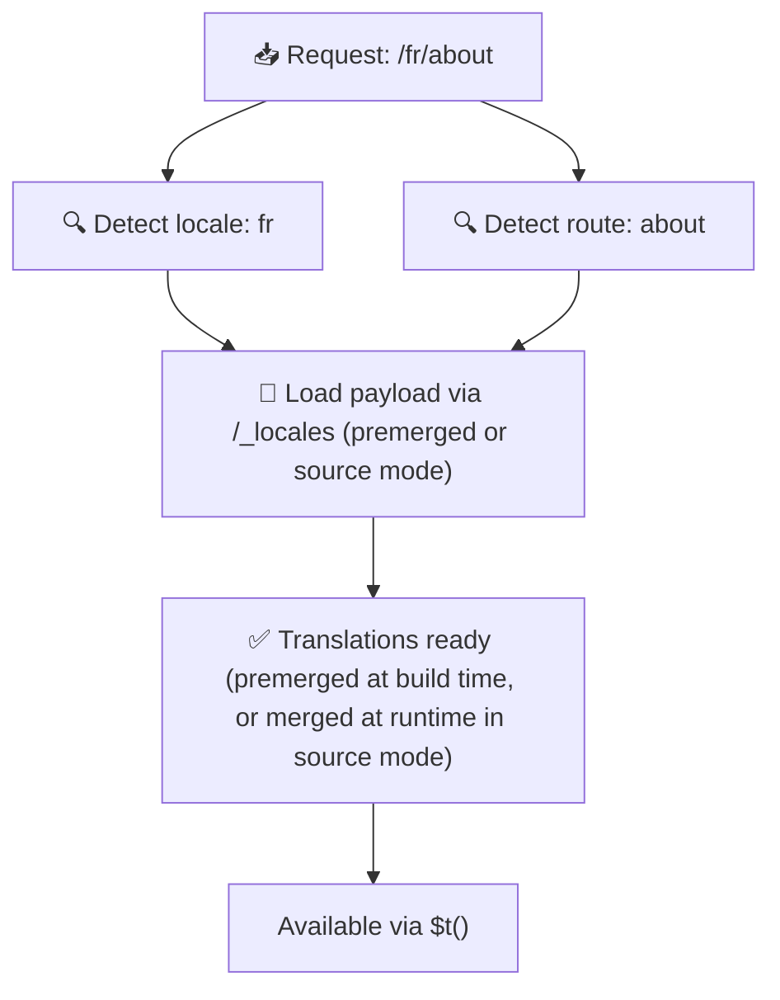

# 📂 מדריך מבנה תיקיות

## 📖 מבוא

ארגון יעיל של קבצי התרגום שלכם חיוני לתחזוקה של מערכת בינאום (i18n) מדרגית ויעילה. `Nuxt I18n Micro` מפשט תהליך זה על ידי הצעת גישה ברורה לניהול תרגומים ברמת root וספציפיים לעמוד. מדריך זה ידריך אתכם דרך מבנה התיקיות המומלץ ויסביר כיצד `Nuxt I18n Micro` מטפל בתרגומים אלה.

## 🗂️ מבנה תיקיות מומלץ

`Nuxt I18n Micro` מארגן תרגומים לקבצי root ולקבצים ספציפיים לעמוד בתוך תיקיית `pages`. עם `translationPayloads.mode: 'premerged'` (ברירת מחדל), תרגומי root ממוזגים אוטומטית לכל קובץ עמוד בזמן build, כך שלכל עמוד יש סט מלא של תרגומים ללא תקורה של מיזוג בזמן ריצה.

עם `mode: 'source'`, קבצי המקור נשארים נפרדים בנכסי Nitro וממוזגים בזמן ריצה דרך ה-route של `/_locales`. ראו [Serverless Payload Output](/guides/performance#serverless-payload-output).

### 🔧 מבנה בסיסי

הנה דוגמה בסיסית של מבנה התיקיות שעליכם לעקוב אחריו:

```text
locales/
├── pages/
│   ├── index/
│   │   ├── en.json
│   │   ├── fr.json
│   │   └── ar.json
│   ├── about/
│   │   ├── en.json
│   │   ├── fr.json
│   │   └── ar.json
├── en.json
├── fr.json
└── ar.json

```

### 📄 הסבר על המבנה

#### 1. 🌍 קבצי תרגום ברמת root

- **נתיב:** `/locales/\{locale\}.json` (למשל, `/locales/en.json`)
- **מטרה:** קבצים אלה מכילים תרגומים המשותפים לכל האפליקציה (תפריטי ניווט, כותרות, פוטרים וכו'). עם `mode: 'premerged'` (ברירת מחדל), הם ממוזגים אוטומטית לכל קובץ ספציפי לעמוד בזמן build, כך שהשרת מחזיר קובץ יחיד מוכן מראש לכל עמוד.

  **תוכן לדוגמה (`/locales/en.json`):**

  ```json
  {
    "menu": {
      "home": "Home",
      "about": "About Us",
      "contact": "Contact"
    },
    "footer": {
      "copyright": "© 2024 Your Company"
    }
  }
  ```

#### 2. 📄 קבצי תרגום ספציפיים לעמוד

- **נתיב:** `/locales/pages/\{routeName\}/\{locale\}.json` (למשל, `/locales/pages/index/en.json`)
- **מטרה:** קבצים אלה מכילים תרגומים ספציפיים לעמודים בודדים. עם `mode: 'premerged'` (ברירת מחדל), תרגומי root ממוזגים כבסיס בזמן build, כך שכל קובץ עמוד הופך לעצמאי.

  **תוכן לדוגמה (`/locales/pages/index/en.json`):**

  ```json
  {
    "title": "Welcome to Our Website",
    "description": "We offer a wide range of products and services to meet your needs."
  }
  ```

  **תוכן לדוגמה (`/locales/pages/about/en.json`):**

  ```json
  {
    "title": "About Us",
    "description": "Learn more about our mission, vision, and values."
  }
  ```

### 📂 טיפול ב-routes דינמיים ונתיבים מקוננים

`Nuxt I18n Micro` הופך אוטומטית segments דינמיים ונתיבים מקוננים ב-routes למבנה תיקיות שטוח באמצעות מוסכמת שינוי שם ספציפית. זה מבטיח שכל התרגומים מאוחסנים באופן עקבי ונגיש בקלות.

#### מבנה תיקיות תרגום ל-Route דינמי

בטיפול ב-routes דינמיים, כמו `/products/[id]`, המודול ממיר את ה-segment הדינמי `[id]` לפורמט סטטי בתוך מבנה הקבצים.

**מבנה תיקיות לדוגמה עבור routes דינמיים:**

עבור route כמו `/products/[id]`, קבצי התרגום יאוחסנו בתיקייה בשם `products-id`:

```text
locales/pages/
├── products-id/
│   ├── en.json
│   ├── fr.json
│   └── ar.json

```

**מבנה תיקיות לדוגמה עבור routes דינמיים מקוננים:**

עבור route מקונן כמו `/products/key/[id]`, קבצי התרגום יאוחסנו בתיקייה בשם `products-key-id`:

```text
locales/pages/
├── products-key-id/
│   ├── en.json
│   ├── fr.json
│   └── ar.json

```

**מבנה תיקיות לדוגמה עבור routes מקוננים רב-שכבתיים:**

עבור route מקונן מורכב יותר כמו `/products/category/[id]/details`, קבצי התרגום יאוחסנו בתיקייה בשם `products-category-id-details`:

```text
locales/pages/
├── products-category-id-details/
│   ├── en.json
│   ├── fr.json
│   └── ar.json

```

### 🛠 התאמת מבנה התיקיות

אם אתם מעדיפים לאחסן תרגומים בתיקייה אחרת, `Nuxt I18n Micro` מאפשר לכם להתאים אישית את התיקייה שבה מאוחסנים קבצי התרגום. תוכלו להגדיר זאת בקובץ `nuxt.config.ts` שלכם.

**דוגמה: התאמת תיקיית התרגום**

```typescript
export default defineNuxtConfig({
  i18n: {
    translationDir: 'i18n', // Custom directory path
  },
})
```

זה יורה ל-`Nuxt I18n Micro` לחפש קבצי תרגום בתיקיית `/i18n` במקום בתיקיית `/locales` ברירת המחדל.

## ⚙️ כיצד תרגומים נטענים

### 🌍 Routes של locale דינמיים

`Nuxt I18n Micro` משתמש ב-routes דינמיים של locale כדי לטעון תרגומים ביעילות. כאשר משתמש מבקר בעמוד, המודול קובע את ה-locale המתאים וטוען את קבצי התרגום המתאימים על בסיס ה-route וה-locale הנוכחיים.



לדוגמה:

- ביקור ב-`/en/index` יטען תרגומים מ-`/locales/pages/index/en.json`.
- ביקור ב-`/fr/about` יטען תרגומים מ-`/locales/pages/about/fr.json`.

שיטה זו מבטיחה שרק התרגומים הנחוצים נטענים, ומיטבת הן את עומס השרת והן את הביצועים בצד הלקוח.

### 💾 Caching ו-Pre-rendering

כדי לשפר עוד יותר את הביצועים, `Nuxt I18n Micro` תומך ב-caching וב-pre-rendering של קבצי תרגום:

- **Caching**: לאחר שקובץ תרגום נטען, הוא נשמר ב-cache עבור בקשות עוקבות, מה שמפחית את הצורך להביא שוב ושוב את אותם הנתונים.
- **Pre-rendering**: במהלך תהליך ה-build, ניתן לבצע pre-render לקבצי תרגום עבור כל ה-locales וה-routes המוגדרים, מה שמאפשר להם להיות מוגשים ישירות מהשרת ללא עיכובי runtime.

## 📝 שיטות עבודה מומלצות

### 📂 השתמשו בקבצים ספציפיים לעמוד בחוכמה

מנפו קבצים ספציפיים לעמוד כדי לשמור על תרגומים מסודרים. זה שומר על תרגומי כל עמוד רזים ומהירים לטעינה, מה שחשוב במיוחד עבור עמודים עם תוכן מורכב או גדול.

### 🔑 שמרו על מפתחות תרגום עקביים

השתמשו במוסכמות שמות עקביות עבור מפתחות התרגום שלכם בקבצים שונים. זה עוזר לשמור על בהירות ומונע בעיות בניהול תרגומים, במיוחד ככל שהאפליקציה שלכם גדלה.

### 🗂️ ארגנו תרגומים לפי הקשר

קבצו תרגומים קשורים יחד בתוך הקבצים שלכם. לדוגמה, קבצו את כל תוויות הכפתורים תחת מפתח `buttons` ואת כל הטקסטים הקשורים לטפסים תחת מפתח `forms`. זה לא רק משפר את הקריאות אלא גם מקל על ניהול תרגומים בין locales שונים.

### ⚠️ מגבלת עומק קינון (2 רמות מומלצות)

במהלך ניווט בצד הלקוח, `Nuxt I18n Micro` משתמש ב-2-level deep merge מיטובי כדי לשלב תרגומים מהעמודים היוצאים והנכנסים. זה מבטיח שמפתחות מקוננים חופפים (למשל, לשני העמודים יש מפתחות תחת `common.*`) נשמרים במהלך אנימציות מעבר.

**זה עובד נכון עבור המבנה הסטנדרטי `Section → Key → Value` (2 רמות):**

```json
// Page A translations
{ "common": { "fromA": "Text A" } }

// Page B translations
{ "common": { "fromB": "Text B" } }

// During transition, both are available:
// { "common": { "fromA": "Text A", "fromB": "Text B" } }
```

**עם זאת, אם אתם משתמשים ב-3+ רמות של קינון, מפתחות עמוקים יותר עשויים להיות מוחלפים במהלך מעברים:**

```json
// Page A translations
{ "auth": { "form": { "login": "Login" } } }

// Page B translations
{ "auth": { "form": { "register": "Register" } } }

// During transition: "login" key is lost
// { "auth": { "form": { "register": "Register" } } }
```

<Tip>

</Tip>

### 🧹 נקו באופן קבוע תרגומים שאינם בשימוש

עם הזמן, האפליקציה שלכם עשויה לצבור מפתחות תרגום שאינם בשימוש, במיוחד אם תכונות מוסרות או משנות מבנה. סקרו ונקו את קבצי התרגום שלכם באופן תקופתי כדי לשמור עליהם רזים וניתנים לתחזוקה.
