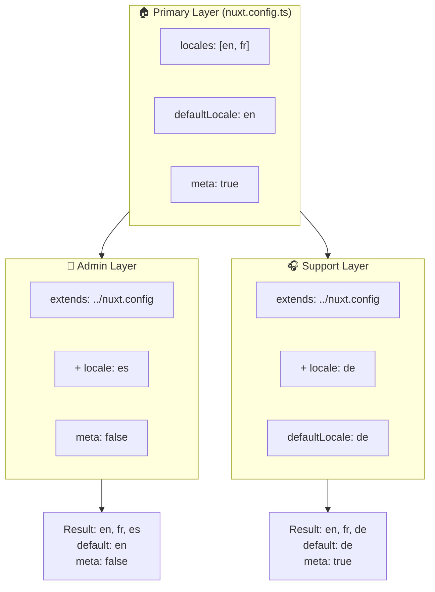

# 🗂️ Layers ב-`Nuxt I18n Micro`

## 📖 מבוא ל-Layers

Layers ב-`Nuxt I18n Micro` מאפשרים לכם לנהל ולהתאים אישית הגדרות לוקליזציה בגמישות בין חלקים שונים של האפליקציה שלכם. על ידי הגדרת layers שונים, תוכלו להתאים את הקונפיגורציה עבור הקשרים שונים, כגון עקיפת הגדרות עבור מקטעים ספציפיים של האתר שלכם או יצירת קונפיגורציות בסיס לשימוש חוזר שניתן להרחיב על ידי חלקים אחרים של האפליקציה שלכם.

### זרימת ירושת Layer



## 🛠️ שכבת קונפיגורציה ראשית

**שכבת הקונפיגורציה הראשית** היא המקום שבו מגדירים את הגדרות הלוקליזציה ברירת המחדל עבור כל האפליקציה. שכבה זו חיונית מכיוון שהיא מגדירה את הקונפיגורציה הגלובלית, כולל ה-locales הנתמכים, שפת ברירת המחדל והגדרות i18n חיוניות נוספות.

### 📄 דוגמה: הגדרת שכבת הקונפיגורציה הראשית

הנה דוגמה כיצד ניתן להגדיר את שכבת הקונפיגורציה הראשית בקובץ `nuxt.config.ts` שלכם:

```typescript
export default defineNuxtConfig({
  i18n: {
    locales: [
      { code: 'en', iso: 'en-EN', dir: 'ltr' },
      { code: 'fr', iso: 'fr-FR', dir: 'ltr' },
      { code: 'ar', iso: 'ar-SA', dir: 'rtl' },
    ],
    defaultLocale: 'en', // The default locale for the entire app
    translationDir: 'locales', // Directory where translations are stored
    meta: true, // Automatically generate SEO-related meta tags like `alternate`
    autoDetectLanguage: true, // Automatically detect and use the user's preferred language
  },
})
```

## 🌱 Layers צאצאים

Layers צאצאים משמשים להרחבה או עקיפה של הקונפיגורציה הראשית עבור חלקים ספציפיים של האפליקציה שלכם. לדוגמה, ייתכן שתרצו להוסיף locales נוספים או לשנות את ה-locale ברירת המחדל עבור מקטע מסוים באתר שלכם. Layers צאצאים שימושיים במיוחד באפליקציות מודולריות שבהן חלקים שונים של האפליקציה עשויים לדרוש דרישות לוקליזציה שונות.

### 📄 דוגמה: הרחבת השכבה הראשית ב-Layer צאצא

נניח שיש לכם מקטע באתר שצריך לתמוך ב-locales נוספים, או שאתם רוצים להשבית locale מסוים בהקשר מסוים. הנה כיצד ניתן להשיג זאת על ידי הרחבת שכבת הקונפיגורציה הראשית:

```typescript
// basic/nuxt.config.ts (Primary Layer)
export default defineNuxtConfig({
  i18n: {
    locales: [
      { code: 'en', iso: 'en-EN', dir: 'ltr' },
      { code: 'fr', iso: 'fr-FR', dir: 'ltr' },
    ],
    defaultLocale: 'en',
    meta: true,
    translationDir: 'locales',
  },
})
```

```typescript
// extended/nuxt.config.ts (Child Layer)
export default defineNuxtConfig({
  extends: '../basic', // Inherit the base configuration from the 'basic' layer
  i18n: {
    locales: [
      { code: 'en', iso: 'en-EN', dir: 'ltr' }, // Inherited from the base layer
      { code: 'fr', iso: 'fr-FR', dir: 'ltr' }, // Inherited from the base layer
      { code: 'de', iso: 'de-DE', dir: 'ltr' }, // Added in the child layer
    ],
    defaultLocale: 'fr', // Override the default locale to French for this section
    autoDetectLanguage: false, // Disable automatic language detection in this section
  },
})
```

### 🌐 שימוש ב-Layers באפליקציה מודולרית

באפליקציית Nuxt גדולה ומודולרית יותר, ייתכן שיהיו לכם מספר מקטעים, שכל אחד דורש הגדרות i18n משלו. על ידי מינוף layers, תוכלו לשמור על מבנה קונפיגורציה נקי ומדרגי.

### 📄 דוגמה: קונפיגורציה שכבתית באפליקציה מודולרית

דמיינו שיש לכם אתר מסחר אלקטרוני עם מקטעים נפרדים כמו האתר הראשי, פאנל האדמין ופורטל תמיכת לקוחות. כל מקטע עשוי לדרוש סט שונה של locales או הגדרות i18n אחרות.

#### **שכבה ראשית (קונפיגורציה גלובלית):**

```typescript
// nuxt.config.ts
export default defineNuxtConfig({
  i18n: {
    locales: [
      { code: 'en', iso: 'en-EN', dir: 'ltr' },
      { code: 'fr', iso: 'fr-FR', dir: 'ltr' },
    ],
    defaultLocale: 'en',
    meta: true,
    translationDir: 'locales',
    autoDetectLanguage: true,
  },
})
```

#### **Layer צאצא עבור פאנל אדמין:**

```typescript
// admin/nuxt.config.ts
export default defineNuxtConfig({
  extends: '../nuxt.config', // Inherit the global settings
  i18n: {
    locales: [
      { code: 'en', iso: 'en-EN', dir: 'ltr' }, // Inherited
      { code: 'fr', iso: 'fr-FR', dir: 'ltr' }, // Inherited
      { code: 'es', iso: 'es-ES', dir: 'ltr' }, // Specific to the admin panel
    ],
    defaultLocale: 'en',
    meta: false, // Disable automatic meta generation in the admin panel
  },
})
```

#### **Layer צאצא עבור פורטל תמיכת לקוחות:**

```typescript
// support/nuxt.config.ts
export default defineNuxtConfig({
  extends: '../nuxt.config', // Inherit the global settings
  i18n: {
    locales: [
      { code: 'en', iso: 'en-EN', dir: 'ltr' }, // Inherited
      { code: 'fr', iso: 'fr-FR', dir: 'ltr' }, // Inherited
      { code: 'de', iso: 'de-DE', dir: 'ltr' }, // Specific to the support portal
    ],
    defaultLocale: 'de', // Default to German in the support portal
    autoDetectLanguage: false, // Disable automatic language detection
  },
})
```

בדוגמה מודולרית זו:

- לכל מקטע (admin, support) יש הגדרות i18n משלו, אך כולם יורשים את הקונפיגורציה הבסיסית.
- פאנל האדמין מוסיף ספרדית (`es`) כ-locale ומשבית יצירת תגי meta.
- פורטל התמיכה מוסיף גרמנית (`de`) כ-locale וברירת המחדל היא גרמנית עבור ממשק המשתמש.

## 📝 שיטות עבודה מומלצות לשימוש ב-Layers

- **🔧 שמרו על השכבה הראשית פשוטה:** השכבה הראשית צריכה להכיל את ההגדרות הנפוצות ביותר החלות באופן גלובלי בכל האפליקציה שלכם. שמרו עליה פשוטה כדי להבטיח עקביות.
- **⚙️ השתמשו ב-Layers צאצאים להתאמות ספציפיות:** בצעו עקיפה או הרחבה של הגדרות ב-layers צאצאים רק כאשר הכרחי. גישה זו מונעת מורכבות מיותרת בקונפיגורציה שלכם.
- **📚 תעדו את ה-Layers שלכם:** תעדו בבירור את המטרה והפרטים של כל layer בפרויקט שלכם. זה יעזור לשמור על בהירות ויקל על אחרים (או עליכם בעתיד) להבין את הקונפיגורציה.
