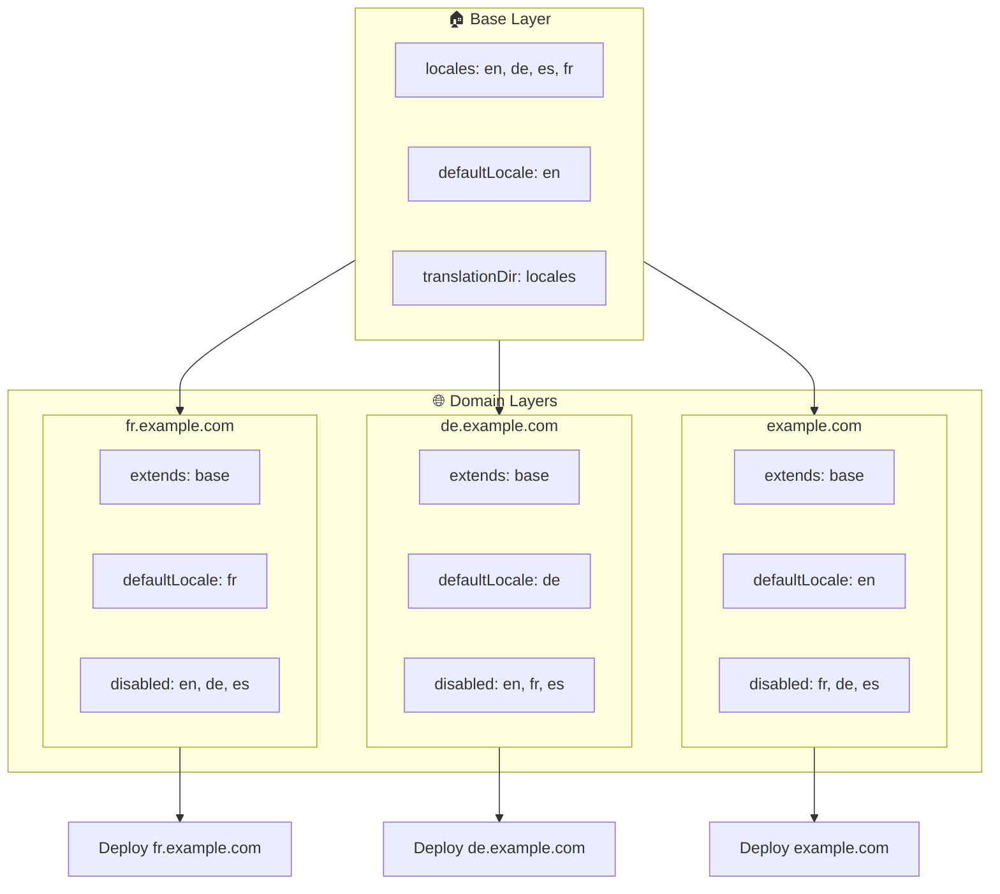

# 🌍 הגדרת locales רב-דומיין עם `Nuxt I18n Micro` באמצעות layers

## 📝 מבוא

על ידי מינוף layers ב-`Nuxt I18n Micro`, ניתן ליצור הגדרת לוקליזציה רב-דומיין גמישה וניתנת לתחזוקה. גישה זו לא רק מפשטת ניהול דומיינים על ידי ביטול הצורך בפונקציונליות מורכבת אלא גם מאפשרת חלוקת עומס יעילה והפחתה של מורכבות הפרויקט. על ידי הרצת פרויקטים נפרדים עבור locales שונים, האפליקציה שלכם יכולה בקלות להתרחב ולהסתגל לדרישות locale משתנות במספר דומיינים, ומציעה פתרון חזק ומדרגי לאפליקציות גלובליות.

## 🎯 מטרה

ליצור הגדרה שבה דומיינים שונים מגישים locales ספציפיים על ידי התאמת קונפיגורציות ב-layers צאצאים. שיטה זו ממנפת את מערכת ה-layering של Nuxt, ומאפשרת לכם לשמור על קונפיגורציה בסיסית תוך הרחבה או שינוי שלה עבור כל דומיין.

### ארכיטקטורה רב-דומיין



## 🛠 שלבים להטמעת locales רב-דומיין

### 1. **צרו את שכבת הבסיס**

התחילו על ידי יצירת שכבת קונפיגורציה בסיסית הכוללת את כל הגדרות ה-locale המשותפות עבור האפליקציה שלכם. קונפיגורציה זו תשמש כבסיס לקונפיגורציות ספציפיות לדומיין אחרות.

#### **קונפיגורציית שכבת הבסיס**

צרו את קובץ הקונפיגורציה הבסיסי `base/nuxt.config.ts`:

```typescript
// base/nuxt.config.ts

export default defineNuxtConfig({
  i18n: {
    locales: [
      { code: 'en', iso: 'en-US', dir: 'ltr' },
      { code: 'de', iso: 'de-DE', dir: 'ltr' },
      { code: 'es', iso: 'es-ES', dir: 'ltr' },
    ],
    defaultLocale: 'en',
    translationDir: 'locales',
    meta: true,
    autoDetectLanguage: true,
  },
})
```

### 2. **צרו layers צאצאים ספציפיים לדומיין**

עבור כל דומיין, צרו layer צאצא ששולט על הקונפיגורציה הבסיסית כדי לענות על הדרישות הספציפיות של אותו דומיין. תוכלו להשבית locales שאינם נחוצים עבור דומיין ספציפי.

#### **דוגמה: קונפיגורציה לדומיין הצרפתי**

צרו קונפיגורציית layer צאצא לדומיין הצרפתי ב-`fr/nuxt.config.ts`:

```typescript
// fr/nuxt.config.ts

export default defineNuxtConfig({
  extends: '../base', // Inherit from the base configuration

  i18n: {
    locales: [
      { code: 'en', iso: 'en-US', dir: 'ltr', disabled: true }, // Disable English
      { code: 'fr', iso: 'fr-FR', dir: 'ltr' }, // Add and enable the French locale
      { code: 'de', iso: 'de-DE', dir: 'ltr', disabled: true }, // Disable German
      { code: 'es', iso: 'es-ES', dir: 'ltr', disabled: true }, // Disable Spanish
    ],
    defaultLocale: 'fr', // Set French as the default locale
    autoDetectLanguage: false, // Disable automatic language detection
  },
})
```

#### **דוגמה: קונפיגורציה לדומיין הגרמני**

באופן דומה, צרו קונפיגורציית layer צאצא לדומיין הגרמני ב-`de/nuxt.config.ts`:

```typescript
// de/nuxt.config.ts

export default defineNuxtConfig({
  extends: '../base', // Inherit from the base configuration

  i18n: {
    locales: [
      { code: 'en', iso: 'en-US', dir: 'ltr', disabled: true }, // Disable English
      { code: 'fr', iso: 'fr-FR', dir: 'ltr', disabled: true }, // Disable French
      { code: 'de', iso: 'de-DE', dir: 'ltr' }, // Use the German locale
      { code: 'es', iso: 'es-ES', dir: 'ltr', disabled: true }, // Disable Spanish
    ],
    defaultLocale: 'de', // Set German as the default locale
    autoDetectLanguage: false, // Disable automatic language detection
  },
})
```

### 3. **פרסו את האפליקציה עבור כל דומיין**

פרסו את האפליקציה עם הקונפיגורציה המתאימה לכל דומיין. לדוגמה:

- פרסו את קונפיגורציית ה-`fr` layer ל-`fr.example.com`.
- פרסו את קונפיגורציית ה-`de` layer ל-`de.example.com`.

### 4. **הגדירו פרויקטים מרובים עבור locales שונים**

עבור כל locale ודומיין, תצטרכו להריץ מופע נפרד של האפליקציה. זה מבטיח שכל דומיין מגיש את הקונפיגורציית ה-locale הנכונה, ומיטב את חלוקת העומס ומפשט את מבנה הפרויקט. על ידי הרצת פרויקטים מרובים המותאמים לכל locale, תוכלו לשמור על הפרדה נקייה בין הקונפיגורציות ולהפחית את המורכבות של ההגדרה הכוללת.

### 5. **הגדירו ניתוב על בסיס דומיין**

ודאו שהניתוב שלכם מוגדר להפנות משתמשים לפרויקט הנכון על בסיס הדומיין שאליו הם ניגשים. זה יבטיח שכל דומיין מגיש את ה-locale המתאים, ישפר את חוויית המשתמש וישמור על עקביות בין אזורים שונים.

### 6. **פרסו ואמתו**

לאחר הגדרת ה-layers ופריסתם לדומיינים המתאימים, ודאו שכל דומיין מגיש את ה-locale הנכון. בדקו את האפליקציה ביסודיות כדי לוודא שה-locale הנכון נטען בהתאם לדומיין.

## 📝 שיטות עבודה מומלצות

- **שמרו על קונפיגורציית בסיס גנרית**: קונפיגורציית הבסיס צריכה לכסות הגדרות כלליות החלות על כל הדומיינים.
- **בודדו לוגיקה ספציפית לדומיין**: שמרו קונפיגורציות ספציפיות לדומיין ב-layers המתאימים כדי לשמור על בהירות והפרדת דאגות.

## 🎉 סיכום

על ידי מינוף layers ב-`Nuxt I18n Micro`, ניתן ליצור הגדרת לוקליזציה רב-דומיין גמישה וניתנת לתחזוקה. גישה זו לא רק מבטלת את הצורך בפונקציונליות מורכבת של ניהול דומיינים אלא גם מאפשרת לכם לחלק את העומס ביעילות ולהפחית את מורכבות הפרויקט. הרצת פרויקטים נפרדים עבור locales שונים מבטיחה שהאפליקציה שלכם יכולה להתרחב בקלות ולהסתגל לדרישות locale שונות במגוון דומיינים, ומספקת פתרון חזק ומדרגי עבור אפליקציות גלובליות.
