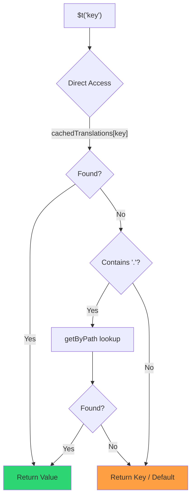

# 🚀 מדריך ביצועים

## 📖 מבוא

`Nuxt I18n Micro` תוכנן מתוך התחשבות בביצועים, ומציע שיפור משמעותי על פני מודולי בינאום (i18n) מסורתיים כמו `nuxt-i18n`. מדריך זה מספק מבט מעמיק על היתרונות של ביצועים בשימוש ב-`Nuxt I18n Micro`, וכיצד הוא משתווה לפתרונות אחרים.

## 🤔 למה להתמקד בביצועים?

בפרויקטים בקנה מידה גדול ובסביבות עם תעבורה גבוהה, צווארי בקבוק בביצועים יכולים להוביל לזמני build איטיים, שימוש מוגבר בזיכרון וזמני תגובת שרת גרועים. בעיות אלו הופכות בולטות יותר עם הגדרות i18n מורכבות הכוללות קבצי תרגום גדולים. `Nuxt I18n Micro` נבנה כדי להתמודד עם אתגרים אלה חזיתית על ידי מיטוב עבור מהירות, יעילות זיכרון והשפעה מינימלית על גודל ה-bundle של האפליקציה שלכם.

## 📊 השוואת ביצועים

ביצענו סדרת בדיקות על fixtures זהים דרך `pnpm test:performance` (`pnpm -C scripts cli performance`) מול **`@nuxtjs/i18n@10.6.0`**. המתודולוגיה המלאה והתרשימים: [תוצאות בדיקות ביצועים](/guides/performance-results).

פרופיל CLI ברירת מחדל: **4 locales** × **2 עמודים** (`index`, `page`) × ~10k מפתחות leaf של index. העלו את `--locales` / `--keys` לעומס regression-radar כבד יותר. הדו"ח מפצל את **code**, **translations** (כולל `chunks/raw/*` של `@nuxtjs/i18n`), ו-**total** של פלט ניתן לפריסה.

```bash
pnpm test:performance
pnpm -C scripts cli performance --only micro --skip-stress
pnpm -C scripts cli performance --locales 12 --keys 100000 --runs 3
```

### ⏱️ זמן Build וצריכת משאבים

<Accordion title="**@nuxtjs/i18n v10.6**">
- **Code Bundle**: 2.16 MB
- **Translations**: 7.21 MB (message chunks + locale payloads)
- **Total deployable**: 9.37 MB
- **Max Memory Usage**: 1,821 MB
- **Elapsed Time**: 8.34s (mean of 3)
</Accordion>

<Tip>
- **Code Bundle**: 1.74 MB — **~19% קוד קטן יותר מ-`@nuxtjs/i18n` v10.6**
- **Translations**: 6.8 MB (JSON נטען בעצלנות)
- **Total deployable**: 8.54 MB
- **Max Memory Usage**: 1,065 MB — **~41% פחות זיכרון מ-`@nuxtjs/i18n` v10.6**
- **Elapsed Time**: 5.34s — **~36% מהיר יותר מ-`@nuxtjs/i18n` v10.6** (≈ baseline של plain-nuxt)
</Tip>

> תיעוד ישן שהראה `@nuxtjs/i18n` "code ≈ 15 MB / translations 0 B" ספר קבצי message של `chunks/raw` כקוד אפליקציה. המסווג הנוכחי מפריד ביניהם; הפער ב-**code** קטן יותר, ו-micro עדיין מוביל בזמן build, RSS שיא ובבדיקות עומס.

ראו את [דוח ה-benchmark המלא](/guides/performance-results) לתרשימים, תוצאות Autocannon ופרטי fixture.

### 🌐 ביצועי שרת תחת עומס

Artillery (6s@6 + 60s@60) ו-Autocannon (10c / 10s), ממוצע של 3 ריצות רצופות לכל fixture.

<Accordion title="**@nuxtjs/i18n v10.6**">
- **Requests per Second (Artillery)**: 143 [#/sec]
- **Average Response Time**: 956 ms
- **Autocannon RPS / avg latency**: 72 / 139 ms
</Accordion>

<Tip>
- **Requests per Second (Artillery)**: 275 [#/sec] — **~93% יותר מ-`@nuxtjs/i18n` v10.6**
- **Average Response Time**: 483 ms — **~49% מהיר יותר מ-`@nuxtjs/i18n` v10.6**
- **Autocannon RPS / avg latency**: 162 / 62 ms
</Tip>

### 📈 השוואה חזותית

<Note>
תרשים אינטראקטיבי הושמט בתיעוד Mintlify. ראו את טבלאות ה-benchmark בעמוד זה או ב[תיעוד VitePress](https://s00d.github.io/nuxt-i18n-micro/guide/performance-results) עבור התרשים: `chart`.
</Note>

<Note>
תרשים אינטראקטיבי הושמט בתיעוד Mintlify. ראו את טבלאות ה-benchmark בעמוד זה או ב[תיעוד VitePress](https://s00d.github.io/nuxt-i18n-micro/guide/performance-results) עבור התרשים: `chart`.
</Note>

| Metric          | @nuxtjs/i18n v10.6 | i18n-micro | Improvement        |
| --------------- | ------------------ | ---------- | ------------------ |
| Build Time      | 8.34s              | 5.34s      | **~36% מהיר יותר**    |
| Memory (build)  | 1,821 MB           | 1,065 MB   | **~41% פחות**      |
| Code Bundle     | 2.16 MB            | 1.74 MB    | **~19% קטן יותר**   |
| Response Time   | 956 ms             | 483 ms     | **~49% מהיר יותר**    |
| RPS (Artillery) | 143                | 275        | **~93% יותר**      |

### 🔍 פרשנות התוצאות

מול `@nuxtjs/i18n` **v10.6** הנוכחי (פרופיל CLI ברירת מחדל, ממוצע של 3):

- 🗜️ **גרף קוד קטן יותר**: ~1.74 MB לעומת ~2.16 MB לאחר ש-message chunks אינם מסומנים בטעות כ"code".
- 🧠 **RSS build נמוך יותר**: ~1.1 GB שיא לעומת ~1.8 GB.
- 🕒 **Builds מהירים יותר**: ~5.3s לעומת ~8.3s (micro תואם את baseline של plain-Nuxt בפרופיל זה).
- ⚡ **טוב בהרבה תחת עומס**: ~275 לעומת ~143 Artillery RPS, ~162 לעומת ~72 Autocannon RPS, latency ממוצע נמוך יותר.

מספרים אבסולוטיים שונים מטבלאות שפורסמו ישן יותר (מילונים קטנים יותר, Nuxt ישן יותר, ופיצול "0 B translations" לא הוגן עבור `@nuxtjs/i18n`). כיוונית זה זהה: micro נשאר בקדמה בעלות build ותפוקת בקשות.

## ⚙️ מיטובים עיקריים

### 🛠️ עיצוב מינימליסטי

`Nuxt I18n Micro` נבנה סביב ארכיטקטורה מינימליסטית עם ליבה קטנה וחבילות אסטרטגיה ייעודיות. זה מפחית תקורה ומפשט את הלוגיקה הפנימית, מה שמוביל לביצועים משופרים.

### 🚦 ניתוב יעיל

ב-v3, יצירת routes ולוגיקת נתיב runtime מפוצלות לחבילות ייעודיות ל-tree-shaking אופטימלי:

- **`@i18n-micro/route-strategy`** — יצירת route בזמן build: מרחיב את דפי Nuxt עם routes מקומיים. רק האסטרטגיה שנבחרה (`no_prefix`, `prefix`, `prefix_except_default`, `prefix_and_default`) נכללת.
- **`@i18n-micro/path-strategy`** — פתרון נתיב, הפניות ויצירת קישורים בזמן ריצה. משתמש בפונקציות טהורות ובדגלי הקשר מחושבים מראש כדי למזער הקצאות בנתיבים חמים. Subpath exports (`/prefix`, `/no-prefix` וכו') מבטיחים שרק המימוש הנבחר נארז.

גישה זו שומרת על קונפיגורציית הניתוב קלת משקל ומבטיחה פתרון route מהיר ללא קשר למספר ה-locales.

### 📂 טעינת תרגומים יעילה

המודול תומך רק בקבצי JSON לתרגומים, עם הפרדה ברורה בין קבצים גלובליים לספציפיים לעמוד. זה מבטיח שרק נתוני התרגום הנחוצים נטענים בכל רגע נתון, מה שמשפר עוד יותר את הביצועים.

### 🔒 GlobalThis Singleton Cache

החל מ-v3.0.0, המודול משתמש בדפוס singleton של `globalThis` עם `Symbol.for` כדי להבטיח מופע cache יחיד בכל תהליך Node.js. זה מונע:

- כפילות cache כאשר אותו מודול נארז מספר פעמים
- יצירה מחדש של אובייקטים לכל בקשה שגורמת ללחץ garbage collection
- דליפות זיכרון ממופעי cache יתומים

```mermaid
flowchart LR
    subgraph Process["Node.js Process"]
        G["globalThis[Symbol.for('CACHE')]"]

        subgraph R1["SSR Request 1"]
            P1[Plugin Instance] --> G
        end

        subgraph R2["SSR Request 2"]
            P2[Plugin Instance] --> G
        end

        subgraph R3["SSR Request 3"]
            P3[Plugin Instance] --> G
        end
    end

    G --> Cache["Single Map Instance"]
    Cache --> D1["en:index → translations"]
    Cache --> D2["en:about → translations"
```

```typescript
// Internal implementation pattern
const CACHE_KEY = Symbol.for('__NUXT_I18N_STORAGE_CACHE__')
if (!globalThis[CACHE_KEY]) {
  globalThis[CACHE_KEY] = new Map()
}
```

### ⚡ פונקציית תרגום ממוטבת (tFast)

הפונקציה `$t()` משתמשת באסטרטגיית חיפוש ישירה שממוטבת למהירות:

1. **הקשר מחושב מראש**: locale ושם route מחושבים פעם אחת במהלך הניווט, לא בכל קריאה ל-`$t()`
2. **חיפוש ממקור יחיד**: כל התרגומים (root + page-specific + fallback) ממוזגים מראש בזמן build לקובץ יחיד לכל עמוד — אין צורך בחיפוש שכבתי
3. **מיזוג עמוק מצטבר בניווט**: בניווט בתוך אותו locale, תרגומי עמוד חדש מבוצע להם מיזוג עמוק (עומק 2 רמות) למילון הפעיל, כך שמפתחות מהעמוד הקודם נשארים נראים במהלך אנימציות מעבר — גם כאשר עמודים חולקים קידומות מקוננות חופפות (למשל, לשני העמודים יש מפתחות תחת `common.*`)
4. **Garbage collection דרך `page:transition:finish`**: לאחר שאנימציית המעבר הושלמה במלואה, המילון הממוזג מוחלף בתרגומים הנקיים עבור העמוד החדש בלבד, ומשחרר זיכרון ממפתחות של עמוד ישן
5. **גישה ישירה למאפיין**: משתמש ב-`obj[key]` במקום בחיפושי Map לנתיבים חמים



```typescript
// Simplified lookup logic — single active dictionary
let val = cachedTranslations[key]
if (val === undefined && key.includes('.')) {
  val = getByPath(cachedTranslations, key)
}
```

### 💉 טעינה בצד שרת (ללא הטמעה ב-HTML)

תרגומים שנטענים במהלך SSR נשארים ב**זיכרון השרת** עבור `$t` במהלך רינדור. הם **אינם** מועתקים ל-`nuxtApp.payload` / למסמך ה-HTML (אותו רעיון כמו `@nuxtjs/i18n` עם `experimental.preload: false`).

בצד הלקוח, `01.plugin.ts` `await`-ים `switchContext`, שטוען `/\{apiBaseUrl\}/:page/:locale/data.json` לפני שהאפליקציה ממשיכה — בקשה אחת, לא blob inline של 8 MB.

`NuxtI18n` עדיין שומר את המילון הממוזג הפעיל (`cachedTranslations`) עבור `$t()` / `$has()`. ניווטים באותו locale מבצעים מיזוג עמוק של page chunks עד ש-`page:transition:finish` מנקה מפתחות ישנים.

#### היכן זה עומד היום

המספרים למטה נקראים מקובץ ה-budget של `pnpm run budget:payload` מודד ואוכף.

{/* generated:payload-budget — do not edit; run `pnpm run docs:generate` */}

נמדד על `playground` בין `/`, `/de`:

| מדידה | גודל |
| --- | --- |
| מקורות תרגום בדיסק | 15.2 MB |
| מוגש כקבצי payload נפרדים | 76.3 MB |
| `__NUXT_DATA__` inline הכי גדול | 6.9 MB |
| נכסי לקוח | 449.5 KB |

ה-playground נושא מילון בגודל מוגזם במכוון, כך שאלו אינם מספרים לצפות מהם ב
אפליקציה אמיתית — הם נקודה קבועה למדוד מולה. ה-budget נכשל כשהם גדלים באופן בלתי צפוי,
וכך שינוי מקרי במה שה-payload נושא נשם לב אליו.

{/* /generated:payload-budget */}

### 💾 Caching ו-Pre-rendering

תרגומים עוברים דרך מספר caches, וידיעה איזה מהם ענה לבקשה היא
ההבדל בין חמש דקות לחמש שעות של debug. יש ארבעה, בסדר
שבו בקשה פוגשת אותם:

| שכבה | היכן | תוחלת חיים | נוקה על ידי |
| --- | --- | --- | --- |
| דפדפן / CDN | `Cache-Control` על `/\{apiBaseUrl\}/**` | `httpCacheDuration`, `immutable` | `?v=` חדש — כלומר פריסה ששינתה תרגומים |
| Nitro route cache | `routeRules['/\{apiBaseUrl\}/**'].cache` | 60 שניות, stale-while-revalidate | הפעלה מחדש של השרת |
| Server loader | `CacheControl` in-process, מפתח `locale:routeName` | תוחלת חיים של תהליך, או `cacheTtl` | הפעלה מחדש של השרת, HMR ב-dev |
| Client store | `translationStorage` וה-chunk הפעיל ב-`NuxtI18n` | תוחלת חיים של עמוד | טעינה מחדש |

שני כללים שומרים עליהם מלא לסתור זה את זה:

- **ה-Nitro route cache קיים רק כאשר `?v=` קיים.** עם cache-buster כל URL הוא
  ייחודי לתוכן שלו, כך ש-caching בצד שרת הוא ללא staleness. הגדרת
  `dateBuild: 0` והשכבה הזו כבויה, כי ה-URL אז יציב וה-
  תגובה אומרת `must-revalidate` — cache בצד שרת היה עונה מרישום ישן
  עד דקה ובשקט מתגבר עליו.
- **`immutable` גם דורש `?v=`.** ללא buster ה-header הוא
  `public, max-age=0, must-revalidate`, לא משנה מה `httpCacheDuration` אומר: `max-age` ארוך
  על URL שאף פעם לא משתנה מקבע את התגובה הראשונה שדפדפן אי פעם ראה.

<Warning>
עם `translationPayloads.publicAssets` (ברירת מחדל במצב premerged) payloads מועתקים ל
`public/<apiBaseUrl>/\{page\}/\{locale\}/data.json`. פלטפורמה שמגישה את התיקייה בעצמה
(Cloudflare Pages, Firebase Hosting, `npx serve`) מיישמת headers משלה — ה-header של Nitro
`routeRules` מגיע רק לתגובות שעוברות דרך השרת. הגדירו מדיניות cache עבור
קבצים סטטיים אלה בקונפיגורציה של הפלטפורמה עצמה.
</Warning>

🏁 **Pre-rendering**: במצב premerged, `publicAssets` כבר כותב את עץ ה-URL של הלקוח לתוך
`public/`. הצטרפו ל-`prerenderRoutes` רק אם אתם צריכים ש-Nitro יממש routes של handler כאשר
העותק הזה מושבת.

### 🗜️ Payloads ציבוריים דחוסים

כאשר `nitro.compressPublicAssets` מופעל, מטעני התרגום המועתקים לתיקייה הציבורית
מקבלים גם אחים `.gz` ו-`.br`:

```ts
export default defineNuxtConfig({
  nitro: { compressPublicAssets: true },
})
```

Nitro דוחס נכסים ציבוריים לפני ה-hook שמעתיק את ה-payloads, כך שללא זה הם היו
החלק הבודד הבלתי דחוס של build סטטי. המודול אינו מפעיל דחיסה בעצמו —
הוא רק מיישם את ההגדרה שבחרתם. בחירה לפי encoding (`\{ gzip: true, brotli: false \}`) מכובדת.

Playground index payload: 6 651 984 B raw, 1 012 831 B gzip, 821 617 B brotli.

### ☁️ פלט Payload ל-Serverless

ב-**Node**, SSR קורא JSON של תרגום מ-`public/<apiBaseUrl>` (`readFile`, ללא Nitro `serverAssets` / Rollup `raw:`). ב-**Edge**, Nitro `serverAssets` מטמיע את אותו עץ (העדיפו `mode: 'source'` לקטלוגים גדולים).

```typescript
export default defineNuxtConfig({
  i18n: {
    translationPayloads: {
      serverAssets: true, // default — Node → public copy; Edge → serverAssets embed
      publicAssets: true, // default in premerged mode
    },
  },
})
```

השתמשו ב-`translationPayloads.mode: 'source'` להטמעות Edge קומפקטיות (ועותקים ציבוריים קומפקטיים אופציונליים):

```typescript
export default defineNuxtConfig({
  i18n: {
    translationPayloads: {
      mode: 'source',
    },
  },
})
```

`mode: 'source'` שומר קבצי מקור ממוזגי layer קומפקטיים וממזג root/page/fallback בזמן ריצה דרך ה-route המובנה `/_locales` (או Edge `assets:i18n`). כברירת מחדל זה משבית עותקי נכסים ציבוריים ו-routes של payload שעברו prerender.

<Warning>
`prerenderRoutes` ברירת מחדל היא `false`. עם `mode: 'source'`, `publicAssets` גם ברירת מחדל היא `false`. אירוח סטטי טהור ללא runtime של Nitro/edge לפיכך לא יכול לטעון תרגומים בצד הלקוח אלא אם כן אתם מפעילים אחד מהפלטים הללו, שומרים על `serverHandler` זמין בזמן ריצה, או מארחים payloads חיצונית.

Premerged + `publicAssets` ברירת מחדל כבר ממקם את `/\{apiBaseUrl\}/\{page\}/\{locale\}/data.json` תחת `public/`, כך שמארחים סטטיים יכולים לשרת בקשות לקוח ללא Nitro.
</Warning>

<Warning>
הגדרת `apiBaseServerHost` או `apiBaseClientHost` מעבירה את הגשת ה-payload למקור זה, מה שמגיע עם דרישות משלו — ראו [Configuration → External CDN hosts](/guides/configuration#external-cdn-hosts).
</Warning>

או השביתו פלטי HTTP/public בודדים וארחו payloads חיצונית:

```typescript
export default defineNuxtConfig({
  i18n: {
    apiBaseClientHost: 'https://cdn.example.com',
    apiBaseServerHost: 'https://cdn.example.com',
    translationPayloads: {
      serverHandler: false,
      publicAssets: false,
      prerenderRoutes: false,
    },
  },
})
```

שמרו על `serverHandler` מופעל כאשר אתם מסתמכים על ה-route המקומי המובנה `/\{apiBaseUrl\}/:page/:locale/data.json`. השביתו אותו כאשר payloads מתארחים חיצונית ו-`apiBaseServerHost` מצביע על אותו מקור חיצוני. הפעילו את `prerenderRoutes` רק כאשר אתם צריכים ש-Nitro יממש routes סטטיים של payload ו-`publicAssets` עדיין לא כתב אותם.

במהלך build, המודול מזהיר כאשר פלט payload שנוצר עולה על `translationPayloads.warnFileCount` (ברירת מחדל 500) או `translationPayloads.warnSizeBytes` (ברירת מחדל 10 MB). הוא גם מזהיר כאשר כל הפלטים המקומיים מושבתים ללא מארחי payload חיצוניים מוגדרים.

## 📝 טיפים למקסום ביצועים

הנה כמה טיפים כדי לוודא שאתם מקבלים את הביצועים הטובים ביותר מ-`Nuxt I18n Micro`:

- 📉 **הגבילו נתוני locale**: כללו רק את ה-locales שאתם צריכים בפרויקט שלכם כדי לשמור על גודל bundle קטן.
- 🗂️ **השתמשו בתרגומים ספציפיים לעמוד**: ארגנו את קבצי התרגום שלכם לפי עמוד כדי למנוע טעינת נתונים מיותרים.
- 💾 **הפעילו caching**: השתמשו בתכונות ה-caching כדי להפחית עומס שרת ולשפר זמני תגובה.
- 🏁 **מנפו pre-rendering**: בצעו pre-render לתרגומים שלכם כדי להאיץ טעינות עמוד ולהפחית תקורת runtime.

לתוצאות מפורטות של בדיקות הביצועים, אנא עיינו ב[תוצאות בדיקות ביצועים](/guides/performance-results).
